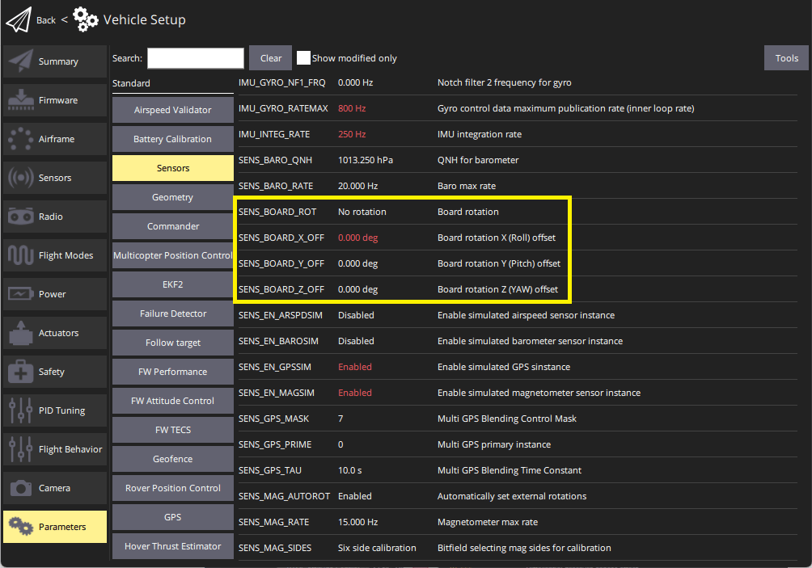

# Advanced Flight Controller Orientation Tuning

The orientation and horizon level may be fine-tuned manually with parameters to correct for sensor board small misalignment or minor calibration errors.

:::note
These instructions are not recommended for regular users. For basic settings stick to the instructions linked below:

- [Flight Controller Orientation](../config/flight_controller_orientation.md)
- [Level Horizon Calibration](../config/level_horizon_calibration.md)
:::

If there is a persistent drift bias (often seen in multirotors but not limited to them), it is a good strategy to trim it with the help of this fine-tuning offset angle parameters instead of using the trimmers of your RC Transmitter. This way when in fully autonomous flight the aircraft will maintain the trimming.

## Setting Orientation Parameters

To change the orientation parameters:

1. Open QGroundControl menu: **Settings > Parameters > Sensor Calibration**.
2. Change the parameters as shown below: 

## Parameter information

The **SENS_BOARD_ROT** parameter defines the rotation relative to the platform, while the X,Y and Z fine tuning offsets are fixed relative to the board itself. What happens is that the fine tuning offsets are added to the SENS_BOARD_ROT angle in order to get the total offset angles for the Yaw, Pitch and Roll orientation of the flight controller.

**SENS_BOARD_ROT**

This parameter defines the rotation of the FMU board relative to the platform. Possible values are:

- 0 = No rotation
- 1 = Yaw 45°
- 2 = Yaw 90°
- 3 = Yaw 135°
- 4 = Yaw 180°
- 5 = Yaw 225°
- 6 = Yaw 270°
- 7 = Yaw 315°
- 8 = Roll 180°
- 9 = Roll 180°, Yaw 45°
- 10 = Roll 180°, Yaw 90°
- 11 = Roll 180°, Yaw 135°
- 12 = Pitch 180°
- 13 = Roll 180°, Yaw 225°
- 14 = Roll 180°, Yaw 270°
- 15 = Roll 180°, Yaw 315°
- 16 = Roll 90°
- 17 = Roll 90°, Yaw 45°
- 18 = Roll 90°, Yaw 90°
- 19 = Roll 90°, Yaw 135°
- 20 = Roll 270°
- 21 = Roll 270°, Yaw 45°
- 22 = Roll 270°, Yaw 90°
- 23 = Roll 270°, Yaw 135°
- 24 = Pitch 90°
- 25 = Pitch 270°

**SENS_BOARD_X_OFF**

Rotation, in degrees, around PX4FMU's X axis or Roll axis. Positive angles increase in CCW direction, negative angles increase in CW direction.

**SENS_BOARD_Y_OFF**

Rotation, in degrees, around PX4FMU's Y axis or Pitch axis. Positive angles increase in CCW direction, negative angles increase in CW direction.

**SENS_BOARD_Z_OFF**

Rotation, in degrees, around PX4FMU's Z axis Yaw axis. Positive angles increase in CCW direction, negative angles increase in CW direction.