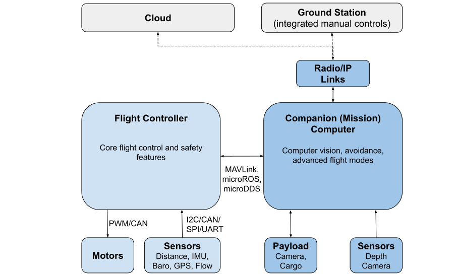

# Companion Computers

Companion computers ("mission computers"), are separate on-vehicle computers that are connected to the flight controller, and which enable computationally expensive features like [object avoidance](../computer_vision/obstacle_avoidance.md) and [collision prevention](../computer_vision/collision_prevention.md).

The diagram below shows a possible architecture for an unmanned vehicle architecture that includes a flight controller and companion computer.

<!-- source for drawing: https://docs.google.com/drawings/d/1ZDSyj5djKCEbabgx8K4ESdTeEUizgEt8spUWrMGbHUE/edit?usp=sharing -->

The flight controller runs PX4 on NuttX, and provides core flight and safety code. The companion computer usually runs Linux, as this is a much better platform for "general" software development. They are connected using a fast serial or Ethernet link, and typically communicate using the [MAVLink protocol](https://mavlink.io/en/) or uXRCE-DDS.

Communications with the ground stations and the cloud are usually routed via the companion computer (e.g. using the [MAVLink Router](https://github.com/mavlink-router/mavlink-router)).

## Integrated Companion/Flight Controller Boards

Controller boards that come with a pre-integrated companion computer and flight controller can significantly ease both software and hardware setup. In some cases the boards are set up to allow easy replacement of flight controller and/or companion computer parts.

The following boards are known to provide a good integration with PX4:

- [Holybro Pixhawk RPI CM4 Baseboard](../companion_computer/holybro_pixhawk_rpi_cm4_baseboard.md)

## Managed Integrated Systems

The following integrated companion computer/flight controller systems use managed/custom versions of flight controller and companion computer software by default. They are listed here as they can be updated with "vanilla" PX4 firmware for testing/rapid development.

- [Auterion Skynode](../companion_computer/auterion_skynode.md)

## Companion Computer Options

PX4 can be used with computers that can be configured to communicate via MAVLink or microROS/uXRCE-DDS over over a serial port (or Ethernet port, if present).

A small subset of possible alternatives are listed below:

- Raspberry Pi
- Odroid
- Tegra K1

:::note
The choice of computer will depend on the usual tradeoffs: cost, weight, power consumption, ease of setup, and computational resources required.
:::

## Companion Computer Software

The companion computer needs to run software that communicates with the flight controller, and which routes traffic to ground stations and the cloud.

#### Drone Apps

Drone APIs and SDKs allow you to write software that can control PX4. Popular alternatives include:

- [MAVSDK](https://mavsdk.mavlink.io/main/en/index.html) - libraries in various programming languages to interface with MAVLink systems such as drones, cameras or ground systems.
- [ROS 2](../ros/ros2.md) to communicate to ROS 2 nodes (may also be used).
- [ROS 1 and MAVROS](../ros/mavros_installation.md)

MAVSDK is generally easier to learn and use, while ROS provides more pre-written software for advanced cases like computer vision. [Drone APIs and SDKs > What API Should I Use?](../robotics/README.md#what-api-should-i-use) explains the different options in detail.

You can also write your own custom MAVLink libraries from scratch:

- [C/C++ example code](https://github.com/mavlink/c_uart_interface_example) shows how to connect custom code
- MAVLink also can also be used with [many other programming languages](https://mavlink.io/en/#mavlink-project-generatorslanguages)

#### Routers

You will need a router if you need to bridge MAVLink from the vehicle to a ground station or IP network, or if you need multiple connections:
- [MAVLink Router](https://github.com/intel/mavlink-router) (recommended)
- [MAVProxy](https://ardupilot.org/mavproxy/)

## Ethernet Setup

Ethernet is the recommended connection, if supported by your flight controller. See [Ethernet Setup](../advanced_config/ethernet_setup.md) for instructions.

## Flight Controller Specific Setup

The following topics explain how to set up companion computers for specific flight controllers, in particular when you are not using an Ethernet connection.

- [Using a Companion Computer with Pixhawk Controllers](../companion_computer/pixhawk_companion.md)

## Additional Information

- [Companion Computer Peripherals](../companion_computer/companion_computer_peripherals.md)
- [PX4 System Architecture > FC and Companion Computer](../concept/px4_systems_architecture.md#fc-and-companion-computer)

