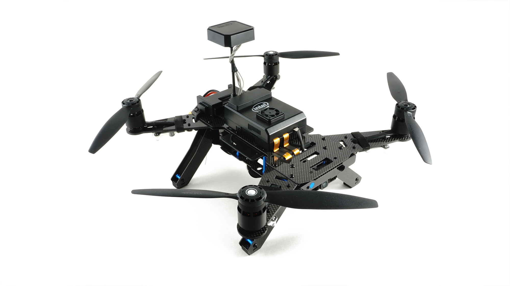
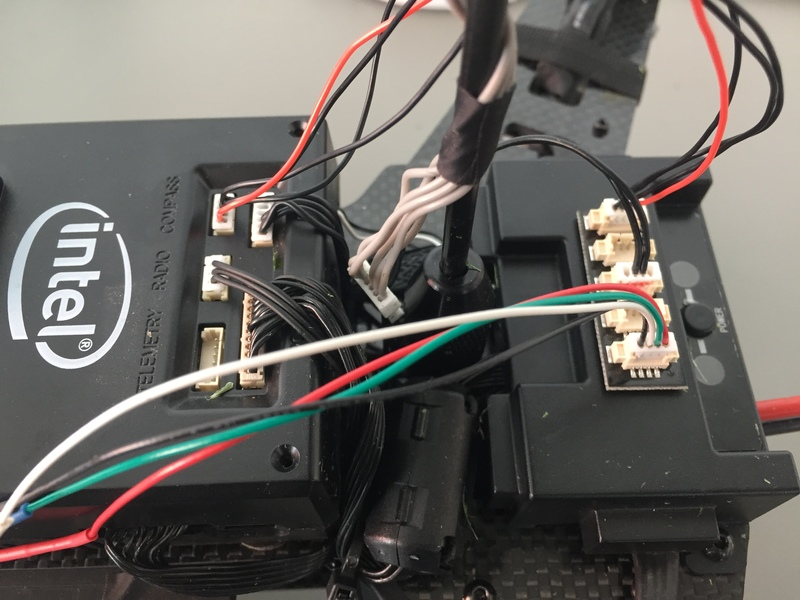
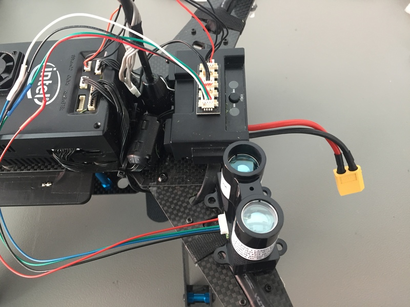

# Intel Aero Ready to Fly Drone

:::warning
This flight controller has been [discontinued](../flight_controller/autopilot_experimental.md) and is no longer commercially available.

PX4 v1.11 is the last release that supports this platform.
:::

The *Intel Aero Ready to Fly Drone*® is a UAV development platform. Part of this is the *Intel Aero Compute Board*, running Linux on a Quad-core CPU. The other part is an STM32 microcontroller that is connected to it and that runs PX4 on NuttX. These are integrated in the same package on the *Intel Aero Ready to Fly Drone*, which also includes the vision accessory kit.



## Introduction

The main documentation on the [official wiki](https://github.com/intel-aero/meta-intel-aero/wiki) explains how to setup, update and connect to the board, and how to do development on the Linux side. The instructions in this topic concentrate on updating the firmware on the microcontroller from a development tree.

It's important to update to the latest image available since some instructions change between releases. You can check the BIOS and distro version by connecting to the board and running the following command:

    get_aero_version.py
    

The instructions here are tested with the following version:

    BIOS_VERSION = Aero-01.00.13
    OS_VERSION = Poky Aero (Intel Aero Linux Distro) 1.5.1-dev (pyro)"
    AIRMAP_VERSION = 1.8
    FPGA_VERSION = 0xc1
    

## Setup Intel Aero using Ubuntu

In order to install Ubuntu on Intel Aero, the following equipment is needed:

1. Power supply (battery or network cable)
2. Micro HDMI to HDMI cable to attach a monitor
3. Micro USB3 to USB2 female adapter
4. USB Hub to attach mouse and keyboard

Follow the linked instructions from [Intel Aero wiki > Installing Ubuntu on Intel Aero](https://github.com/intel-aero/meta-intel-aero/wiki/90-%28References%29-OS-user-Installation#installing-ubuntu-on-intel-aero):

1. [Upgrade Yocto first](https://github.com/intel-aero/meta-intel-aero/wiki/90-%28References%29-OS-user-Installation#upgrade-yocto-first) (optional)
2. [OS](https://github.com/intel-aero/meta-intel-aero/wiki/90-%28References%29-OS-user-Installation#os)
3. [Intel Aero Repository](https://github.com/intel-aero/meta-intel-aero/wiki/90-%28References%29-OS-user-Installation#intel-aero-repository)

As soon as the steps under *Intel Aero Repository* (above) are completed the Aero kernel is installed. From this point forwards, always boot using this kernel.

Follow the instructions to flash the BIOS, FPGA and Flight Controller. Open the MAVLink router config file: **/etc/mavlink-router/main.conf**

Include the laptop IP as a UDP Endpoint by adding the following lines to the configuration file. The IP address must be set to the one of the laptop. To find the IP address of the laptop, execute: `ifconfig`.

    [UdpEndpoint wifi]
    Mode = Normal
    Address = 192.168.8.255
    

After all those steps are completed, the drone should automatically connect to *QGroundControl* running on the laptop.

Next install ROS, by following the [instructions here](https://github.com/intel-aero/meta-intel-aero/wiki/05-Autonomous-drone-programming-with-ROS).

### RealSense Camera

1. RealSense SDK
    
    Follow the steps to install the RealSense SDK listed on the [aero wiki](https://github.com/intel-aero/meta-intel-aero/wiki/90-%28References%29-OS-user-Installation#intel-realsense-sdk). When cloning the repository, the legacy branch needs to be used for the R200 model. If the D435 or D415 is used, the master branch needs to be cloned. All other steps are the same and the branches can be just switched back and forth if the camera is changed.
    
    If the RealSense R200 is used, it can already be started over a ROS node using:
    
        roslaunch realsense_camera r200_nodelet_default.launch
        
    
    If any D400 series camera is used, follow the next step to install a different ROS wrapper.

2. ROS Wrapper for D400 series RealSense
    
    Follow the instructions in [Install Intel RealSense ROS from Sources](https://github.com/intel-ros/realsense#step-3-install-intel-realsense-ros-from-sources) to install a catkin workspace and clone the RealSense software.
    
    Install the udev rules using:
    
        sudo cp config/99-realsense-libusb.rules /etc/udev/rules.d/
        sudo udevadm control --reload-rules && udevadm trigger
        
    
    Now the RealSense can be started over a ROS node using:
    
        roslaunch realsense2_camera rs_camera.launch
        

### Obstacle Avoidance

To run the PX4 obstacle avoidance software, install catkin first:

    apt install python-catkin-tools
    

Create a catkin workspace and initialize it. Then clone the avoidance repository into the source space, or use a symbolic link to the source space. Build the package and start the ROS node using:

    catkin build local_planner
    
    roslaunch local_planner local_planner_aero.launch
    

## Flashing PX4 software

After setting up the PX4 development environment, follow these steps update the PX4 software:

1. Do a full update of all software on the vehicle (https://github.com/intel-aero/meta-intel-aero/wiki/Upgrade-To-Latest-Software-Release)
2. Grab the [Firmware](https://github.com/PX4/PX4-Autopilot)
3. Compile with `make intel_aerofc-v1_default`
4. Configure the target hostname
    
    If your system resolves link local names you don't have to do anything and you can skip this step. You can test it by trying to ssh into `intel-aero.local` after connecting to it either via WiFi or USB:
    
        ssh root@intel-aero.local
        
    
    If it doesn't work you can try giving the IP that will be used by the upload script:
    
        # WiFi IP
        export AERO_HOSTNAME=192.168.8.1
        
        # Ethernet-over-USB IP
        export AERO_HOSTNAME=192.168.7.2
        

5. Upload with: `make intel_aerofc-v1_default upload`

## Connecting QGroundControl via Network

1. Make sure you are connected to the board with WiFi or USB Network
2. SSH to the board and make sure MAVLink forwarding runs. By default it automatically starts when booting. It can be started manually with: ```systemctl start mavlink-router```
3. Start *QGroundControl* and it should automatically connect.
4. Instead of starting *QGroundControl*, you can open a [MAVLink shell](../debug/mavlink_shell.md) using the script: ```./Tools/mavlink_shell.py 0.0.0.0:14550```

<span id="leddarone"></span>

## Connecting LeddarOne Range Finder

Connect the [LeddarOne](../sensor/leddar_one.md) to the Aero telemetry port. The pinout for the LeddarOne and Aero telemetry port (TELEM1) are as follows.

| Pin | Aerofc TELEMETRY | LeddarOne |
| --- | ---------------- | --------- |
| 1   | VCC              | GND       |
| 2   | TX               | -         |
| 3   | RX               | VCC       |
| 4   | SCL              | RX        |
| 5   | SDA              | TX        |
| 6   | GND              | -         |

To enable the rangefinder set the [SENS_LEDDAR1_CFG](../advanced_config/parameter_reference.md#SENS_LEDDAR1_CFG) parameter to TELEM1 and reboot the board (instructions for setting parameters [available here](../advanced_config/parameters.md)).

<span id="lidar_lite"></span>

## Connecting Lidar Lite Range Finder

:::warning
The Lidar Lite is not recommended for use with *Intel Aero Ready to Fly Drone*® due to measurements spikes.
:::

The following instructions are for a [Lidar Lite](../sensor/rangefinders.md#lidar-lite) V3 connected via I2C. The Intel® Aero Ready to Fly Drone has two ports with I2C: One labled COMPASS and the other TELEMETRY. The pinout for both of them can be found below. We recommend using the TELEMETRY port as it is not being used. If your TELEMETRY port is already occupied, a splitter can be used to share the I2C connection (works on any I2C port). Check the images below for the splitter setup.

In addition it is recommended to use a electrolytic capacitor for the Lidar Lite I2C connection to reduce spikes in the distance readings (see [here](https://static.garmin.com/pumac/LIDAR_Lite_v3_Operation_Manual_and_Technical_Specifications.pdf) on page 3).

The pinout for the Lidar Lite V3 and Aero telemetry port are as follows

| Pin | Aerofc TELEMETRY | Lidar Lite V3 |
| --- | ---------------- | ------------- |
| 1   | VCC              | VCC           |
| 2   | TX               | -             |
| 3   | RX               | -             |
| 4   | SCL              | SCL           |
| 5   | SDA              | SDA           |
| 6   | GND              | GND           |

| pin | Aerofc COMPASS | Lidar Lite V3 |
| --- | -------------- | ------------- |
| 1   | VCC            | VCC           |
| 2   | SCL            | -             |
| 3   | SDA            | -             |
| 4   | GND            | SCL           |
| 5   | -              | SDA           |
| 6   | -              | GND           |





## Using Optical Flow on the Aero

The *Intel Aero Ready to Fly Drone*® comes with a preinstalled optical flow binary on the compute board (Linux OS version 1.6 or higher), which enables it to stably fly based on optical flow velocity estimation. In order to use optical flow, a range sensor has to be installed first (see above).

To use the optical flow, run the following command in a console on the vehicle's compute board:

    systemctl start aero-optical-flow
    

If you want to start the optical flow binary at boot, use

    systemctl enable aero-optical-flow #use disable to undo
    

In addition, the following parameter values should be set in the flight controller.

| Parameter                                                                  | Value |
| -------------------------------------------------------------------------- | ----- |
| [EKF2_AID_MASK](../advanced_config/parameter_reference.md#EKF2_AID_MASK) | 2     |
| [EKF2_HGT_MODE](../advanced_config/parameter_reference.md#EKF2_HGT_MODE) | 2     |