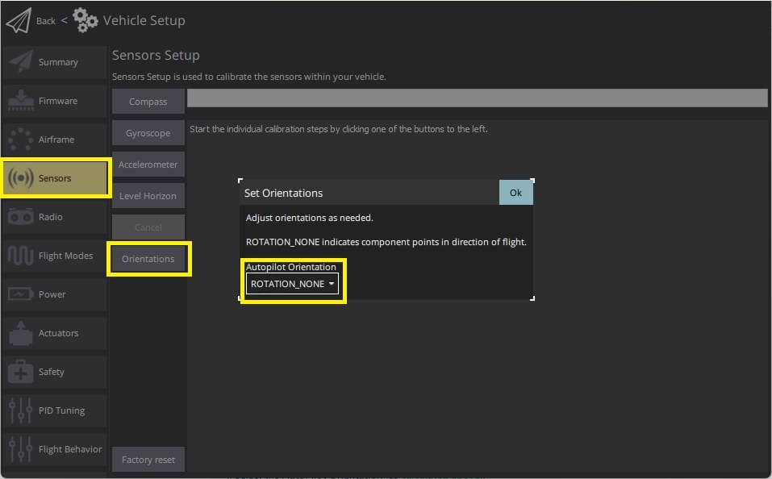

# Flight Controller/Sensor Orientation

By default the flight controller (and external compass(es), if present) should be placed on the frame top-side up, oriented so that the arrow points towards the front of the vehicle. If the board or an external compass are mounted in any other orientation then you will need configure this in the firmware.

## Calculating Orientation

ROLL, PITCH and/or YAW offsets of the flight controller are calculated relative to the vehicle around the forward (x), right (y), down (z) axes.

The axes to rotate around stay the same from one rotation step to the next one. So the frame to perform the rotation in stays fixed. This is also known as _extrinsic rotation_.

For example, the vehicles shown below have rotations around the z-axis (i.e. yaw only) corresponding to: `ROTATION_NONE`, `ROTATION_YAW_90`,`ROTATION_YAW_180`,`ROTATION_YAW_270`.

:::note
For a VTOL Tailsitter airframe set the vehicle orientation according to its multirotor configuration (i.e. relative to the vehicle during, takeoff, hovering, landing) for all sensor calibrations.

The axis are normally relative to the orientation of the vehicle during steady forward flight. For more information see [Basic Concepts](../getting_started/px4_basic_concepts.md#heading-and-directions).
:::

## Setting the Orientation

To set the orientations:

1. Start _QGroundControl_ and connect the vehicle.
1. Select the **Q** icon (top left), **Vehicle Setup** in the popup.
1. Select **Sensors** in the sidebar and then the **Orientations** button.

   

1. Select the **AutoPilot Orientation** (as [calculated above](#calculating-orientation)).

   

1. Press **OK**.

## Fine Tuning

You can use [Level Horizon Calibration](../config/level_horizon_calibration.md) to compensate for small miss-alignments in controller orientation and to level the horizon in flight view.

## Further Information

- [Advanced Orientation Tuning](../advanced_config/advanced_flight_controller_orientation_leveling.md) (advanced users only).
- [QGroundControl User Guide > Sensors](https://docs.qgroundcontrol.com/master/en/qgc-user-guide/setup_view/sensors_px4.html#flight_controller_orientation)
