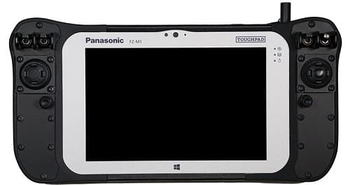

# Joystick Setup

A [computer joystick](https://en.wikipedia.org/wiki/Joystick) or gamepad connected through *QGroundControl* can be used to manually control the vehicle (*instead* of using an [RC Transmitter](../config/radio.md)).

This approach may be used by manual control units that have an integrated ground control station (like the *UAVComponents* [MicroNav](https://www.uavcomp.com/command-control/micronav/) shown below). Joysticks are also commonly used to allow developers to fly the vehicle in simulation.

:::tip
[Radio Setup](../config/radio.md) is not required if using only a joystick (because a joystick is not an RC controller)!
:::

:::note
*QGroundControl* uses the cross-platform [SDL2](http://www.libsdl.org/index.php) library to convert joystick movements to MAVLink [MANUAL_CONTROL](https://mavlink.io/en/messages/common.html#MANUAL_CONTROL) messages, which are then sent to PX4 over the telemetry channel. In consequence, a joystick-based controller system requires a reliable high bandwidth telemetry channel to ensure that the vehicle is responsive to joystick movements.
:::

## Enabling PX4 Joystick Support

Information about how to set up a joystick is covered in: [QGroundControl > Joystick Setup](https://docs.qgroundcontrol.com/en/SetupView/Joystick.html).

In summary:
* Open *QGroundControl*
* Set the parameter [COM_RC_IN_MODE=1](../advanced_config/parameter_reference.md#COM_RC_IN_MODE) - `Joystick`
  - See [Parameters](https://docs.qgroundcontrol.com/en/SetupView/Parameters.html) for information about setting parameters
  - Setting the parameter to `2` or `3` also enables Joystick under some circumstances.
* Connect the joystick
* Configure the connected joystick in: **Vehicle Setup > Joystick**.
