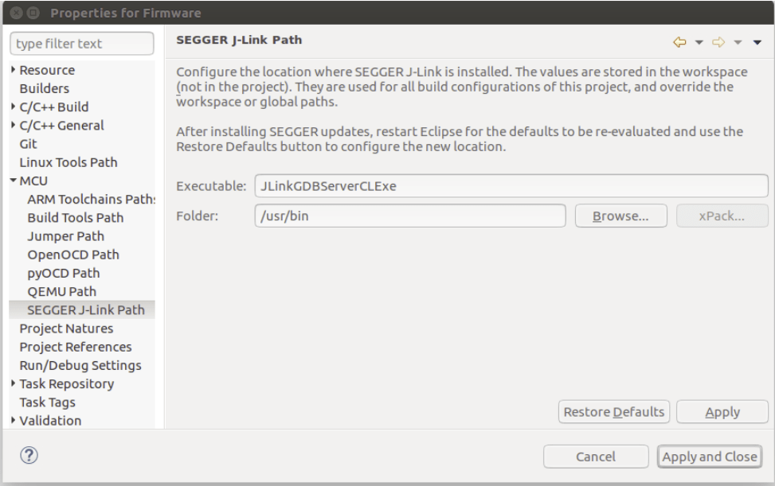

# MCU Eclipse/J-Link Debugging for PX4

This topic explains how to setup and use [MCU Eclipse](https://gnu-mcu-eclipse.github.io/) with a *Segger Jlink adapter* to debug PX4 running on NuttX (e.g. Pixhawk series boards).

## Required Hardware

- [J-Link EDU Mini](https://www.segger.com/products/debug-probes/j-link/models/j-link-edu-mini/)
- Adapter to connect Segger JLink to Flight Controller [SWD (JTAG) Hardware Debugging Interface](../debug/swd_debug.md) (debug port).
- USB micro cable
- Suitable cables to connect your target.

## Installation

### PX4

Setup PX4 by following the normal guidelines:
- [Setup the PX4 Developer Environment/Toolchain](../dev_setup/dev_env.md) for your platofrm (e.g. for Linux see: [Development Environment on Ubuntu LTS / Debian Linux](../dev_setup/dev_env_linux_ubuntu.md)).
- [Download PX4](../dev_setup/building_px4.md) and optionally build it on the command line.

### Eclipse

To install *Eclipse*:
1. Download [Eclipse CDT for C/C++ Developers](https://github.com/gnu-mcu-eclipse/org.eclipse.epp.packages/releases/) (MCU GitHub).
1. Extract the Eclipse folder and copy it anywhere (there is no need to run any install scripts).
1. Run *Eclipse* and choose a location for your initial workbench.

### Segger Jlink Tools

To install the *Segger Jlink* tools:
1. Download and run the [J-Link Software and Documentation Pack](https://www.segger.com/downloads/jlink/#J-LinkSoftwareAndDocumentationPack) for your OS (Windows and Linux packages available).
   - On Linux the tools are installed in **usr/bin**.

For more information, see: https://gnu-mcu-eclipse.github.io/debug/jlink/install/

## First Use

1. Connect the *Segger JLink* to the host computer and the [flight controller debug port](../debug/swd_debug.md) (via an adapter).
1. Power the flight controller.
1. Run *Eclipse*.
1. Add a source by choosing **File > Import > C/C++ > Existing Code as Makefile Project** and click **Next**.
1. Point it to the **PX4-Autopilot** folder and give it a name, then select *ARM Cross GCC* in the *Toolchain for Indexer Settings* and click **Finish**. Import takes a while, wait for it to complete.
1. Set the MCU settings: right-click on the top-level project in the Project Explorer, select *Properties* then under MCU choose *SEGGER J-Link Path*. Set it as shown in the screenshot below. 
1. Update packs:
   - Click the small icon on the top right called *Open Perspective* and open the *Packs* perspective. 
   - Click the **update all** button.

:::tip
This takes a VERY LONG TIME (10 minutes). Ignore all the errors about missing packages that pop up.
:::

     
   - The STM32Fxx devices are found in the Keil folder, install by right-clicking and then selecting **install** on the according device for F4 and F7.
1. Setup debug configuration for target:
   - Right click project and open the *Settings* (menu: **C/C++ Build > Settings**)
   - Choose the *Devices* Tab, *Devices* section (Not *Boards*).
   - Find the FMU chip you wish to debug.

   
1. Select debug configurations with the small drop-down next to the bug symbol: 
1. Then select *GDB SEGGER J-Link Debugging* and then the **New config** button on the top left. 
1. Setup build config:
   - Give it a name and set  the *C/C++ Application* to the corresponding **.elf** file.
   - Choose *Disable Auto build* :::note Remember that you must build the target from the command line before starting a debug session.
:::

   
1. The *Debugger* and *Startup* tabs shouldn’t need any modifications (just verify your settings with the screenshots below)

    

## Troubleshooting

### Target CPU not in Package Manager

If the target CPU does not appear in the package manager you may need these steps to get the register view working.

:::tip
This should not generally happen (but anecdotally has been reported when connecting to an STM F7 controller).
:::

Adding missing SVD files for the *Peripheral View*:
1. Find out where MCU Eclipse stores its packages (**Preferences > C/C++ > MCU Packages**): 
2. Download missing packages from: http://www.keil.com/dd2/Pack/
3. Open downloaded pack with a decompression tool, and extract the **.SVD** files from: **/CMSIS/SVD**.
4. Select desired **.SVD** file in: **Debug Options > GDB SEGGER JLink Debugging > SVD Path** 
