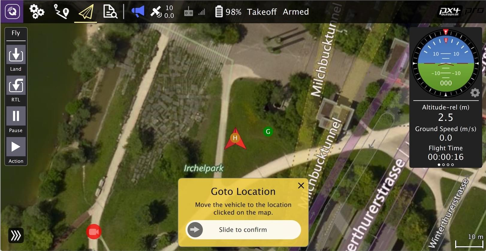

# Building PX4 Software

PX4 can be built on the console or in an IDE, for both simulated and hardware targets.

:::note
Before following these instructions you must first install the [Developer Toolchain](../dev_setup/dev_env.md) for your host operating system and target hardware.
:::

:::tip
For solutions to common build problems see [Troubleshooting](#troubleshooting) below.
:::

## Download the PX4 Source Code

The PX4 source code is stored on Github in the [PX4/PX4-Autopilot](https://github.com/PX4/PX4-Autopilot) repository. To get the *very latest* version onto your computer, enter the following command into a terminal:

```sh
git clone https://github.com/PX4/PX4-Autopilot.git --recursive
```

:::note
This is all you need to do just to build the latest code. [GIT Examples > Contributing code to PX4](../contribute/git_examples.md#contributing_code) provides a lot more information about using git to contribute to PX4.
:::

## First Build (Using the jMAVSim Simulator)

First we'll build a simulated target using a console environment. This allows us to validate the system setup before moving on to real hardware and an IDE.

Navigate into the **PX4-Autopilot** directory and start [jMAVSim](../simulation/jmavsim.md) using the following command:
```sh
make px4_sitl jmavsim
```

This will bring up the PX4 console below:


:::note
You may need to start *QGroundControl* before proceeding, as the default PX4 configuration requires a ground control connection before takeoff. This can be [downloaded from here](https://docs.qgroundcontrol.com/master/en/getting_started/download_and_install.html).
:::

The drone can be flown by typing:
```sh
pxh> commander takeoff
```


The drone can be landed by typing `commander land` and the whole simulation can be stopped by doing **CTRL+C** (or by entering `shutdown`).

Flying the simulation with the ground control station is closer to the real operation of the vehicle. Click on a location in the map while the vehicle is flying (takeoff flight mode) and enable the slider. This will reposition the vehicle.



:::tip PX4 can be used with a number of other [Simulators](../simulation/README.md), including [Gazebo Simulation](../simulation/gazebo.md) and [AirSim Simulation](../simulation/airsim.md). These are also started with *make* - e.g.
```
make px4_sitl gazebo
```
:::

## NuttX / Pixhawk Based Boards

### Building for NuttX

To build for NuttX- or Pixhawk- based boards, navigate into the **PX4-Autopilot** directory and then call `make` with the build target for your board.

For example, to build for [Pixhawk 4](../flight_controller/pixhawk4.md) hardware you could use the following command:
```sh
cd PX4-Autopilot
make px4_fmu-v5_default
```

A successful run will end with similar output to:
```sh
-- Build files have been written to: /home/youruser/src/PX4-Autopilot/build/px4_fmu-v4_default
[954/954] Creating /home/youruser/src/PX4-Autopilot/build/px4_fmu-v4_default/px4_fmu-v4_default.px4
```

The first part of the build target `px4_fmu-v4` indicates the firmware for a particular flight controller hardware. The following list shows the build commands for the [Pixhawk standard](../flight_controller/autopilot_pixhawk_standard.md) boards:

- [Holybro Pixhawk 6X (FMUv6X)](../flight_controller/pixhawk6x.md): `make px4_fmu-v6x_default`
- [Holybro Pixhawk 6C (FMUv6C)](../flight_controller/pixhawk6c.md): `make px4_fmu-v6c_default`
- [Holybro Pixhawk 5X (FMUv5X)](../flight_controller/pixhawk5x.md): `make px4_fmu-v5x_default`
- [Pixhawk 4 (FMUv5)](../flight_controller/pixhawk4.md): `make px4_fmu-v5_default`
- [Pixhawk 4 Mini (FMUv5)](../flight_controller/pixhawk4_mini.md): `make px4_fmu-v5_default`
- [CUAV V5+ (FMUv5)](../flight_controller/cuav_v5_plus.md): `make px4_fmu-v5_default`
- [CUAV V5 nano (FMUv5)](../flight_controller/cuav_v5_nano.md): `make px4_fmu-v5_default`
- [Pixracer (FMUv4)](../flight_controller/pixracer.md): `make px4_fmu-v4_default`
- [Pixhawk 3 Pro](../flight_controller/pixhawk3_pro.md): `make px4_fmu-v4pro_default`
- [Pixhawk Mini](../flight_controller/pixhawk_mini.md): `make px4_fmu-v3_default`
- [Pixhawk 2 (Cube Black) (FMUv3)](../flight_controller/pixhawk-2.md): `make px4_fmu-v3_default`
- [mRo Pixhawk (FMUv3)](../flight_controller/mro_pixhawk.md): `make px4_fmu-v3_default` (supports 2MB Flash)
- [Holybro pix32 (FMUv2)](../flight_controller/holybro_pix32.md): `make px4_fmu-v2_default`
- [Pixfalcon (FMUv2)](../flight_controller/pixfalcon.md): `make px4_fmu-v2_default`
- [Dropix (FMUv2)](../flight_controller/dropix.md): `make px4_fmu-v2_default`
- [Pixhawk 1 (FMUv2)](../flight_controller/pixhawk.md): `make px4_fmu-v2_default` :::warning You **must** use a supported version of GCC to build this board (e.g. the same as used by [CI/docker](../test_and_ci/docker.md)) or remove modules from the build. Building with an unsupported GCC may fail, as PX4 is close to the board's 1MB flash limit.
:::
- Pixhawk 1 with 2 MB flash: `make px4_fmu-v3_default`

Build commands for non-Pixhawk NuttX fight controllers (and for all other-boards) are provided in the documentation for the individual [flight controller boards](../flight_controller/README.md).

:::note
The `_default` suffix is the firmware _configuration_. This is optional (i.e. you can also build using `make px4_fmu-v4`, `make bitcraze_crazyflie`, etc.).
:::

### Uploading Firmware (Flashing the board)

Append `upload` to the make commands to upload the compiled binary to the autopilot hardware via USB. For example

```sh
make px4_fmu-v4_default upload
```

A successful run will end with this output:

```sh
Erase  : [====================] 100.0%
Program: [====================] 100.0%
Verify : [====================] 100.0%
Rebooting.

[100%] Built target upload
```

## Other Boards

Build commands for other boards are given the [board-specific flight controller pages](../flight_controller/README.md) (usually under a heading *Building Firmware*).

You can also list all configuration targets using the command:
```sh
make list_config_targets
```


## Compiling in a Graphical IDE

[VSCode](../dev_setup/vscode.md) is the officially supported (and recommended) IDE for PX4 development. It is easy to set up and can be used to compile PX4 for both simulation and hardware environments.


## Troubleshooting

### General Build Errors

Many build problems are caused by either mismatching submodules or an incompletely cleaned-up build environment. Updating the submodules and doing a `distclean` can fix these kinds of errors:
```
git submodule update --recursive
make distclean
```

### Flash overflowed by XXX bytes

The `region 'flash' overflowed by XXXX bytes` error indicates that the firmware is too large for the target hardware platform. This is common for `make px4_fmu-v2_default` builds, where the flash size is limited to 1MB.

If you're building the *vanilla* master branch, the most likely cause is using an unsupported version of GCC. In this case, install the version specified in the [Developer Toolchain](../dev_setup/dev_env.md) instructions.

If building your own branch, it is possibly you have increased the firmware size over the 1MB limit. In this case you will need to remove any drivers/modules that you don't need from the build.


### macOS: Too many open files error

MacOS allows a default maximum of 256 open files in all running processes. The PX4 build system opens a large number of files, so you may exceed this number.

The build toolchain will then report `Too many open files` for many files, as shown below:
```sh
/usr/local/Cellar/gcc-arm-none-eabi/20171218/bin/../lib/gcc/arm-none-eabi/7.2.1/../../../../arm-none-eabi/bin/ld: cannot find NuttX/nuttx/fs/libfs.a: Too many open files
```

The solution is to increase the maximum allowed number of open files (e.g. to 300). You can do this in the macOS *Terminal* for each session:
- Run this script [Tools/mac_set_ulimit.sh](https://github.com/PX4/PX4-Autopilot/blob/release/1.13/Tools/mac_set_ulimit.sh), or
- Enter this command:
  ```sh
  ulimit -S -n 300
  ```

### macOS Catalina: Problem running cmake

As of macOS Catalina 10.15.1 there may be problems when trying to build the simulator with *cmake*. If you have build problems on this platform then try run the following command in your terminal:
```sh
xcode-select --install
sudo ln -s /Library/Developer/CommandLineTools/SDKs/MacOSX.sdk/usr/include/* /usr/local/include/
```

### Ubuntu 18.04: Compile errors involving arm_none_eabi_gcc

Build issues related to `arm_none_eabi_gcc`may be due to a broken g++ toolchain installation. You can verify that this is the case by checking for missing dependencies using:
```bash
arm-none-eabi-gcc --version
arm-none-eabi-g++ --version
arm-none-eabi-gdb --version
arm-none-eabi-size --version
```

Example of bash output with missing dependencies:
```bash
arm-none-eabi-gdb --version
arm-none-eabi-gdb: command not found
```

This can be resolved by removing and [reinstalling the compiler](https://askubuntu.com/questions/1243252/how-to-install-arm-none-eabi-gdb-on-ubuntu-20-04-lts-focal-fossa).

### Ubuntu 18.04: Visual Studio Code is unable to watch for file changes in this large workspace

See [Visual Studio Code IDE (VSCode) > Troubleshooting](../dev_setup/vscode.md#troubleshooting).

### Failed to import Python packages

"Failed to import" errors when running the `make px4_sitl jmavsim` command indicates that some Python packages are not installed (where expected).
```
Failed to import jinja2: No module named 'jinja2'
You may need to install it using:
    pip3 install --user jinja2
```
If you have already installed these dependencies this may be because there is more than one Python version on the computer (e.g. Python 2.7.16 Python 3.8.3), and the module is not present in the version used by the build toolchain.

You should be able to fix this by explicitly installing the dependencies as shown:
```
pip3 install --user pyserial empty toml numpy pandas jinja2 pyyaml pyros-genmsg packaging
```


## PX4 Make Build Targets

The previous sections showed how you can call *make* to build a number of different targets, start simulators, use IDEs etc. This section shows how *make* options are constructed and how to find the available choices.

The full syntax to call *make* with a particular configuration and initialization file is:
```sh
make [VENDOR_][MODEL][_VARIANT] [VIEWER_MODEL_DEBUGGER_WORLD]
```

**VENDOR_MODEL_VARIANT**: (also known as `CONFIGURATION_TARGET`)

- **VENDOR:** The manufacturer of the board: `px4`, `aerotenna`, `airmind`, `atlflight`, `auav`, `beaglebone`, `intel`, `nxp`, etc. The vendor name for Pixhawk series boards is `px4`.
- **MODEL:** The *board model* "model": `sitl`, `fmu-v2`, `fmu-v3`, `fmu-v4`, `fmu-v5`, `navio2`, etc.
- **VARIANT:** Indicates particular configurations: e.g. `rtps`, `lpe`, which contain components that are not present in the `default` configuration. Most commonly this is `default`, and may be omitted.

:::tip
You can get a list of *all* available `CONFIGURATION_TARGET` options using the command below:
```sh
make list_config_targets
```
:::

**VIEWER_MODEL_DEBUGGER_WORLD:**

- **VIEWER:** This is the simulator ("viewer") to launch and connect: `gazebo`, `jmavsim`, `none` <!-- , ?airsim -->

:::tip
`none` can be used if you want to launch PX4 and wait for a simulator (jmavsim, gazebo, or some other simulator). For example, `make px4_sitl none_iris` launches PX4 without a simulator (but with the iris airframe).
:::
- **MODEL:** The *vehicle* model to use (e.g. `iris` (*default*), `rover`, `tailsitter`, etc), which will be loaded by the simulator. The environment variable `PX4_SIM_MODEL` will be set to the selected model, which is then used in the [startup script](../simulation/README.md#startup-scripts) to select appropriate parameters.
- **DEBUGGER:** Debugger to use: `none` (*default*), `ide`, `gdb`, `lldb`, `ddd`, `valgrind`, `callgrind`. For more information see [Simulation Debugging](../debug/simulation_debugging.md).
- **WORLD:** (Gazebo only). Set a the world ([PX4/sitl_gazebo/worlds](https://github.com/PX4/sitl_gazebo/tree/master/worlds)) that is loaded. Default is [empty.world](https://github.com/PX4/sitl_gazebo/blob/master/worlds/empty.world). For more information see [Gazebo > Loading a Specific World](../simulation/gazebo.md#set_world).

:::tip
You can get a list of *all* available `VIEWER_MODEL_DEBUGGER_WORLD` options using the command below:
```sh
make px4_sitl list_vmd_make_targets
```
:::

Notes:
- Most of the values in the `CONFIGURATION_TARGET` and `VIEWER_MODEL_DEBUGGER` have defaults, and are hence optional. For example, `gazebo` is equivalent to `gazebo_iris` or `gazebo_iris_none`.
- You can use three underscores if you want to specify a default value between two other settings. For example, `gazebo___gdb` is equivalent to `gazebo_iris_gdb`.
- You can use a `none` value for `VIEWER_MODEL_DEBUGGER` to start PX4 and wait for a simulator. For example start PX4 using `make px4_sitl_default none` and jMAVSim using `./Tools/jmavsim_run.sh -l`.


The `VENDOR_MODEL_VARIANT` options map to particular *px4board* configuration files in the PX4 source tree under the [/boards](https://github.com/PX4/PX4-Autopilot/tree/release/1.13/boards) directory. Specifically `VENDOR_MODEL_VARIANT` maps to a configuration file **boards/VENDOR/MODEL/VARIANT.px4board** (e.g. `px4_fmu-v5_default` corresponds to [boards/px4/fmu-v5/default.px4board](https://github.com/PX4/PX4-Autopilot/blob/release/1.13/boards/px4/fmu-v5/default.px4board)).

Additional make targets are discussed in relevant sections:
- `bloaty_compare_master`: [Binary Size Profiling]()
- ...


## Firmware Version & Git Tags

The *PX4 Firmware Version* and *Custom Firmware Version* are published using the MAVLink [AUTOPILOT_VERSION](https://mavlink.io/en/messages/common.html#AUTOPILOT_VERSION) message, and displayed in the *QGroundControl* **Setup > Summary** airframe panel:


These are extracted at build time from the active *git tag* for your repo tree. The git tag should be formatted as `<PX4-version>-<vendor-version>` (e.g. the tag in the image above was set to `v1.8.1-2.22.1`).

:::warning
If you use a different git tag format, versions information may not be displayed properly.
:::


