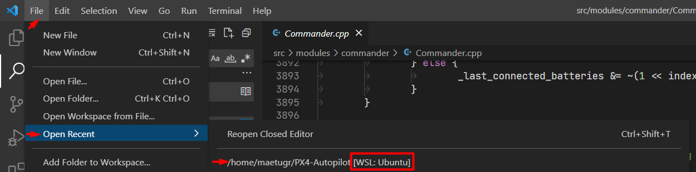

# Windows Development Environment (WSL2-Based)

The following instructions explain how to set up a PX4 development environment on Windows 10 or Windows 11 (preferred), running on Ubuntu Linux within [WSL2](https://docs.microsoft.com/en-us/windows/wsl/about).

This environment can be used to build PX4 for:

- [Pixhawk and other NuttX-based hardware](../dev_setup/building_px4.md#nuttx-pixhawk-based-boards)
- [jMAVSim Simulation](../simulation/jmavsim.md)
- [Gazebo Classic Simulation](../sim_gazebo_classic/README.md)

:::tip
This setup is supported by the PX4 dev team.
The environment should in theory be able to build any target that can be built on Ubuntu.
The list above are those targets that have been tested.
:::

:::note
This setup be used on Windows 10, with some [caveats](#windows-10-gui-support).
:::

## Overview

The [Windows Subsystem for Linux](https://docs.microsoft.com/en-us/windows/wsl/about) ([WSL2](https://docs.microsoft.com/en-us/windows/wsl/compare-versions)) allows users to install and run the [Ubuntu Development Environment](../dev_setup/dev_env_linux_ubuntu.md) on Windows, _almost_ as though we were running it on a Linux computer.

With this environment developers can:
- Build any simulator or hardware target supported by [Ubuntu Development Environment](../dev_setup/dev_env_linux_ubuntu.md) in the WSL Shell. (Ubuntu is the best supported and tested PX4 development platform).
- Debug code in [Visual Studio Code](dev_env_windows_wsl.md#visual-studio-code-integration) (**Windows**).
- Monitor a _simulation_ using _QGroundControl for Linux_ running in WSL. QGC for Linux connects automatically to the simulation.

_QGroundControl for Windows_ is additionally required if you need to:

- [Update firmware](#flash-a-flight-control-board) on a real vehicle.
- Monitor a real vehicle. Note that you can also use it to monitor a simulation, but you must manually [connect to the simulation running in WSL](#qgroundcontrol-on-windows).


:::note
Connecting to a real device from within WSL is not supported, so you can't update firmware using the [`upload`](../dev_setup/building_px4.md#uploading-firmware-flashing-the-board) option when building on the command line, or from *QGroundControl for Linux*.
:::

:::note
The approach is similar to installing PX4 in your _own_ virtual machine, as described in [Windows VM-Hosted Toolchain](../dev_setup/dev_env_windows_vm.md). The benefit of WSL2 is that its virtual machine is deeply integrated into Windows, system-managed, and performance optimised.
:::


### Windows 10 GUI Support

Windows 10 builds do not yet support GUIs for WSL2 apps, so windowed, graphics features will not work. This includes Gazebo Classic and jMAVSim rendered visualization, QGC for Linux running in WSL, `git` gui, etc.

Development is possible as you can still:
- Build PX4 in WSL2 and flash it to boards using QGC from **Windows**.
- Run simulations in [headless mode](../sim_gazebo_classic/README.md#headless-mode) (by prefixing the `make` command with `HEADLESS=1`). Connect using QGC on Windows or in WSL.

:::note WSL2 GUI support is provided by the [Windows Subsystem for Linux GUI (WSLg)](https://github.com/microsoft/wslg). This is present in stable Windows 11 builds by default. It is not yet in stable Windows 10 (only insider previews). See the link for rollout information.
:::


## Installation

### Install WSL2

To install WSL2 with the default Ubuntu distribution on a new installation of Windows 11:

1. Make sure your computer your computer's virtualization feature is enabled in the BIOS. It's usually referred as "Virtualization Technology", "Intel VT-x" or "AMD-V" respectively.
1. Open _cmd.exe_ as administrator. This can be done by pressing the start key, typing `cmd`, right klicking on the _Command prompt_ entry and selecting **Run as administrator**.
1. Execute the command `wsl --install` to run the installation routine for WSL.
1. Reboot the computer.
1. Open `cmd` again as a normal user (not as administrator). This can be done by pressing the **Start** key, typing `cmd` and pressing **Enter**.
1. Execute the command `wsl` to access the WSL shell.
1. WSL will prompt you for a user name and password for the Ubuntu installation. Record these credentials as you will need them later on!


:::note
If you have any problems with your setup, check the current [Microsoft WSL installation documentation](https://docs.microsoft.com/windows/wsl/).
:::

### Opening a WSL Shell

All operations to install and build PX4 must be done within a WSL Shell (you can use the same shell that was used to install WSL2 or open a new one).

To open a WSL shell:

1. Open a command prompt:

   - Press the Windows **Start** key.
   - Type `cmd` and press **Enter** to open the prompt.
1. To start WSL and access the WSL shell, execute the command:

   ```
   wsl
   ```

:::note
Enter the following commands to first close the WSL shell, and then shut down WSL:

```
exit
wsl --shutdown
````

Alternatively, after entering `exit` you can just close the prompt.
:::

### Install PX4 Toolchain

Next we download the PX4 source code within the WSL2 environment, and use the normal *Ubuntu installer script* to to set up the developer environment.
This will install the toolchain for Gazebo Classic simulation, JMAVSim simulation and Pixhawk/NuttX hardware.

To install the development toolchain:

1. [Open a WSL2 Shell](#opening-a-wsl-shell) (if it is still open you can use the same one that was used to install WSL2).
1. Execute the command `cd ~` to switch to the home folder of WSL for the next steps.

   :::warning
   This is important!
   If you work from a location outside of the WSL file system you'll run into issues such as very slow execution and access right/permission errors.

:::

1. Download the PX4 source code using `git` (which is already installed in WSL2):

   ```bash
   git clone https://github.com/PX4/PX4-Autopilot.git --recursive
   ```

:::note
The environment setup scripts in the source usually work for recent PX4 releases. If working with an older version of PX4 you may need to [get the source code specific to your release](../contribute/git_examples.md#get-a-specific-release).
:::

1. Run the **ubuntu.sh** installer script and acknowledge any prompts as the script progresses:

   ```bash
   bash ./PX4-Autopilot/Tools/setup/ubuntu.sh
   ```

:::note
This installs tools to build PX4 for Pixhawk, Gazebo Classic and JMAVSim targets:

   - You can use the `--no-nuttx` and `--no-sim-tools` options to omit the NuttX and/or simulation tools.
   - Other Linux build targets are untested (you can try these by entering the appropriate commands in [Ubuntu Development Environment](../dev_setup/dev_env_linux_ubuntu.md) into the WSL shell).
:::

1. Restart the "WSL computer" after the script completes (exit the shell, shutdown WSL, and restart WSL):
   ```
   exit
   wsl --shutdown
   wsl
   ```
1. Switch to the PX4 repository in the WSL home folder:
   ```
   cd ~/PX4-Autopilot
   ```
1. Build the PX4 SITL target and test your environment:
   ```
   make px4_sitl
   ```

For more build options see [Building PX4 Software](../dev_setup/building_px4.md).


## Visual Studio Code Integration

VS Code running on Windows is well integrated with WSL.

To set up the integration:
1. [Download](https://code.visualstudio.com/) and install Visual Studio Code (VS Code) on Windows,
2. Open _VS Code_.
3. Install the extension called [Remote - WSL](https://marketplace.visualstudio.com/items?itemName=ms-vscode-remote.remote-wsl) (marketplace)
4. [Open a WSL shell](#opening-a-wsl-shell)
5. In the WSL shell, switch to the PX4 folder:
   ```
   cd ~/PX4-Autopilot
   ```
6. In the WSL shell, start VS Code:
   ```
   code .
   ```
   This will open the IDE fully integrated with the WSL shell.

   Make sure you always open the PX4 repository in the Remote WSL mode.

7. Next time you want to develop WSL2 you can very easily open it again in Remote WSL mode by selecting **Open Recent** (as shown below). This will start WSL for you.

   

   Note however that the IP address of the WSL virtual machine will have changed, so you won't be able to monitor simulation from QGC for Windows (you can still monitor using QGC for Linux)


## QGroundControl

You can run QGroundControl in either WSL or Windows to connect to the running simulation. If you need to [flash a flight control board](#flash-a-flight-control-board) with new firmware you can only do this from the QGroundControl for Windows.

### QGroundControl in WSL

The easiest way to set up and use QGroundControl is to download the Linux version into your WSL.

You can do this using from within the WSL shell.
1. In a web browser, navigate to the QGC [Ubuntu download section](https://docs.qgroundcontrol.com/master/en/getting_started/download_and_install.html#ubuntu)
1. Right-click on the **QGroundControl.AppImage** link, and select "Copy link address". This will be something like _https://d176td9ibe4jno.cloudfront.net/builds/master/QGroundControl.AppImage_
1. [Open a WSL shell](#opening-a-wsl-shell) and enter the following commands to download the appimage and make it executable (replace the AppImage URL where indicated):
   ```
   cd ~
   wget <the_copied_AppImage_URL>
   chmod +x QGroundControl.AppImage
   ```
1. Run QGroundControl:
   ```
   ./QGroundControl.AppImage
   ```

QGroundControl will launch and automatically connect to a running simulation and allow you to monitor and control your vehicle(s).

You will not be able to use it to install PX4 firmware because WSL does not allow access to serial devices.


### QGroundcontrol on Windows

Install [QGroundControl on Windows](https://docs.qgroundcontrol.com/master/en/getting_started/download_and_install.html#windows) if you want to be able to update hardware with firmware created within PX4.

These steps describe how you can connect to the simulation running in the WSL:

1. [Open a WSL shell](#opening-a-wsl-shell)
2. Check the IP address of the WSL virtual machine by running the command `ip addr | grep eth0`:
   ```bash
   $ ip addr | grep eth0

   6: eth0: <BROADCAST,MULTICAST,UP,LOWER_UP> mtu 1500 qdisc mq state UP group default qlen 1000
       inet 172.18.46.131/20 brd 172.18.47.255 scope global eth0
   ```
   Copy the first part of the `eth0` interface `inet` address to the clipboard. In this case: `172.18.46.131`.
3. In QGC go to **Q > Application Settings > Comm Links**
4. Add a UDP Link called "WSL" to port `18570` of the IP address copied above.
5. Save it and connect to it.

:::note
You will have to update the WSL comm link in QGC every time WSL restarts (because it gets a dynamic IP address).
:::

## Flash a Flight Control Board

Flashing a custom built PX4 binary has to be done using [QGroundControl for Windows](#qgroundcontrol-on-windows) since WSL2 does not natively offer direct access to serial devices like Pixhawk boards.

Do the following steps to flash your custom binary built in WSL:

1. If you haven't already build the binary in WSL e.g. with a [WSL shell](dev_env_windows_wsl.md#opening-a-wsl-shell) and by running:
   ```
   cd ~/PX4-Autopilot
   make px4_fmu-v5
   ```
   Note: Use the correct target for your board. "fmu-v5" can be used for a Pixhawk 4 board.
1. Detach the USB cable of your Pixhawk board from the computer if it was plugged.
1. Open QGC.
1. In QGC go to **Q > Vehicle Setup > Firmware**
1. Plug your pixhawk board via USB
1. Once connected select "PX4 Flight Stack", check "Advanced settings" and choose "Custom firmware file ..." from the drop down below.
1. Continue and select the firmware binary you just built before. In the open dialog look for the "Linux" location with the penguin icon in the left pane. It's usually all the way at the bottom. Choose the file in the path: `Ubuntu\home\{your WSL user name}\PX4-Autopilot\build\{your build target}\{your build target}.px4` :::note
You can add the folder to the favourites to access it quickly next time.
:::
1. Start the flashing.
