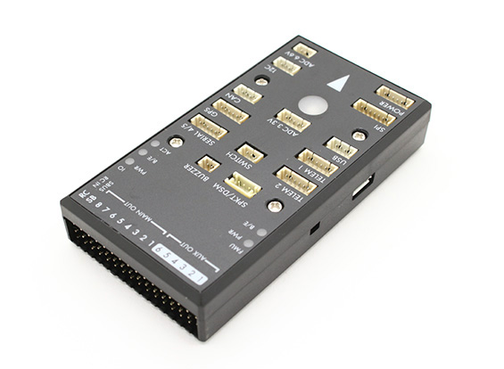

# Holybro HKPilot32 Flight Controller

The Hobbyking&reg; *HKPilot32 autopilot* is based on the [Pixhawk&reg;-project](https://pixhawk.org/) **FMUv2** open hardware design. It runs the PX4 Flight Stack on the [NuttX](http://nuttx.org) OS.

> **Tip** The HKPilot32 is software compatible with the [3DR Pixhawk 1](../flight_controller/pixhawk.md). It is not connector compatible, but is otherwise physically very similar to the 3DR Pixhawk or mRo Pixhawk.

As a CC-BY-SA 3.0 licensed Open Hardware design, schematics and design files should be [available here](https://github.com/PX4/Hardware).

> **Note** This flight controller formerly known as the Hobbyking&reg; *HKPilot32* autopilot.

 

<blockquote>
  

    <strong>Tip</strong> This autopilot is <a href="../flight_controller/autopilot_pixhawk_standard.md">supported</a> by the PX4 maintenance and test teams.
  

</blockquote>

<h2>
  Key Features
</h2>

<ul>
  <li>
    Main System-on-Chip: <a href="http://www.st.com/web/en/catalog/mmc/FM141/SC1169/SS1577/LN1789">STM32F427</a> <ul>
      <li>
        CPU: 32-bit STM32F427 Cortex&reg; M4 core with FPU
      </li>
      <li>
        RAM: 168 MHz/256 KB
      </li>
      <li>
        Flash: 2 MB
      </li>
    </ul>
  </li>
  <li>
    Failsafe System-on-Chip: STM32F103
  </li>
  <li>
    Sensors: <ul>
      <li>
        ST Micro L3GD20 3-axis 16-bit gyroscope
      </li>
      <li>
        ST Micro LSM303D 3-axis 14-bit accelerometer / magnetometer
      </li>
      <li>
        Invensense&reg; MPU 6000 3-axis accelerometer/gyroscope
      </li>
      <li>
        MEAS MS5611 barometer
      </li>
    </ul>
  </li>
  <li>
    Dimensions/Weight <ul>
      <li>
        Size: 81x44x15mm
      </li>
      <li>
        Weight: 33.1g
      </li>
    </ul>
  </li>
  <li>
    GPS: U-blox&reg; super precision Neo-7M with compass
  </li>
  <li>
    Input Voltage: 2~10s (7.4~37V)
  </li>
</ul>

<h3>
  Connectivity
</h3>

<ul>
  <li>
    1x I2C
  </li>
  <li>
    2x CAN
  </li>
  <li>
    3.3 and 6.6V ADC inputs
  </li>
  <li>
    5x UART (serial ports), one high-power capable, 2x with HW flow control
  </li>
  <li>
    Spektrum DSM / DSM2 / DSM-X® Satellite compatible input up to DX8 (DX9 and above not supported)
  </li>
  <li>
    Futaba&reg; S.BUS compatible input and output
  </li>
  <li>
    PPM sum signal
  </li>
  <li>
    RSSI (PWM or voltage) input
  </li>
  <li>
    SPI
  </li>
  <li>
    External microUSB port
  </li>
  <li>
    Molex PicoBlade connectors
  </li>
</ul>

<h3>
  Accessories
</h3>

<ul>
  <li>
    <a href="https://shop.holybro.com/c/digital-air-speed-sensor_0508">Digital airspeed sensor</a>
  </li>
  <li>
    <a href="https://hobbyking.com/en_us/apm-pixhawk-wireless-wifi-radio-module.html">Hobbyking&reg; Wifi Telemetry</a>
  </li>
  <li>
    <a href="https://shop.holybro.com/c/433mhz_0470">Telemetry Radio EU (433 MHz)</a>
  </li>
  <li>
    <a href="https://shop.holybro.com/c/915mhz_0471">Telemetry Radio USA (915 MHz)</a>
  </li>
</ul>

<h2>
  Purchase
</h2>

  <a href="https://shop.holybro.com/c/pixhawk-2_0460">shop.holybro.com</a>

<h2>
  Building Firmware
</h2>

<blockquote>
  

    <strong>Tip</strong> Most users will not need to build this firmware! It is pre-built and automatically installed by <em>QGroundControl</em> when appropriate hardware is connected.
  

</blockquote>

  To <a href="https://dev.px4.io/master/en/setup/building_px4.html">build PX4</a> for this target:

<pre><code>make px4_fmu-v2_default
</code></pre>

<h2>
  Debug Port
</h2>

  See <a href="../flight_controller/pixhawk.md#debug-ports">3DR Pixhawk 1 > Debug Ports</a>.

<h2>
  Pinouts and Schematics
</h2>

  The board is based on the <a href="https://pixhawk.org/">Pixhawk project</a> <strong>FMUv2</strong> open hardware design.

<ul>
  <li>
    <a href="https://raw.githubusercontent.com/PX4/Hardware/master/FMUv2/PX4FMUv2.4.5.pdf">FMUv2 + IOv2 schematic</a> -- Schematic and layout
  </li>
</ul>

<blockquote>
  

    <strong>Note</strong> As a CC-BY-SA 3.0 licensed Open Hardware design, all schematics and design files are <a href="https://github.com/PX4/Hardware">available</a>.
  

</blockquote>

<h2>
  Serial Port Mapping
</h2>

<table>
  <tr>
    <th>
      UART
    </th>
    
    <th>
      Device
    </th>
    
    <th>
      Port
    </th>
  </tr>
  
  <tr>
    <td>
      UART1
    </td>
    
    <td>
      /dev/ttyS0
    </td>
    
    <td>
      IO debug
    </td>
  </tr>
  
  <tr>
    <td>
      USART2
    </td>
    
    <td>
      /dev/ttyS1
    </td>
    
    <td>
      TELEM1 (flow control)
    </td>
  </tr>
  
  <tr>
    <td>
      USART3
    </td>
    
    <td>
      /dev/ttyS2
    </td>
    
    <td>
      TELEM2 (flow control)
    </td>
  </tr>
  
  <tr>
    <td>
      UART4
    </td>
    
    <td>
    </td>
    
    <td>
    </td>
  </tr>
  
  <tr>
    <td>
      UART7
    </td>
    
    <td>
      CONSOLE
    </td>
    
    <td>
    </td>
  </tr>
  
  <tr>
    <td>
      UART8
    </td>
    
    <td>
      SERIAL4
    </td>
    
    <td>
    </td>
  </tr>
</table>