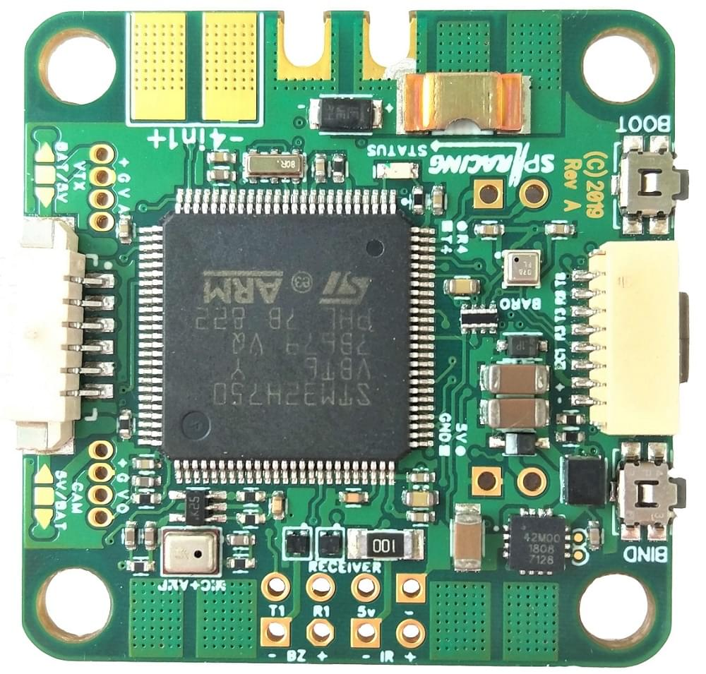

# SPRacingH7EXTREME (PX4 Edition)

:::warning PX4 does not manufacture this (or any) autopilot. Contact the [manufacturer](https://shop.seriouslypro.com) for hardware support or compliance issues. :::

The [SPRacingH7EXTREME](https://shop.seriouslypro.com/sp-racing-h7-extreme) is a feature packed FC/PDB with DUAL ICM20602 gyros, H7 400/480Mhz(+) CPU, high-precision BMP388 barometer, SD Card socket, current sensor, 8 easily accessible motor outputs, OSD, Microphone, Audio output, and more.

It can be used easily for small to large quads, planes, octocoptors and more advanced frames. It's best used with separate ESCs as it features a built-in power distribution board (PDB). Wiring up a 4in1 ESC is easy too.

There is also a 12 pin stacking connector which provides 4 more motor outputs, SPI and a UART connectivity.

:::note
This flight controller is [manufacturer supported](../flight_controller/autopilot_manufacturer_supported.md). :::

## Key Features

* Main System-on-Chip: [STM32H750VBT6 rev.y/v](https://www.st.com/en/microcontrollers-microprocessors/stm32h750vb.html)
  * CPU: 400/480Mhz(+) ARM Cortex M7 with single-precision FPU. (+ 480Mhz with Rev V CPUs)
  * RAM: 1MB
  * 16MB External Flash 4-bit QuadSPI in Memory Mapped mode for code *and* config.
* On-board sensors:
  * Dual Gyros (1xSPI each, with separate interrupt signals, 32khz capable, fsync capable)
  * High-precision BMP388 Baro (I2C + interrupt)
  * 110A Current Sensor
* GPS via External 8 pin IO port.
* Audio/Visual
  * On-screen display OSD (dedicated SPI, character based, MAX7456)
  * Microphone sensor
  * Audio output from CPU DAC.
  * Audio mixer for microphone/DAC outputs.
* Interfaces
  * SD Card (4-bit SDIO not 1-bit SPI)
  * IR transponder (iLAP compatible)
  * Buzzer circuitry
  * RSSI (Analog/PWM)
  * 12 motor outputs (4 by motor pads, 4 in the middle, and 4 on stacking connector).
  * 1x SPI breakout onto stacking connector
  * 6 Serial Ports (5x TX & RX, 1x TX-only bi-directional for telemetry)
  * Boot Button (Side press)
  * Bind/User Button (Side press)
  * Receiver ports (all usual protocols, no inverter needed)
  * CAM OSD control and Video IN on CAM socket.
  * SWD debugging port.
* Video OUT + Audio OUT on VTX socket.
* USB with OTG capability (ID and VBUS connected to CPU)
* Power System
  * Integrated PDB.
  * 2-6S BEC
  * TVS Protection Diode
  * Dedicated 500ma VREG for Gyros, with gyro noise filter capacitors.
  * Second 500ma VREG for CPU, Baro, Microphone, etc.
* Other features
  * Status Led
  * LED strip support (with well-placed connection pads).
  * Bootable from SD Card or External flash.
  * Flashable from SD Card.
  * Solder-from-top design.
  * PCB Cutouts for battery wires.
  * No Compass, use an external GPS with a magnometer/compass sensor connected to the GPS IO port.
  * Also runs Betaflight 4.x+, Cleanflight 4.x+.
  * Designed by Dominic Clifton, the guy that created Cleanflight
* Dimensions
  * 36x36mm with 30.5*30.5 mouting pattern, M4 holes.
  * Soft-mount M4 to M3 grommets supplied.

## Where to Buy

The SPRacingH7EXTREME is available from the [Seriously Pro shop](https://shop.seriouslypro.com/sp-racing-h7-extreme).

:::note
Select the PX4 edition when purchasing!
:::

## Manual, Pinouts and Connection Diagrams

The manual with pinouts can be downloaded from [here](http://seriouslypro.com/files/SPRacingH7EXTREME-Manual-latest.pdf). See the [SPRacingH7EXTREME website](http://seriouslypro.com/spracingh7extreme) for other diagrams.

## Credits

This design was created by [Dominic Clifton](https://github.com/hydra) Initial PX4 support by [Igor-Misic](https://github.com/Igor-Misic)
