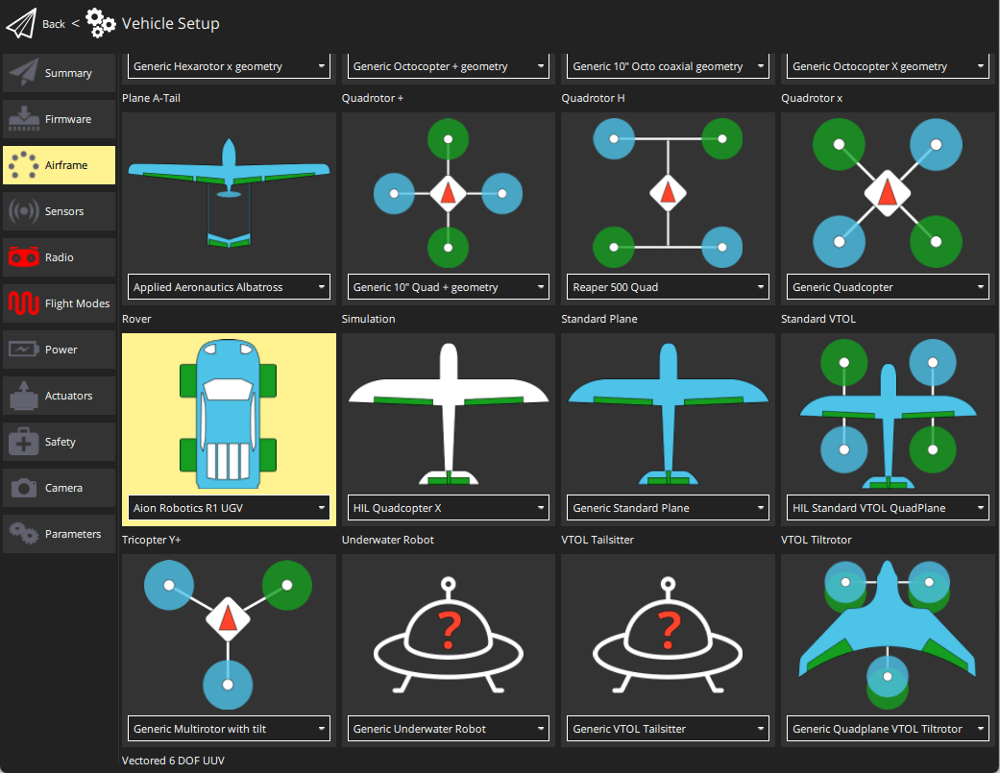

# Rovers (UGVs)

<LinkedBadge type="warning" text="Experimental" url="../airframes/#experimental-vehicles"/>

:::warning
Support for rover is [experimental](../airframes/README.md#experimental-vehicles). Maintainer volunteers, [contribution](../contribute/README.md) of new features, new frame configurations, or other improvements would all be very welcome!
:::

PX4 supports rovers (Unmanned Ground Vehicles - UGVs) with [ackermann and differential](#rover-types) steering.

This section contains build logs/instructions for assembling as well as configuring a number of UGV frames.


## Rover Types

PX4 supports rovers with:

- **Differential steering**: direction is controlled by moving the left- and right-side wheels at different speeds. This kind of steering commonly used on bulldozers, tanks, and other tracked vehicles.
- **Ackermann steering**: direction is controlled by pointing wheels in the direction of travel ([ackermann geometry](https://en.wikipedia.org/wiki/Ackermann_steering_geometry) compensates for the fact that wheels on the inside and outside of the turn move at different rates). This kind of steering is used on most commercial vehicles, including cars, trucks etc.

The supported frames can be seen in [Airframes Reference > Rover](../airframes/airframe_reference.md#rover).

## How to Configure a Rover

### Ackermann Steering Configuration

Setting up a rover with Ackermann steering is straightforward:

1. In the [Airframe](../config/airframe.md) configuration, select the _Generic Ground Vehicle_.

   

   Select the **Apply and Restart** button.

1. Open the [Actuators Configuration & Testing](../config/actuators.md) to map the steering and throttle functions to flight controller outputs.

### Differential Steering Configuration

1. In the [Airframe](../config/airframe.md) configuration, select either the _Aion Robotics R1 UGV_ or _NXP Cup car: DF Robot GPX_

   

Select the **Apply and Restart** button.

1. Open the [Actuators Configuration & Testing](../config/actuators.md) and map the left and right motor functions to flight controller outputs.

## RoboClaw Motor Controller Support

PX4 now includes support for the [RoboClaw Motor Controllers](https://www.basicmicro.com/RoboClaw-2x15A-Motor-Controller_p_10.html), providing an additional option for rover builders. 

### Setting Up RoboClaw with PX4

To integrate a RoboClaw motor controller with your rover:

1. **Connect the RoboClaw to Your Flight Controller**: 
   - Ensure proper connection of the RoboClaw unit to the flight controller. For specific wiring instructions, refer to the 'Packet Serial Wiring' section in the [RoboClaw User Manual](https://downloads.basicmicro.com/docs/roboclaw_user_manual.pdf), which has been validated for compatibility.
   - The RoboClaw can be connected to any compatible serial (UART) port that offers an equivalent pin arrangement, such as GPS2 or TELEM1. Make sure the chosen port has the necessary UART TX/RX and GROUND pins.
   - After selecting the appropriate port and connecting the cables, navigate to the [Parameters](../advanced_config/parameters.md) section in QGC. Locate the 'BRCLW' section and set the `RBCLW_SER_CFG` parameter to match your chosen port (e.g., `RBCLW_SER_CFG GPS2` for the GPS2 port):

     ```
     RBCLW_SER_CFG [Your Selected Port]
     ```

   - If using several RoboClaw motor controllers, each can be assigned a unique address on the bus, with the default address being 128. To set a different address, use the `RBCLW_ADDRESS` parameter:

     ```
     RBCLW_ADDRESS [Your Roboclaw Address]
     ```

   - The final parameter, `RBCLW_COUNTS_REV`, is related to the encoder and specifies the number of encoder counts required for one wheel revolution. For the tested `RoboClaw 2x15A Motor Controller`, this value should be left at `1200`. Adjust this value based on your specific encoder and wheel setup:

     ```
     RBCLW_COUNTS_REV [Value]
     ```


2. **Configure the Motor Controller in PX4**:
   Navigate to the [Actuators Configuration & Testing](../config/actuators.md) in the PX4 setup.
   Select the RoboClaw driver from the list of available motor controller drivers. For the channel assignments, disarm, minimum, and maximum values, please refer to the image below.

   

   For systems with more than two motors, it is possible to assign the same function to several motors. 

## Simulation

[Gazebo Classic](../sim_gazebo_classic/README.md) provides simulations for both types of steering:

- Ackermann: [ackermann rover](../sim_gazebo_classic/vehicles.md#ackermann-ugv)
- Differential: [r1 rover](../sim_gazebo_classic/vehicles.md#differential-ugv)

## Videos

This video shows the [Traxxas Stampede Rover](../frames_rover/traxxas_stampede.md) (an Ackermann vehicle).

@[youtube](https://youtu.be/N3HvSKS3nCw)

