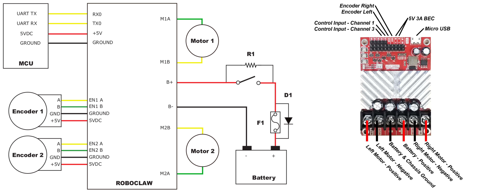

# Aion Robotics R1 UGV

This vehicle was chosen to test and improve the differential drive support for PX4. 


## Parts List 

* [Aion R1 (Discontinued)](https://www.aionrobotics.com/)
  * [Documentation](https://github-docs.readthedocs.io/en/latest/r1-ugv.html)
* [RoboClaw 2x15A](https://www.basicmicro.com/RoboClaw-2x15A-Motor-Controller_p_10.html)
  * [R1 Roboclaw specifications](https://resources.basicmicro.com/aion-robotics-r1-autonomous-robot/)
* [Skynode](https://auterion.com/product/skynode/)

## Assembly 

The assembly consists of a 3D-printed frame on which all the autopilot parts were attached. In our case, it is an Auterion Skynode, connected to a Pixhawk Adapter Board that interfaces with the Roboclaw over serial. If using a standard Pixhawk, it is possible to directly connect the Roboclaw to the Autopilot without an Adapter Board. 


## Configuration

Use *QGroundControl* for rover configuration:

1. In the [Basic Configuration](../config/README.md) section, select the [Airframe](../config/airframe.md) tab.
2. Choose **Aion Robotics R1 UGV** under the **Rover** category.


### Connecting RoboClaw to the Autopilot

1. Ensure proper connection of the RoboClaw to the flight controller, as detailed in the [RoboClaw User Manual](https://downloads.basicmicro.com/docs/roboclaw_user_manual.pdf) 'Packet Serial Wiring' section, which has been validated for compatibility.

   

2. Connect the RoboClaw to a suitable serial (UART) port (e.g., GPS2 or TELEM1).

3. After selecting the appropriate port and connecting the cables, navigate to the [Parameters](../advanced_config/parameters.md) section in QGC. Locate the 'BRCLW' section and set the `RBCLW_SER_CFG` parameter to match your chosen port (e.g., `RBCLW_SER_CFG GPS2` for the GPS2 port):
   
    ```
    RBCLW_SER_CFG [Your Selected Port]
    ```
- If using several RoboClaw motor controllers, each can be assigned a unique address on the bus, with the default address being 128. To set a different address, use the `RBCLW_ADDRESS` parameter:

  ```
  RBCLW_ADDRESS [Your Roboclaw Address]
  ```

- The final parameter, `RBCLW_COUNTS_REV`, is related to the encoder and specifies the number of encoder counts required for one wheel revolution. For the tested `RoboClaw 2x15A Motor Controller`, this value should be left at `1200`. Adjust this value based on your specific encoder and wheel setup:

  ```
  RBCLW_COUNTS_REV [Value]
  ```

### Configuring RoboClaw in PX4

1. In PX4, navigate to Actuators Configuration & Testing.
2. Select the RoboClaw driver from the list of available motor controller drivers. For the channel assignments, disarm, minimum, and maximum values, please refer to the image below. For systems with more than two motors, it is possible to assign the same function to several motors. The reason for the unusual values, can be found in the [RoboClaw User Manual](https://downloads.basicmicro.com/docs/roboclaw_user_manual.pdf) under `Compatibility Commands` for `Packet Serial`: 

    ```
    Drive motor forward. Valid data range is 0 - 127. A value of 127 = full speed forward, 64 =
    about half speed forward and 0 = full stop.
    ```


## Usage

Currently, PX4 supports MANUAL mode for this setup.
