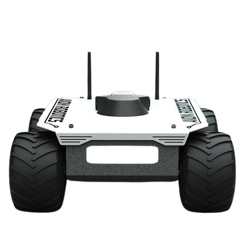
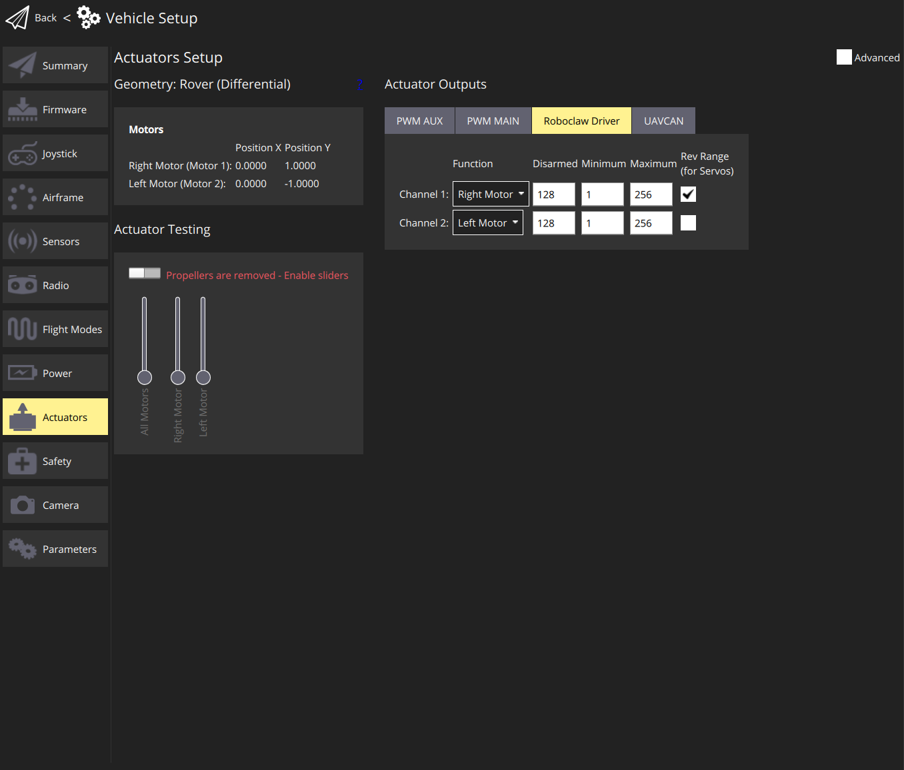
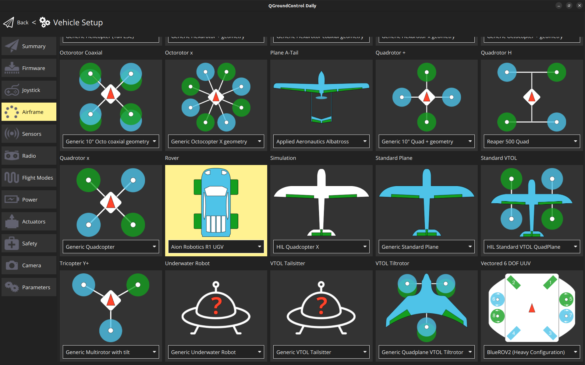

# Aion Robotics R1 UGV

This vehicle was chosen to test and improve the differential drive support for PX4. 



## Parts List 

* [Aion R1 (Discontinued)](https://www.aionrobotics.com/)
  * [Documentation](https://github-docs.readthedocs.io/en/latest/r1-ugv.html)
* [RoboClaw 2x15A](https://www.basicmicro.com/RoboClaw-2x15A-Motor-Controller_p_10.html)
  * [R1 Roboclaw specifications](https://resources.basicmicro.com/aion-robotics-r1-autonomous-robot/)
* [Skynode](https://auterion.com/product/skynode/)

## Assembly 

The assembly consists of a 3D-printed frame on which all the autopilot parts were attached. 

TO BE CONTINUED 

## Output Connections 

To integrate a RoboClaw motor controller with your rover:

1. **Connect the RoboClaw to Your Flight Controller**: 
   - Ensure proper connection of the RoboClaw unit to the flight controller. For specific wiring instructions, refer to the 'Packet Serial Wiring' section in the [RoboClaw User Manual](https://downloads.basicmicro.com/docs/roboclaw_user_manual.pdf), which has been validated for compatibility.
   - The RoboClaw can be connected to any compatible serial (UART) port that offers an equivalent pin arrangement, such as GPS2 or TELEM1. Make sure the chosen port has the necessary UART TX/RX and GROUND pins.


   - After selecting the appropriate port and connecting the cables, navigate to the [Parameters](../advanced_config/parameters.md) section in QGC. Locate the 'BRCLW' section and set the `RBCLW_SER_CFG` parameter to match your chosen port (e.g., `RBCLW_SER_CFG GPS2` for the GPS2 port):

     ```
     RBCLW_SER_CFG [Your Selected Port]
     ```

   - If using several RoboClaw motor controllers, each can be assigned a unique address on the bus, with the default address being 128. To set a different address, use the `RBCLW_ADDRESS` parameter:

     ```
     RBCLW_ADDRESS [Your Roboclaw Address]
     ```

   - The final parameter, `RBCLW_COUNTS_REV`, is related to the encoder and specifies the number of encoder counts required for one wheel revolution. For the tested `RoboClaw 2x15A Motor Controller`, this value should be left at `1200`. Adjust this value based on your specific encoder and wheel setup:

     ```
     RBCLW_COUNTS_REV [Value]
     ```


2. **Configure the Motor Controller in PX4**:
   Navigate to the [Actuators Configuration & Testing](../config/actuators.md) in the PX4 setup.
   Select the RoboClaw driver from the list of available motor controller drivers. For the channel assignments, disarm, minimum, and maximum values, please refer to the image below.

   

   For systems with more than two motors, it is possible to assign the same function to several motors.


## Configuration

Rovers are configured using *QGroundControl* in the same way as any other vehicle.

The main rover-specific configuration is setting the correct frame:
1. Switch to the [Basic Configuration](../config/README.md) section in *QGroundControl*
1. Select the [Airframe](../config/airframe.md) tab.
1. Scroll down the list to find the **Rover** icon.
1. Choose **Aion Robotics R1 UGV** from the drop down list.



## RoboClaw Motor Controller Support

PX4 now includes support for the [RoboClaw Motor Controllers](https://www.basicmicro.com/RoboClaw-2x15A-Motor-Controller_p_10.html), providing an additional option for rover builders.  

   ## Usage

   At the current time, PX4 only supports MANUAL. 