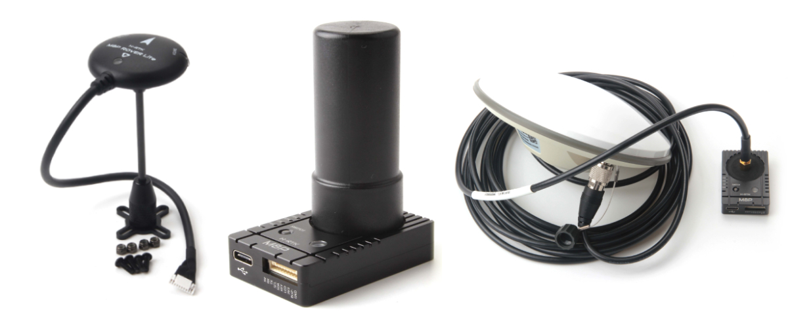
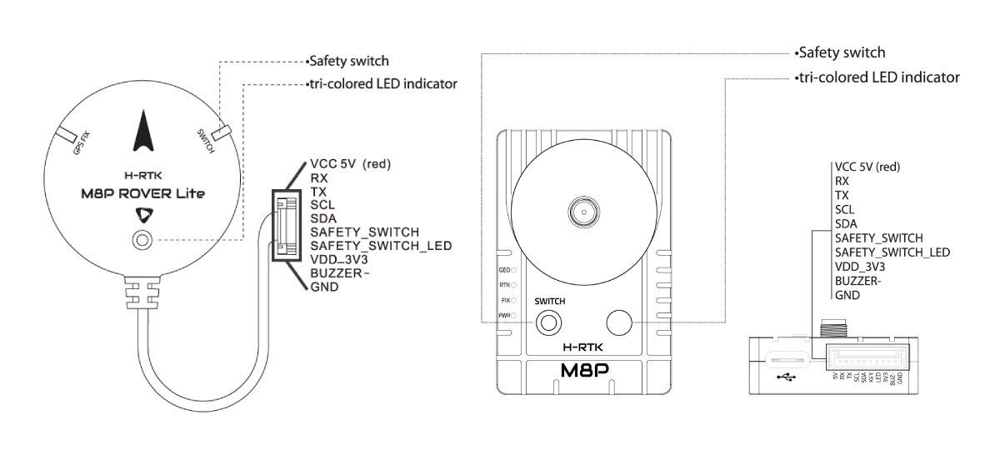
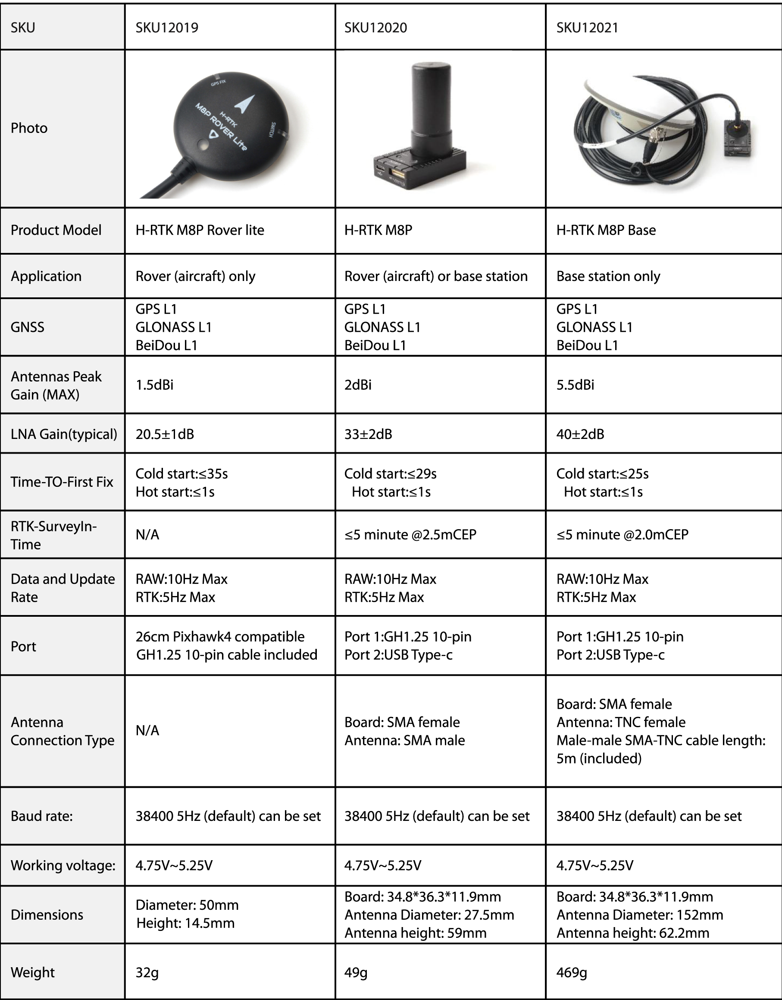

# Holybro H-RTK M8P GNSS

The [Holybro H-RTK M8P GNSS](http://www.holybro.com/product/h-rtk-m8p-rover-lite/) is an [RTK GNSS module](../gps_compass/rtk_gps.md) for mass market launched by Holybro. There are three models of Holybro H-RTK M8P to choose from, each with different antenna design to meet different needs. Refer to [Specification and Model Comparison section](#Specification-and-Model-Comparison) for more details.

Using RTK allows PX4 to get its position with centimeter-level accuracy, which is much more accurate than can be provided by a normal GPS.

 *H-RTK M8P Rover, H-RTK M8P, H-RTK M8P Base*

## Purchase

* [Holybro Website](https://shop.holybro.com/h-rtk-m8p_p1221.html)

## Configuration

RTK setup and use on PX4 via _QGroundControl_ is largely plug and play \(see [RTK GPS](../advanced_features/rtk-gps.md) for more information\).

## Wiring and Connections

All H-RTK GNSS models come with a GH 10-pin connector/cable that is compatible with [Pixhawk 4](../flight_controller/pixhawk4.md).

> **Note** The cables/connectors may need to be modified in order to connect to other flight controller boards (see [pin map](#pin_map)below).

## Pin Map {#pin_map}

## Specification and Model Comparison

