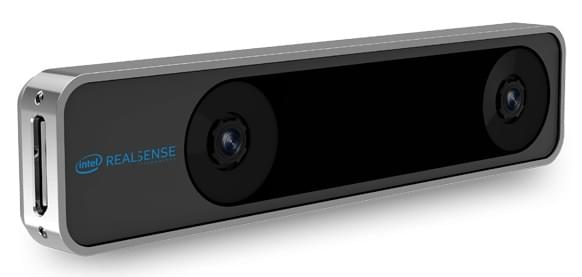

# Intel® RealSense™ Tracking Camera T265 (VIO)

The [Intel® RealSense™ Tracking Camera T265](https://www.intelrealsense.com/tracking-camera-t265/) provides odometry information that can be used for [VIO](../computer_vision/visual_inertial_odometry.md), augmenting or replacing other positioning systems on PX4.

:::tip
This camera is recommended, and is used in the [Visual Inertial Odometry (VIO) > Suggested Setup](../computer_vision/visual_inertial_odometry.md#suggested-setup).
:::



## Where to Buy

[Intel® RealSense™ Tracking Camera T265](https://www.intelrealsense.com/tracking-camera-t265/) (store.intelrealsense.com)

## Setup Instructions

At a high level:

- The [`realsense-ros` wrapper](https://github.com/IntelRealSense/realsense-ros) provided by Intel should be used to extract the raw data from the camera.
- The camera should be mounted with lenses facing down (default). Be sure to specify the camera orientation by publishing the static transform between the `base_link` and `camera_pose_frame` in a ROS launch file, for example:
  ```xml
  <node pkg="tf" type="static_transform_publisher" name="tf_baseLink_cameraPose"
      args="0 0 0 0 1.5708 0 base_link camera_pose_frame 1000"/>
  ```
  This is a static transform that links the camera ROS frame `camera_pose_frame` to the MAVROS drone frame `base_link`.
  - the first three `args` specify _translation_ x,y,z in metres from the center of the flight controller to the camera. For example, if the camera is 10cm in front of the controller and 4cm up, the first three numbers would be : [0.1, 0, 0.04,...]
  - the next three `args` specify rotation in radians (yaw, pitch, roll). So `[... 0, 1.5708, 0]` means pitch down by 90° (facing the ground). Facing straight forward would be [... 0 0 0].
- The camera is sensitive to high-frequency vibrations! It should be soft-mounted with, for example, vibration isolation foam.
