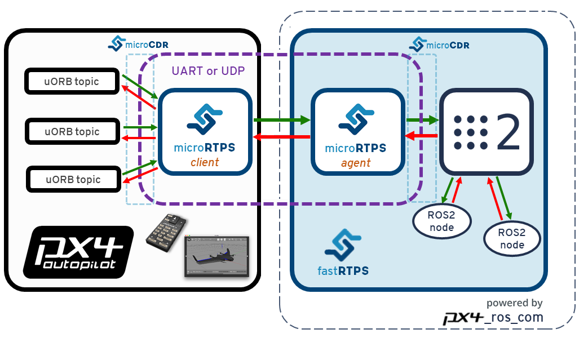

# ROS 2 User Guide (PX4-ROS 2 Bridge)

This topic explains how to setup and use ROS 2 with PX4.

It provides an overview of the ROS2-PX4 bridge architecture and application pipeline, along with instructions on how to install all the needed software and build ROS 2 applications.

:::note
The Fast DDS interface in the PX4 Autopilot can be leveraged by any applications running and linked in DDS domains (including ROS nodes).

For information about using the *microRTPS bridge* **without ROS 2**, see the [RTPS/DDS Interface section](../middleware/micrortps.md).
:::

:::note
For a more detailed and visual explanation on how to use PX4 with ROS 2 see these presentations from the PX4 maintainers:
1. [ROS World 2020 - Getting started with ROS 2 and PX4](https://www.youtube.com/watch?v=qhLATrkA_Gw)
1. [PX4 Dev Summit 2019 - "ROS 2 Powered PX4"](https://www.youtube.com/watch?v=2Szw8Pk3Z0Q)
:::

## Overview

The application pipeline for ROS 2 is very straightforward, thanks to the native communications middleware (DDS/RTPS). The [microRTPS Bridge](../middleware/micrortps.md) consists of a client running on PX4 and an agent running on the Mission/Companion Computer, which communicate to provide bi-directional data exchange and message translation between UORB and ROS 2 message formats. This allows you to create ROS 2 subscribers or publisher nodes that interface directly with PX4 UORB topics! This is shown in the diagram below.



ROS 2 uses the [`px4_msgs`](https://github.com/PX4/px4_msgs) and [`px4_ros_com`](https://github.com/PX4/px4_ros_com) packages to ensure that matching message definitions are used for creating both the client and the agent code (this is important), and also to remove the requirement for PX4 to be present when building ROS code.
- `px4_msgs` contains PX4 ROS message definitions. When this project is built it generates the corresponding ROS 2-compatible typesupport, used by ROS 2 nodes, and IDL files, used by `fastddsgen` to generate the microRTPS agent code.
- `px4_ros_com` contains the microRTPS agent code templates for the agent publishers and subscribers. The build process runs a `fastddsgen` instance to generate the code for the `micrortps_agent`, which compiles into a single executable.

The PX4 Autopilot project automatically updates [`px4_msgs`](https://github.com/PX4/px4_msgs) with new message definitions whenever they are changed (in the `master` branch).

:::note
The subset of uORB topics that will be accessible to ROS applications can be found in the [bridge configuration yaml file](https://github.com/PX4/px4_ros_com/blob/master/templates/urtps_bridge_topics.yaml).
:::

PX4 firmware contains the microRTPS client based on its build-time message definitions.

:::note
Astute readers will note that the generated agent might not have been built with that same set of definitions (unless they were both built of the same 'master' commit).

Right now this is not a problem because the PX4 message set/definitions are relatively stable and the updated/new messages get automatically deployed to `px4_msgs`.

In the near future the intention is to:
1. Create also a branch per release in both `px4_ros_com` and `px4_msgs`, so both the message definitions and agent code match the ones present on the PX4/client side by the time of the release.
2. Have an initial message exchange of the bridge configuration, using the messages structs MD5SUMs to verify if the messages definitions are the same, and if not, disable their stream and warn the user.
:::

:::warning
You cannot use an agent generated as part of a "normal" PX4 build with ROS 2 (e.g. if the user uses `BUILD_MICRORTPS_AGENT=1 make px4_sitl_rtps`). While microRTPS client is the same, the IDL files used by ROS 2 are slightly different from the [ROS-independent files generated in PX4 builds](../middleware/micrortps.md). The other detail is that the "normal" PX4 build doesn't use `fastddsgen` with typesupport for ROS 2 networks - and that's also one of the main reasons we have a separate microRTPS agent in `px4_ros_com`, which is completely compatible with ROS 2 networks. We use the `px4_msg` to generate appropriate IDL files for the `micrortps_agent` in `px4_ros_com`.
:::


## Installation & Setup

To setup ROS 2 for use with PX4 you will need to:
- [Install Fast DDS](#install-fast-dds)
- [Install ROS2](#install-ros-2)
- [Build ROS 2 Workspace](#build-ros-2-workspace)
- [Sanity Check the Installation](#sanity-check-the-installation) (Optional)

### Install Fast DDS

Follow the [Fast DDS Installation Guide](../dev_setup/fast-dds-installation.md) to install **Fast RTPS(DDS) 2.0.2** (or later) and **Fast-RTPS-Gen 1.0.4** (not later!) and their dependencies.

:::warning
Check the guide to confirm the latest dependencies! You won't be able to continue with this guide until the correct versions of **Fast RTPS(DDS)** and **Fast-RTPS-Gen** have been installed.
:::


### Install ROS 2

<!-- what other toolchain needed? e.g. for ROS - gcc? does it all come with the ROS setup? -->

:::note
This install and build guide covers ROS 2 Foxy in Ubuntu 20.04.
::: :::warning
If ROS_DOMAIN_ID is set in environment variables from ROS2 tutorial, you need to unset ROS_DOMAIN_ID for connection between ROS2 and microRTPS-agent.
::: To install ROS 2 and its dependencies:

1. [Install ROS 2 Foxy](https://index.ros.org/doc/ros2/Installation/Foxy/Linux-Install-Debians/)
1. The install process should also install the **`colcon`** build tools, but in case that doesn't happen, you can install the tools manually:

   ```sh
   sudo apt install python3-colcon-common-extensions
   ```

1. **`eigen3_cmake_module`** is also required, since Eigen3 is used on the transforms library:

   ```sh
   sudo apt install ros-foxy-eigen3-cmake-module
   ```

1. Some Python dependencies must also be installed (using **`pip`** or **`apt`**):

   ```sh
   sudo pip3 install -U empy pyros-genmsg setuptools
   ```


### Build ROS 2 Workspace

This section shows how create a ROS 2 workspace hosted in your *home directory* (modify the commands as needed to put the source code elsewhere). The `px4_ros_com` and `px4_msg` packages are cloned to a workspace folder, and then a script is used to build the workspace.

:::note
The build process will open new tabs on the console, corresponding to different stages of the build process that need to have different environment configurations sourced.
:::

To create and build the workspace:

1. Create a workspace directory using:
   ```sh
   $ mkdir -p ~/px4_ros_com_ros2/src
   ```
1. Clone the ROS 2 bridge packages `px4_ros_com` and `px4_msgs` to the `/src` directory (the `master` branch is cloned by default):
   ```sh
   $ git clone https://github.com/PX4/px4_ros_com.git ~/px4_ros_com_ros2/src/px4_ros_com
   $ git clone https://github.com/PX4/px4_msgs.git ~/px4_ros_com_ros2/src/px4_msgs
   ```
1. Use the `build_ros2_workspace.bash` script to build the ROS 2 workspace (including `px4_ros_com` and `px4_msgs`).
   ```sh
   $ cd ~/px4_ros_com_ros2/src/px4_ros_com/scripts
   $ source build_ros2_workspace.bash
   ```


:::tip
All script options can be listed by calling it with the `--help` argument. In particular the `--verbose` argument shows the full *colcon* build output.
:::

:::note
The `px4_ros_com/scripts` directory contains multiple scripts for building different kinds of workspaces.
:::


### Sanity Check the Installation

One way to check that the installation/setup succeeded is to test that the bridge can communicate with PX4. We can do this by running the bridge against PX4 running in the simulator.

1. [Setup your PX4 Ubuntu Linux development environment](../dev_setup/dev_env_linux_ubuntu.md) - the default instructions get the latest version of PX4 source and install all the needed tools.
1. Open a new terminal in the root of the **PX4 Autopilot** project, and then start a PX4 Gazebo simulation using:
   ```sh
   make px4_sitl_rtps gazebo
   ```
   Once PX4 has fully started the terminal will display the [NuttShell/System Console](../debug/system_console.md). Note also that PX4 SITL will automatically start the `micrortps_client` connected to UDP ports 2019 and 2020.
1. On a *new* terminal, `source` the ROS 2 workspace and then start the `micrortps_agent` daemon with UDP as the transport protocol:
   ```sh
   $ source ~/px4_ros_com_ros2/install/setup.bash
   $ micrortps_agent -t UDP
   ```
1. Open a new terminal and start a "listener" using the provided launch file:
   ```sh
   $ source ~/px4_ros_com_ros2/install/setup.bash
   $ ros2 launch px4_ros_com sensor_combined_listener.launch.py
   ```

   If the bridge is working correctly you will be able to see the data being printed on the terminal/console where you launched the ROS listener:

   ```sh
   RECEIVED DATA FROM SENSOR COMBINED
   ================================
   ts: 870938190
   gyro_rad[0]: 0.00341645
   gyro_rad[1]: 0.00626475
   gyro_rad[2]: -0.000515705
   gyro_integral_dt: 4739
   accelerometer_timestamp_relative: 0
   accelerometer_m_s2[0]: -0.273381
   accelerometer_m_s2[1]: 0.0949186
   accelerometer_m_s2[2]: -9.76044
   accelerometer_integral_dt: 4739
   ```

You can also verify the rate of the message using `ros2 topic hz`. E.g. in the case of `sensor_combined` use `ros2 topic hz /fmu/sensor_combined/out`:
   ```sh
   average rate: 248.187
    min: 0.000s max: 0.012s std dev: 0.00147s window: 2724
   average rate: 248.006
    min: 0.000s max: 0.012s std dev: 0.00147s window: 2972
   average rate: 247.330
    min: 0.000s max: 0.012s std dev: 0.00148s window: 3212
   average rate: 247.497
    min: 0.000s max: 0.012s std dev: 0.00149s window: 3464
   average rate: 247.458
    min: 0.000s max: 0.012s std dev: 0.00149s window: 3712
   average rate: 247.485
    min: 0.000s max: 0.012s std dev: 0.00148s window: 3960
   ```


## ROS 2 Example Applications

### Creating a ROS 2 listener

With the `px4_ros_com` built successfully, one can now take advantage of the generated *microRTPS* agent app and also from the generated sources and headers of the ROS 2 msgs from `px4_msgs`, which represent a one-to-one matching with the uORB counterparts.

To create a listener node on ROS 2, lets take as an example the `sensor_combined_listener.cpp` node under `px4_ros_com/src/examples/listeners`.

The code first imports the C++ libraries needed to interface with the ROS 2 middleware and the required message header file:

```cpp
#include <rclcpp/rclcpp.hpp>
#include <px4_msgs/msg/sensor_combined.hpp>
```

Then it creates a `SensorCombinedListener` class that subclasses the generic `rclcpp::Node` base class.

```cpp
/**
 * @brief Sensor Combined uORB topic data callback
 */
class SensorCombinedListener : public rclcpp::Node
{
```

This creates a callback function for when the `sensor_combined` uORB messages are received (now as RTPS/DDS messages), and outputs the content of the message fields each time the message is received.

```cpp
public:
    explicit SensorCombinedListener() : Node("sensor_combined_listener") {
        subscription_ = this->create_subscription<px4_msgs::msg::SensorCombined>(
            "fmu/sensor_combined/out",
            10,
            [this](const px4_msgs::msg::SensorCombined::UniquePtr msg) {
            std::cout << "\n\n\n\n\n\n\n\n\n\n\n\n\n\n\n\n\n\n\n\n\n\n\n\n";
            std::cout << "RECEIVED SENSOR COMBINED DATA"   << std::endl;
            std::cout << "============================="   << std::endl;
            std::cout << "ts: "          << msg->timestamp    << std::endl;
            std::cout << "gyro_rad[0]: " << msg->gyro_rad[0]  << std::endl;
            std::cout << "gyro_rad[1]: " << msg->gyro_rad[1]  << std::endl;
            std::cout << "gyro_rad[2]: " << msg->gyro_rad[2]  << std::endl;
            std::cout << "gyro_integral_dt: " << msg->gyro_integral_dt << std::endl;
            std::cout << "accelerometer_timestamp_relative: " << msg->accelerometer_timestamp_relative << std::endl;
            std::cout << "accelerometer_m_s2[0]: " << msg->accelerometer_m_s2[0] << std::endl;
            std::cout << "accelerometer_m_s2[1]: " << msg->accelerometer_m_s2[1] << std::endl;
            std::cout << "accelerometer_m_s2[2]: " << msg->accelerometer_m_s2[2] << std::endl;
            std::cout << "accelerometer_integral_dt: " << msg->accelerometer_integral_dt << std::endl;
        });
    }
```

The lines below create a publisher to the `sensor_combined` uORB topic, which can be matched with one or more compatible ROS2 subscribers to the `fmu/sensor_combined/out` ROS2 topic.

```cpp
private:
    rclcpp::Subscription<px4_msgs::msg::SensorCombined>::SharedPtr subscription_;
};
```

The instantiation of the `SensorCombinedListener` class as a ROS node is done on the `main` function.

```cpp
int main(int argc, char *argv[])
{
    std::cout << "Starting sensor_combined listener node..." << std::endl;
    setvbuf(stdout, NULL, _IONBF, BUFSIZ);
    rclcpp::init(argc, argv);
    rclcpp::spin(std::make_shared<SensorCombinedListener>());

    rclcpp::shutdown();
    return 0;
}
```


### Creating a ROS 2 advertiser

A ROS 2 advertiser node publishes data into the DDS/RTPS network (and hence to the PX4 Autopilot).

Taking as an example the `debug_vect_advertiser.cpp` under `px4_ros_com/src/advertisers`, first we import required headers, including the `debug_vect` msg header.

```cpp
#include <chrono>
#include <rclcpp/rclcpp.hpp>
#include <px4_msgs/msg/debug_vect.hpp>

using namespace std::chrono_literals;
```

Then the code creates a `DebugVectAdvertiser` class that subclasses the generic `rclcpp::Node` base class.

```cpp
class DebugVectAdvertiser : public rclcpp::Node
{
```

The code below creates a function for when messages are to be sent. The messages are sent based on a timed callback, which sends two messages per second based on a timer.

```cpp
public:
    DebugVectAdvertiser() : Node("debug_vect_advertiser") {
        publisher_ = this->create_publisher<px4_msgs::msg::DebugVect>("fmu/debug_vect/in", 10);
        auto timer_callback =
        [this]()->void {
            auto debug_vect = px4_msgs::msg::DebugVect();
            debug_vect.timestamp = std::chrono::time_point_cast<std::chrono::microseconds>(std::chrono::steady_clock::now()).time_since_epoch().count();
            std::string name = "test";
            std::copy(name.begin(), name.end(), debug_vect.name.begin());
            debug_vect.x = 1.0;
            debug_vect.y = 2.0;
            debug_vect.z = 3.0;
            RCLCPP_INFO(this->get_logger(), "\033[97m Publishing debug_vect: time: %llu x: %f y: %f z: %f \033[0m",
                                debug_vect.timestamp, debug_vect.x, debug_vect.y, debug_vect.z);
            this->publisher_->publish(debug_vect);
        };
        timer_ = this->create_wall_timer(500ms, timer_callback);
    }

private:
    rclcpp::TimerBase::SharedPtr timer_;
    rclcpp::Publisher<px4_msgs::msg::DebugVect>::SharedPtr publisher_;
};
```

The instantiation of the `DebugVectAdvertiser` class as a ROS node is done on the `main` function.

```cpp
int main(int argc, char *argv[])
{
    std::cout << "Starting debug_vect advertiser node..." << std::endl;
    setvbuf(stdout, NULL, _IONBF, BUFSIZ);
    rclcpp::init(argc, argv);
    rclcpp::spin(std::make_shared<DebugVectAdvertiser>());

    rclcpp::shutdown();
    return 0;
}
```


### Offboard Control

For a complete reference example on how to use Offboard control with PX4, see: [ROS 2 Offboard control example](../ros/ros2_offboard_control.md).


## Manual Workspace Setup with a ROS1 compatible workspace (FYI Only)

:::note
This is provided to help you better understand the build process and how to include the ROS1 workspace. It is not needed to build or use ROS 2. It additionally includes instructions for building the `ros1_bridge` package, which is used in [ROS (1) via ROS 2 Bridge](../ros/ros1_via_ros2.md).
:::

This section describes the process to *manually* setup your workspace and build the `px4_ros_com`, `px4_msgs`, and `ros1_bridge` package. The topic effectively explains the operation of the `build_ros2_workspace.bash` script in the [installation instructions](#build-ros-2-workspace)).


**To build the ROS 2 workspace only:**

1. `cd` into `px4_ros_com_ros2` dir and source the ROS 2 environment. Don't mind if it tells you that a previous workspace was set before:

   ```sh
   cd ~/px4_ros_com_ros2
   source /opt/ros/foxy/setup.bash
   ```

2. Build the workspace:

   ```sh
   colcon build --symlink-install --event-handlers console_direct+
   ```

To build both ROS 2 and ROS (1) workspaces (replacing the previous steps):

1. `cd` into `px4_ros_com_ros2` dir and source the ROS 2 environment. Don't mind if it tells you that a previous workspace was set before:

   ```sh
   source /opt/ros/foxy/setup.bash
   ```

1. Clone the `ros1_bridge` package so it can be built on the ROS 2 workspace:

   ```sh
   git clone https://github.com/ros2/ros1_bridge.git -b dashing ~/px4_ros_com_ros2/src/ros1_bridge
   ```

1. Build the `px4_ros_com` and `px4_msgs` packages, excluding the `ros1_bridge` package:

   ```sh
   colcon build --symlink-install --packages-skip ros1_bridge --event-handlers console_direct+
   ```

:::note
`--event-handlers console_direct+` only serve the purpose of adding verbosity to the `colcon` build process, and can be removed if one wants a more "quiet" build.
:::

1. Then build the ROS(1) packages side. First open a **new** terminal window and source the ROS(1) environment that was installed on the system:

   ```sh
   source /opt/ros/melodic/setup.bash
   ```

1. Build the `px4_ros_com` and `px4_msgs` packages on the ROS end (using the terminal opened in the previous step):

   ```sh
   cd ~/px4_ros_com_ros1 && colcon build --symlink-install --event-handlers console_direct+
   ```

1. Open another new terminal and then source the environments and workspaces in the order listed below:

   ```sh
   source ~/px4_ros_com_ros1/install/setup.bash
   source ~/px4_ros_com_ros2/install/setup.bash
   ```

1. Finally, build the `ros1_bridge`:

   ```sh
   cd ~/px4_ros_com_ros2 && colcon build --symlink-install --packages-select ros1_bridge --cmake-force-configure --event-handlers console_direct+
   ```

:::note
The build process may consume a lot of memory resources. On a resource limited machine, reduce the number of jobs being processed in parallel (e.g. set environment variable `MAKEFLAGS=-j1`). For more details on the build process, see the build instructions on the [ros1_bridge](https://github.com/ros2/ros1_bridge) package page.
:::


### Cleaning the workspaces

After building the workspaces there are many files that must be deleted before you can do a clean/fresh build (for example, after you have changed some code and want to rebuild).

Unfortunately *colcon* does not currently have a way of cleaning the generated **build**, **install** and **log** directories, so these directories must be deleted manually.

The **clean_all.bash** script (in **px4_ros_com/scripts**) is provided to ease this cleaning process, this script can be used to clean all of the workspace options listed above (ROS 2, ROS 1, and Both)

The most common way of using it is by passing it the ROS (1) workspace directory path (since it's usually not on the default path):

```sh
$ source clean_all.bash --ros1_ws_dir <path/to/px4_ros_com_ros1/ws>
```

:::tip
Like the build scripts, the `clean_all.bash` script also has a `--help` guide.
:::

## Additional information

* [DDS and ROS middleware implementations](https://github.com/ros2/ros2/wiki/DDS-and-ROS-middleware-implementations)
