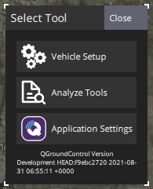

# Distance Sensors (Rangefinders)

Distance sensors provide distance measurement that can be used for [terrain following](../flying/terrain_following_holding.md#terrain_following), [terrain holding](../flying/terrain_following_holding.md#terrain_hold) (i.e. precision hovering for photography), improved landing behaviour ([conditional range aid](../advanced_config/tuning_the_ecl_ekf.md#conditional-range-aiding)), warning of regulatory height limits, collision prevention, etc.

This section lists the distance sensors supported by PX4 (linked to more detailed documentation), the [generic configuration](#configuration) required for all rangefinders, [testing](#testing), and [simulation](#simulation) information. More detailed setup and configuration information is provided in the topics linked below (and sidebar).


## Supported Rangefinders

### ARK Flow

[ARK Flow](../dronecan/ark_flow.md) is an open-source Time-of-Flight (ToF) and optical flow sensor module, which is capable of measuring distances from 8cm to 30m. It can be connected to the flight controller via its CAN1 port, allowing additional sensors to connect through its CAN2 port. It supports [DroneCAN](../dronecan/README.md), runs [PX4 DroneCAN Firmware](../dronecan/px4_cannode_fw.md), and is packed into a tiny form factor.


### Holybro ST VL53L1X Lidar

The [VL53L1X](https://holybro.com/products/st-vl53l1x-lidar) is a state-of-the-art, Time-of-Flight (ToF), laser-ranging sensor, enhancing the ST FlightSense™ product family. It is the fastest miniature ToF sensor on the market with accurate ranging up to 4 m and fast ranging frequency up to 50 Hz.

It comes with a JST GHR 4 pin connector that is compatible with the I2C port on [Pixhawk 4](../flight_controller/pixhawk4.md), [Pixhawk 5X](../flight_controller/pixhawk5x.md), and other flight controllers that follow the [Pixhawk Connector Standard](https://github.com/pixhawk/Pixhawk-Standards/blob/master/DS-009%20Pixhawk%20Connector%20Standard.pdf)).

### Lidar-Lite

[Lidar-Lite](../sensor/lidar_lite.md) is a compact, high-performance optical distant measurement rangefinder. It has a sensor range from (5cm - 40m) and can be connected to either PWM or I2C ports.

### MaxBotix I2CXL-MaxSonar-EZ

The MaxBotix [I2CXL-MaxSonar-EZ](https://www.maxbotix.com/product-category/i2cxl-maxsonar-ez-products) range has a number of relatively short-ranged sonar based rangefinders that are suitable for assisted takeoff/landing and collision avoidance. These can be connected using an I2C port.

The rangefinders are enabled using the parameter [SENS_EN_MB12XX](../advanced_config/parameter_reference.md#SENS_EN_MB12XX).

### Lightware LIDARs

[Lightware SFxx Lidar](../sensor/sfxx_lidar.md) provide a broad range of lightweight "laser altimeters" that are suitable for many drone applications.

PX4 supports: SF11/c and SF/LW20. PX4 can also be used with the following discontinued models: SF02, SF10/a, SF10/b, SF10/c.

### TeraRanger Rangefinders

[TeraRanger](../sensor/teraranger.md) provide a number of lightweight distance measurement sensors based on infrared Time-of-Flight (ToF) technology. They are typically faster and have greater range than sonar, and smaller and lighter than laser-based systems.

PX4 supports the following models connected via the I2C bus: TeraRanger One, TeraRanger Evo 60m and TeraRanger Evo 600Hz.


### Ainstein US-D1 Standard Radar Altimeter

The *Ainstein* [US-D1 Standard Radar Altimeter](../sensor/ulanding_radar.md) is compact microwave rangefinder that has been optimised for use on UAVs. It has a sensing range of around 50m. A particular advantages of this product are that it can operate effectively in all weather conditions and over all terrain types (including water).


### LeddarOne

[LeddarOne](../sensor/leddar_one.md) is small Lidar module with a narrow, yet diffuse beam that offers excellent overall detection range and performance, in a robust, reliable, cost-effective package. It has a sensing range from 1cm to 40m and needs to be connected to a UART/serial bus.


### TFmini

The [Benewake TFmini Lidar](../sensor/tfmini.md) is a tiny, low cost, and low power LIDAR with 12m range.


### PSK-CM8JL65-CC5

The [Lanbao PSK-CM8JL65-CC5 ToF Infrared Distance Measuring Sensor](../sensor/cm8jl65_ir_distance_sensor.md) is a very small (38 mm x 18mm x 7mm, <10g) IR distance sensor with a 0.17m-8m range and millimeter resolution. It must be connected to a UART/serial bus.

### Avionics Anonymous UAVCAN Laser Altimeter Interface

The [Avionics Anonymous UAVCAN Laser Altimeter Interface](../dronecan/avanon_laser_interface.md) allows several common rangefinders (e.g. [Lightware SF11/c, SF30/D](../sensor/sfxx_lidar.md), etc) to be connected to the [CAN](../can/README.md) bus via [DroneCAN](../dronecan/README.md), a more robust interface than I2C.

<a id="configuration"></a>

## Configuration/Setup

Rangefinders are usually connected to either a serial (PWM) or I2C port (depending on the device driver), and are enabled on the port by setting a particular parameter.

The hardware and software setup that is *specific to each distance sensor* is covered in their individual topics.

The generic configuration that is *common to all distance sensors*, covering both the physical setup and usage, is given below.


### Generic Configuration

The common rangefinder configuration is specified using [EKF2\_RNG\_*](../advanced_config/parameter_reference.md#EKF2_RNG_CTRL) parameters. These include (non exhaustively):
- [EKF2_RNG_POS_X](../advanced_config/parameter_reference.md#EKF2_RNG_POS_X), [EKF2_RNG_POS_Y](../advanced_config/parameter_reference.md#EKF2_RNG_POS_Y), [EKF2_RNG_POS_Z](../advanced_config/parameter_reference.md#EKF2_RNG_POS_Z) - offset of the rangefinder from the vehicle centre of gravity in X, Y, Z directions.
- [EKF2_RNG_PITCH](../advanced_config/parameter_reference.md#EKF2_RNG_PITCH) - A value of 0 degrees (default) corresponds to the range finder being exactly aligned with the vehicle vertical axis (i.e. straight down), while 90 degrees indicates that the range finder is pointing forward. Simple trigonometry is used to calculate the distance to ground if a non-zero pitch is used.
- [EKF2_RNG_DELAY](../advanced_config/parameter_reference.md#EKF2_RNG_DELAY) - approximate delay of data reaching the estimator from the sensor.
- [EKF2_RNG_SFE](../advanced_config/parameter_reference.md#EKF2_RNG_SFE) - Range finder range dependent noise scaler.
- [EKF2_RNG_NOISE](../advanced_config/parameter_reference.md#EKF2_RNG_NOISE) - Measurement noise for range finder fusion


## Testing

The easiest way to test the rangefinder is to vary the range and compare to the values detected by PX4. The sections below show some approaches to getting the measured range.

### QGroundControl MAVLink Inspector

The *QGroundControl MAVLink Inspector* lets you view messages sent from the vehicle, including `DISTANCE_SENSOR` information from the rangefinder. The main difference between the tools is that the *Analyze* tool can plot values in a graph.

:::note
The messages that are sent depend on the vehicle configuration. You will only get `DISTANCE_SENSOR` messages if the connected vehicle has a rangefinder installed and is publishing sensor values.
:::

To view the rangefinder output:

1. Open the menu **Q > Select Tool > Analyze Tools**:

   
1. Select the message `DISTANCE_SENSOR`, and then check the plot checkbox against `current_distance`. The tool will then plot the result: 

### QGroundControl MAVLink Console

You can also use the *QGroundControl MAVLink Console* to observe the `distance_sensor` uORB topic:
```sh
listener distance_sensor 5
```

:::note
The *QGroundControl MAVLink Console* works when connected to Pixhawk or other NuttX targets, but not the Simulator. On the Simulator you can run the commands directly in the terminal.
:::

For more information see: [Development > Debugging/Logging > Sensor/Topic Debugging using the Listener Command](../debug/sensor_uorb_topic_debugging.md).


## Simulation

Lidar and sonar rangefinders can be used in the [Gazebo Classic](../sim_gazebo_classic/README.md) simulator. To do this you must start the simulator using a vehicle model that includes the rangefinder.

The iris optical flow model includes a Lidar rangefinder:

```sh
make px4_sitl gazebo-classic_iris_opt_flow
```

The typhoon_h480 includes a sonar rangefinder:

```sh
make px4_sitl gazebo-classic_typhoon_h480
```

If you need to use a different vehicle you can include the model in its configuration file. You can see how in the respective Iris and Typhoon configuration files:

- [iris_opt_flow.sdf](https://github.com/PX4/PX4-SITL_gazebo/blob/main/models/iris_opt_flow/iris_opt_flow.sdf)
  ```xml
    <include>
      <uri>model://lidar</uri>
      <pose>-0.12 0 0 0 3.1415 0</pose>
    </include>
    <joint name="lidar_joint" type="revolute">
      <child>lidar::link</child>
      <parent>iris::base_link</parent>
      <axis>
        <xyz>0 0 1</xyz>
        <limit>
          <upper>0</upper>
          <lower>0</lower>
        </limit>
      </axis>
    </joint>
   ```
- [typhoon_h480.sdf](https://github.com/PX4/PX4-SITL_gazebo/blob/main/models/typhoon_h480/typhoon_h480.sdf.jinja#L1131-L1145)
  ```xml
    <include>
      <uri>model://sonar</uri>
    </include>
    <joint name="sonar_joint" type="revolute">
      <child>sonar_model::link</child>
      <parent>typhoon_h480::base_link</parent>
      <axis>
        <xyz>0 0 1</xyz>
        <limit>
          <upper>0</upper>
          <lower>0</lower>
        </limit>
      </axis>
    </joint>
  ```
