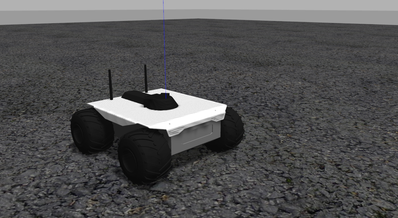

# Gazebo Vehicles

This topic lists/displays the vehicles supported by the PX4 [Gazebo](../sim_gazebo_classic/README.md) simulation and the `make` commands required to run them (the commands are run from a terminal in the **PX4-Autopilot** directory).

Supported vehicle types include: mutirotors, VTOL, VTOL Tailsitter, Plane, Rover, Submarine/UUV.

:::tip
For the full list of build targets run `make px4_sitl list_vmd_make_targets` (and filter on those that start with `gazebo_`).
:::

:::note
The [Gazebo](../sim_gazebo_classic/README.md) page shows how to install Gazebo, how to enable video and load custom maps, and many other configuration options.
:::

## Multicopter
<a id="quadrotor"></a>

### Quadrotor (Default)

```sh
make px4_sitl gazebo
```

<a id="quadrotor_optical_flow"></a>

### Quadrotor with Optical Flow

```sh
make px4_sitl gazebo_iris_opt_flow
```

### Quadrotor with Depth Camera

These models have a depth camera attached, modelled on the Intel® RealSense™ D455.

_Forward-facing depth camera:_

```sh
make px4_sitl gazebo_iris_depth_camera
```

_Downward-facing depth camera:_

```sh
make px4_sitl gazebo_iris_downward_depth_camera
```

<a id="3dr_solo"></a>

### 3DR Solo (Quadrotor)

```sh
make px4_sitl gazebo_solo
```


<a id="typhoon_h480"></a>

### Typhoon H480 (Hexrotor)

```sh
make px4_sitl gazebo_typhoon_h480
```


:::note
This target also supports [video streaming simulation](../sim_gazebo_classic/README.md#video-streaming).
:::

<a id="fixed_wing"></a>

## Plane/Fixed Wing

<a id="standard_plane"></a>

### Standard Plane

```sh
make px4_sitl gazebo_plane
```


<a id="standard_plane_catapult"></a>

#### Standard Plane with Catapult Launch

```sh
make px4_sitl gazebo_plane_catapult
```

This model simulates hand/catapult launch, which can be used for [fixed wing takeoff](../flying/fixed_wing_takeoff.md#fixed-wing-takeoff) in position mode, takeoff mode, or missions.

The plane will automatically be launched as soon as the vehicle is armed.


## VTOL

<a id="standard_vtol"></a>

### Standard VTOL

```sh
make px4_sitl gazebo_standard_vtol
```


<a id="tailsitter_vtol"></a>

### Tailsitter VTOL

```sh
make px4_sitl gazebo_tailsitter
```


<a id="ugv"></a>

## Unmmanned Ground Vehicle (UGV/Rover/Car)

### Ackermann UGV

```sh
make px4_sitl gazebo_rover
```


### Differential UGV

```sh
make px4_sitl gazebo_r1_rover
```




<a id="uuv"></a>

## Unmanned Underwater Vehicle (UUV/Submarine)

<a id="uuv_hippocampus"></a>

### HippoCampus TUHH UUV

```sh
make px4_sitl gazebo_uuv_hippocampus
```


<a id="usv"></a>

## Unmanned Surface Vehicle (USV/Boat)

<a id="usv_boat"></a>

### Boat

```sh
make px4_sitl gazebo_boat
```


<a id="airship"></a>

## Airship

<a id="cloudship"></a>

### Cloudship

```sh
make px4_sitl gazebo_cloudship
```


