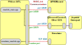

# Simulation

Simulators allow PX4 flight code to control a computer modeled vehicle in a simulated "world". You can interact with this vehicle just as you might with a real vehicle, using *QGroundControl*, an offboard API, or a radio controller/gamepad.

:::tip
Simulation is a quick, easy, and most importantly, *safe* way to test changes to PX4 code before attempting to fly in the real world. It is also a good way to start flying with PX4 when you haven't yet got a vehicle to experiment with.
:::

PX4 supports both *Software In the Loop (SITL)* simulation, where the flight stack runs on computer (either the same computer or another computer on the same network) and *Hardware In the Loop (HITL)* simulation using a simulation firmware on a real flight controller board.

Information about available simulators and how to set them up are provided in the next section. The other sections provide general information about how the simulator works, and are not required to *use* the simulators.


## Supported Simulators

The following simulators work with PX4 for HITL and/or SITL simulation.

| Simulator                                                               | Description                                                                                                                                               |
| ----------------------------------------------------------------------- | --------------------------------------------------------------------------------------------------------------------------------------------------------- |
| [Gazebo](../sim_gazebo_gz/README.md)                                    | <p><strong>This simulator is highly recommended.</strong></p><p>Gazebo supersedes [Gazebo Classic](../sim_gazebo_classic/README.md), featuring more advanced rendering, physics and sensor models. It is the only version of Gazebo available from Ubuntu Linux 22.04</p><p>A powerful 3D simulation environment that is particularly suitable for testing object-avoidance and computer vision. It can also be used for [multi-vehicle simulation](../simulation/multi-vehicle-simulation.md) and is commonly used with [ROS](../simulation/ros_interface.md), a collection of tools for automating vehicle control. </p><p><strong>Supported Vehicles:</strong> Quad, Standard VTOL, Plane</p>                                                      |
| [Gazebo Classic](../sim_gazebo_classic/README.md)                       | <p><strong>This simulator is highly recommended.</strong></p><p>A powerful 3D simulation environment that is particularly suitable for testing object-avoidance and computer vision. It can also be used for [multi-vehicle simulation](../simulation/multi-vehicle-simulation.md) and is commonly used with [ROS](../simulation/ros_interface.md), a collection of tools for automating vehicle control.</p><p><strong>Supported Vehicles:</strong> Quad ([Iris](../airframes/airframe_reference.md#copter_quadrotor_x_generic_quadcopter), Hex (Typhoon H480), [Generic Standard VTOL (QuadPlane)](../airframes/airframe_reference.md#vtol_standard_vtol_generic_standard_vtol), Tailsitter, Plane, Rover, Submarine </p>                                                                               |
| [FlightGear](../simulation/flightgear.md)                               | <p>A simulator that provides physically and visually realistic simulations. In particular it can simulate many weather conditions, including thunderstorms, snow, rain and hail, and can also simulate thermals and different types of atmospheric flows. [Multi-vehicle simulation](../simulation/multi_vehicle_flightgear.md) is also supported.</p> <p><strong>Supported Vehicles:</strong> Plane, Autogyro, Rover</p>                                                                                                        |
| [JSBSim](../simulation/jsbsim.md)                                       | <p>A simulator that provides advanced flight dynamics models. This can be used to model realistic flight dynamics based on wind tunnel data.</p> <p><strong>Supported Vehicles:</strong> Plane, Quad, Hex</p>                                                                                                       |
| [jMAVSim](../simulation/jmavsim.md)                                     | A simple multirotor simulator that allows you to fly *copter* type vehicles around a simulated world. <p>It is easy to set up and can be used to test that your vehicle can take off, fly, land, and responds appropriately to various fail conditions (e.g. GPS failure). It can also be used for [multi-vehicle simulation](../simulation/multi_vehicle_jmavsim.md).</p><p><strong>Supported Vehicles:</strong> Quad</p> |
| [AirSim](../simulation/airsim.md)                                       | <p>A cross platform simulator that provides physically and visually realistic simulations. This simulator is resource intensive, and requires a very significantly more powerful computer than the other simulators described here.</p><p><strong>Supported Vehicles:</strong> Iris (MultiRotor model and a configuration for PX4 QuadRotor in the X configuration).</p>                                                                                                      |
| [Simulation-In-Hardware](../simulation/simulation-in-hardware.md) (SIH) | <p>An alternative to HITL that offers a hard real-time simulation directly on the hardware autopilot. This simulator is implemented in C++ as a PX4 module directly in the Firmware [code](https://github.com/PX4/PX4-Autopilot/tree/release/1.14/src/modules/simulation/simulator_sih). </p><p><strong>Supported Vehicles:</strong> Plane, Quad, Tailsitter</p>                                                                                                      |

Instructions for how to setup and use the simulators are in the topics linked above.

---
The remainder of this topic is a "somewhat generic" description of how the simulation infrastructure works. It is not required to *use* the simulators.


## Simulator MAVLink API

All simulators except for Gazebo communicate with PX4 using the Simulator MAVLink API. This API defines a set of MAVLink messages that supply sensor data from the simulated world to PX4 and return motor and actuator values from the flight code that will be applied to the simulated vehicle. The image below shows the message flow.


:::note
A SITL build of PX4 uses [SimulatorMavlink.cpp](https://github.com/PX4/PX4-Autopilot/blob/release/1.14/src/modules/simulation/simulator_mavlink/SimulatorMavlink.cpp) to handle these messages while a hardware build in HIL mode uses [mavlink_receiver.cpp](https://github.com/PX4/PX4-Autopilot/blob/release/1.14/src/modules/mavlink/mavlink_receiver.cpp). Sensor data from the simulator is written to PX4 uORB topics. All motors / actuators are blocked, but internal software is fully operational.
:::

The messages are described below (see links for specific detail).

| Message                                                                                                        | Direction  | Description                                                                                                                                                                                                                                   |
| -------------------------------------------------------------------------------------------------------------- | ---------- | --------------------------------------------------------------------------------------------------------------------------------------------------------------------------------------------------------------------------------------------- |
| [MAV_MODE:MAV_MODE_FLAG_HIL_ENABLED](https://mavlink.io/en/messages/common.html#MAV_MODE_FLAG_HIL_ENABLED) | NA         | Mode flag when using simulation. All motors/actuators are blocked, but internal software is fully operational.                                                                                                                                |
| [HIL_ACTUATOR_CONTROLS](https://mavlink.io/en/messages/common.html#HIL_ACTUATOR_CONTROLS)                    | PX4 to Sim | PX4 control outputs (to motors, actuators).                                                                                                                                                                                                   |
| [HIL_SENSOR](https://mavlink.io/en/messages/common.html#HIL_SENSOR)                                            | Sim to PX4 | Simulated IMU readings in SI units in NED body frame.                                                                                                                                                                                         |
| [HIL_GPS](https://mavlink.io/en/messages/common.html#HIL_GPS)                                                  | Sim to PX4 | The simulated GPS RAW sensor value.                                                                                                                                                                                                           |
| [HIL_OPTICAL_FLOW](https://mavlink.io/en/messages/common.html#HIL_OPTICAL_FLOW)                              | Sim to PX4 | Simulated optical flow from a flow sensor (e.g. PX4FLOW or optical mouse sensor)                                                                                                                                                              |
| [HIL_STATE_QUATERNION](https://mavlink.io/en/messages/common.html#HIL_STATE_QUATERNION)                      | Sim to PX4 | Contains the actual "simulated" vehicle position, attitude, speed etc. This can be logged and compared to PX4's estimates for analysis and debugging (for example, checking how well an estimator works for noisy (simulated) sensor inputs). |
| [HIL_RC_INPUTS_RAW](https://mavlink.io/en/messages/common.html#HIL_RC_INPUTS_RAW)                            | Sim to PX4 | The RAW values of the RC channels received.                                                                                                                                                                                                   |

PX4 directly uses the  [Gazebo API](https://gazebosim.org/docs) to interface with [Gazebo](../sim_gazebo_gz/README.md) and MAVlink is not required.

## Default PX4 MAVLink UDP Ports

By default, PX4 uses commonly established UDP ports for MAVLink communication with ground control stations (e.g. *QGroundControl*), Offboard APIs (e.g. MAVSDK, MAVROS) and simulator APIs (e.g. Gazebo). These ports are:

* PX4's remote UDP Port **14550** is used for communication with ground control stations. GCS are expected to listen for connections on this port. *QGroundControl* listens to this port by default.
* PX4's remote UDP Port **14540** is used for communication with offboard APIs. Offboard APIs are expected to listen for connections on this port. :::note Multi-vehicle simulations use a separate remote port for each instance, allocated sequentially from `14540` to `14549` (additional instances all use port `14549`).
:::
* The simulator's local TCP Port, **4560**, is used for communication with PX4. The simulator listens to this port, and PX4 initiates a TCP connection to it.

:::note
The ports for the GCS, offboard APIs and simulator are specified by startup scripts. See [System Startup](../concept/system_startup.md) to learn more.
:::

<!-- A useful discussion about UDP ports here: https://github.com/PX4/PX4-user_guide/issues/1035#issuecomment-777243106 --> 


## SITL Simulation Environment

The diagram below shows a typical SITL simulation environment for any of the supported simulators that use MAVLink (i.e. all of them except Gazebo).



The different parts of the system connect via UDP, and can be run on either the same computer or another computer on the same network.

* PX4 uses a simulation-specific module to connect to the simulator's local TCP port 4560. Simulators then exchange information with PX4 using the [Simulator MAVLink API](#simulator-mavlink-api) described above. PX4 on SITL and the simulator can run on either the same computer or different computers on the same network. :::note Simulators can also use the *uxrce-dds bridge* ([XRCE-DDS](../middleware/uxrce_dds.md)) to directly interact with PX4 (i.e. via [UORB topics](../middleware/uorb.md) rather than MAVLink). This approach *may* used by Gazebo Classic for [multi-vehicle simulation](../sim_gazebo_classic/multi_vehicle_simulation_gazebo.md#build-and-test-xrce-dds).
:::
* PX4 uses the normal MAVLink module to connect to ground stations and external developer APIs like MAVSDK or ROS
  - Ground stations listen to PX4's remote UDP port: `14550`
  - External developer APIs listen to PX4's remote UDP port: `14540`. For multi-vehicle simulations, PX4 sequentially allocates a separate remote port for each instance from `14540` to `14549` (additional instances all use port `14549`).
* PX4 defines a number of *local* UDP ports (`14580`,`18570`), which are sometimes used when networking with PX4 running in a container or virtual machine. These are not recommended for "general" use and may change in future.
* A serial connection may be used to connect [Joystick/Gamepad](../config/joystick.md) hardware via *QGroundControl*.

If you use the normal build system SITL `make` configuration targets (see next section) then both SITL and the Simulator will be launched on the same computer and the ports above will automatically be configured. You can configure additional MAVLink UDP connections and otherwise modify the simulation environment in the build configuration and initialisation files.


### Starting/Building SITL Simulation

The build system makes it very easy to build and start PX4 on SITL, launch a simulator, and connect them. The syntax (simplified) looks like this:

```
make px4_sitl simulator[_vehicle-model]
```

where `simulator` is `gz` (for Gazebo), `gazebo-classic`, `jmavsim` or some other simulator, and vehicle-model is a particular vehicle type supported by that simulator ([Gazebo](../sim_gazebo_gz/README.md) and [jMAVSim](../simulation/jmavsim.md) only support multicopters at time of writing, while [Gazebo Classic](../sim_gazebo_classic/README.md) supports many different types).

A number of examples are shown below, and there are many more in the individual pages for each of the simulators:

```sh
# Start Gazebo with the x500 multicopter
make px4_sitl gz_x500

# Start Gazebo Classic with plane
make px4_sitl gazebo-classic_plane

# Start Gazebo Classic with iris and optical flow
make px4_sitl gazebo-classic_iris_opt_flow

# Start JMavSim with iris (default vehicle model)
make px4_sitl jmavsim

# Start PX4 with no simulator (i.e. to use your own "custom" simulator)
make px4_sitl none_iris
```

The simulation can be further configured via environment variables:

- `PX4_ESTIMATOR`: This variable configures which estimator to use. Possible options are: `ekf2` (default), `lpe` (deprecated). It can be set via `export PX4_ESTIMATOR=lpe` before running the simulation.

The syntax described here is simplified, and there are many other options that you can configure via *make* - for example, to set that you wish to connect to an IDE or debugger. For more information see: [Building the Code > PX4 Make Build Targets](../dev_setup/building_px4.md#px4-make-build-targets).

<a id="simulation_speed"></a>

### Run Simulation Faster than Realtime

SITL can be run faster or slower than realtime when using jMAVSim or Gazebo Classic.

The speed factor is set using the environment variable `PX4_SIM_SPEED_FACTOR`. For example, to run the jMAVSim simulation at 2 times the real time speed:
```
PX4_SIM_SPEED_FACTOR=2 make px4_sitl jmavsim
```
To run at half real-time:
```
PX4_SIM_SPEED_FACTOR=0.5 make px4_sitl jmavsim
```

You can apply the factor to all SITL runs in the current session using `EXPORT`:

```
export PX4_SIM_SPEED_FACTOR=2
make px4_sitl jmavsim
```

:::note
At some point IO or CPU will limit the speed that is possible on your machine and it will be slowed down "automatically".
Powerful desktop machines can usually run the simulation at around 6-10x, for notebooks the achieved rates can be around 3-4x.
:::

:::note
To avoid PX4 detecting data link timeouts, increase the value of param [COM_DL_LOSS_T](../advanced_config/parameter_reference.md#COM_DL_LOSS_T) proportional to the simulation rate. For example, if `COM_DL_LOSS_T` is 10 in realtime, at 10x simulation rate increase to 100.
:::

### Lockstep Simulation

PX4 SITL and the simulators (jMAVSim or Gazebo Classic) have been set up to run in *lockstep*. What this means is that PX4 and the simulator wait on each other for sensor and actuator messages, rather than running at their own speeds.

:::note
Lockstep makes it possible to [run the simulation faster or slower than realtime](#simulation_speed), and also to pause it in order to step through code.
:::

The sequence of steps for lockstep are:

1. The simulation sends a sensor message [HIL_SENSOR](https://mavlink.io/en/messages/common.html#HIL_SENSOR) including a timestamp `time_usec` to update the sensor state and time of PX4.
1. PX4 receives this and does one iteration of state estimation, controls, etc. and eventually sends an actuator message [HIL_ACTUATOR_CONTROLS](https://mavlink.io/en/messages/common.html#HIL_ACTUATOR_CONTROLS).
1. The simulation waits until it receives the actuator/motor message, then simulates the physics and calculates the next sensor message to send to PX4 again.

The system starts with a "freewheeling" period where the simulation sends sensor messages including time and therefore runs PX4 until it has initialized and responds with an actuator message.

#### Disable Lockstep Simulation

The lockstep simulation can be disabled if, for example, SITL is to be used with a simulator that does not support this feature. In this case the simulator and PX4 use the host system time and do not wait on each other.

To disable lockstep in PX4, run `make px4_sitl_default boardconfig` and set the `BOARD_NOLOCKSTEP` "Force disable lockstep" symbol which is located under toolchain.

To disable lockstep in Gazebo, edit [the model SDF file](https://github.com/PX4/PX4-SITL_gazebo-classic/blob/3062d287c322fabf1b41b8e33518eb449d4ac6ed/models/plane/plane.sdf#L449) and set `<enable_lockstep>false</enable_lockstep>`.

To disable lockstep in jMAVSim, remove `-l` in [sitl_run.sh](https://github.com/PX4/PX4-Autopilot/blob/release/1.14/Tools/simulation/jsbsim/sitl_run.sh#L40), or make sure otherwise that the java binary is started without the `-lockstep` flag.
<!-- Relevant lines in sitl_run.sh are: -->
<!-- # Start Java simulator -->
<!-- "$src_path"/Tools/simulation/jmavsim/jmavsim_run.sh -r 250 -l & SIM_PID=$! -->


### Startup Scripts

Scripts are used to control which parameter settings to use or which modules to start. They are located in the [ROMFS/px4fmu_common/init.d-posix](https://github.com/PX4/PX4-Autopilot/tree/release/1.14/ROMFS/px4fmu_common/init.d-posix) directory, the `rcS` file is the main entry point. See [System Startup](../concept/system_startup.md) for more information.

### Simulating Failsafes and Sensor/Hardware Failure

[Simulate Failsafes](../simulation/failsafes.md) explains how to trigger safety failsafes like GPS failure and battery drain.


## HITL Simulation Environment

With Hardware-in-the-Loop (HITL) simulation the normal PX4 firmware is run on real hardware. The HITL Simulation Environment in documented in: [HITL Simulation](../simulation/hitl.md).


## Joystick/Gamepad Integration

*QGroundControl* desktop versions can connect to a USB Joystick/Gamepad and send its movement commands and button presses to PX4 over MAVLink. This works on both SITL and HITL simulations, and allows you to directly control the simulated vehicle. If you don't have a joystick you can alternatively control the vehicle using QGroundControl's onscreen virtual thumbsticks.

For setup information see the *QGroundControl User Guide*:
* [Joystick Setup](https://docs.qgroundcontrol.com/master/en/SetupView/Joystick.html)
* [Virtual Joystick](https://docs.qgroundcontrol.com/master/en/SettingsView/VirtualJoystick.html)

<!-- FYI Airsim info on this setting up remote controls: https://github.com/Microsoft/AirSim/blob/master/docs/remote_controls.md -->


## Camera Simulation

PX4 supports capture of both still images and video from within the [Gazebo Classic](../sim_gazebo_classic/README.md) simulated environment. This can be enabled/set up as described in [Gazebo > Video Streaming](../sim_gazebo_classic/README.md#video).

The simulated camera is a gazebo classic plugin that implements the [MAVLink Camera Protocol](https://mavlink.io/en/protocol/camera.html) <!-- **PX4-Autopilot/Tools/simulation/gazebo/sitl_gazebo/src/gazebo_geotagged_images_plugin.cpp -->. PX4 connects/integrates with this camera in *exactly the same way* as it would with any other MAVLink camera:
1. [TRIG_INTERFACE](../advanced_config/parameter_reference.md#TRIG_INTERFACE) must be set to `3` to configure the camera trigger driver for use with a MAVLink camera :::tip In this mode the driver just sends a [CAMERA_TRIGGER](https://mavlink.io/en/messages/common.html#CAMERA_TRIGGER) message whenever an image capture is requested. For more information see [Camera](../peripherals/camera.md).
:::

1. PX4 must forward all camera commands between the GCS and the (simulator) MAVLink Camera. You can do this by starting [MAVLink](../modules/modules_communication.md#mavlink) with the `-f` flag as shown, specifying the UDP ports for the new connection.
   ```
   mavlink start -u 14558 -o 14530 -r 4000 -f -m camera
   ```
   :::note
More than just the camera MAVLink messages will be forwarded, but the camera will ignore those that it doesn't consider relevant.
:::

The same approach can be used by other simulators to implement camera support.

## Running Simulation on a Remote Server

It is possible to run the simulator on one computer, and access it from another computer on the same network (or on another network with appropriate routing). This might be useful, for example, if you want to test a drone application running on real companion computer hardware running against a simulated vehicle.

This does not work "out of the box" because PX4 does not route packets to external interfaces by default (in order to avoid spamming the network and different simulations interfering with each other). Instead it routes traffic internally - to "localhost".

There are a number of ways to make the UDP packets available on external interfaces, as outlined below.

### Use MAVLink Router

The [mavlink-router](https://github.com/mavlink-router/mavlink-router) can be used to route packets from localhost to an external interface.

To route packets between SITL running on one computer (sending MAVLink traffic to localhost on UDP port 14550), and QGC running on another computer (e.g. at address `10.73.41.30`) you could:

- Start *mavlink-router* with the following command:
  ```
  mavlink-routerd -e 10.73.41.30:14550 127.0.0.1:14550
  ```
- Use a *mavlink-router* conf file.
  ```
  [UdpEndpoint QGC]
  Mode = Normal
  Address = 10.73.41.30
  Port = 14550

  [UdpEndpoint SIM]
  Mode = Eavesdropping
  Address = 127.0.0.1
  Port = 14550
  ```

:::note
More information about *mavlink-router* configuration can be found [here](https://github.com/mavlink-router/mavlink-router#running).
:::

### Enable UDP Broadcasting

The [mavlink module](../modules/modules_communication.md#mavlink_usage) routes to *localhost* by default, but you can enable UDP broadcasting of heartbeats using its `-p` option. Any remote computer on the network can then connect to the simulator by listening to the appropriate port (i.e. 14550 for *QGroundControl*).

:::note UDP
broadcasting provides a simple way to set up the connection when there is only one simulation running on the network. Do not use this approach if there are multiple simulations running on the network (you might instead [publish to a specific address](#enable-streaming-to-specific-address)).
:::

This should be done in an appropriate configuration file where `mavlink start` is called. For example: [/ROMFS/px4fmu_common/init.d-posix/px4-rc.mavlink](https://github.com/PX4/PX4-Autopilot/blob/release/1.14/ROMFS/px4fmu_common/init.d-posix/px4-rc.mavlink).


### Enable Streaming to Specific Address

The [mavlink module](../modules/modules_communication.md#mavlink_usage) routes to *localhost* by default, but you can specify an external IP address to stream to using its `-t` option. The specified remote computer can then connect to the simulator by listening to the appropriate port (i.e. 14550 for *QGroundControl*).

This should be done in various configuration files where `mavlink start` is called. For example: [/ROMFS/px4fmu_common/init.d-posix/px4-rc.mavlink](https://github.com/PX4/PX4-Autopilot/blob/release/1.14/ROMFS/px4fmu_common/init.d-posix/px4-rc.mavlink).


### SSH Tunneling

SSH tunneling is a flexible option because the simulation computer and the system using it need not be on the same network.

:::note
You might similarly use VPN to provide a tunnel to an external interface (on the same network or another network).
:::

One way to create the tunnel is to use SSH tunneling options. The tunnel itself can be created by running the following command on *localhost*, where `remote.local` is the name of a remote computer:
```
ssh -C -fR 14551:localhost:14551 remote.local
```

The UDP packets need to be translated to TCP packets so they can be routed over SSH. The [netcat](https://en.wikipedia.org/wiki/Netcat) utility can be used on both sides of the tunnel - first to convert packets from UDP to TCP, and then back to UDP at the other end.

:::tip QGC
must be running before executing *netcat*.
:::

On the *QGroundControl* computer, UDP packet translation may be implemented by running following commands:
```
mkfifo /tmp/tcp2udp
netcat -lvp 14551 < /tmp/tcp2udp | netcat -u localhost 14550 > /tmp/tcp2udp
```
On the simulator side of the SSH tunnel, the command is:
```
mkfifo /tmp/udp2tcp
netcat -lvup 14550 < /tmp/udp2tcp | netcat localhost 14551 > /tmp/udp2tcp
```

The port number `14550` is valid for connecting to QGroundControl or another GCS, but should be adjusted for other endpoints (e.g. developer APIs etc.).

The tunnel may in theory run indefinitely, but *netcat* connections may need to be restarted if there is a problem.

The [QGC_remote_connect.bash](https://raw.githubusercontent.com/ThunderFly-aerospace/sitl_gazebo/autogyro-sitl/scripts/QGC_remote_connect.bash) script can be run on the QGC computer to automatically setup/run the above instructions. The simulation must already be running on the remote server, and you must be able to SSH into that server.
