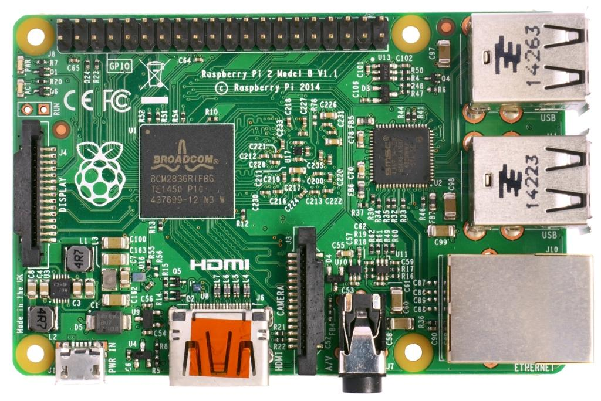

# Raspberry Pi 2/3 Navio2 Autopilot

> **Warning** PX4 does not manufacture this (or any) autopilot.
  Contact the [manufacturer](https://emlid.com/) for hardware support or compliance issues.

<span></span>
> **Warning** PX4 support for this flight controller is [experimental](../flight_controller/autopilot_experimental.md).



## Developer Quick Start

### OS Image

Use the [Emlid RT Raspbian image for Navio 2](https://docs.emlid.com/navio2/Navio-APM/configuring-raspberry-pi/).
The default image will have most of the setup procedures shown below already done.

> **Warning** Make sure not to upgrade the system (more specifically the kernel).
  By upgrading, a new kernel can get installed which lacks the necessary HW support (you can check with `ls /sys/class/pwm`, the directory should not be empty).

### Setting up Access

The Raspbian image has SSH setup already.
Username is "pi" and password is "raspberry".
You can connect to your RPi2/3 over a network (Ethernet is set to come up with DHCP by default) and then proceed to configure WiFi access.
We assume that the username and password remain at their defaults for the purpose of this guide.

To setup the RPi2/3 to join your local wifi, follow [this guide](https://www.raspberrypi.org/documentation/configuration/wireless/wireless-cli.md).

Find the IP address of your Pi from your network, and then you can proceed to connect to it using SSH.

```sh
ssh pi@<IP-ADDRESS>
```

### Expand the Filesystem

After installing the OS and connecting to it, make sure to [expand the Filesystem](https://www.raspberrypi.org/documentation/configuration/raspi-config.md), so there is enough space on the SD Card.

### Disable Navio RGB Overlay

The existing Navio RGB overlay claims GPIOs used by PX4 for RGB Led.
Edit `/boot/config.txt` by commenting the line enabling the `navio-rgb` overlay.
```
#dtoverlay=navio-rgb
```

### Changing Hostnames

To avoid conflicts with any other RPis on the network, we advise you to change the default hostname to something sensible.
We used "px4autopilot" for our setup.
Connect to the Pi via SSH and follow the below instructions.

Edit the hostname file:

```sh
sudo nano /etc/hostname
```

Change `raspberry` to whatever hostname you want (one word with limited characters apply)

Next you need to change the hosts file:

```sh
sudo nano /etc/hosts
```
Change the entry `127.0.1.1 raspberry` to `127.0.1.1 <YOURNEWHOSTNAME>`

Reboot the Pi after this step is completed to allow it to re-associate with your network.

### Setting up Avahi (Zeroconf)

To make connecting to the Pi easier, we recommend setting up Avahi (Zeroconf) which allows easy access to the Pi from any network by directly specifying its hostname.

```sh
sudo apt-get install avahi-daemon
sudo insserv avahi-daemon
```
Next, setup the Avahi configuration file

```sh
sudo nano /etc/avahi/services/multiple.service
```
Add this to the file :

```xml
<?xml version="1.0" standalone='no'?>
<!DOCTYPE service-group SYSTEM "avahi-service.dtd">
<service-group>
        <name replace-wildcards="yes">%h</name>
        <service>
                <type>_device-info._tcp</type>
                <port>0</port>
                <txt-record>model=RackMac</txt-record>
        </service>
        <service>
                <type>_ssh._tcp</type>
                <port>22</port>
        </service>
</service-group>

```
Restart the daemon

```sh
sudo /etc/init.d/avahi-daemon restart
```
And that's it.
You should be able to access your Pi directly by its hostname from any computer on the network.


> **Tip** You might have to add .local to the hostname to discover it.

### Configuring a SSH Public-Key

In order to allow the PX4 development environment to automatically push executables to your board, you need to configure passwordless access to the RPi. 
We use the public-key authentication method for this.

To generate new SSH keys enter the following commands (Choose a sensible hostname such as `<YOURNANME>@<YOURDEVICE>`.  Here we have used `pi@px4autopilot`)

These commands need to be run on the HOST development computer!

```sh
ssh-keygen -t rsa -C pi@px4autopilot
```
Upon entering this command, you'll be asked where to save the key. We suggest you save it in the default location ($HOME/.ssh/id_rsa) by just hitting Enter.

Now you should see the files `id_rsa` and `id_rsa.pub` in your `.ssh` directory in your home folder:

```sh
ls ~/.ssh
authorized_keys  id_rsa  id_rsa.pub  known_hosts
```
The `id_rsa` file is your private key. Keep this on the development computer.
The `id_rsa.pub` file is your public key. This is what you put on the targets you want to connect to.

To copy your public key to your Raspberry Pi, use the following command to append the public key to your authorized_keys file on the Pi, sending it over SSH:

```sh
cat ~/.ssh/id_rsa.pub | ssh pi@px4autopilot 'cat >> .ssh/authorized_keys'
```

Note that this time you will have to authenticate with your password ("raspberry" by default).

Now try `ssh pi@px4autopilot` and you should connect without a password prompt.

If you see a message "`Agent admitted failure to sign using the key.`" then add your RSA or DSA identities to the authentication agent, ssh-agent and the execute the following command:

```sh
ssh-add
```
If this did not work, delete your keys with `rm ~/.ssh/id*` and follow the instructions again.

### Testing file transfer
We use SCP to transfer files from the development computer to the target board over a network (WiFi or Ethernet).

To test your setup, try pushing a file from the development PC to the Pi over the network now.
Make sure the Pi has network access, and you can SSH into it.

```sh
echo "Hello" > hello.txt
scp hello.txt pi@px4autopilot:/home/pi/
rm hello.txt
```
This should copy over a "hello.txt" file into the home folder of your RPi.
Validate that the file was indeed copied, and you can proceed to the next step.

### Native Builds (optional)

You can run PX4 builds directly on the Pi if you desire. 
This is the *native* build. 
The other option is to run builds on a development computer which cross-compiles for the Pi, and pushes the PX4 executable binary directly to the Pi.
This is the *cross-compiler* build, and the recommended one for developers due to speed of deployment and ease of use.

For cross-compiling setups, you can skip this step.

The steps below will setup the build system on the Pi to that required by PX4.
Run these commands on the Pi itself!

```sh
sudo apt-get update
sudo apt-get install cmake python-empy
```

Then clone the Firmware directly onto the Pi.

### Building the Code

Continue with our [standard build system installation](https://dev.px4.io/master/en/setup/dev_env_linux.html).
