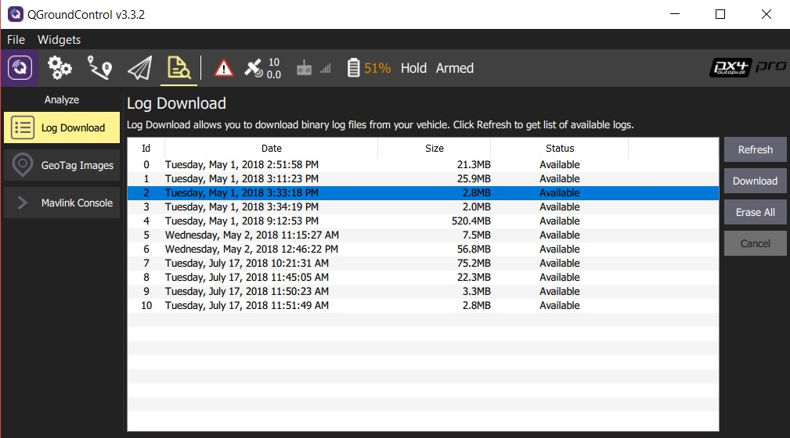

# Flight Reporting

PX4 logs detailed aircraft state and sensor data, which can be used to analyze performance issues.
This topic explains how you can download and analyse logs, and share them with the development team for review.

> **Tip** Keeping flight logs is a legal requirement in some jurisdictions.

## Downloading Logs from the Flight Controller

Logs can be downloaded using [QGroundControl](http://qgroundcontrol.com/): **[Analyze View > Log Download](https://docs.qgroundcontrol.com/en/analyze_view/log_download.html)**.

## Analyzing the Logs

Upload the log file to the online *Flight Review* tool (http://logs.px4.io).
After upload you'll emailed a link to the analysis page for the log.

[Log Analysis using Flight Review](../log/flight_review.md) explains how to interpret the plots, and can help you to verify/reject the causes of common problems: excessive vibration, poor PID tuning, saturated controllers, imbalanced vehicles, GPS noise, etc.

> **Note** There are many other great tools for visualising and analysing PX4 Logs.
  For more information see: [Flight Analysis](../log/flight_log_analysis.md).
  

> **Tip** If you have a constant high-rate MAVLink connection to the vehicle (not just a telemetry link) then you can use *QGroundControl* to automatically upload logs directly to *Flight Review*.
  For more information see [Settings > MAVLink Settings > MAVLink 2 Logging (PX4 only)](https://docs.qgroundcontrol.com/en/SettingsView/MAVLink.html#logging).

## Sharing the Log Files for Review by PX4 Developers

The [Flight Review](http://logs.px4.io) log file link can be shared for discussion in the [support forums](../README.md#support) or a [Github issue](../README.md#reporting-bugs--issues).

## Log Configuration

The logging system is configured by default to collect sensible logs for use with [Flight Review](http://logs.px4.io).

Logging may further be configured using the [SD Logging](../advanced_config/parameter_reference.md#sd-logging) parameters.
The parameters you are most likely to change are listed below.

Parameter | Description
--- | ---
[SDLOG_MODE](../advanced_config/parameter_reference.md#SDLOG_MODE) | Logging Mode defines when logging starts and stops. - `0`: log when armed until disarm (default). - `1`: log from boot until disarm. - `2`: log from boot until shutdown.
[SDLOG_PROFILE](../advanced_config/parameter_reference.md#SDLOG_PROFILE) | Logging profile. Use this to enable less common logging/analysis (e.g. for EKF2 replay, high rate logging for PID & filter tuning, thermal temperature calibration).
[SDLOG_MISSION](../advanced_config/parameter_reference.md#SDLOG_MISSION) | Create very small additional "Mission Log". This log can *not* be used with *Flight Review*, but is useful when you need a small log for geotagging or regulatory compliance.

> **Note** *Developers* can further configure what information is logged via the [logger](https://dev.px4.io/master/en/middleware/modules_system.html#logger) module
  (you would use this, for example, if you want to log your own topics).
  For more information see: [Logging](https://dev.px4.io/master/en/log/logging.html) (PX4 Developer Guide).

## Key Links

- [Flight Review](http://logs.px4.io)
- [Log Analysis using Flight Review](../log/flight_review.md)
- [Flight Log Analysis](../log/flight_log_analysis.md)