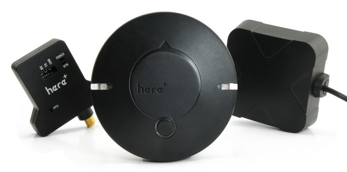
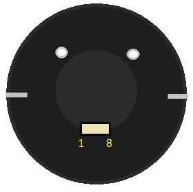
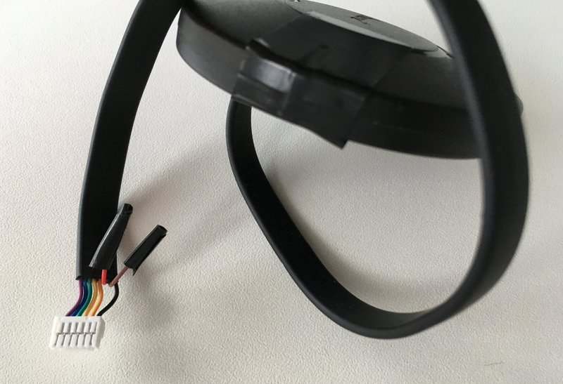

# HEX/ProfiCNC Here+ RTK GPS

The [Here+ RTK GPS receiver](http://www.proficnc.com/content/12-here) is a small, light and energy efficient [RTK GPS module](../gps_compass/rtk_gps.md), based on the u-blox M8P. Using RTK, PX4 can get its position with centimetre-level accuracy, which is much more accurate than can be provided by a normal GPS.

## Purchase

* [ProfiCNC](http://www.proficnc.com/gps/77-gps-module.html)
* [Hex - China](http://www.hex.aero/shop/all/here-rtk-gnss-set/) (China)
* [Other resellers](http://www.proficnc.com/stores)

## Configuration

RTK setup and use on PX4 via *QGroundControl* is largely plug and play (see [RTK GPS](../advanced_features/rtk-gps.md) for more information).

## Pinout

The Here+ GPS comes with an 8 pin connector with the following pinout

Pin | Here+ GPS
--- | ---
1 (purple) | VCC_5V
2 (blue) | GPS_RX
3 (green) | GPS_TX
4 (yellow) | I2C SCL
5 (orange) | I2C SDA
6 (red) | SAFETY BUTTON
7 (brown) | BUTTON_LED
8 (black) | GND

## Wiring and Connections

Connection examples are shown below for a number of boards (these can be used to modify the cable as needed for other boards).

### Hex Cube

The supplied cable can be inserted directly into the [Hex Cube (Pixhawk 2)](../flight_controller/pixhawk-2.md) GPS UART port.

#### Pixhawk 3 Pro

The [Pixhawk 3 Pro](../flight_controller/pixhawk3_pro.md) and [Pixracer](../flight_controller/pixracer.md) have a 6 pin GPS port connector.
For these controllers you can modify the GPS cable (as shown below) to remove pin 6 and 7.

Pin 6 and 7 are for the safety button - these can be attached as well if needed.

| Pin | Here+ GPS     | Pin | Pixhawk 3 Pro GPS |
| --- | ------------- | --- | ----------------- |
| 1   | VCC_5V        | 1   | VCC               |
| 2   | GPS_RX        | 2   | GPS_TX            |
| 3   | GPS_TX        | 3   | GPS_RX            |
| 4   | I2C SCL           | 4   | SCL           |
| 5   | I2C SDA           | 5   | SDA           |
| 6   | BUTTON        | -   | -                 |
| 7   | BUTTON_LED    | -   | -                 |
| 8   | GND           | 6   | GND               |

#### Pixhawk 4

The Here+ to [Pixhawk 4](../flight_controller/pixhawk4.md) GPS port pin mapping is 1:1 for pins 1-7 and then connect GND (Here+ pin 8 / Pixhawk pin 10).
Pixhawk 4 GPS port pins 8 and 9 can be left disconnected. 

> **Note** The Pixhawk 4 GPS port has pin 1 on the left hand side.

Pin | Here+ GPS | pin | Pixhawk 4 GPS Port
--- | --- | --- | --- 
1 | VCC_5V | 1 | VCC (+5V)
2 | GPS_RX | 2 | GPS_TX
3 | GPS_TX | 3 | GPS_RX
4 | I2C SCL | 4 | SCL1
5 | I2C SDA | 5 | SDA1
6 | BUTTON | 6 | SAFETY_SWITCH
7 | BUTTON_LED | 7 | SAFETY_SWITCH_LED
/ | - | 8 | VDD_3V3
/ | - | 9 | BUZZER
8 | GND | 10 | GND
