# Bootloader Update Pixhawk V6X-RT

The _PX4 Bootloader_ is used to load firmware for [Pixhawk boards](../flight_controller/pixhawk_series.md) (PX4FMU, PX4IO).

Pixhawk controllers usually comes with an appropriate bootloader version pre-installed.
However in some cases it may not be present, or an older version may be present that needs to be updated.
It is also possible that the device is bricked, so the device has to be erased and a new bootloader must be flashed.

This topic explains several methods for updating/unbricking the Pixhawk bootloader.

## Building the PX4 V6X-RT Bootloader

This can be built from within the PX4-Autopilot folder using the `make` command and the board-specific target with a `_bootloader` suffix.
For FMUv6X the command is:

```sh
make px4_fmu-v6xrt_bootloader
```

This will build the bootloader binary as `build/px4_fmu-v6xrt_bootloader/px4_fmu-v6xrt_bootloader.bin`, which can be flashed via SWD or ISP.
If you are building the bootloader you should be familiar with one of these options already.

If you need a HEX file instead of an ELF file, use objcopy:

```sh
arm-none-eabi-objcopy -O ihex build/px4_fmu-v6xrt_bootloader/px4_fmu-v6xrt_bootloader.elf px4_fmu-v6xrt_bootloader.hex
```

## Flashing the bootloader through USB

The Pixhawk V6X-RT comes with a build-in bootloader located on the ROM.
To flash a new bootloader through USB you've got to download the [NXP MCUXpresso Secure Provisioning tool](https://www.nxp.com/design/design-center/software/development-software/mcuxpresso-software-and-tools-/mcuxpresso-secure-provisioning-tool:MCUXPRESSO-SECURE-PROVISIONING).
The tool is available for Windows, Linux and macOS.

1. Install the _MCUXpresso Secure Provisioning_ application and launch the application:

   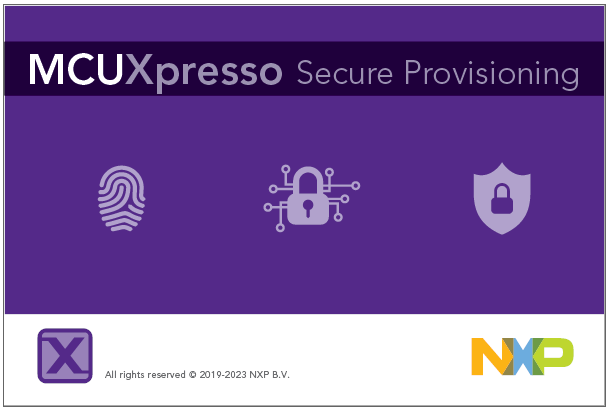

1. On first start you have to create a "New Workspace".
   Select `i.mX RT11xx` and then select `MIMXRT1176`

   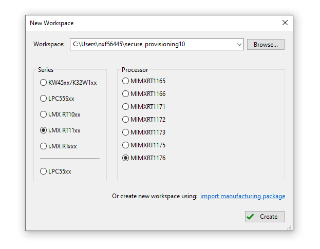

1. After creating a "New Workspace" click on the **FlexSPI NOR - simplified** button

   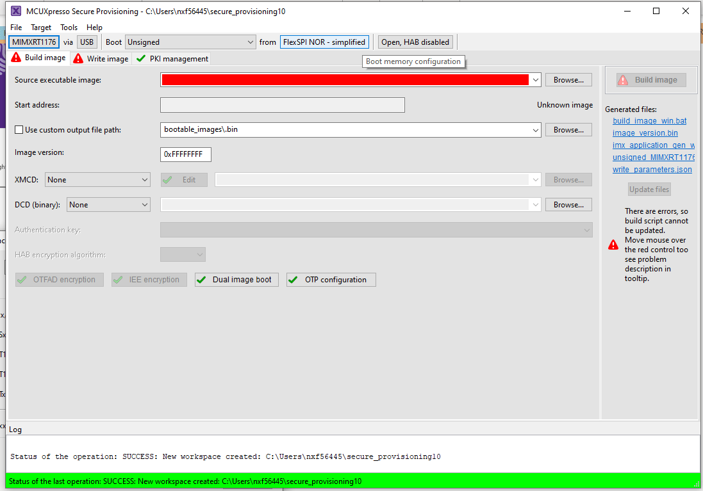

1. On the _Boot Memory Configuration_ window change the "Device type" to `Macronix Octal DDR` and press **OK**.

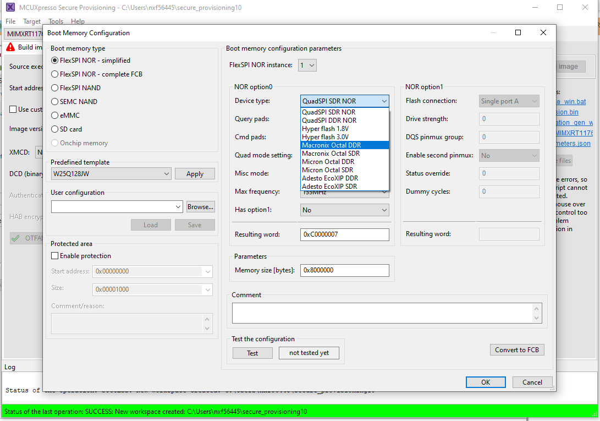

1. On the menu bar select **Tools > Flash Programmer**:

   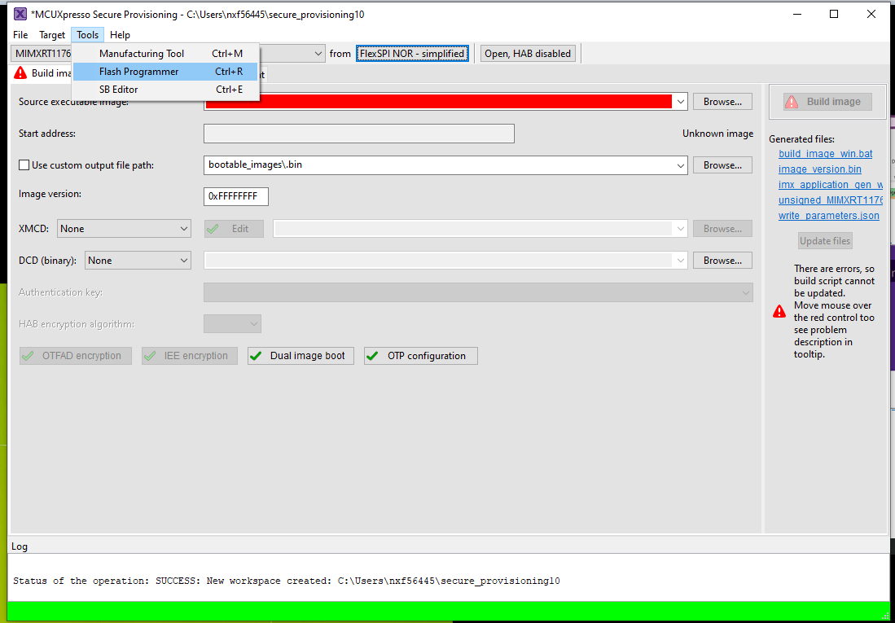

1. You should get this pop-up indicating the Pixhawk V6X-RT is not in the "ISP bootloader mode".

   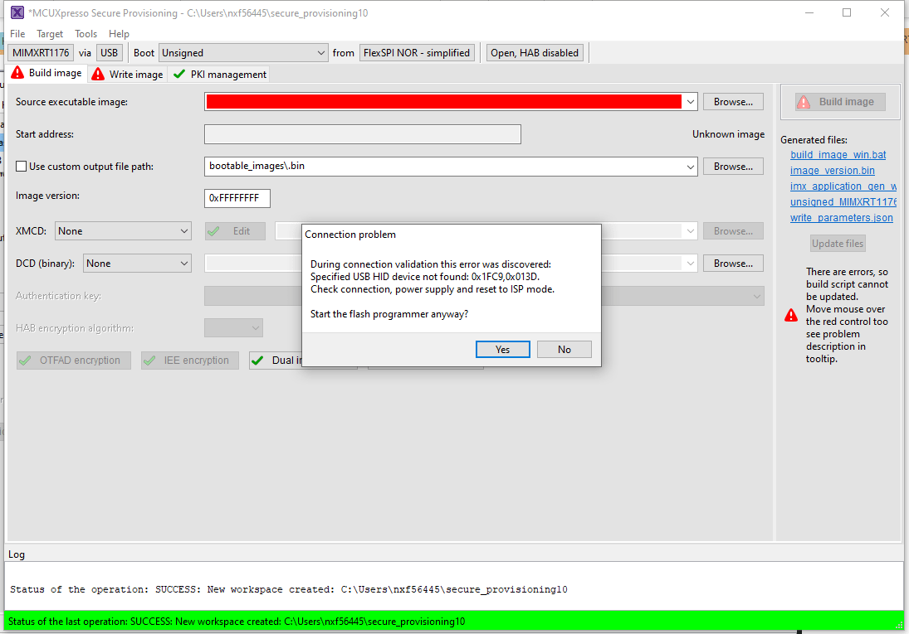

   To get the Pixhawk V6X-RT into "ISP bootloader mode" there are 2 options:

   1. Launch QGC connect the Pixhawk select **Analayze Tools** and then **MAVLINK Console**.
      On the console type `reboot -i`.
      This will put the Pixhawk V6X-RT into "ISP bootloader mode"

      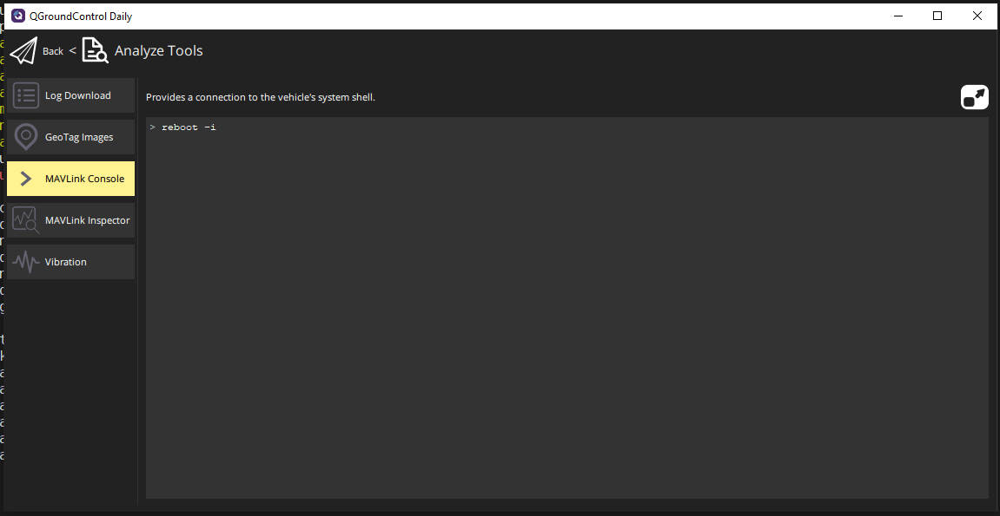

   2. If the board is bricked and connecting to QGC is not possible you've open the FMUM module and press the BOOT button (circled in red in the picture below) while powering the board.

      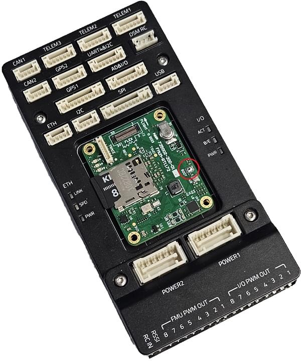

      Press **YES** to launch the _Flash Programmer Tool_.

1. When the Flash Programming has started you get a popup to configure the target memory press **Yes**

   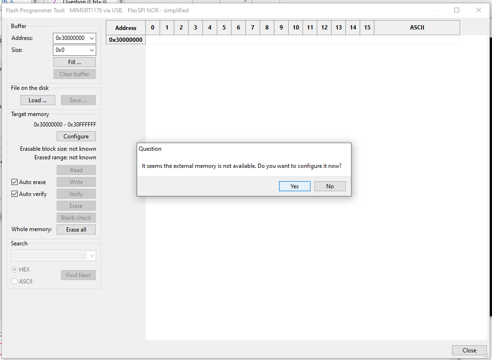

1. When the Target Memory configuration is succesful you can press the the **Erase All** button

   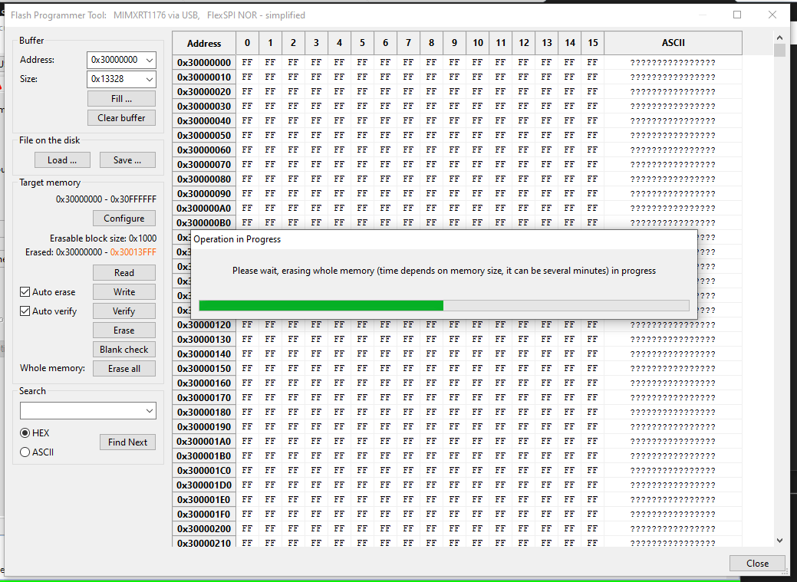

1. After erasing the flash press the **Load ...** button and then press the **Browse** button

   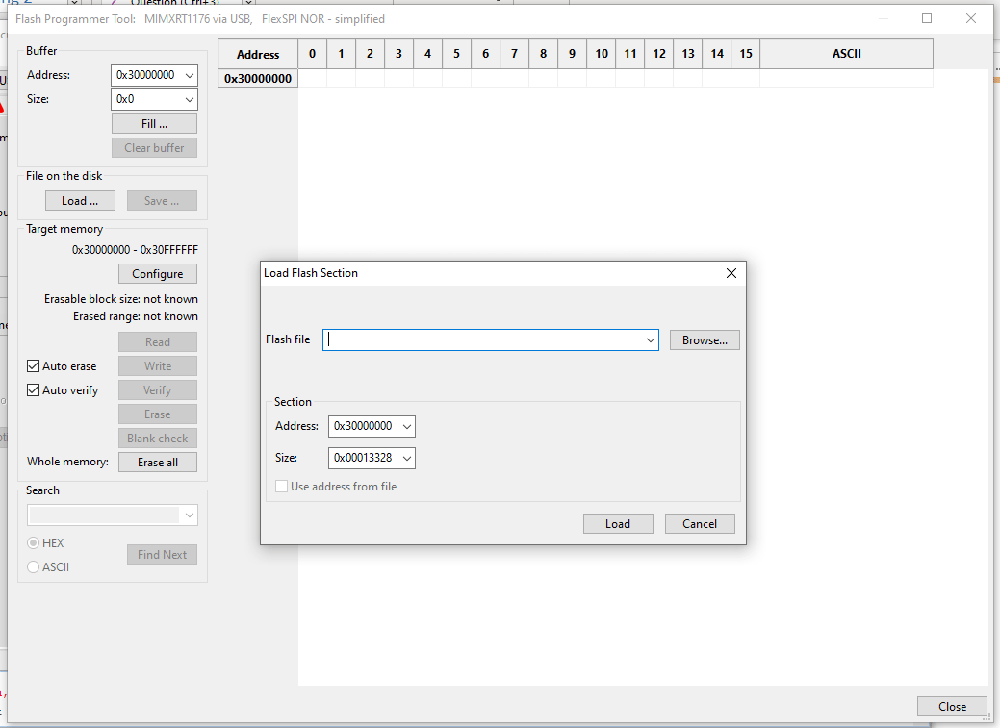

1. Locate the `px4_fmu-v6xrt_bootloader.bin` file and press **Open** and then press on **Load**.

   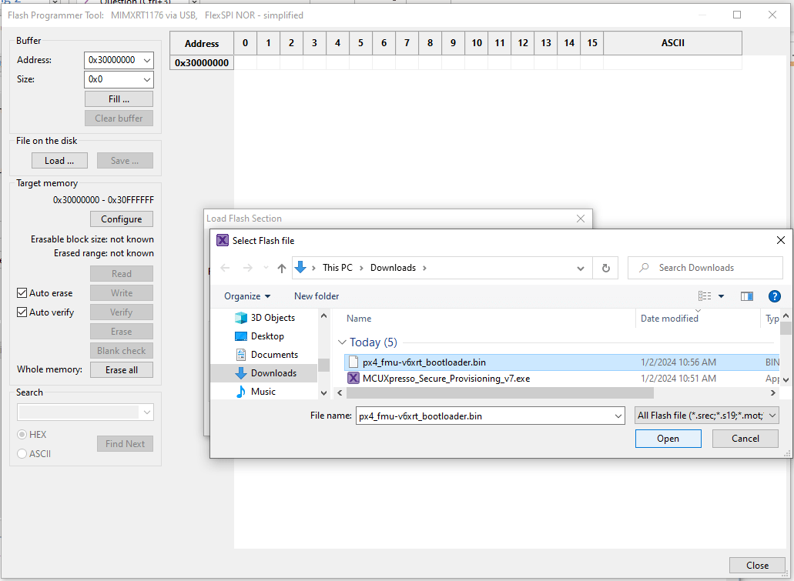

1. If the load is successful you should see the "Success: load from file" at the bottom right

   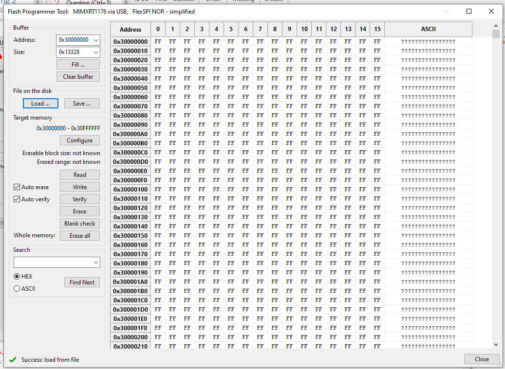

1. Press the **Write** button to flash the PX4 bootloader

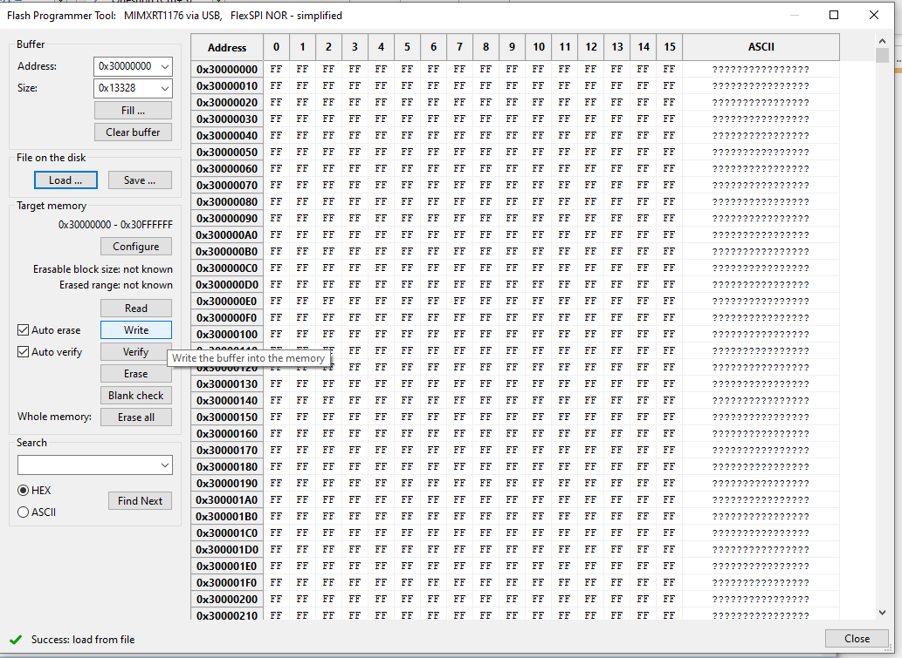

1. On success it should show "Success: Write memory 0x30000000 - 0x3XXXXXXX" Note: values might differ due to bootloader changes.

   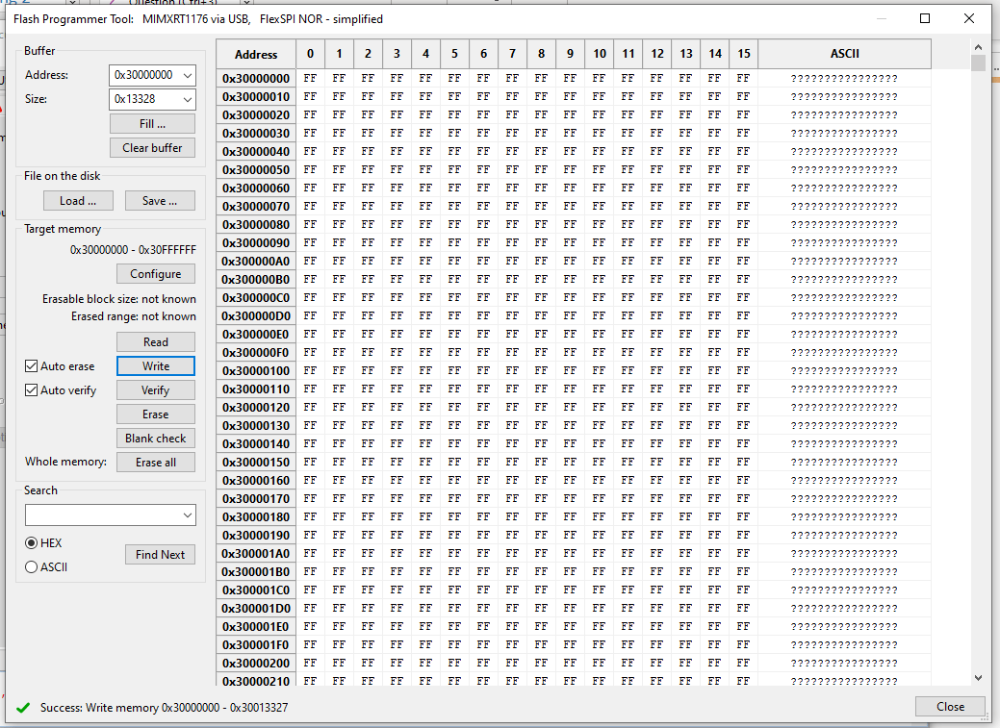

Now unplug the Pixhawk V6X-RT and re-power the board.
After the bootloader has updated you can [Load PX4 Firmware](../config/firmware.md) using _QGroundControl_.

## Dronecode Probe Bootloader Update

The following steps explain how you can "manually" update the bootloader using the dronecode probe:

1. Get a binary containing the bootloader (either from dev team or build it yourself).
1. Connect the Dronecode probe to your PC via USB.
1. Go into the directory containing the binary and run the following command in the terminal:

   ```sh
   arm-none-eabi-gdb px4_fmu-v6xrt_default.elf
   ```

1. The _gdb terminal_ appears and it should display the following output:

   ```sh
   GNU gdb (GNU Tools for Arm Embedded Processors 7-2017-q4-major) 8.0.50.20171128-git
   Copyright (C) 2017 Free Software Foundation, Inc.
   License GPLv3+: GNU GPL version 3 or later <http://gnu.org/licenses/gpl.html>
   This is free software: you are free to change and redistribute it.
   There is NO WARRANTY, to the extent permitted by law.
   Type "show copying"    and "show warranty" for details.
   This GDB was configured as "--host=x86_64-linux-gnu --target=arm-none-eabi".
   Type "show configuration" for configuration details.
   For bug reporting instructions, please see:
   <http://www.gnu.org/software/gdb/bugs/>.
   Find the GDB manual and other documentation resources online at:
   <http://www.gnu.org/software/gdb/documentation/>.
   For help, type "help".
   Type "apropos word" to search for commands related to "word"...
   Reading symbols from px4_fmu-v6xrt_default.elf...done.
   ```

1. Find your `<dronecode-probe-id>` by running an ls command in the **/dev/serial/by-id** directory.
1. Now connect to the Dronecode probe with the following command:

   ```sh
   tar ext /dev/serial/by-id/<dronecode-probe-id>
   ```

1. Power on the Pixhawk with another USB cable and connect the Dronecode probe to the FMU-DEBUG port.

   :::note
   To be able to connect the Dronecode probe to the FMU-DEBUG port
   :::

1. Use the following command to scan for the Pixhawk’s swd and connect to it:

   ```sh
   (gdb) mon swdp_scan
   (gdb) attach 1
   ```

1. Load the binary into the Pixhawk:

   ```sh
   (gdb) load
   ```

After the bootloader has updated you can [Load PX4 Firmware](../config/firmware.md) using _QGroundControl_.
