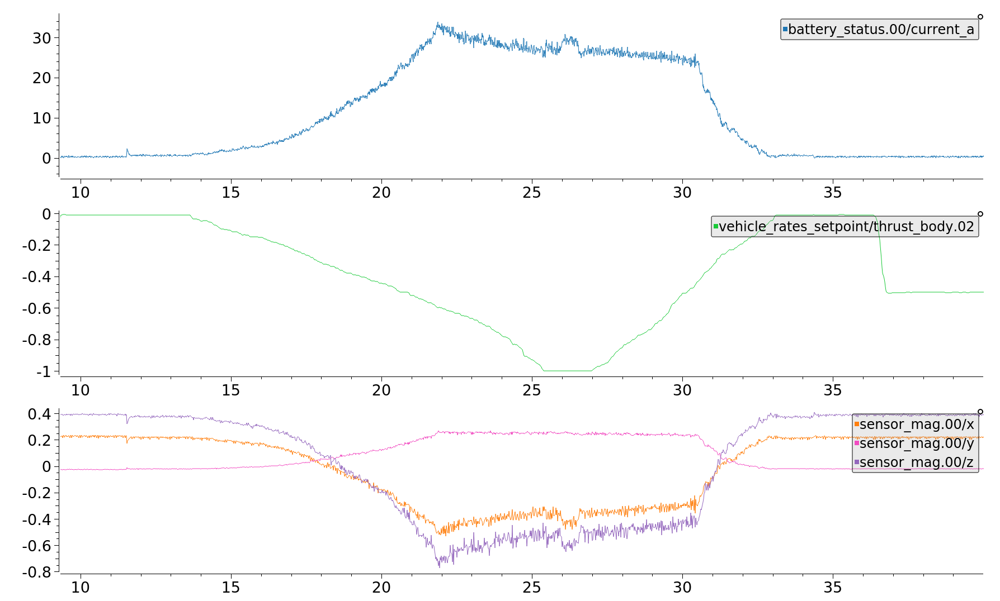
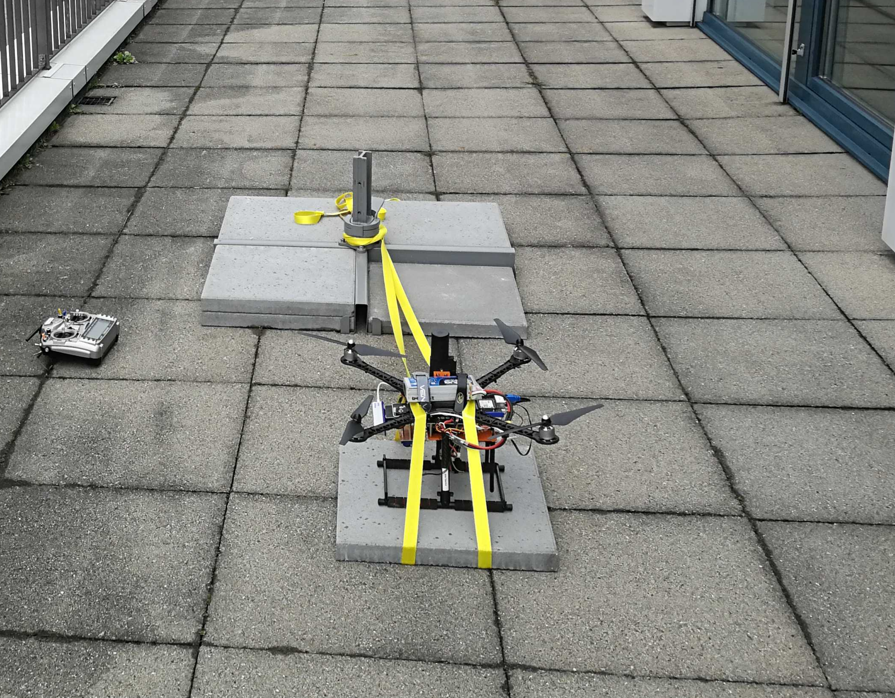
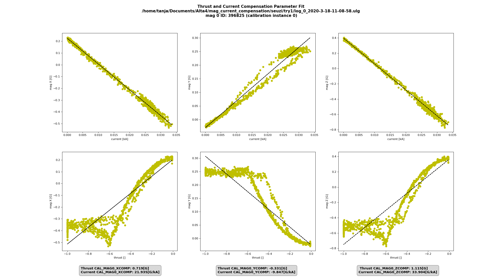
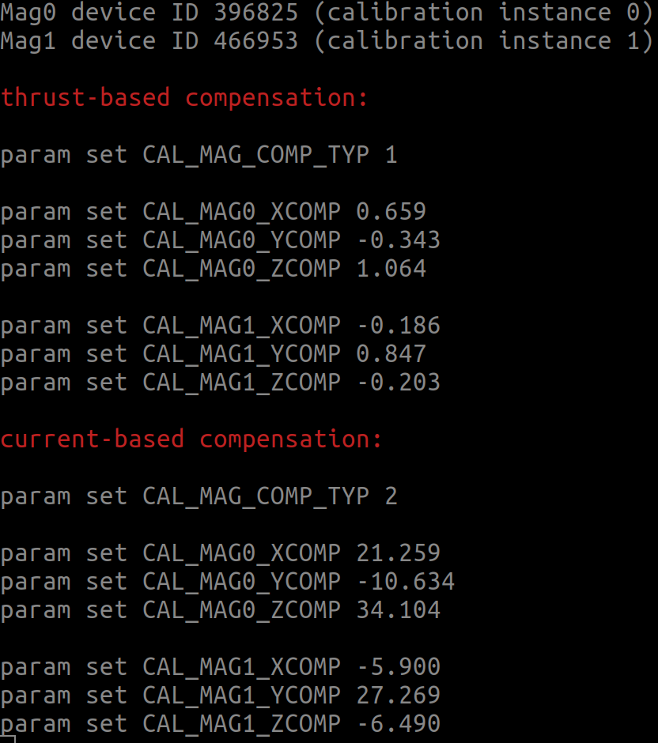

# Compass Power Compensation

The compass should be mounted as far as possible from cables which carry large currents. Those currents induce magnetic fields, which will corrupt the compass readings. The strength of such an induced magnetic field decreases quadratically with the distance from the cable. Moving the compass away from such induced magnetic field is certainly the easiest and most reliable solution. But there might be cases where this is not realistic.

## When is Power Compensation applicable? {#when}

Performing this power compensation is advisable only if all the following statements hold true:
1. You can see a strong correlation of the compass readings with the thrust setpoint and/or the battery current. 

   
1. The drone does not have moving cables. The cables causing the mag corruption MUST stay exactly as they are. If they move, the identified parameters for the compansation are void.
1. You cannot move the compass to a location where the influence disappears.

## How to compensate the compass {#how}

1. Make sure your drone runs a Firmware version supporting power compensation (current master, targeted for v.1.12.0)
1. Perform the standared compass calibration as described [here] (../config/compass.html#compass-calibration)
1. Set the [SDLOG_MODE](../advanced_config/parameter_reference.md#SDLOG_MODE) parameter to 2 to enable logging of data from boot. 
1. Set the [SDLOG_PROFILE](../advanced_config/parameter_reference.md#SDLOG_PROFILE) checkbox for *high rate* (bit 2) to get more data points.
1. Strap your drone to a heavy object, which it will not be able to move. Mount the props, only that way the motors will draw the the same current as in flight.

1. Power the vehicle and switch into ACRO flight mode (to avoid the vehicle trying to compensate for the unexpected limitation by the straps). Perform the test carefully always keeping an eye on the vibrations. Arm the vehicle and slowly throttle up to full throttle, then slowly lower the throttle down to zero and disarm.
1. Retrieve the ulog and use the python script [mag_compensation.py](https://github.com/PX4/Firmware/blob/master/src/lib/mag_compensation/python/mag_compensation.py) to identify the compensation parameters

> **Note** If your log does not contain battery current measurements, you will need to comment out the respective lines in the python script, such that it does the calculation for thrust only.

1. The script will return the parameter identification for thrust as well as for current. If a current measurement is available, using the current-compensation usually yields the better results. Here is an example of a log, where the current fit is good, but the thrust parameters are unusable as the relationship is not linear.

1. Once the parameters are identified, the power compensation must be enabled by setting [CAL_MAG_COMP_TYP](../advanced_config/parameter_reference.md#CAL_MAG_COMP_TYP) to 1 (when using thrust parameters) or 2 (when using current parameters). Also all the compensation parameters returned by the python script must be set.
