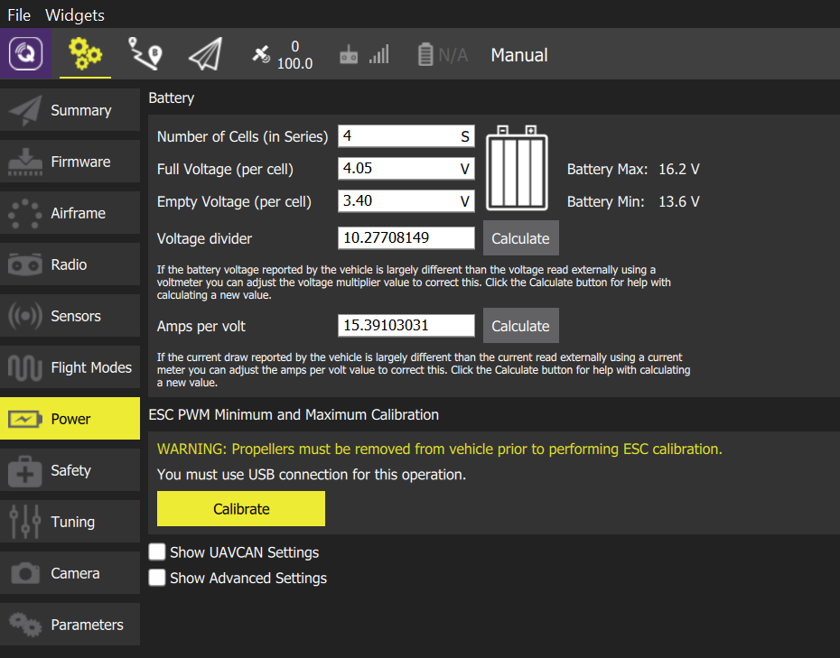

# ESC Calibration

Electronic Speed Controllers (ESC) regulate the speed (and direction) of motors based on a PWM input from the flight controller (FC). 

All ESCs in a multicopter must be configured to respond to flight controller input in the same way (across the whole input range). 
High-quality controllers come with a factory calibration and can be just configured using the [PWM_MIN](../advanced_config/parameter_reference.md#PWM_MIN) and [PWM_MAX](../advanced_config/parameter_reference.md#PWM_MAX) parameters provided in the ESC technical specification.

Many low-cost models require calibration. This can/should be performed if you are unsure whether it is required!

> **Warning** Never attempt ESC calibration with props on. Before you begin just remove them.

To calibrate the ESCs:

1. Disconnect the battery and connect the flight controller via USB (only). 
1. Open the *QGroundControl* **Settings > Power**, then press the **Calibrate** button.

   

1. Connect the battery when prompted:

   

   The calibration will begin automatically:

   

1. Once the calibration complete you will be prompted to disconnect the battery.

   

