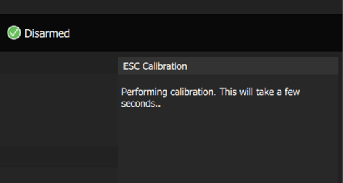
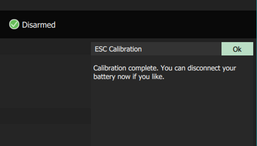

# ESC calibration

Electronic speed controllers translate the input from the RC or the
flight controller to the motors. ESCs do not always have to be
calibrated. High-quality controllers come with a factory calibration and
can be just configured using the PWM\_MIN and PWM\_MAX parameters. This
ensures that all the ESCs in a multicopter will scale the same way the
input from the FC to the motors.  However, many low-cost models do
require calibration and so if unsure calibration is recommended. Here is
how you do it.

> **Warning** Never attempt ESC calibration with props on. Before you begin just remove them.

For the calibration process to begin you should use only the USB
connection to the flight controller in the first step.

Then you will be asked to plug in the battery.

The calibration will begin automatically.

Wait until it is finished.

You are done. Now the ESCs are calibrated.

