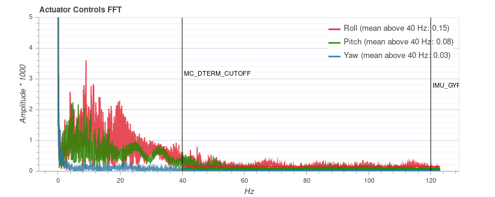
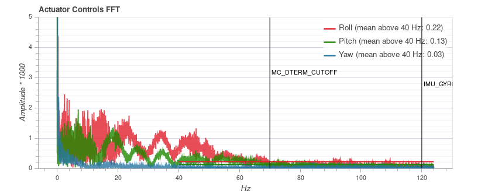
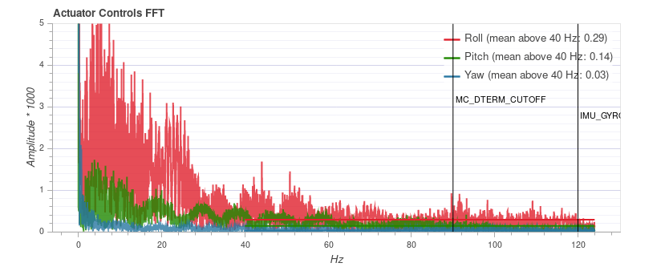

# Racer Setup

This page describes how to setup a racer and get the best performance out of it,
particularly in acro mode.

> **Tip** Many things described here can also be applied to other multicopters
> to improve flight performance.

Keep in mind that racers are fast vehicles, specifically designed to be
overpowered, and thus you should already have some experience, or let someone
with experience help you.

> **Note** A racer usually leaves away certain sensors, such as the GPS, which means that less failsafe options are available.

## Build Options
Racers typically do not have a GPS, but you will get some benefits if you add one.
### Minimal
PX4 can go as minimal as using only a gyro and an accel sensor.
<!-- TODO: link to omnibus once we have docs -->
If the board has an internal mag, it should not be used as it typically suffers
from strong interferences (this is especially true for a small racer).

### GPS with external Mag
A GPS adds some weight and it should be placed away from high currents to avoid
mag interferences (on a GPS mast), which unfortunately means it will easily
break during crashes. On the other hand you get some benefits, that are
interesting especially for beginners:
- You can go into position hold and the vehicle will just stay in one place.
  This is handy if you lose the orientation or need a brake. It can also be used
  to land safely.
- [Return mode](../flight_modes/return.md) can be used, either on a switch or as RC loss/low
  battery failsafe.
- You will have the last position when it crashes.
- The log contains the flight track, which means you can review the flight (in 3D).
  This can help to improve your acro flight skills.

> **Note** During agressive acro maneuvers the GPS can lose its position fix
> for a short time. If you switch into position mode during that time, altitude
> mode will be used instead until the position becomes valid again.

## Vehicle Setup
The following paragraphs describe a few important points when building the
vehicle. If you need complete build instructions, you can follow the
[QAV-R 5" KISS ESC Racer](../frames_multicopter/qav_r_5_kiss_esc_racer.md) build
log.

### Vibration Setup
There are various ways how to do the mounting to reduce vibrations, and there is
probably not a single best method. You will however have much less problems with
vibrations if you use high-quality components (frame, motors, props) as for
example used in [this build](../frames_multicopter/qav_r_5_kiss_esc_racer.md).
Make sure to use **balanced props**. The FC can be mounted with
[O-rings](../frames_multicopter/qav_r_5_kiss_esc_racer.md#mounting).

### Center of Gravity
Make sure that the center of gravity is as close as possible to the center of
thrust. Left-right balance is usually not a problem, but front-back. You can
move the battery until it is correct and mark it on the frame so you will always
place it correctly.

> **Note** The integral term can account for an imbalanced setup, and a custom
> mixer can do that even better, but it's best to fix it in the vehicle setup.

### Software Setup
After having built the racer, you will need to configure the software.
Go through the [Basic Configuration Guide](../config/README.md) and choose the
[Generic 250 Racer](../airframes/airframe_reference.md#copter_quadrotor_x_generic_250_racer)
airframe, which already sets some racer-specific parameters. These parameters
are important:

- Enable One-Shot by setting `PWM_RATE` to 0.
- Enable `SYS_FMU_TASK` (explained below).
- Set the maximum roll-, pitch- and yaw rates for Manual/Stabilized mode as
  desired: `MC_ROLLRATE_MAX`, `MC_PITCHRATE_MAX` and `MC_YAWRATE_MAX`.
  The maximum tilt angle is configured with `MPC_MAN_TILT_MAX`.
- The minimum thrust `MPC_MANTHR_MIN` should be set to 0.
- Disable RC input filtering by setting `RC_FLT_CUTOFF` to 0.

#### Estimator
If you use a GPS you can skip this section and use the default estimator.
Otherwise you should switch to the Q attitude estimator, which works without mag
or baro. To select it, set `SYS_MC_EST_GROUP` to 1, and change the
following parameters:
- Set `SYS_HAS_MAG` to 0 if the system does not have a mag.
- Set `SYS_HAS_BARO` to 0 if the system does not have a baro.
- Configure the Q estimator: set `ATT_ACC_COMP` to 0, `ATT_W_ACC` to 0.4 and
  `ATT_W_GYRO_BIAS` to 0. You can tune these later if you wish.

#### Failsafe
Configure [RC loss and low battery failsafe](../config/safety.md). If you do not
use a GPS, set the failsafe to **Lockdown**, which turns off the motors. Test RC
loss on the bench without props attached by turning off the remote when the
vehicle is armed.

Make sure to assign a kill switch, test it and train to use it (or use an arm
switch).

#### Arm switch {#arming-switch}
To use an arm switch manually set the parameter `RC_MAP_ARM_SW` to the
corresponding switch RC channel. The vehicle should from then on immediately
arm/disarm whenever your switch is tuned on/off. If the switch positions are
reversed just change the sign of the parameter `RC_ARMSWITCH_TH` or also change
its value to alter the threshold value. Make sure to test this under safe
conditions!

#### PID tuning
At this point you should be ready for a first test flight.

If it goes well, do a first pass of [PID tuning](pid_tuning_guide_multicopter.md) (ignore the thrust curve settings).
The vehicle needs to be **undertuned**, meaning the P and D gains should rather
be set too low so that there are no oscillations from the controller that could
be interpreted as noise (the default gains might be good enough). This is
important for the filter tuning. There will be a second PID tuning round
later.

Make sure to calibrate the ESCs before doing any tuning.

### Control Latency
The Control Latency is the delay from a physical disturbance of the vehicle
until the motors react to the change. It is crucial to reduce the control
latency as much as possible: a lower latency allows to increase the rate P
gains, which means better flight performance. Even 1 millisecond (!) added to
the latency makes a difference. These are the factors that contribute to the
latency:
- A soft airframe or soft vibration mounting (they act as a filter).
- Low-pass filters in software and on the sensor chip.
- PX4 software internals: the sensor signals need to be read in the driver
  and then pass through the controller to the output driver.
  Enable `SYS_FMU_TASK` to reduce latency (default on Pixracer and Omnibus).
- The IO chip (MAIN pins) adds about 5.4 ms latency compared to using the AUX pins.
  This does not apply to a Pixracer or Omnibus F4, but for example to a Pixhawk.
  To avoid the IO, disable `SYS_USE_IO` and attach the motors to the AUX pins
  instead.
- PWM output signal: enable One-Shot (`PWM_RATE`=0) to reduce latency.

### Filters
<!-- TODO: this probably should be documented somewhere else -->
As mentioned in the previous section, filters affect the control latency. This
is the filtering pipeline for the controllers in PX4:

- On-chip DLPF for the gyro sensor. The cutoff frequency is set to 98Hz and it
  is sampled with 1kHz.
- Low-pass filter on the gyro sensor data. It can be configured with the
  `IMU_GYRO_CUTOFF` parameter.
- Low-pass filter on the D-term. The D-term is most suspectible to noise while
  slightly increased latency does not negatively affect performance. For this
  reason the D-term has an additional low-pass filter, configurable via
  `MC_DTERM_CUTOFF`.
- A slewrate filter on the motor outputs (`MOT_SLEW_MAX`). Generally not used.

To reduce the control latency, we want to increase the cutoff frequency for the
low-pass filters. However this is a trade-off as it will also
increase the noise of the signal, which is fed to the motors. Noise on the
motors has the following consequences:
- Motors and ESCs can get hot, to the point where they get damaged.
- Reduced flight time because the motors continously change their speed.
- Visible random small twitches.

The best filter settings depend on the vehicle, and the defaults are set
conservative such that it works on lower-quality setups as well.

#### Filter Tuning
First make sure to have the high-rate logging profile activated
(`SDLOG_PROFILE` parameter). Flight Review will then show an FFT plot for the
roll, pitch and yaw controls.

> **Warning** Do not try to fix a vehicle that suffers from high vibrations with
> filter tuning. Rather fix the vehicle first.

Filter tuning is best done by doing a flight and then looking at the log. You
can do multiple flights right after each other with different parameters and
then inspect all logs, but make sure to disarm in between so that separate
log files are created.

The performed flight maneuver can simply be hovering in stabilized mode with
some rolling and pitching to all directions and some increased throttle periods.
The total duration does not need to be more than 30 seconds. In order to better
compare, the maneuver should be similar in all tests.

First tune the gyro filter `IMU_GYRO_CUTOFF` by increasing it in steps of 10 Hz
while using a low D-term filter value (`MC_DTERM_CUTOFF` = 30). Upload the logs
to https://logs.px4.io and compare the *Actuator Controls FFT* plot. Set the
cutoff frequency to a value before the noise starts to increase noticeably (for
frequencies around and above 60 Hz).

Next tune the D-term filter (`MC_DTERM_CUTOFF`) in the same way.
Below is an example for three different filter values. At 90 Hz the general noise
level starts to increase (especially for roll), and thus a cutoff frequency of 70
Hz is a safe setting.

> **Note** The plot cannot be compared between different vehicles, as the y axis
> scale can be different. On the same vehicle it is consistent and independent of
> the flight duration though.

#### PID tuning
Now do a second round of PID tuning, this time as tight as possible, and also
tune the thrust curve.

#### Airmode
After you verified that the vehicle flies well at low and high throttle, you can
enable airmode with the `MC_AIRMODE` parameter. It makes sure that the
vehicle is still controllable and tracks the rate at low throttle.

Happy flipping :)

