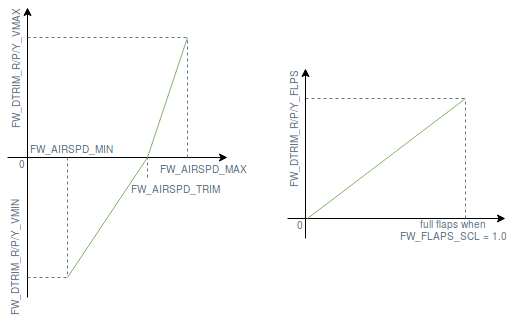

# Fixedwing trimming guide

## Basic trimming
There are several parameters an operator might want to use in order to properly trim a fixedwing aircraft. An overview of those parameters and their use case is shown below:

- [RCx_TRIM](../advanced_config/parameter_reference.md#RC1_TRIM) applies trim to the signal received from the RC transmitter. These parameters are set automatically during RC calibration.

- [PWM_MAIN_TRIMx](../advanced_config/parameter_reference.md#PWM_MAIN_TRIM1) applies trim to a PWM channel, after mixing. Use that to finely align the control surfaces to default angles before flying.

- [FW_PSP_OFF](../advanced_config/parameter_reference.md#FW_PSP_OFF) applies an offset to the pitch setpoint. Use that to set the angle of attack at which your aircraft needs to fly at cruise speed.

- [FW_AIRSPD_TRIM](../advanced_config/parameter_reference.md#FW_AIRSPD_TRIM) is used by the rate controllers to scale their output depending on the measured airspeed. See [Airspeed Scaling](https://dev.px4.io/en/flight_stack/controller_diagrams.html#airspeed-scaling) for more details on this.

- [TRIM_ROLL](../advanced_config/parameter_reference.md#TRIM_ROLL), [TRIM_PITCH](../advanced_config/parameter_reference.md#TRIM_PITCH) and [TRIM_YAW](../advanced_config/parameter_reference.md#TRIM_YAW) applies trim to the control signals - before mixing. For example, if you have two servos for the elevator, `TRIM_PITCH` applies trim to both of them. Use that when your control surfaces are aligned but the aircraft pitches/rolls/yaws up/down/left/right during manual (not stabilized) flight or if the control signal has a constant offset during stabilized flight.

The correct order to set those parameters is:

1. Trim the servos by physically adjusting the linkages lengths if possible and fine tune by trimming the PWM channels (use `PWM_MAIN/AUX_TRIMx`) on the bench to properly set the control surfaces to their theoretical position.

2. Fly in stabilized mode at cruise speed and set the pitch setpoint offset (`FW_PSP_OFF`) to desired angle of attack. The required angle of attack at cruise speed corresponds to the pitch angle the airplane needs to fly at to keep constant altitude during wing-leveled flight. If you are using an airpeed sensor, also set the correct cruise airspeed (`FW_AIRSPD_TRIM`).

3. Look at the actuator controls in the log file (upload it to [Flight Review](https://logs.px4.io) and ckeck the Actuator Controls plot for example) and set the pitch trim (`TRIM_PITCH`). Set that value to the average offset of the pitch signal during wing-leveled flight.

Step 3 can be performed before step 2 if you don't want to have to look at the log or if you feel comfortable flying in manual mode. You can then trim your remote (with the trim switches) and report the values to  `TRIM_PITCH`  (and remove the trims from your transmitter) or ask someone to update  `TRIM_PITCH` directly during flight via telemetry and QGC.

## Advanced trimming
Given that the downward pitch moment induced by an asymmetric airfoil increases witch airspeed and when the flaps are deployed, the aircraft needs to be re-trimmed according to the current measured airspeed and flaps position. For this purpose, a bilinear curve (see figure below) function of airspeed and a pitch trim increment function of the flaps state can be defined using the following parameters:

- [FW_DTRIM_R/P/Y_VMIN/VMAX](../advanced_config/parameter_reference.md#FW_DTRIM_R_VMIN) is the roll/pitch/yaw trim value added to `TRIM_ROLL/PITCH/YAW` at min/max airspeed (defined by [FW_AIRSPD_MIN](https://dev.px4.io/en/advanced/parameter_reference.html#FW_AIRSPD_MIN) and [FW_AIRSPD_MAX](https://dev.px4.io/en/advanced/parameter_reference.html#FW_AIRSPD_MAX)).

- [FW_DTRIM_R/P_FLPS](../advanced_config/parameter_reference.md#FW_DTRIM_R_FLPS) is the roll/pitch trim value added to `TRIM_ROLL/PITCH/YAW` when the flaps are deployed.

<!-- The drawing is on draw.io: https://drive.google.com/file/d/15AbscUF1kRdWMh8ONcCRu6QBwGbqVGfl/view?usp=sharing
Request access from dev team. -->

A perfectly symmetrical airframe would only require pitch trim increments, but since a real airframe is never perfectly symmetrical, roll and yaw trims increments are also sometimes required. 

> **Note** If a scale factor different from 1.0 is used for the flaps (parameter [FW_FLAPS_SCL](https://dev.px4.io/en/advanced/parameter_reference.html#FW_FLAPS_SCL), the trim increment added by the `FW_DTRIM_R/P_FLPS`is also scaled by the same factor.
