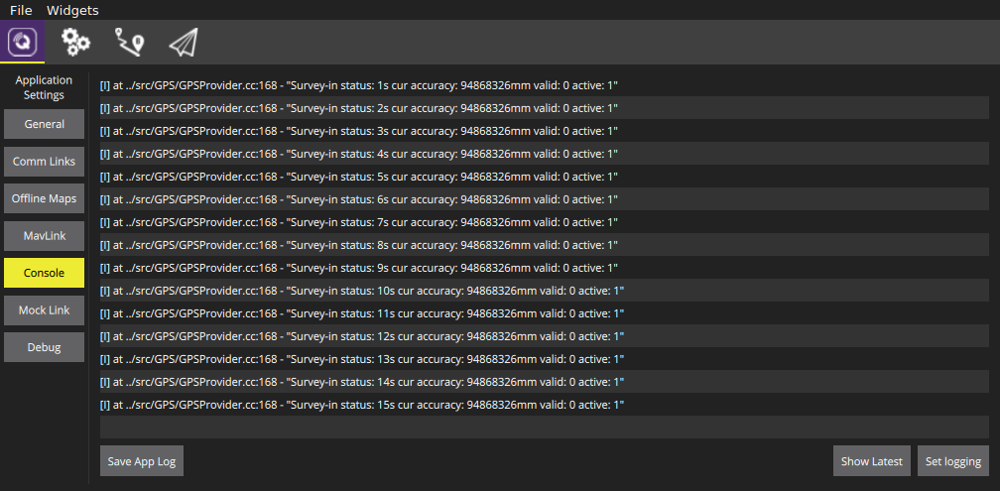
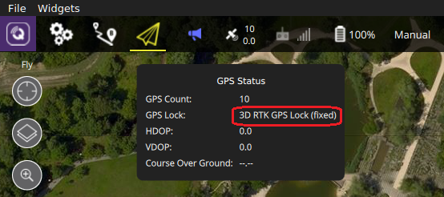

# RTK GPS

RTK (Real Time Kinematik) increases the GPS accuracy to a
centimeter-level. PX4 supports RTK GPS using the 
[u-blox M8P](https://www.u-blox.com/en/product/neo-m8p) 
GPS device. This page describes the required setup.

You will need:

- A pair of u-blox M8P GPS devices
- A laptop/PC with QGroundControl (mobile devices are not yet supported)
- A vehicle with a WiFi link to the laptop (for example Pixracer)

We always tested with a WiFi link to ensure there is enough bandwith. It
might also be possible to use a telemetry link.

## Setup & Usage

The base GPS device needs to be in a fixed position while it is used. So
make sure it is in a position where it is not moved and with a clear
view to the sky, not close to a building. Preferably, it should be
elevated (for example with a tripod, or on a roof). Compared to normal
GPS, RTK is more sensitive and needs a careful setup.

First start QGroundControl and attach the base GPS via USB to the
Laptop. The GPS is recognized automatically. Switch to the console
window output and you should see an update each second (see the image
below). If you started QGroundControl via console, you should see the
status update there as well (if not, make sure the autoconnect to RTK
GPS option is checked in the general application settings).

What you see is the status of the survey-in process. This is a startup
procedure to get an accurate position estimate of the base station. It's
configured to run at least 3 minutes and it must reach an accuracy of 1
meter. The current accuracy is printed to the console. It takes several
minutes to complete, depending on the GPS signal reception.

While survey-in is running you can already start the vehicle and make
sure it connects to QGroundControl. No further setup on the vehicle is
required. Once the survey-in process is finished, QGroundControl
automatically starts to send the RTCM correction data to the vehicle.
After a while it should switch to RTK mode, which is visible in the GPS
status (3D RTK GPS Lock):

There are two RTK modes: Float and Fixed. While the Float mode is easier
to reach, it is a bit less accurate than Fixed mode (further
explanations are for example
[here](http://www.ehow.com/info_12245568_difference-between-rtk-fix-rtk-float.html)).
The system will automatically switch to Fixed mode when the signal is
good enough.

Now you can start to fly!

You may also need to tune some parameters. The default parameters are
tuned assuming a GPS accuracy in the order of meters, not centimeters.

## Video Demonstration


https://youtu.be/en_a5XBx2vU


(Video credits to Michael Ammann)

