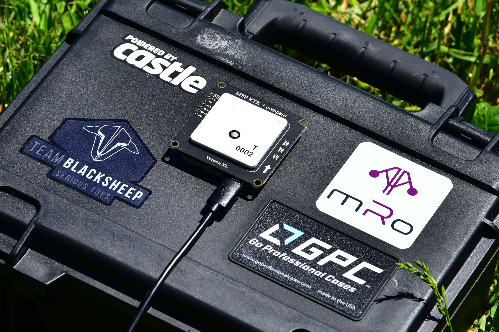

# RTK GPS

RTK (Real Time Kinematik) increases the GPS accuracy to a
centimeter-level. PX4 supports RTK GPS using the 
[u-blox M8P](https://www.u-blox.com/en/product/neo-m8p) 
GPS device. This page describes the required setup.

You will need:

- A pair of u-blox M8P GPS devices (see below)
- A laptop/PC with QGroundControl (mobile devices are not yet supported)
- A vehicle with a WiFi or Telemetry link to the laptop (for example using
  Pixracer or Pixhawk 3 Pro)

## GPS Devices
The following are two example GPS devices that can be used with PX4.

### Drotek XL RTK

Buy online : [Drotek XL RTK](https://drotek.com/shop/en/home/792-xl-rtk-gps-neo-m8p-rover.html)

### HEX/ProfiCNC Here+

Buy online : [Here+ RTK GNSS](http://www.hex.aero/shop/all/here-rtk-gnss-set/)

## Setup & Usage

We successfully tested with a WiFi link (ESP8266 on a Pixracer) and a 3DR
Telemetry link between the Laptop and the vehicle. When using a telemetry
module, it is crucial to use mavlink version 2 and an up-to-date firmware on the
telemetry device. The mavlink version can be enforced by setting the parameter
`MAV_PROTO_VER` to 2 and the telemetry can be updated with
[QGC](https://docs.qgroundcontrol.com/en/SetupView/Firmware.html).

The base GPS device which is connected to the Laptop, needs to be in a
fixed position while it is used. So
make sure it is in a position where it is not moved and with a clear
view to the sky, not close to a building. Preferably, it should be
elevated (for example with a tripod, or on a roof). Compared to normal
GPS, RTK is more sensitive and needs a careful setup.

First start QGroundControl and attach the base GPS via USB to the
Laptop. The GPS is recognized automatically. Also start the vehicle and make
sure it is connected to QGC. QGC will then show an additional GPS icon with the
status of the base GPS:

What you see is the status of the survey-in process. This is a startup
procedure to get an accurate position estimate of the base station, by taking
many measurements over time. You can see that the accuracy converges towards 0.
The process ends after a minimum amount of seconds passed and a certain accuracy
is reached. Both of these can be changed on the QGC configuration page.

After the process is completed (it takes several minutes), the GPS icon changes
to white and QGC starts to stream RTCM data to the vehicle:

No further configuration on the vehicle is necessary.
After a while it should switch to RTK mode, which is visible in the GPS
status (3D RTK GPS Lock) of the vehicle:

There are two RTK modes: Float and Fixed. While the Float mode is easier
to reach, it is a bit less accurate than Fixed mode (further
explanations are for example
[here](http://www.ehow.com/info_12245568_difference-between-rtk-fix-rtk-float.html)).
The system will automatically switch to Fixed mode when the signal is
good enough.

Now you can start to fly!

You may also need to tune some parameters. The default parameters are
tuned assuming a GPS accuracy in the order of meters, not centimeters. For
example, you can decrease `EKF2_GPS_V_NOISE` and `EKF2_GPS_P_NOISE` to 0.2.

## Video Demonstration


https://youtu.be/en_a5XBx2vU


(Video credits to Michael Ammann)

## Example Vehicle Setup

[This page](https://dev.px4.io/en/airframes_multicopter/dji_flamewheel_450.html)
describes an airframe setup with the Here+ RTK and a Pixhawk 3 Pro.

