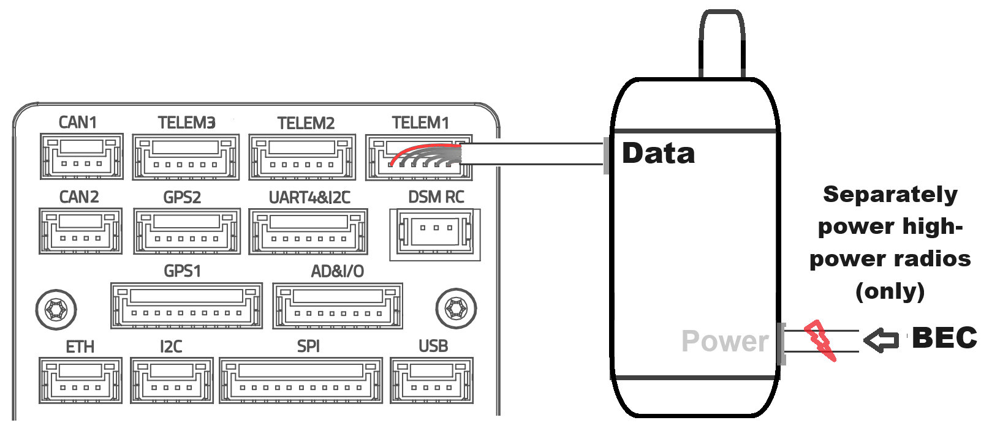

This topic provides basic instructions and links showing how to connect and assemble the core components of a typical unmanned system (UAS) running PX4.

The instructions are focussed on systems that use [Pixhawk-series](../flight_controller/pixhawk_series.md) flight controllers, and in particular those that have adopted the [Pixhawk connector standard](https://github.com/pixhawk/Pixhawk-Standards/blob/master/DS-009%20Pixhawk%20Connector%20Standard.pdf).
For these flight controllers, much of the "wiring up" is as simple as connecting the components into the appropriately labelled ports using supplied cables.

Note that there are also [flight controller-specific guides](#flight-controller-specific-assembly-guides).

::: info If your FC does not use the connector standard ...
If your flight controller has not adopted the connector standard then you should review [flight controller-specific](#flight-controller-specific-assembly-guides) and manufacturer-specific setup guides.

Pixhawk series flight controllers that don't follow the connector standard will often provide cables for interconnecting with pixhawk standard components.
For other controllers you may need to manually create cables and connectors.
:::

## Flight Controller Overview

The images below show Pixhawk v6x flight controllers (FC) from CUAV and Holybro.
Their available ports are very similar because they are both [Pixhawk standard autopilots](../flight_controller/autopilot_pixhawk_standard.md) that have adopted the [Pixhawk connector standard](https://github.com/pixhawk/Pixhawk-Standards/blob/master/DS-009%20Pixhawk%20Connector%20Standard.pdf).

The connector standard ports are listed below, along with their labels on each of the FCs, and what they are used for.
As both FCs have much the same ports with similar names, core peripherals are connected in the same way.

| Standard                    | Holybro       | CUAV                | Connect to ...                                               |
| --------------------------- | ------------- | ------------------- | ------------------------------------------------------------ |
| Full GPS plus Safety Switch | GPS1          | GPS&SAFETY          | Primary GPS (gps, compass, safety switch, buzzer, LED)       |
| Basic GPS                   | GPS2          | GPS2                | Secondary GPS (GPS/compass)                                  |
| CAN                         | CAN1/CAN2     | CAN1/CAN2           | DroneCAN devices, such as GNSS modules, motors, etc          |
| Telemetry                   | TELEM (1,2,3) | TELEM (1,2,3)       | Telemetry radios, companion computers, MAVLink cameras, etc. |
| Analog Power                | POWER (1,2)   | POWER (1,2)         | SMbus (I2C) power modules                                    |
| I2C                         | I2C           | None                | Other I2C peripherals                                        |
| SPI                         | SPI           | SPI6                | SPI devices (note: 11 pin, not 6 as in standard)             |
| PX4 Debug Full              | FMU DEBUG     | FMU DEBUG, IO DEBUG | Debugging on Pixhawk "x" FCs                                 |
| Pixhawk Debug Mini          | None          | None                | Debugging on other Pixhawk variants                          |

There are some other similarities that are not part of the standard: they both have the same ethernet port (`ETH`), `SBUS OUT`, `AD&IO`, `USB`, USB-C.

There are also some important differences, most particularly in the way that the various RC Control protocols and PWM output are connected.
We'll go into those in the relevant sections.

::: tip
Remove power from the flight controller before connecting peripherals!
This is "best practice", even if it is not strictly necessary in all cases.
:::

## Mount and Orient Controller

The flight controller should ideally be [mounted on the frame](../assembly/mount_and_orient_controller.md) as close to your vehicle’s center of gravity as possible, oriented top-side up with the arrow pointing towards the front of the vehicle.

::: info
If the controller cannot be mounted in the recommended/default orientation (e.g. due to space constraints) you will need to configure the autopilot software with the orientation that you actually used: [Flight Controller Orientation](../config/flight_controller_orientation.md).
:::

To reduce the impact of vibration on the flight controllers internal IMU(s) and gyroscope(s) you should mount the controller using mounting foam if provided, and otherwise follow manufacturer guidance.

## GNSS/Compass (+ Buzzer + Safety Switch + LED)

A [GNSS/Compass module](../gps_compass/#supported-gnss), which usually incorporates a [buzzer](../getting_started/px4_basic_concepts.md#buzzer), [safety switch](../getting_started/px4_basic_concepts.md#safety-switch), and [UI LED](../getting_started/led_meanings.md#ui-led), is connected to the flight controller 10-Pin JST GH connector labeled `GPS1` or `GPS&SAFETY`.
A second GPS/compass module, if present, is attached to the 6-pin GPS port labeled `GPS2`.

[DroneCan](../dronecan/index.md) GNSS/Compass modules are connected CAN bus ports, which usually labeled `CAN1` and `CAN2`.

All GNSS/Compass modules [should be mounted on the frame](../assembly/mount_gps_compass.md) as far away from other electronics as possible, with the direction marker pointing towards the front of the vehicle (separating the compass from other electronics will reduce interference).

::: details
The Pixhawk connector standard 10-pin _Full GPS plus Safety Switch Port_ is intended for connecting the primary GNSS.
It includes a UART port for the GNSS, and I2C port for the Compass, and pins for the [buzzer](../getting_started/px4_basic_concepts.md#buzzer), [safety switch](../getting_started/px4_basic_concepts.md#safety-switch), and [UI LED](../getting_started/led_meanings.md#ui-led).
PX4 configures this UART for use as the primary GPS by default.

The 6-pin _Basic GPS Port_, if present, includes only a UART and I2C port.
PX4 may not configure this as the secondary GPS port.
You can check/configure it yourself by following the instructions in [Serial Port Configuration.](../peripherals/serial_configuration.md).

You can use other UART ports for connecting to this kind of GPS module, but you may need to wire an appropriate cable, and port must be configured using the linked instructions.
You can also use another I2C port for connecting a magnetometer that is either standalone or part of a GNSS/compass module.
:::

For more connection and configuration information see:

- [GNSS/Compass module](../gps_compass/#supported-gnss) — Supported modules + UART GNSS module connection and configuration.
- [DroneCan](../dronecan/index.md) — List of CAN GNSS + connection and configuration guide
- [RTK GNSS](../gps_compass/rtk_gps.md) — GNSS with centimetre accuracy

<!-- https://discord.com/channels/1022170275984457759/1022185721450213396/threads/1245295551784681512 -->

## Radio Control (Optional)

A [Remote Control (RC) system](../getting_started/rc_transmitter_receiver.md) can be used to manually control a UAS.
A system consists of a vehicle-based radio receiver connected to the flight controller, and a ground-based radio transmitter that is integrated into a handheld controller.

::: tip
RC systems are essential when bringing up a new airframe, and highly recommended for other low-latency manual flight use cases.
PX4 does not _require_ a manual controller for autonomous flight modes.
:::

[Remote Control Transmitters & Receivers](../getting_started/rc_transmitter_receiver.md) explains how to select and bind a compatible transmitter/receiver.

The [Connecting Receivers](../getting_started/rc_transmitter_receiver.md#connecting-receivers) section explains how to identify the port to connect your particular receiver.
Generally the correct port is easy to infer from the labels on the flight controller:

- Spektrum/DSM receivers usually connect to an input that includes `DSM` in the label, such as: `DSM`, `DSM/SBUS RC`, `DSM RC`, `DSM/SBUS/RSSI` .
- PPM or SBUS receivers connect to the RC input, which is most commonly labeled `RC IN`, but may be a port with `SBUS` or `PPM` in the label.
- Pixhawk flight controllers usually come with cables for connecting to the common RC receiver types.

## Telemetry Radios (Optional)

[Telemetry radios](../telemetry/index.md) can be used by [ground control stations](../getting_started/px4_basic_concepts.md#ground-control-stations) (GCS) to communicate with vehicles in flight.
A GCS allows you to monitor and control the UAS via a graphical interface, edit, upload, and run missions, view video from a connected camera, capture video and images, and so on.

Connect the vehicle-based radio to the `TELEM1` port as shown below.
The other radio is connected to your ground station computer or mobile device (usually by USB).

Low-power telemetry radios are powered from the port, and generally no further configuration should be required.

If using higher power/range radios you will need to separately power the radio from a BEC and modify the telemetry port data rates.
You may also need to configure the radio itself — check radio-specific documentation for configuration information.

::: details

- `TELEM1` is configured for the typical data rates of low power radios such as [SIK Radios](../telemetry/sik_radio.md).
- If you're using a radio that supports higher data rates, then you may want to modify the [serial port configuration](../peripherals/serial_configuration.md) as covered in PX4 and manufacturer documentation.
- Low power radios such as most [SIK Radios](../telemetry/sik_radio.md) and [Wifi telemetry radios](../telemetry/telemetry_wifi.md) with around 300m range are powered from the flight controller.
- High powered radios like the [Microhard Serial radio](../telemetry/microhard_serial.md) will need to be separately powered and may need to be configured (see the PX4 and manufacturer documentation).
- You can also attach telemetry radios to the `TELEM2` and `TELEM3` telemetry ports (if present).
  Note however that `TELEM2` is configured by default for connecting to a companion computer, and might need to be [reconfigured](../peripherals/mavlink_peripherals.md) to connect to a ground station.
  :::

## SD Card

SD cards are highly recommended.
Among other things they are required for [recording and analyzing flight details](../getting_started/flight_reporting.md) and using DroneCan/UAVCAN bus hardware.
A SD card is factory-installed on many flight controllers, but you should check the documentation for your FC.

:::tip
For more information see [Basic Concepts > SD Cards (Removable Memory)](../getting_started/px4_basic_concepts.md#sd-cards-removable-memory).
:::

## Powering the Flight Controller

Pixhawk flight controllers require a regulated power supply that is sufficient to power the controller itself and a few low-power peripherals, such as a GNSS module, RC transmitter, and low power telemetry radio.

Flight controller manufacturers usually recommend suitable [power modules](../power_module/index.md) for powering the FC and providing measurements of the battery voltage and total current — which PX4 can use to estimate power levels.
The power module is connected to the FC power port, which is normally labeled `POWER` (or `POWER 1` or `POWER 2` for FCs that have redundant power supply).

The diagram below shows what this might look like.

::: info
Flight controllers may also/instead use digital power ports that provide power information via the CAN bus.
For example, the CUAV Pixhawk 6x also has the digital power ports `POWER C1` and `POWER C2`.
:::

The power module is supplied by the battery, and has separate connectors to power the FC and another to power all other hardware such as motors, servos, payloads, and even high power radios.

In order to simplify wiring up the rest of the system you may choose to use a _power distribution board (PDB)_.
This may include a power module, ESCs for controlling motors, a BEC (battery elimination circuit) for supplying servos and other peripherals.

You don't have to use manufacturer-recommended PDB or power modules, but you should check whatever solution you use matches the flight controller power requirements.

## Other Peripherals

The wiring and configuration of optional/less common components is covered within the [Hardware Hardware Selection & Setup](../hardware/drone_parts.md) topics for individual peripherals.

## Build Tutorials

Assembly of the autopilot system on a specific vehicle frame depends on the actual hardware you are using, including size, geometry, materials, attachment points, and the components that are used.
This cannot be captured in a single generic set of instructions.

Instead we've provided links to specific examples of how this might be done in the build tutorials linked below.
These show end-to-end setup and configuration of a number of vehicles.

- [Kits](../frames_multicopter/kits.md)
- [DIY Builds](../frames_multicopter/diy_builds.md)

- [DIY Builds](../frames_plane/diy_builds.md)

- [Standard VTOL](../frames_vtol/standardvtol.md)
- [Tailsitter VTOL](../frames_vtol/tailsitter.md)
- [Tiltrotor VTOL](../frames_vtol/tiltrotor.md)

Other frames:

- [Airframe Builds](../airframes/index.md) for complete assembly examples on different vehicle frames.

## Flight Controller Specific Assembly Guides

::: tip
The manufacturer documentation for your [flight controller](../flight_controller/index.md) may include guides for controllers that are not listed below, or that are more up-to-date than the following guides.
:::

These guides explain how to connect the core components of the autopilot system "off the frame" for a number of popular [flight controllers](../flight_controller/index.md).
They recommend sensors, power systems, and other components from the same manufacturer.

- [CUAV Pixhawk V6X Wiring QuickStart](../assembly/quick_start_cuav_pixhawk_v6x.md)
- [CUAV V5+ Wiring Quickstart](../assembly/quick_start_cuav_v5_plus.md)
- [CUAV V5 nano Wiring Quickstart](../assembly/quick_start_cuav_v5_nano.md)
- [Holybro Pixhawk 6C Wiring Quickstart](../assembly/quick_start_pixhawk6c.md)
- [Holybro Pixhawk 6X Wiring Quickstart](../assembly/quick_start_pixhawk6x.md)
- [Holybro Pixhawk 5X Wiring Quickstart](../assembly/quick_start_pixhawk5x.md)
- [Holybro Pixhawk 4 Wiring Quickstart](../assembly/quick_start_pixhawk4.md)
- [Holybro Pixhawk 4 Mini (Discontinued) Wiring Quickstart](../assembly/quick_start_pixhawk4_mini.md)
- [Holybro Durandal Wiring Quickstart](../assembly/quick_start_durandal.md)
- [Holybro Pix32 v5 Wiring Quickstart](../assembly/quick_start_holybro_pix32_v5.md)
- [Cube Wiring Quickstart](../assembly/quick_start_cube.md) (All cube variants)
- [Pixracer Wiring Quickstart](../assembly/quick_start_pixracer.md)
- [mRo (3DR) Pixhawk Wiring Quickstart](../assembly/quick_start_pixhawk.md)

## See Also

- [Drone Components & Parts](../getting_started/px4_basic_concepts.md#drone-components-parts) (Basic Concepts)
- [Payloads](../getting_started/px4_basic_concepts.md#payloads) (Basic Concepts)
- [Hardware Selection & Setup](../hardware/drone_parts.md) — information about connecting and configuring specific flight controllers, sensors and other peripherals (e.g. airspeed sensor for planes).
  - [Mounting the Flight Controller](../assembly/mount_and_orient_controller.md)
  - [Vibration Isolation](../assembly/vibration_isolation.md)
  - [Mounting a Compass](../assembly/mount_gps_compass.md)

::: info
The and sections of [PX4 Basic Concepts](../getting_started/px4_basic_concepts.md) provide a broad overview of the main drone components.
[Hardware Selection & Setup](../hardware/drone_parts.md) contains details about specific hardware, including selection, assembly, and configuration.
:::

- [Multicopter Racer Setup](../config_mc/racer_setup.md) — racer-specific assembly and configuration information (racers don't have GPS module)

