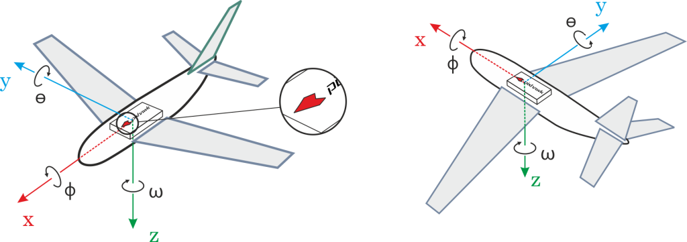

# Mounting the Flight Controller

## Orientation

Almost all Flight Controllers have a *heading mark arrow* (shown below). The controller should be placed on the frame top-side up, oriented so that the arrow points towards the front of the vehicle (on all aircraft frames - airplane, multirotor, VTOL, ground vehicles etc.)

> **Note** If the controller cannot be mounted in the recommended/default orientation (e.g. due to physical constraints) you will need to configure the autopilot software with the orientation that you actually used: [Flight Controller Orientation](../config/flight_controller_orientation.md).

## Vibration damping

Flight Control boards with in-built accelerometers are sensitive to vibrations. Some boards include in-built vibration-damping, while in other cases the boards come with vibration damping foam that you can use to isolate the controller from the vehicle.

 - Pixhawk vibration damping foam

You should use the vibration damping/mounting strategy recommended in your flight controller documentation.

