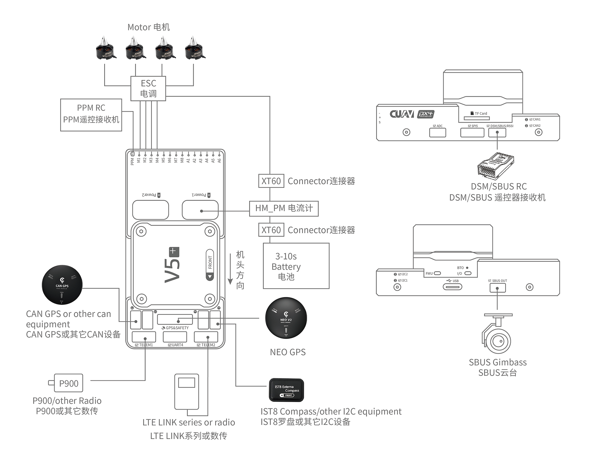
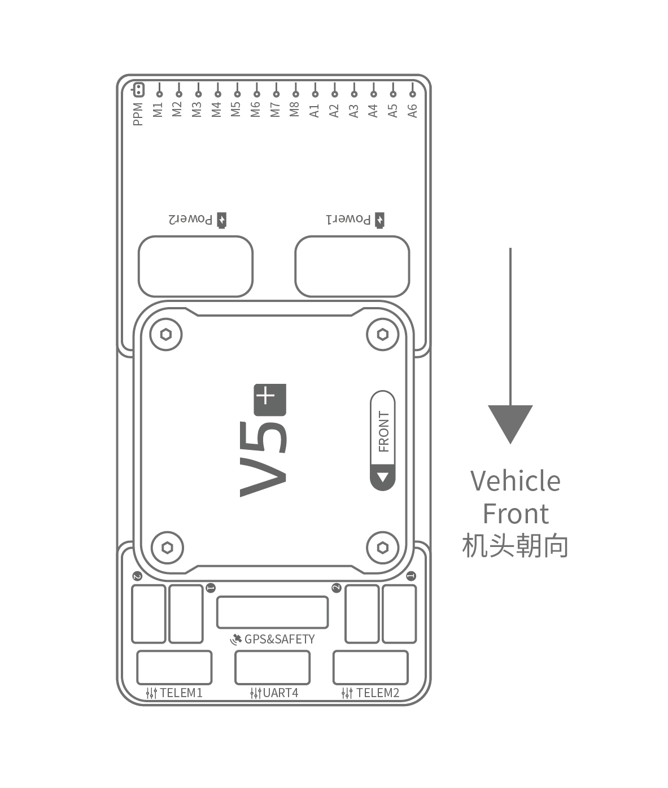
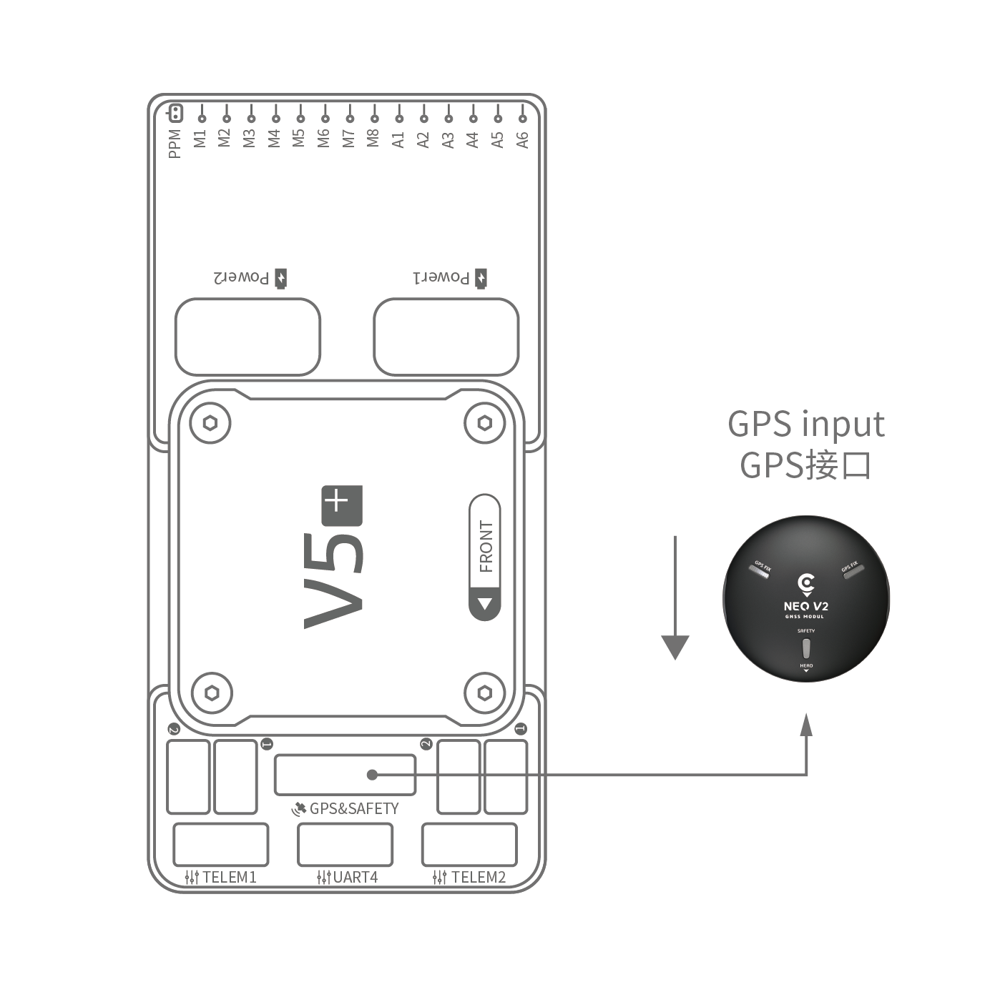
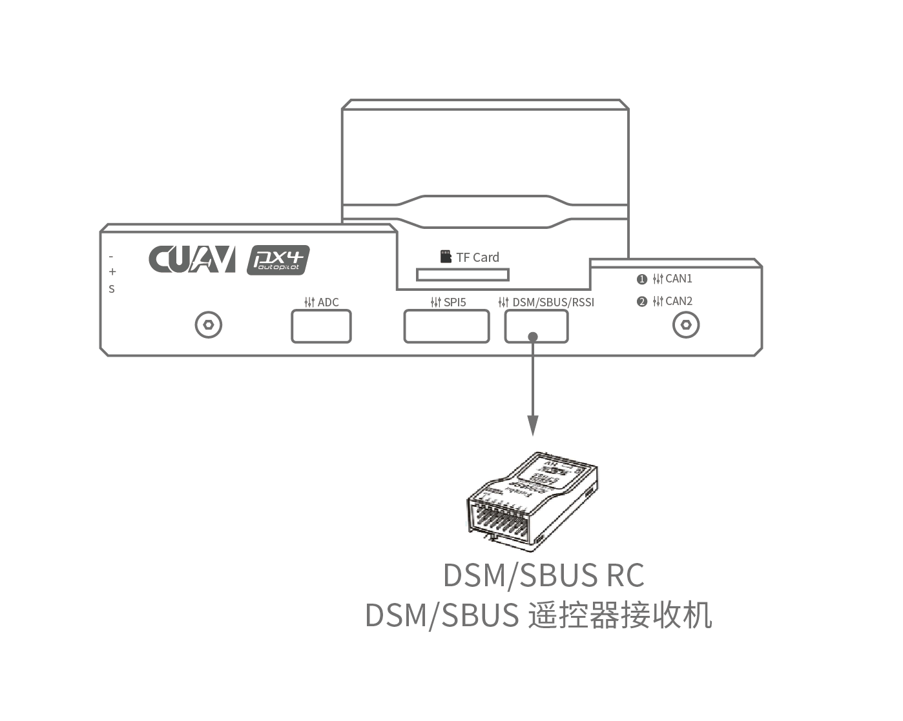
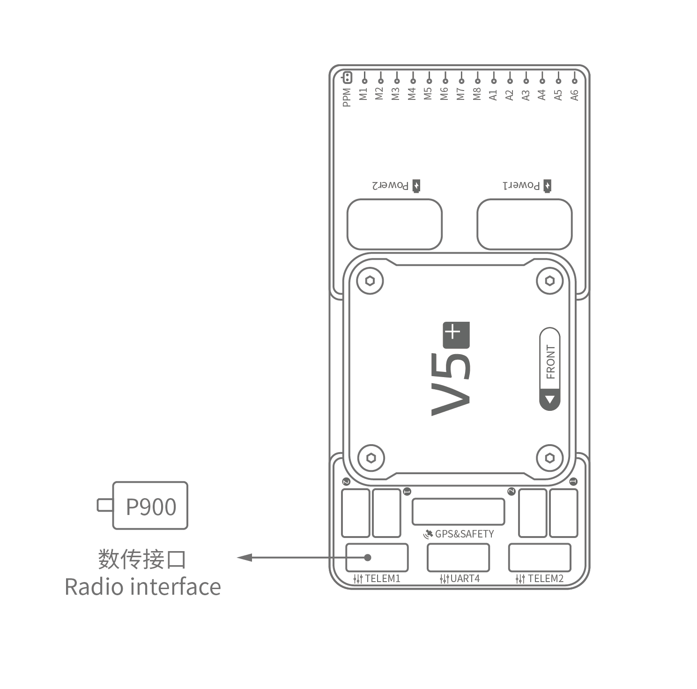
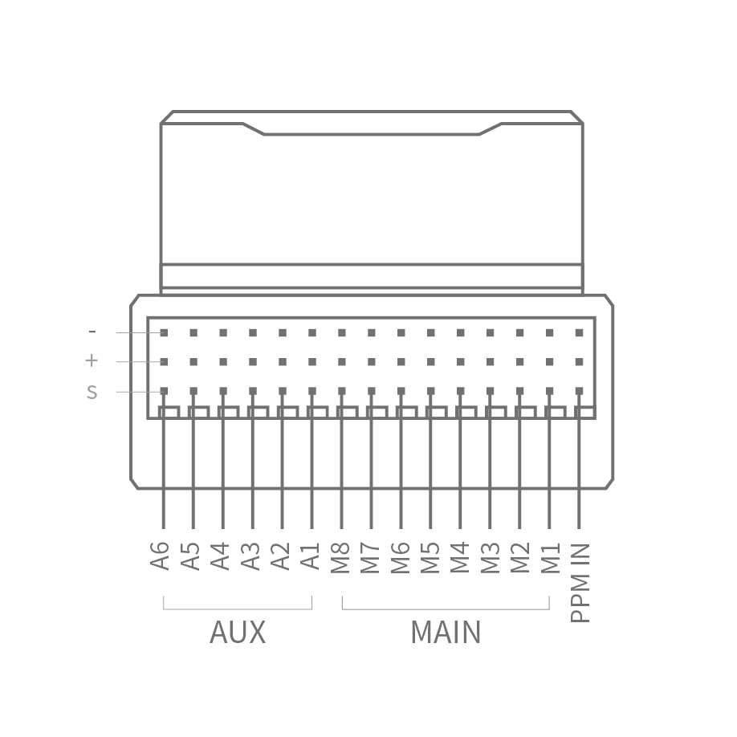

# CUAV V5+ Wiring Quick Start

---

This quick start guide shows how to power the CUAV V5+ flight controller and connect its most important peripherals。
 

## Wiring Chart Overview

The image below shows how to connect the most important sensors and peripherals (except the motor and servo outputs). We'll go through each of these in detail in the following sections.

| Main interface | **Function** |
| :--- | :--- |
| POWER1 | Connect Power  module;  power input & AD voltage  and current detection |
| POWER2 | Connect i2c smart battery|
| TF CARD |Insert SD card for log storage|
| M1~M8 | PWM outputs，Can be used to control motors or servos |
| A1~A8| PWM outputs，Can be used to control motors or servos |
| DSU7|Used for FMU debug, reading debug information |
| I2C1/I2C2 | Connect an I2C device such as an external compass |
| CAN1/CAN2| Connect UAVCAN devices such as CAN GPS  |
| TYPE-C\(USB\)| Connect to a computer for communication between the flight controller and the computer, such as loading firmware |
| SBUS OUT|Connect sbus camera Gimbass |
| GPS&SAFETY |Connect to Neo Gps, which includes GPS, safety switch, buzzer interface |
| TELEM1/TELME2| Connect to the Telemetry System |
| DSM/SBUS/RSSI | Includes DSM, SBUS, RSSI signal input interface, DSM interface can be connected to DSM satellite receiver, SBUS interface to SBUS remote control receiver, RSSI for signal strength return module

> **NOTE**For more interface information, please read [CUAV V5+ Manual](http://manual.cuav.net/V5-Plus.pdf).

> **NOTE** If the controller cannot be mounted in the recommended/default orientation (e.g. due to space constraints) you willneed to configure the autopilot software with the orientation that you actually used:[light Controller Orientation](https://docs.px4.io/en/advanced_features/rtk-gps.html).

## GPS + Compass + Safety Switch + LED 

The recommended GPS modules are the neo v2 GPS, It contains GPS, compass, safety switch, buzzer, LED status light.
The GPS/Compass module should be mounted on the frame as far away from other electronics as possible, with the direction marker towards the front of the vehicle (NEO GPS arrow is in the same direction as the flight control arrow). Connect to the flight control GPS interface using a cable.
> **NOTE**If you use CAN GPS, please use the cable to connect to the flight control CAN interface.。

## Safety Switch 

The dedicated safety switch that comes with the V5+ is only required if you are not using the recommended NEO GPS (which has an inbuilt safety switch).
If you are flying without the GPS you must attach the switch directly to the  GPS1  port in order to be able to arm the vehicle and fly (If you use the old 6-pin GPS, please read the definition of the bottom interface to change the line.).

## Buzzer

If you do not use the recommended  GPS, there may be problems with the buzzer not working. You may need to add an external buzzer instead.

## Radio Control 

A remote control (RC) radio system is required if you want to manually control your vehicle (PX4 does not require a radio system for autonomous flight modes). 
You will need to select a compatible transmitter/receiver and then bind them so that they communicate (read the instructions that come with your specific transmitter/receiver).

The figure below shows how you can access your remote receiver (please find the sbus cable in the kit).

## Spektrum Satellite Receivers

The CUAV V5+ has a dedicated DSM cable. The Spektrum satellite receiver should be connected to the flight control DSM/SBUS/RSSI interface.

## Power

The CUAV V5+ kit includes HV\_PM, which supports 2~10s lipo battery. Please connect the 6pin connector of the HW\_PM module to the flight control power1 interface.

## Telemetry System (Optional) 

A telemetry system allows you to communicate with, monitor, and control a vehicle in flight from a ground station (for example, you can direct the UAV to a particular position, or upload a new mission).

The communication channel is via Telemetry Radios. The vehicle-based radio should be connected to the **TELEM1/TELEM2** port (if connected to this port, no further configuration is required). The other radio is connected to your ground station computer or mobile device (usually via USB).

## SD Car(Optional)

The factory has completed inserting the sd card, you do not need to operate.

## Motors

Motors/servos are connected to the MAIN and AUX ports in the order specified for your vehicle in the Airframe Reference. 

## Pinouts{#pinouts}

Download **CUAV V5+** pinouts from [here](http://manual.cuav.net/V5-Plus.pdf).

