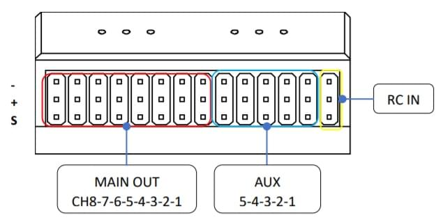

# Durandal Wiring Quick Start

This quick start guide shows how to power the Holybro [Durandal](../flight_controller/durandal.md)&reg; flight controller and connect its most important peripherals.

## Unboxing

Durandal is sold bundled with a number of different combinations of accessories, including power modules: *PM02 V3* and *PM07*, and the *Pixhawk 4 GPS/Compass* (UBLOX NEO-M8N).

The content of the box with the *PM02 V3* power module is shown below.
This includes a pinout guide and power module instructions.

The unpacked components, including cables, are:

## Wiring Chart Overview

The image below shows how to connect the most important sensors and peripherals (except the motor and servo outputs).
We'll go through each of these in detail in the following sections.

> **Tip** More information about available ports can be found here: [Durandal > Pinouts](../flight_controller/durandal.md#pinouts).

## Mount and Orient Controller

*Durandal* should be mounted on the frame using vibration-damping foam pads (included in the kit).
It should be positioned as close to your vehicle’s center of gravity as possible, oriented top-side up with the arrow pointing towards the front of the vehicle.

> **Note** If the controller cannot be mounted in the recommended/default orientation (e.g. due to space constraints) you will need to configure the autopilot software with the orientation that you actually used: [Flight Controller Orientation](../config/flight_controller_orientation.md).

## GPS + Compass + Buzzer + Safety Switch + LED

Durandal is designed to work well with the *Pixhawk 4 GPS module*, which has an integrated compass, safety switch, buzzer and LED.
It connects directly to the [GPS port](../flight_controller/durandal.md#gps) using the 10 pin cable.

<!-- Confirm how compass delivery works - separate or in the package? -->

The GPS/Compass should be mounted on the frame as far away from other electronics as possible, with the direction marker towards the front of the vehicle (separating the compass from other electronics will reduce interference).

 

> **Note** The GPS module's integrated safety switch is enabled *by default* (when enabled, PX4 will not let you arm the vehicle).
  To disable the safety press and hold the safety switch for 1 second.
  You can press the safety switch again to enable safety and disarm the vehicle (this can be useful if, for whatever reason, you are unable to disarm the vehicle from your remote control or ground station).

## Power

You can use a power module or power distribution board to power motors/servos and measure power consumption. 

### PM02 v3 Power Module

The *PM02 v3* power module that can be bundled with *Durandal* has the following characteristics/limits:
- Max input voltage: 60V
- Max current sensing: 120A Voltage
- Current measurement configured for SV ADC Switching regulator outputs 5.2V and 3A max 
- Weight: 20g 
- Package includes: 
  - PM02 board
  - 6pin MLX cable (1)
  - 6pin GH cable (1) 

Connect the output of the *Power Module* that comes with the kit to one of the Durandal [POWER](../flight_controller/durandal.md#power) ports using the 6-wire GH cable.

The PM input **2~12S** will be connected to your LiPo battery.

The PM output should be connected to TBD

<!-- 

> **Note** The 8 pin power (+) rail of **MAIN/AUX** is not powered by the power module. 
  If it will need to be separately powered in order to drive servos for rudders, elevons etc.
  To do this, the power rail needs to be connected to a BEC equipped ESC or a standalone 5V BEC or a 2S LiPo battery.
  Be careful with the voltage of servo you are going to use.

The pinout of *Pixhawk 4*’s power ports is shown below. 
The CURRENT signal should carry an analog voltage from 0-3.3V for 0-120A as default. 
The VOLTAGE signal should carry an analog voltage from 0-3.3V for 0-60V as default. 
The VCC lines have to offer at least 3A continuous and should default to 5.1V. 
A lower voltage of 5V is still acceptable, but discouraged.
-->

<!-- Data sheet for AP says 18.1 voltage divider, 36 Amps/volt 

> **Note** Using the Power Module that comes with the kit you will need to configure the *Number of Cells* in the [Power Settings](https://docs.qgroundcontrol.com/en/SetupView/Power.html)
> but you won't need to calibrate the *voltage divider*.
> You will have to update the *voltage divider* if you are using any other power module (e.g. the one from the Pixracer).

-->

## Radio Control

A remote control (RC) radio system is required if you want to *manually* control your vehicle (PX4 does not require a radio system for autonomous flight modes). 

You will need to [select a compatible transmitter/receiver](../getting_started/rc_transmitter_receiver.md) and then *bind* them so that they communicate (read the instructions that come with your specific transmitter/receiver). 

The instructions below show how to connect the different types of receivers to *Durandal*:

- Spektrum/DSM receivers connect to the [DSM RC](../flight_controller/durandal.md#dsm-rc-port) input.
  
  

- PPM and S.Bus receivers connect to the [SBUS_IN/PPM_IN](../flight_controller/durandal.md#rc-in) input port (marked as RC IN, next to the MAIN/AUX inputs).
  
  

- PPM and PWM receivers that have an *individual wire for each channel* must connect to the **PPM RC** port *via a PPM encoder* [like this one](http://www.getfpv.com/radios/radio-accessories/holybro-ppm-encoder-module.html) (PPM-Sum receivers use a single signal wire for all channels).

For more information about selecting a radio system, receiver compatibility, and binding your transmitter/receiver pair, see: [Remote Control Transmitters & Receivers](../getting_started/rc_transmitter_receiver.md).

## Telemetry Radios (Optional)

Telemetry radios may be used to communicate and control a vehicle in flight from a ground station (for example, you can direct the UAV to a particular position, or upload a new mission).

The vehicle-based radio should be connected to the [TELEM1](../flight_controller/durandal.md#telem1_2_3) port as shown below using one of the 6-pos connectors (if connected to this port, no further configuration is required).
The other radio is connected to your ground station computer or mobile device (usually by USB).

## SD Card (Optional)

SD cards are most commonly used to [log and analyse flight details](../getting_started/flight_reporting.md).
Insert a card into the *Durandal* where indicated below.

> **Tip** The SanDisk Extreme U3 32GB is [highly recommended](https://dev.px4.io/master/en/log/logging.html#sd-cards) (Developer Guide).

## Motors

Motors/servos are connected to the **I/O PWM OUT** (**MAIN OUT**) and **FMU PWM OUT** (**AUX**) ports in the order specified for your vehicle in the [Airframe Reference](../airframes/airframe_reference.md). 

> **Note** This reference lists the output port to motor/servo mapping for all supported air and ground frames (if your frame is not listed in the reference then use a "generic" airframe of the correct type). 

> **Note** There are 5 AUX ports; you cannot use this flight controller for airframes that use AUX6, AUX7, AUX8 for motors or other critical flight controls.

## Other Peripherals

The wiring and configuration of optional/less common components is covered within the topics for individual [peripherals](../peripherals/README.md).

## Pinouts

[Durandal > Pinouts](../flight_controller/durandal.md#pinouts)

## Configuration

General configuration information is covered in: [Autopilot Configuration](../config/README.md).

QuadPlane specific configuration is covered here: [QuadPlane VTOL Configuration](../config_vtol/vtol_quad_configuration.md)

## Further information

- [Durandal Overview](../flight_controller/durandal.md)
- [Durandal Technical Data Sheet](http://www.holybro.com/manual/Durandal_technical_data_sheet.pdf) (Holybro)
- [Durandal Pinouts](http://www.holybro.com/manual/Durandal-Pinouts.pdf) (Holybro)