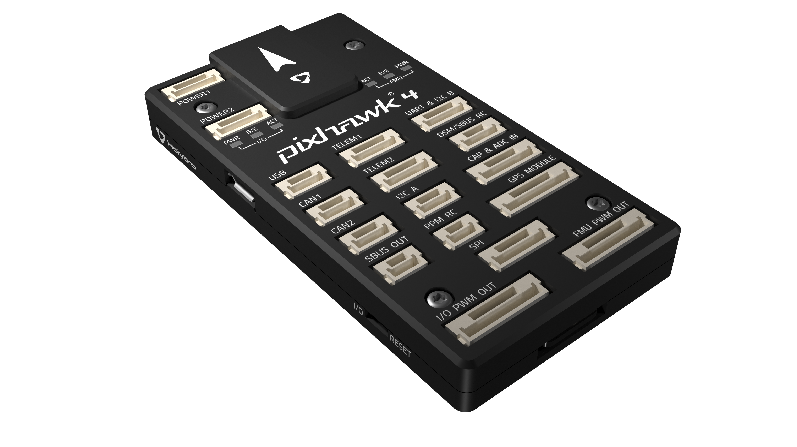
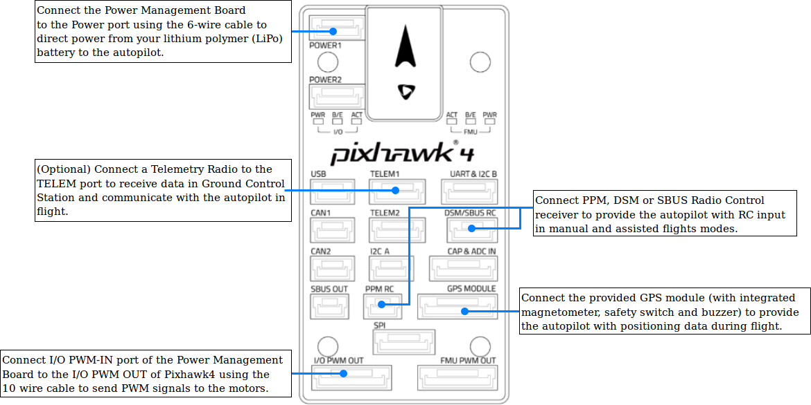
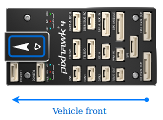
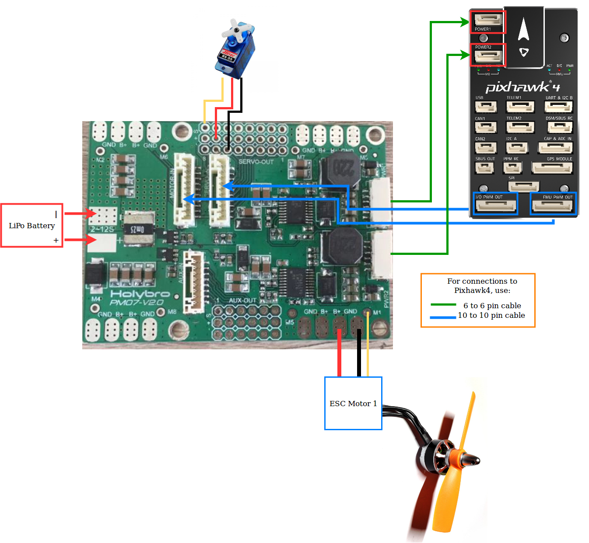
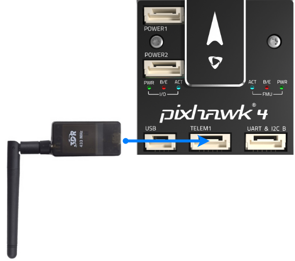

# Pixhawk 4 Wiring Quick Start

This quick start guide shows how to power the Pixhawk 4 flight controller and connect its most important peripherals.
  
 

## Wiring Chart Overview

The image below shows standard Pixhawk 4 connections (except the motor and servo outputs). We'll go through each main part in the following sections.

 
<!-- It would be good to have complete wiring diagram > **Note** More detailed wiring information is [shown below](#detailed-wiring-infographic-copter). -->

## Mount and Orient Controller

The *Pixhawk 4* should be mounted on the frame using vibration-damping foam pads (included in the kit). It should be positioned as close to your vehicle’s center of gravity as possible, oriented top-side up with the arrow pointing towards the front of the vehicle.

> **Note** If the controller cannot be mounted in the
  recommended/default orientation (e.g. due to space constraints) you will
  need to configure the autopilot software with the orientation that you
  actually used: [Flight Controller Orientation](../config/flight_controller_orientation.md).

## GPS + Compass + Buzzer + Safety Switch

Attach the provided GPS with integrated compass, safety switch and buzzer to the GPS port.

> **Note** The diagram shows a GPS with an integrated compass.  The GPS/Compass should be mounted on the frame as far away from other electronics as possible, with the direction marker towards the front of the vehicle (separating the compass from other electronics will reduce interference).

By default, if the safety switch is connected to the pixhawk, the safety is enabled. This means the autopilot will not let you arm the vehicle. To arm the vehicle, you have to press and hold the safety switch for 1 sec to disable safety. Similarly, if the vehicle is armed and something goes wrong such that you are unable to disarm the vehicle from QGC or RC, you can press the safety switch again to disarm and enable safety.

## Power

Connect the output of a Power Management Board (PM board) that comes with the kit to one of the **POWER** bricks of Pixhawk 4 using a 6-wire cable as shown. The PM input **2~12S** will be connected to your LiPo battery. The connections of Power Management Board, including power supply and signal connections to the ESCs and servos, are explained in the table below. Note that the PM board also supplies power to the servos via + and - pins of **FMU PWM-OUT**.

The image below shows the power management board provided with Pixhawk 4.

PIN&Connector | Function
--- | ---
I/O PWM-IN | connect to I/O PWM OUT port of Pixhawk4 using 10 to 10 pin cable
M1 | PWM OUT 1: connect signal wire to ESC of motor 1 here 
M2 | PWM OUT 2: connect signal wire to ESC of motor 2 here
M3 | PWM OUT 3: connect signal wire to ESC of motor 3 here
M4 | PWM OUT 4: connect signal wire to ESC of motor 4 here
M5 | PWM OUT 5: connect signal wire to ESC of motor 5 here
M6 | PWM OUT 6: connect signal wire to ESC of motor 6 here
M7 | PWM OUT 7: connect signal wire to ESC of motor 7 here
M8 | PWM OUT 8: connect signal wire to ESC of motor 8 here
FMU PWM-IN | connect to FMU PWM OUT port of Pixhawk4 using 10 to 10 pin cable
FMU PWM-OUT | FMU PWM output: connect signal wires to ESC or signal,+,- wires to servos here
CAP&ADC-OUT | connect to CAP & ADC IN port of Pixhawk4
CAP&ADC-IN | CAP&ADC input
B+ | connect to ESC B+ to power the ESC
GND | connect to ESC Ground
PWR1 | 5.3v output 3A, connect to Pixhawk4 POWER 1 using 6 to 6 pin cable
PWR2 | 5.3v output 3A, connect to Pixhawk4 POWER 2 using 6 to 6 pin cable
2~12S | Power Input, connect to 12S LiPo Battery

The pinout of Pixhawk 4’s power ports is shown below. The CURRENT signal should carry an analog voltage from 0-3.3V for 0-60A as default. For high-power units the range should be 0-3.3V for 0-120A. The VOLTAGE signal should carry an analog voltage from 0-3.3V for 0-50A as default. The VCC lines have to offer at least 2.5A continuous and should default to 5.3V. A lower voltage of 5V is still acceptable, but discouraged.

Pin | Signal | Volt
--- | --- | ---
1(red) | VCC | +5V
2(yellow) | VCC | +5V
3(blue) | CURRENT | +3.3V
4(white) | VOLTAGE | +3.3V
5(green) | GND | GND
6(black) | GND | GND

## Radio Control

A remote control (RC) radio system is required if you want to *manually* control your vehicle (PX4 does not require a radio system for autonomous flight modes). 

You will need to [select a compatible transmitter/receiver](../getting_started/rc_transmitter_receiver.md) and then *bind* them so that they communicate (read the instructions that come with your specific transmitter/receiver). 

The instructions below show how to connect the different types of receivers to Pixhawk 4:

- Spektrum/DSM or S.BUS receivers must connect to the **DSM/SBUS RC** input.
  
  

- PPM must connect to the **PPM RC** input port.
  
 

- PWM receivers must connect to the **PPM RC** input port via a PPM encoder [like this one](http://www.getfpv.com/radios/radio-accessories/holybro-ppm-encoder-module.html) (PPM receivers use a single signal wire for all channels, while PWM receivers have an individual wire for each channel).

For more information about selecting a radio system, receiver compatibility, and binding your transmitter/receiver pair, see: [Remote Control Transmitters & Receivers](../getting_started/rc_transmitter_receiver.md).

## Telemetry Radios (Optional)

Telemetry radios may be used to communicate and control a vehicle in flight from a ground station (for example, you can direct the UAV to a particular position, or upload a new mission). One radio must be connected to your vehicle as shown below. The other is connected to your ground station computer or mobile device (usually by USB).

<!-- what configuration is required once you've set up a radio) -->

## SD Card (Optional)

SD card is needed to upload missions in order to fly in mission mode and to log flight details which can be extracted after flight for analysing any issues faced during flight. Insert SD card in Pixhawk 4 as shown below.

<!-- what configuration is required once you've set up a radio) -->

## Motors

The mappings between I/O PWM OUT (referred as MAIN) / FMU PWM OUT (referred as AUX) output ports and motor/servos for all supported air and ground frames are listed in the [Airframe Reference](../airframes/airframe_reference.md).

> **Caution** The mapping is not consistent across frames (e.g. you can't rely on the throttle being on the same output for all plane frames). Make sure to use the correct mapping for your vehicle.

> **Tip** If your frame is not listed in the reference then use a "generic" airframe of the correct type.

## Other Peripherals

The wiring and configuration of other components is covered within the topics for individual [peripherals](../peripherals/README.md).

## Configuration

General configuration information is covered in: [Autopilot Configuration](../config/README.md).

QuadPlane specific configuration is covered here: [QuadPlane VTOL Configuration](../config_vtol/vtol_quad_configuration.md)

<!-- what about config of other vtol types and plane. Do the instructions in these ones above apply for tailsitters etc? -->

<!--## Detailed Wiring Infographic (Copter)

 -->

## Further information

- <!--[Pixhawk 4 Quick Start Guide (Holybro)]() Add link-->
- [Pixhawk 4](../flight_controller/pixhawk4.md)
- [Pixhawk project](https://pixhawk.org/modules/pixhawk4)
