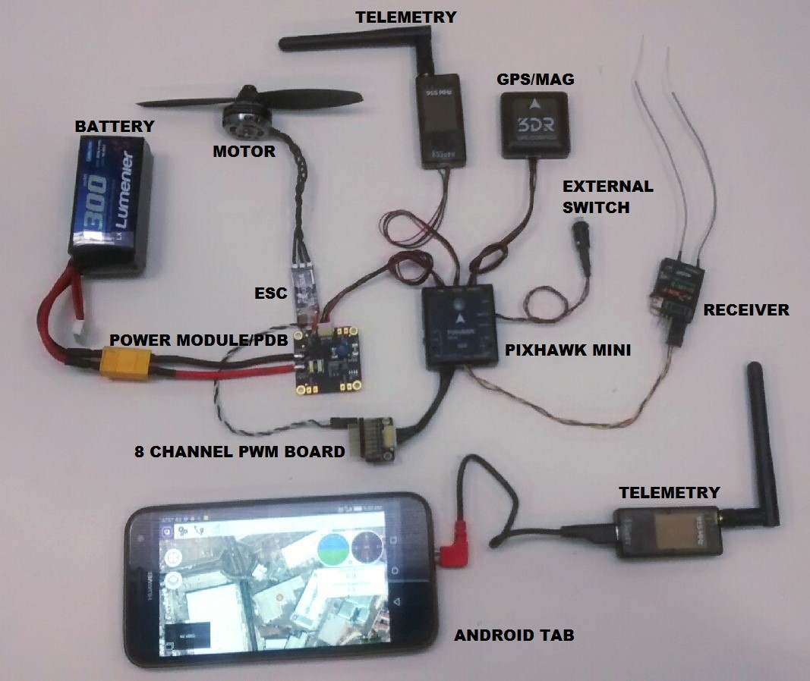
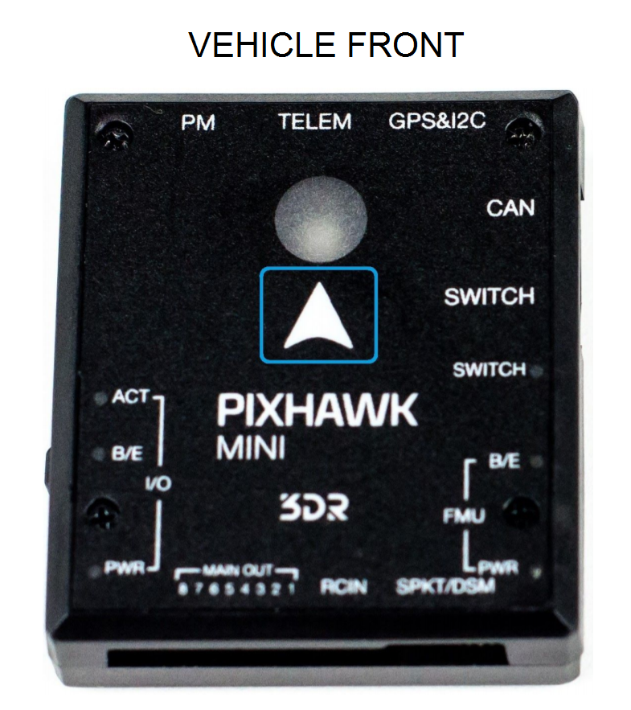
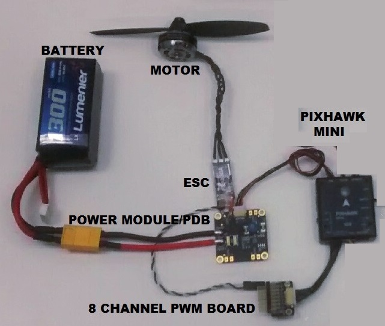
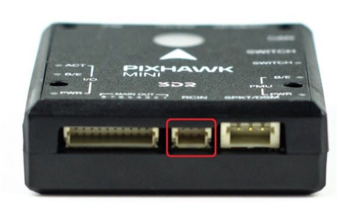

# Pixhawk Mini Wiring Quick Start

This quick start guide shows how power the [Pixhawk Mini](../flight_controller/pixhawk_mini.md) and connect its most important peripherals
(including output connections for copter, plane, and VTOL vehicles).

> **Warning** Under construction.

## Standard Wiring Chart

The image below shows standard *quadcopter* wiring using the *Pixhawk Mini
Kit* and 3DR Telemetry Radios (along with ESC, motor, battery and a
ground control station running on a phone). We'll go through each main part in the following sections.

 
> **Note** The output wiring/powering is slightly different for other types of vehicles. This is covered in more detail below for VTOL, Plane, Copter.

## Mount and Orient Controller

The *Pixhawk Mini* should be mounted on the frame using
vibration-damping foam pads (included in the kit). It should be
positioned as close to your vehicle’s center of gravity as possible, oriented top-side up 
with the arrow points towards the front of the vehicle.

> **Note** If the controller cannot be mounted in the
  recommended/default orientation (e.g. due to space constraints) you will
  need to configure the autopilot software with the orientation that you
  actually used: [Flight Controller Orientation](../config/flight_controller_orientation.md).

## GPS + Compass

Attach the 3DR GPS + Compass to the Pixhawk Mini's **GPS&I2C** port (top
right) using the supplied 6 pin cable. The GPS/Compass should be mounted
on the frame as far away from other electronics as possible, facing the
front of the vehicle (separating the compass from other electronics will
reduce interference).

NOTE - INSERT IMAGE SHOWING BOTH PORTS? OR FRONT-FACING image of GPS&I2C

[IN CALIBRATION, IS ORIENTATION TO VEHICLE FRONT or RELATIVE TO
PIXHAWK?]

The compass must be calibrated before it is first used. For more
information see: [COMPASS CALIBRATION LINK]

## Power

The image below shows typical power-supply wiring when using *Pixhawk
Mini* in a Quadcopter. This uses the *Quad Power Distribution
Board* that comes in the kit to supply both the Pixhawk Mini and the
ESC/Motor from the battery (and can also power other accessories).

> **Note** The *Quad Power Distribution Board* includes a power
  module (PM) that is suitable for batteries <= 4S. 
  The [3DR 10S Power Module](https://store.3dr.com/products/10s-power-module) 
  is recommended if you need more power.

[PLACHOLDER IMAGE - need more detail and consistent name for power
board]

The *Pixhawk Mini* is powered through the **PM** port. When using a
power module (as in this case) the port will also read analog voltage
and current measurements.

Up to 4 ESCs can be separately powered from the power distribution board
(though in this case we only have one connected).

The control signals come from MAIN OUT. In this case there is only one
control channel, which is connected to the ESC via the *8 Channel PWM
Breakout Board*.

The Pixhawk Mini output rail (MAIN OUT) cannot power attached devices
(and does not need to in the circuit as shown). For vehicles where MAIN
OUT is attached to devices that draw power (e.g. a servo used in a
plane) then you will need to power the rail using a BEC (battery
elimination circuit). The included breakout board allows one channel to
provide power on the other outputs. [Show a diagram of this?]

## Radio/Remote Control

Pixhawk Mini supports many different radio receiver models:

- PPM and S.BUS receivers must connect to the **RCIN** port.

  
- PWM receivers (with individual cables for each channel) must connect
  to the RCIN channel *via* a PPM encoder 
  [like this one](http://www.getfpv.com/radios/radio-accessories/holybro-ppm-encoder-module.html).
- Spektrum and DSM receivers must connect to the **SPKT/DSM** input.

  

*PX4* and *Pixhawk Mini* is have been validated with:

- All Spektrum DSM RC receivers
- All Futaba S.BUS and S.BUS2 RC receivers
- All FrSky PPM and S.Bus models
- Graupner HoTT
- All PPM models from other manufacturers

> **Note** ADD SOMETHING ON BINDING TO RECIEVER TO BIND
> **Note** ADD SOMETHING ON DIFFERENT TRANSMITTERS. We PERHAPS NEED A COMPATIBILITY PAGE  

## Safety switch (optional)

The controller has an integrated safety switch that you can use for
motor activation once the autopilot is ready to take off. If this switch
is hard to access on a particular vehicle you can attach the (optional)
external safety button, as shown below.

 

[IMAGE PLACEHOLDER - GOOD IMAGE of SIDE PORTS + CONNECTED SWITCH]

## Telemetry Radios

## Motors

The mappings between MAIN/AUX output ports and motor/servos for all supported air and ground frames are listed in the [Airframe Reference](../airframe_reference.md).

> **Caution** The mapping is not consistent across frames (e.g. you can't rely on the throttle being on the same output for all plane frames). Make sure to use the correct mapping for your vehicle.

> **Tip** If your frame is not listed in the reference then use a "generic" airframe of the correct type.

Notes:

* The output rail must be separately powered, as discussed in the [Power](#power) section above.
* Pixhawk Mini cannot be used for QuadPlane VTOL airframes. This is because QuadPlane requires 9 outputs (4 Main, 5 AUX) and the Pixhawk Mini only has 8 outputs (8 Main).

  

## Other Peripherals

The wiring and configuration of other components is covered within the topics for individual [peripherals](../peripherals/README.md).

## Configuration

General configuration information is covered in: [Autopilot Configuration](../config/README.md).

QuadPlane specific configuration is covered here: [QuadPlane VTOL Configuration](../config/vtol_quad_configuration.md)

## Further information

- [Pixhawk Mini Quick Start Guide (3DR)](https://3drobotics.zendesk.com/hc/en-us/article_attachments/115000349564/PixhawkMiniQuickStartGuide.pdf)

 

