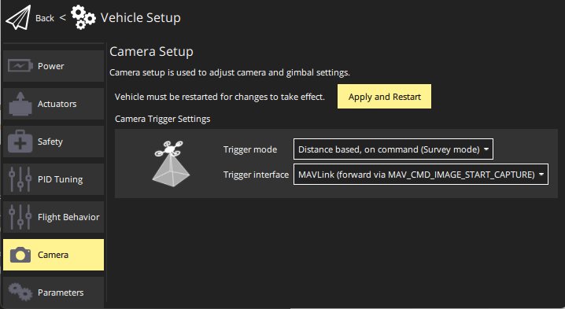

# MAVLink Cameras

MAVLink cameras are [cameras](../camera/index.md) that can be controlled using the [MAVLink camera protocol](https://mavlink.io/en/services/camera.html).

They allow a ground station and autopilot access to any feature of the camera that has been exposed via the protocol, such as image and video capture, control over where captured data is saved, video streaming to a ground station, control over zoom and focus, selecting between infrared and visible light feeds, and so on.
  
Usually MAVLink camera setups involve PX4 communicating with a [camera manager](#camera-managers) running on a companion computer, which then interfaces between MAVLink and the camera's native protocol.

## Overview

### Camera Commands

PX4 should be configured to forward MAVLink camera messages and commands between the camera, ground stations, and other MAVLink SDKs as needed (PX4 does not actually do any "handling" of incoming camera commands when using a MAVLink camera).

### Camera Commands in Missions

PX4 re-emits camera commands found in missions as MAVLink commands, addressed to a camera with the same system id and the component id of [MAV_COMP_ID_CAMERA (100)](https://mavlink.io/en/messages/common.html#MAV_COMP_ID_CAMERA).
If there is a MAVLink camera associated with the system that has this component ID, it will execute the indicated command.

The supported commands at time of writing are: `MAV_CMD_DO_TRIGGER_CONTROL`, `MAV_CMD_DO_DIGICAM_CONTROL`, `MAV_CMD_DO_SET_CAM_TRIGG_INTERVAL`, `MAV_CMD_DO_SET_CAM_TRIGG_DIST`, `MAV_CMD_OBLIQUE_SURVEY`.

- `MAV_CMD_IMAGE_START_CAPTURE`, `MAV_CMD_IMAGE_STOP_CAPTURE`, `MAV_CMD_VIDEO_START_CAPTURE`, `MAV_CMD_VIDEO_STOP_CAPTURE`, `MAV_CMD_DO_CONTROL_VIDEO`,  `MAV_CMD_SET_CAMERA_MODE`, `NAV_CMD_SET_CAMERA_FOCUS`.

:::info
PX4 currently ignores the target camera `id` in [MAV_CMD_IMAGE_START_CAPTURE](https://mavlink.io/en/messages/common.html#MAV_CMD_IMAGE_START_CAPTURE) and other camera messages.
See [PX4-Autopilot#23083](https://github.com/PX4/PX4-Autopilot/issues/23083).
:::

<!-- Note, not sure about `MAV_CMD_SET_CAMERA_MODE`, `NAV_CMD_SET_CAMERA_FOCUS` - do not seem to be resent??? -->

<!-- void Navigator::publish_vehicle_cmd(vehicle_command_s *vcmd)
https://github.com/PX4/PX4-Autopilot/blob/main/src/modules/navigator/navigator_main.cpp#L1381
https://github.com/PX4/PX4-Autopilot/issues/23083
-->

### Joystick

When using a MAVLink camera, Joystick buttons can be mapped to capture images, and to toggle video capture on and off.

## PX4 Configuration

### MAVLink Port & Forwarding Configuration

First set up a MAVLink connection between PX4 and the camera/camera manager.
If your MAVLink network is such that PX4 is "between" your camera and your ground station you will also need to forward communications so that they can communicate.

To connect PX4 to your camera you need to attach the camera to an unused serial port on your flight controller, such as `TELEM2`, or even the Ethernet port (if there is one).
If the camera is abstracted by a camera manager on a companion computer you would connect the companion computer to the unused serial port.

Then you configure the port you selected as a [MAVLink Peripheral](../peripherals/mavlink_peripherals.md).
The document explains how, but in summary:

1. Modify an unused `MAV_n_CONFIG` parameter, such as [MAV_2_CONFIG](../advanced_config/parameter_reference.md#MAV_2_CONFIG), so that it is assigned to port to which you connected the camera/companion computer.
1. Set the corresponding [MAV_2_MODE](../advanced_config/parameter_reference.md#MAV_2_MODE) to `2` (Onboard).
   This ensures that the right set of MAVLink messages are emitted for a companion computer (or camera).
1. Set [MAV_2_FORWARD](../advanced_config/parameter_reference.md#MAV_2_FORWARD) to enable forwarding of communications from the port to other ports, such as the one that is connected to the ground station.
1. You may need to set some of the other parameters, depending on your connection.

That's all for PX4.

Depending on the camera/camera manager you may also need to set up some configuration parameters.
For more information see:

- [Using a Companion Computer with Pixhawk Controllers](../companion_computer/pixhawk_companion.md)
- [Companion Computers > Companion Computer Software](http://localhost:5173/px4_user_guide/en/companion_computer/index.md#companion-computer-software): In particular note [MAVLink-Router](https://github.com/mavlink-router/mavlink-router), which you can setup to route MAVLink traffic between a serial port and an IP link (or other camera manager interface).
- [SIYI A8 mini camera manager](https://github.com/julianoes/siyi-a8-mini-camera-manager) has a tutorial showing a setup with an RPi.

<!-- Do we really need this? I don't see any benefit with a MAVLink setup

### Camera Driver

You can also configure the PX4 camera driver to enable the MAVLink camera backend, and the triggering mode to capture on command in survey missions.

Using _QGroundControl_:

- Open [Vehicle Setup > Camera](https://docs.qgroundcontrol.com/master/en/qgc-user-guide/setup_view/camera.html#px4-camera-setup).
- Set the values as shown:

  

- Select **Apply and Reboot** to apply the parameters.

::: info
You can also [set the parameters directly](../advanced_config/parameters.md) and then reboot the flight controller:

- [TRIG_MODE](../advanced_config/parameter_reference.md#TRIG_MODE) — `4`: Distance based, on command (Survey mode)
- [TRIG_INTERFACE](../advanced_config/parameter_reference.md#TRIG_INTERFACE) — `3`: MAVLink

:::

This configuration ensures that PX4 properly handles the [camera trigger commands](../camera/index.md#commands-supported-by-all-cameras) found in missions by re-emitting them as MAVLink commands to the camera, and forwards the same commands if received from a ground station.

Whenever a camera is triggered, the MAVLink [CAMERA_TRIGGER](https://mavlink.io/en/messages/common.html#CAMERA_TRIGGER) message is also published containing a sequence number (i.e. the current session's image sequence number) and the corresponding timestamp.
This timestamp can be used for several applications, including: timestamping photos for aerial surveying and reconstruction, synchronising a multi-camera system or visual-inertial navigation.

:::info
The camera itself may also emit [CAMERA_TRIGGER](https://mavlink.io/en/messages/common.html#CAMERA_TRIGGER) when it actually captures the image, and this will be more accurate.
:::
-->

## Camera Managers

If you want to use a camera that does not natively support the MAVLink camera protocol you may be able to fine or write a MAVLink Camera manager.
The camera manager runs on a companion computer and bridges between the MAVLink camera protocol interface and the camera's native interface.

Generic/extensible camera managers:

- [MAVLink Camera Manager](https://github.com/mavlink/mavlink-camera-manager) - Extensible cross-platform MAVLink Camera Server built on top of GStreamer and Rust-MAVLink.
- [Dronecode Camera Manager](https://camera-manager.dronecode.org/en/) - Adds Camera Protocol interface for cameras connected to Linux computer.

Camera-specfic camera managers:

- [SIYI A8 mini camera manager](https://github.com/julianoes/siyi-a8-mini-camera-manager) - MAVSDK-plugin based camera manager for the [SIYI A8 mini](https://shop.siyi.biz/products/siyi-a8-mini) (includes tutorial).
  A good example of how MAVSDK can be used to create a MAVLink camera protocol interface for a particular camera.

## Further Information

- [SIYI A8 mini camera manager](https://github.com/julianoes/siyi-a8-mini-camera-manager) - Tutorial for integrating with the [SIYI A8 mini](https://shop.siyi.biz/products/siyi-a8-mini) using a MAVSDK-based camera manager running on a Raspberry Pi companion computer.
