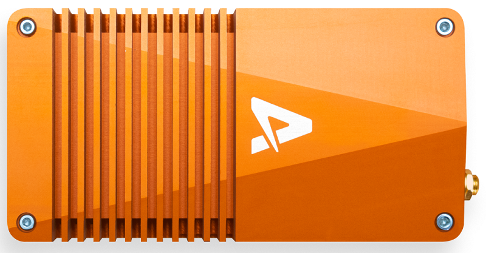

# Auterion Skynode

[Skynode](https://auterion.com/product/skynode/) is a powerful flight computer that combines a mission computer, flight controller, video streaming, networking, and cellular connection, in a single tightly integrated device.



The onboard software is Auterion OS, consisting of an enterprise-hardened version of PX4 running on the flight controller, and an operating system with advanced management software running on the mission computer.
The OS is managed by Auterion in production, with customer applications running as "add ons" in a safe sandbox within the mission computer.

Auterion OS and Skynode allow seamless integration with Auterion's other software and fleet management products.

For information about Auterion and Skynode, including purchase links:

- [auterion.com](https://auterion.com/)
- [Skynode](https://auterion.com/product/skynode/) (auterion.com)
- Skynode Guides:
  - [Manufacturer's Guide](https://docs.auterion.com/manufacturers/getting-started/readme) 
  - [App Developer's Guide](https://docs.auterion.com/developers/getting-started/readme)


## Skynode with Vanilla PX4

:::note
Skynode should only be used with Auterion OS in production.
Auterion support managed versions of PX4.
:::

The unmodified "vanilla" version of PX4 can be installed on Skynode during development, and subsequently reverted to Auterion OS.
This allows rapid development and prototyping, and pre-testing of PX4 features on Skynode before they become part of Auterion OS.
In particular, it may be useful for Auterion customers who have not yet licensed the Auterion OS version of PX4.

PX4 v1.13 will generally work, with the following caveats:

- Configuration for your exact product may not be present in generic PX4.
  You may lose the configuration for ESCs, batteries, sensor configuration, and so on.
- Some parameters have different default values in Auterion OS.
- Features accessed by vendor-specific customisations running on the companion computer may not be present in PX4.


## Building/Uploading Firmware

Skynode PX4 `px4_fmu-v5x` binaries are built from source using the normal [developer environment](../dev_setup/dev_env.md) and [build commands](../dev_setup/building_px4.md), and are uploaded using either  `upload_skynode_usb` or `upload_skynode_wifi` upload targets.

You must have already installed [SSH keys](https://docs.auterion.com/manufacturers/software-customization/adding-ssh-keys) and you will need to enter Skynode's password (twice) during the upload process.

To build and upload PX4 for Skynode [when connected by USB-C](https://docs.auterion.com/manufacturers/avionics/skynode/advanced-configuration/connecting-to-skynode):

```
make px4_fmu-v5x upload_skynode_usb
```

To build and upload PX4 for Skynode when connected using [Skynode's WiFi network](https://docs.auterion.com/manufacturers/avionics/skynode/advanced-configuration/configuration):

```
make px4_fmu-v5x upload_skynode_wifi
```

:::note
`upload_skynode_usb` and `upload_skynode_wifi` connect to Skynode via SSH over a network interface using the default (fixed) IP addresses, and upload a TAR compressed binary to the mission computer.
The mission computer then decompresses the binary and installs it to the flight controller.

SSH and TAR are upload dependencies, but are expected to be present by default on Ubuntu, Ubuntu running on Windows in WSL2, and macOS.
:::

## Restoring Auterion OS

To restore Auterion OS:

1. ?

<!-- HOW? -->

