# Holybro Pixhawk Jetson Baseboard

The [Holybro Pixhawk Jetson Baseboard](https://holybro.com/products/pixhawk-jetson-baseboard) integrates a Pixhawk flight controller and a NVIDIA Orin-series computer into a single package, significantly easing both hardware and software setup for using PX4 with a companion computer.

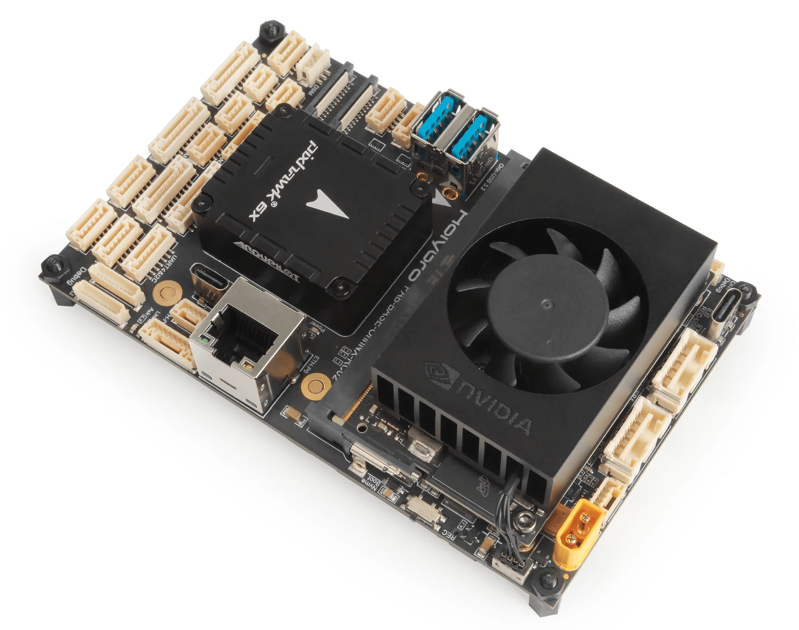

The board comes with either the [Jetson Orin NX (16GB RAM)](https://holybro.com/products/nvidia-jetson-orin-nx-16g) or [Jetson Orin Nano (4GB RAM)](https://holybro.com/products/nvidia-jetson-orin-nx-16g?variant=44391410598077).
It can be used with any Pixhawk Autopilot Bus (PAB) specification-compliant Pixhawk flight controller, such as the Pixhawk 6 or Pixhawk 6X.

This guide walks through the process of setting up the board and connecting to PX4, including:

- Hardware setup
- Flashing the Jetson board
- Initial setup
- PX4 Firmware build and flash on Jetson
- ROS 2 Installation and Ethernet setup
- Pixhawk setup for enabling uXRCE-DDS connection to Jetson
- Testing uXRCE-DDS connection

## Purchase

- [Holybro Pixhawk Jetson Baseboard](https://holybro.com/products/pixhawk-jetson-baseboard)

## Jetson Connectors

- 2x Gigabit Ethernet Port

  - Connected to both Jetson & Autopilot via Ethernet switch (RTL8367S)
  - Ethernet Switch powered by the same circuit as the Pixhawk
  - 8-pin JST-GH
  - RJ45

- 2x MIPI CSI Camera Inputs

  - 4 Lanes each
  - 22-Pin Raspberry Pi Cam FFC

- 2x USB 3.0 Host Port

  - USB A
  - 5A Current Limit

- 2x USB 2.0 Host Port

  - 5-Pin JST-GH
  - 0A Current Limit

- USB 2.0 for Programming/Debugging

  - USB-C

- 2 Key M 2242 for NVMe SSD

  - PCIEx4

- 2 Key E 2230 for WiFi/BT

  - PCIEx2
  - USB
  - UART
  - I2S

- Mini HDMI Out

- 4x GPIO

  - 6-pin JST-GH

- CAN Port

  - Connected to Autopilot's CAN2 (4 Pin JST-GH)

- SPI Port

  - 7-Pin JST-GH

- I2C Port

  - 4-Pin JST-GH

- I2S Port

  - 7-Pin JST-GH

- 2x UART Port

  - 1 for debug
  - 1 connected to Autopilot's telem2

- Fan Power Port

- IIM42652 IMU

### Input Power

- XT30 Connector
  - Voltage Rating: 7-21V (3S-4S)
  - Separate input power circuits from the Autopilot to ensure flight safety
  - Holybro UBEC 12A (3-14S) can be used for applications above 4S
  - Note: The Pixhawk Jetson Baseboard onboard BEC is only rated for 7-21V (3S-4S).
    Using the external "UBEC 12A (3-14S)" provides redundancy and easier replacement in case of BEC failure.

The Jetson power connection on Holybro’s board uses XT30 plug and has independent power circuitry from the Pixhawk Autopilot for safety.
You can see the complete power supply block diagram here:

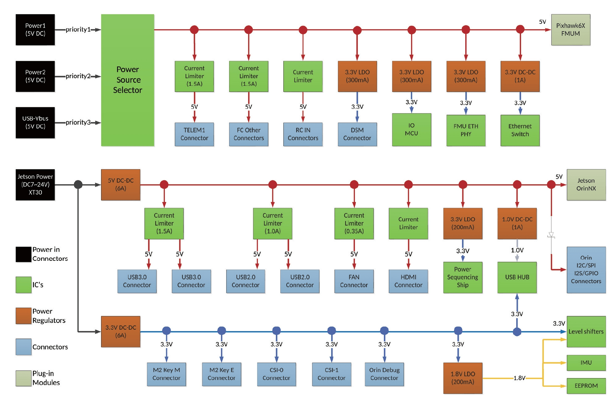

### Power Requirements

- 8V/3A Minimum
  - Depends on Usage and Peripherals

For development on the board it is recommended to have the power supply as well:

- [Power Adapter for Jetson Orin](https://holybro.com/products/power_adapter_for_jetson_orin)

## Autopilot Connectors

- Pixhawk Autopilot Bus Interface

  - 100 Pin Hirose DF40
  - 50 Pin Hirose DF40

- Redundant Digital Power Module Inputs

  - I2C Power Monitor Support
  - 2x 6-Pin Molex CLIK-Mate

- Power Path Selector

- Overvoltage Protection

- Voltage Ratings

  - Max input voltage: 6V
  - USB Power Input: 4.75~5.25V

- Full GPS Plus Safety Switch Port

  - 10-Pin JST-GH

- Secondary (GPS2) Port

  - 6-Pin JST-GH

- 2x CAN Ports

  - 4-Pin JST-GH

- 3x Telemetry Ports with Flow Control

  - 2x 6-Pin JST-GH
  - 1 is connected to Jetson's `UART1` Port

- 16 PWM Outputs

  - 2x 10-Pin JST-GH

- UART4 & I2C Port

  - 6-Pin JST-GH

- 2x Gigabit Ethernet Port

  - Connected to both Jetson & Autopilot via Ethernet switch (RTL8367S)
  - 8-Pin JST-GH
  - RJ45

- AD & IO

  - 8-Pin JST-GH

- USB 2.0

  - USB-C
  - 4-Pin JST-GH

- DSM Input

  - 3-Pin JST-ZH 1.5mm Pitch

- RC In

  - PPM/SBUS
  - 5-Pin JST-GH

- SPI Port

  - External Sensor Bus (SPI5)
  - 11-Pin JST-GH

- 2x Debug Port

  - 1 for FMU
  - 1 for IO
  - 10-Pin JST-SH

- Dimensions (Without Jetson and Flight Controller Module)

  - 126x80x38mm

- Weight

  - With Jetson, Heatsink, Flight Controller, M.2 SSD, M.2 Wi-Fi Module: 203.2g

- UBEC-12A Specifications

  - Input voltage: 3~14S (XT30)
  - Output voltage: 6.0V/7.2V/8.0V/9.2V (recommend 7.2V if supplying power to Jetson Board)
  - Output Current
  - Continuous: 12A
  - Burst: 24A
  - Size: 48x33.6x16.3 mm
  - Weight: 47.8g

## Hardware Setup

This board has two options of Nvidia Jetson Orin or Orin nano at the time of purchase.
We will go through the first time hardware setup below.
Before setting up the board it is recommended to have the following hardware with you:

Besides it is highly recommended to have these:

- External Display ()
- [Mini HDMI to HDMI converter](https://a.co/d/6N815N9) in case your external display has HDMI input
- Ethernet Cable
- Mouse and Keyboard (The baseboard has 4 USB ports exposed from Jetson which two of them are USB 3.0)

The peripherals of the carrier board is in the following diagram:

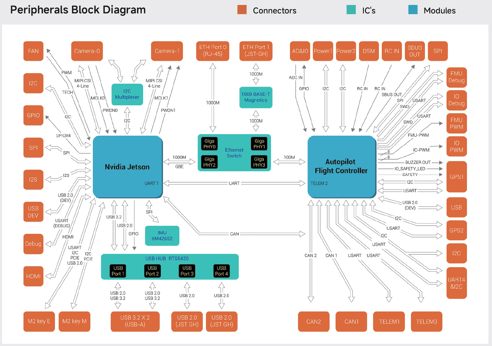

## Flashing the Jetson board

Jetson hardware can be flashed from a computer when the board is in recovery mode.
There are many ways to put Jetson boards into recovery mode, but on Holybro's carrier board there is a small sliding switch provided for this purpose.
You also need to connect the computer via a particular USB port for flashing, which is shown in the image below.

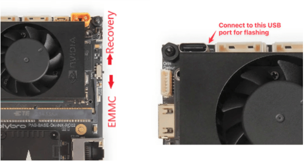

::: info
At the time of writing this documentation the setup is based on Nvidia Jetpack 6.0 (Ubuntu 22.04 base) and ROS 2 Humble which is currently supported by PX4-Autopilot community.

The host computer is also running Ubuntu 22.04 .
:::

Download [Nvidia SDK Manager](https://docs.nvidia.com/sdk-manager/download-run-sdkm/index.html#download-sdk-manager).
You need to have an Nvidia account to install and use the NVidia SDKManager.
Once you have an account you can install the software using either the online or offline installer from the link.

After running sdkmanager you should seethe screen similar to the one below if the board is connected to host computer in recovery mode:

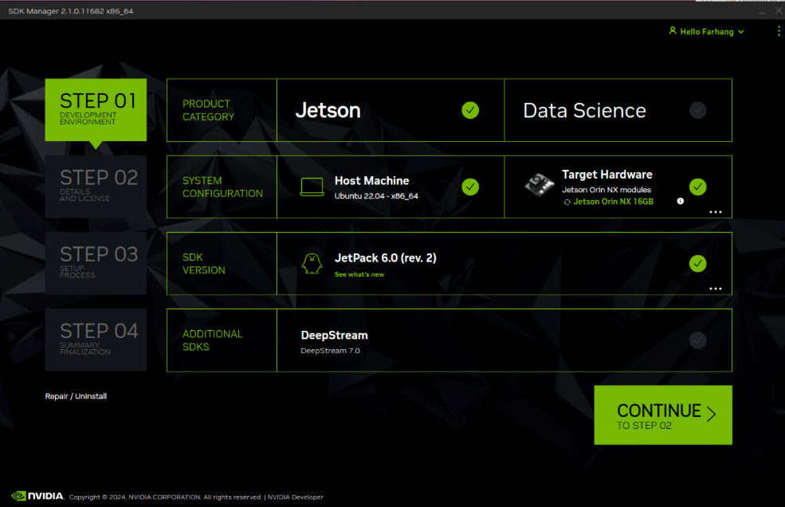

The next page is asking you to choose the components required to be installed.
We just choose the board to be flashed at this point since after flashing,host computer will not be able to connect to the flashed Jetson.

:::info
The USB port used on Holybro Jetson carrier board is only for flashing and cannot be used as debug.
:::

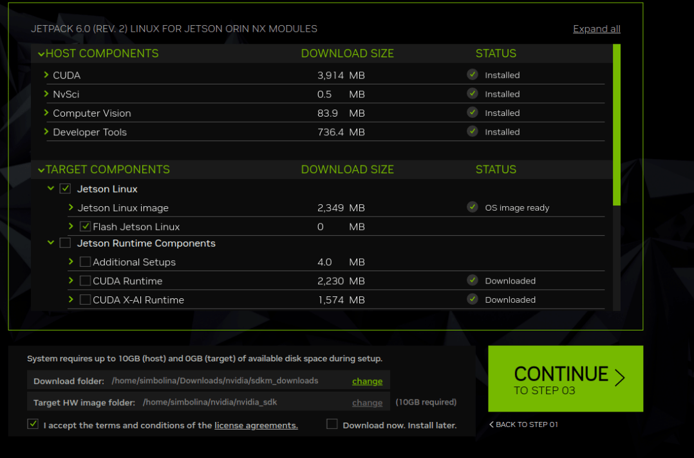

- Choose Pre-config as OEM Configuration (this will skip Ubuntu first time setup screens after reboot).
- Choose your preferred username and password which are your login credentials later to Jetpack.
- The storage device is chosen as NVME since the board has SSD connected to it as the storage.

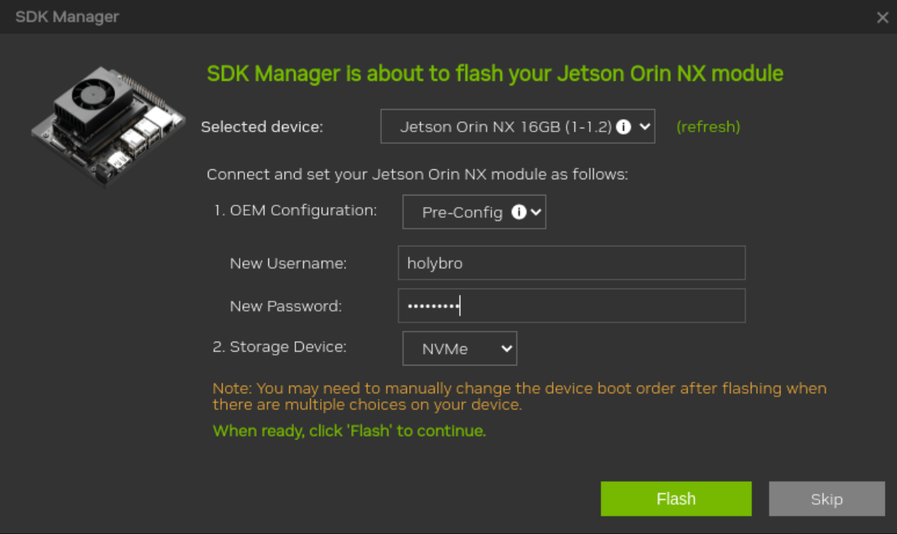

It will take a couple minutes for the whole installation to finish.

::: warning
The fan will be running while the installation is going on, so you may make sure it not blocked.
Jetson will boot into initial login after flashing.

:::

## Jetson Network Setup

Only the first time after flashing the board it automatically reboots to the login screen and skips recovery mode.
You could verify this by connecting your Jetson to an external display.

The diagram below shows how you can connect your Jetson carrier board for the first time to setup the network connections.
This step is needed in case we prefer to connect to Jetson over SSH later.

::: warning
Pixhawk also has to be powered via either USB-C on its own side or Power1/2 connector on top of the Jetson module since the internal ethernet switch on the board is not powered by XT30 connector.
:::

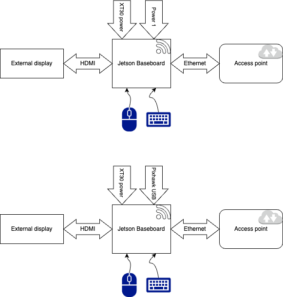

::: info
The board is coming either with Intel 8265NGW AC Dual Band or
Realtek RTL8B22CE if you have chosen to purchase wifi module from Holybro.
In case of having Intel module, there are chances it does not work out of the box.
You could establish connection through the access pointby using the diagram above and run the following command inside Jetson terminal to install the backport driver:

```sh
sudo apt-get install -y backport-iwlwifi-dkms
```

:::

Either you want to leave the board connected with Ethernet to access point or over wifi you need to get the ip that you could communicate with Jetson in your local network over SSH.
We run the below command inside Jetson terminal to get the ip:

```sh
ip addr show
```

## Initial Development Setup on Jetson

At this point the assumption is you can ping Jetson by the IP you have gotten previously:

```sh
ssh holybro@192.168.1.190 #(Your defined IP might be different)
```

After logging into Jetson we can start with installing some dependencies:

````sh
sudo apt update
sudo apt install build-essential cmake git genromfs kconfig-frontends libncurses5-dev flex bison libssl-dev ```
````

::: info

In case you would like to develop PX4 Code on Jetson instead of the host computer you could follow the steps below:

```sh
git clone https://github.com/PX4/PX4-Autopilot.git --recursive
```

In case you need a small portion of commits history and a single branch with no tags since you are on a SoC you could do:

```sh
git clone https://github.com/PX4/PX4-Autopilot.git --recursive --depth 1 --single-branch --no-tags
```

Necessary stuff (I need nuttx for building):

```sh
bash ./PX4-Autopilot/Tools/setup/ubuntu.sh --no-sim-tools
```

In case of path warnings do this once:

```sh
echo 'export PATH="$HOME/.local/bin:$PATH"' >> ~/.bashrc && source ~/.bashrc
```

If You received an error like this one midway running ubuntu.sh:

`E: Unable to locate package g++-multilib`

`E: Couldn't find any package by regex 'g++-multilib'`

Do:

```sh
sudo apt install gcc-arm-none-eabi gdb-arm-none-eabi -y
```

And run `ubuntu.sh` again

We need to give permission to the serial ports next:

```sh
sudo usermod -a -G dialout $USER
sudo apt-get remove modemmanager -y
```

Sanity check if we can build PX4 Firmware (I have Pixhawk 6x here on my carrier board):

```sh
make px4_fmu-v6x_default
```

If passed the build you can connect the USB-C on pixhawk side to the Jetson USB and upload the firmware:

```sh
make px4_fmu-v6x_default upload
```

This photo shows how you can connect Pixhawk to Jetson board directly with the cable already comes in the box:

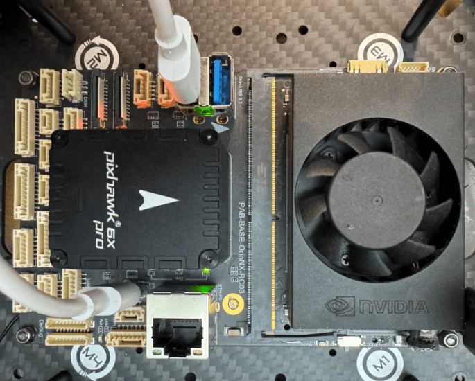

This means you can checkout and flash any PX4 version you want through the SSH connection to Jetson.
:::

## ROS 2 Installation and Setup

You could follow the instructions [here](../ros2/user_guide.md#install-ros-2).
Since later we may need to use additional ROS 2 packages for further development it is better to install full version, so this is the only line different from PX4 guide on ROS 2 installation.

```sh
sudo apt install -y ros-humble-desktop-full -y
```

## Setup Micro XRCE-DDS Agent on Jetson

You could follow the guides [here](../ros2/user_guide.md#setup-micro-xrce-dds-agent-client)

## Ethernet Setup using Netplan

1 - Modify the Netplan configuration file to set up a static IP for the Jetson.
You can usually find the Netplan configuration file in the `/etc/netplan/` directory.
It's typically named something like `01-netcfg.yaml`, but the name can vary.

Open the file in your preferred text editor:

```sh
sudo nano /etc/netplan/01-netcfg.yaml
```

2 - Modify the file to configure the Ethernet interface:

```
   network:
   version: 2
   renderer: networkd
   ethernets:
      eth0:
         dhcp4: no
         addresses:
         - 192.168.0.2/24
```

3- Apply the Netplan configuration:

Save the file and apply the changes using the following command:

```sh
sudo netplan apply
```

Pixhawk ethernet address is set to 192.168.0.3.
See [PX4 Ethernet setup](../advanced_config/ethernet_setup.md) and
[PX4 CM4 Blog post](https://px4.io/get-the-pixhawk-raspberry-pi-cm4-baseboard-by-holybro-talking-with-px4/).

::: warning
There is an internal network switch between Pixhawk and Jetson integrated in Holybro Jetson carrier board so
you do not need to connect any external cables.
:::

We ping pixhawk now inside Jetson terminal:

```sh
ping 192.168.0.3
```

If this is successful as the output below it means you
can run your XRCE-DDS agent on Jetson and have your ros nodes talk to PX4 uxrce-dds middleware.

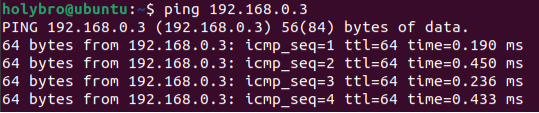

## Connection Sanity Check between Pixhawk and Jetson

Let us make stuff ready to communicate with Pixhawk.
I will use [MAVSDK Python](https://github.com/mavlink/MAVSDK-Python) as it is the easiest way for now:

```sh
 pip3 install mavsdk
```

We can run a [telemetry example](https://github.com/mavlink/MAVSDK-Python/tree/main/examples) here for a sanity check assuming you have cloned MAVSDK-Python repo in your Jetson root directory.
Over Serial we need to change [this line](https://github.com/mavlink/MAVSDK-Python/blob/707c48c01866cfddc0082217dba9f7fe27d59b27/examples/telemetry.py#L10) to:

```sh
await drone.connect(system_address="serial:///dev/ttyTHS*:921600")
```

:::info
Jetson and Pixhawk are internally connected from Pixhawk `TELEM2` to Jetson THS\* (i.e. THS1 or THS0).
Always you could see the available serial instances by:

```sh
ls /dev/ttyTHS*
```

:::

or over the Ethernet with the current setup:

```sh
await drone.connect(system_address="udp://:14550")
```

then we can run this inside Jetson terminal:

```sh
python ~/MAVSDK-Python/examples/telemetry.py
```

The output below is expected in either cases (no battery connected and disarmed vehicle):

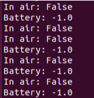

## Running XRCE-DDS Agent and Tests

::: info
It is highly recommended to use [VSCode over SSH](https://code.visualstudio.com/learn/develop-cloud/ssh-lab-machines) to have faster development and applying changes.
:::

With the help from [PX4 ROS 2 user guide](../ros2/user_guide.md#building-the-workspace) we could have a basebone to test communication between the agent (Jetson) and client (Pixhawk) using XRCE-DDS:

```sh
mkdir -p ~/ws_sensor_combined/src/
cd ~/ws_sensor_combined/src/
git clone https://github.com/PX4/px4_msgs.git
git clone https://github.com/PX4/px4_ros_com.git
cd ..
source /opt/ros/humble/setup.bash
colcon build
```

1- Setting the connection based on internal serial

```sh
param set MAV_1_CONFIG = 0 (Disabling current TELEM2 MAVLINK instance)
param set UXRCE_DDS_CFG  102 (TELEM2)
param set UXRCE_DDS_DOM_ID  0 (If you would like to change this you need to change your host domain ID as well. Check ROS2 Humble Domain ID)
param set UXRCE_DDS_PTCFG 0
param set UXRCE_DDS_SYNCC 0 (But if you are sure about your companion UTC time being synced and updated you could consider making this equal to 1 so that PX4 time is updated with your XRCE-DDS Agent time or if there are no external sources like hardware RTC or GPS device)
param set UXRCE_DDS_SYNCT 1
```

::: info
This might not be a recommended way to establish agent-client connection as it will occupy the only serial connection between pixhawk and Jetson.
The reasons are:

1 - Serial connection has higher latency

2 - Reboots or system changes may cause failures to ethernet switch

3 - You could use the serial connection for lower level applications
:::

A Pixhawk reboot is needed after all these so that the changes are applied.
After the reboot please check the client status by running the following the following inside MAVLINK shell:

```sh
uxrce_dds_client status
```

A healthy output should show:

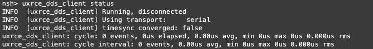

Also another way to check if the client has started running at the boot is to get `dmesg` output from MAVLINK shell.
The below output as a part of `dmesg` log mentions the baudrate and the instance (`/dev/tty/S4` is equal to `TELEM2` for Holybro Pixhawk 6X and 6X Pro) the client is running on.

```sh
Starting UXRCE-DDS Client on /dev/ttyS4
INFO  [uxrce_dds_client] init serial /dev/ttyS4 @ 921600 baud
```

:::info
In case the client was not running you could run it manually:

```sh
uxrce_dds_client start -t serial -d /dev/ttyS4 -b 921600
```

:::

After setting up the params and making sure the client is running we can start the agent on serial as below inside Jetson terminal:

```sh
sudo MicroXRCEAgent serial --dev /dev/ttyTHS1 -b 921600
```

2 - Setting the XRCE-DDS client connection to use Ethernet.
Besides, we are choosing UXRCE_DDS_PRT to define a default udp port PX4 runs the client on Ethernet.

```sh
param set UXRCE_DDS_CFG 1000 (Ethernet)
param set UXRCE_DDS_PRT 8888
```

Then we can run MicroXRCEAgent over Ethernet by:

```sh
MicroXRCEAgent udp4 -p 8888
```

An output similar to the one below means that the connection is established and XRCE-DDs agent is running:

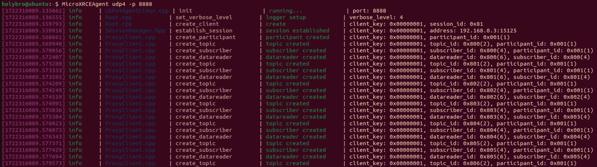

::: info
We do not need to run any client here as on all PX4 boards the client runs at the boot by default
:::

## Running a node to get sensor data using XRCE-DDS agent

By getting help from [ROS2 Example](../ros2/user_guide.md#running-the-example) :

```sh
source ws_sensor_combined/install/setup.bash #(ifyou have not passed this permanently to .bashrc)
```

Then we run the example node:

```sh
ros2 launch px4_ros_com sensor_combined_listener.launch.py
```

You should see high frequency sensor messages as the output:

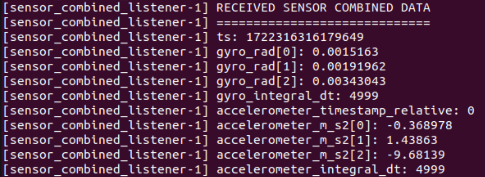

In case you want to run the agent each time booting Jetson you can make a daemon service to run the agent:

Make a new service file:

```sh
sudo nano /etc/systemd/system/microxrceagent.service
```

Paste the following inside:

```plain
[Unit]
Description=Micro XRCE Agent Service After=network.target
[Service]
14
Holybro carrier board
ExecStart=/usr/local/bin/MicroXRCEAgent udp4 -p 8888 Restart=always
User=root
Group=root
ExecStartPre=/bin/sleep 10
[Install]
WantedBy=multi-user.target
```

Save the file and run the following inside terminal

```sh
sudo systemctl daemon-reload
sudo systemctl enable microxrceagent.service
```

Then you can reboot your Jetson board and check if the agent is running in the background:

```sh
sudo systemctl status microxrceagent.service
```

If the service is running, a similar output is expected:

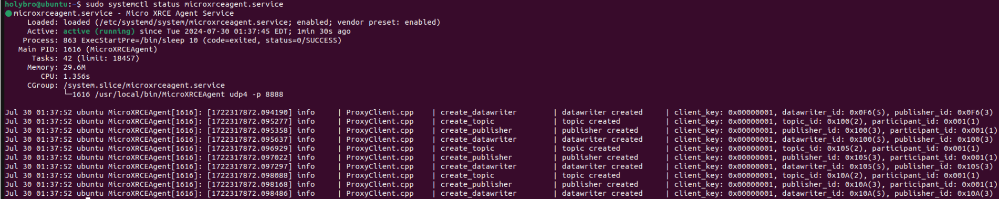

You can just do your ROS2 nodes running and the development.
Every boot the agent is running in the back.

## See Also

- [Jetson carrier board Holybro Docs](https://docs.holybro.com/autopilot/pixhawk-baseboards/pixhawk-jetson-baseboard)
- [PX4 Middleware docs](../middleware/uxrce_dds.md#starting-the-client)
- [PX4 ROS 2 user guide](../ros2/user_guide.md)
