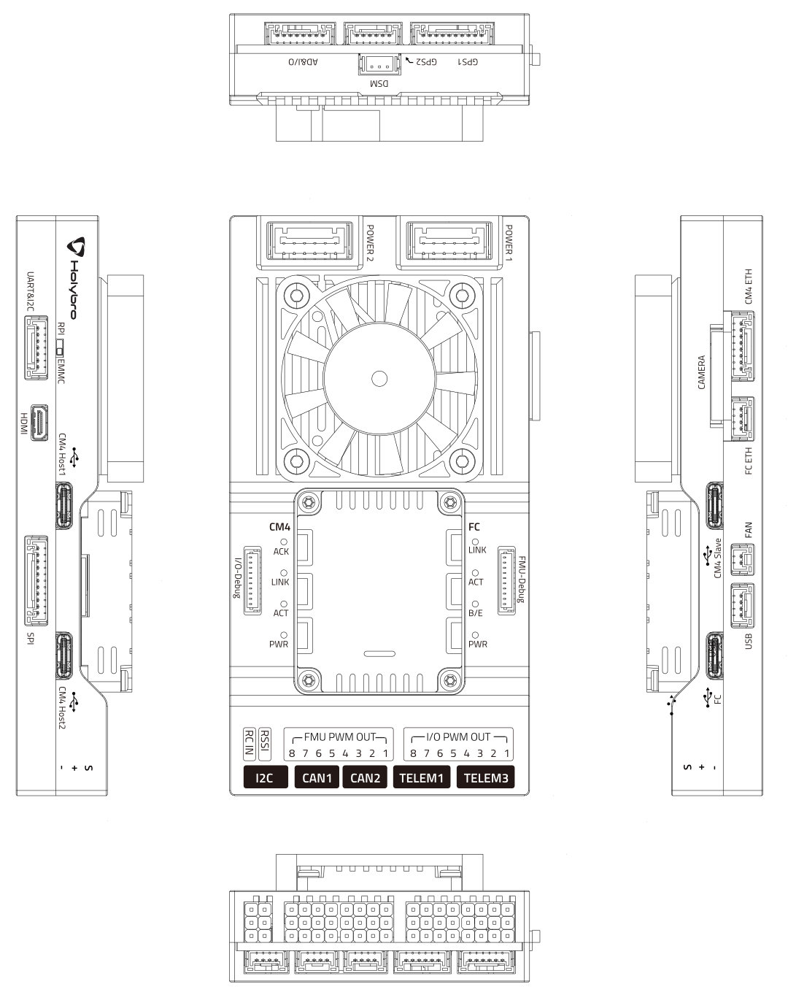
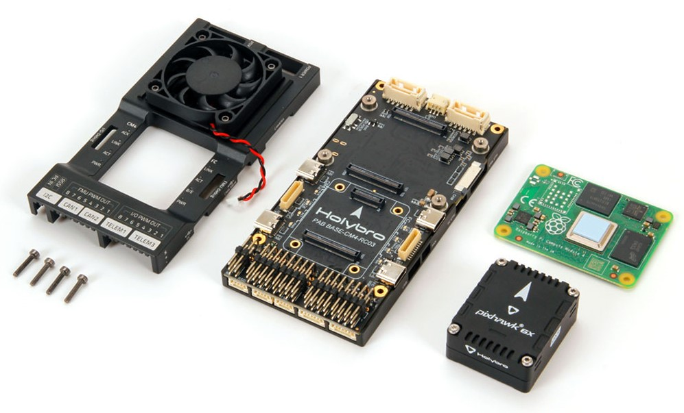
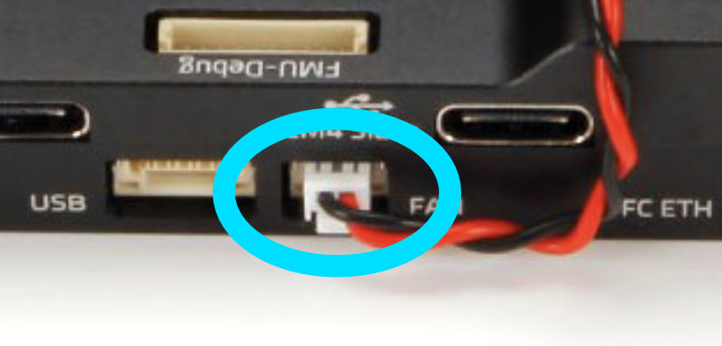
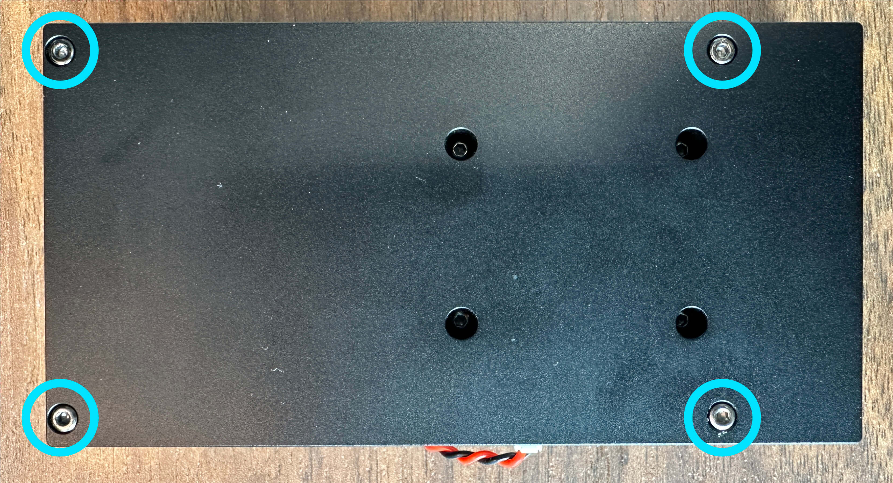
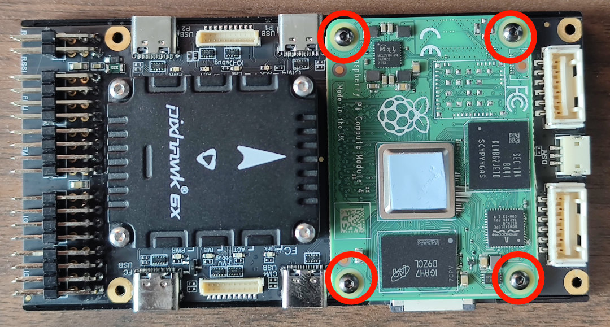
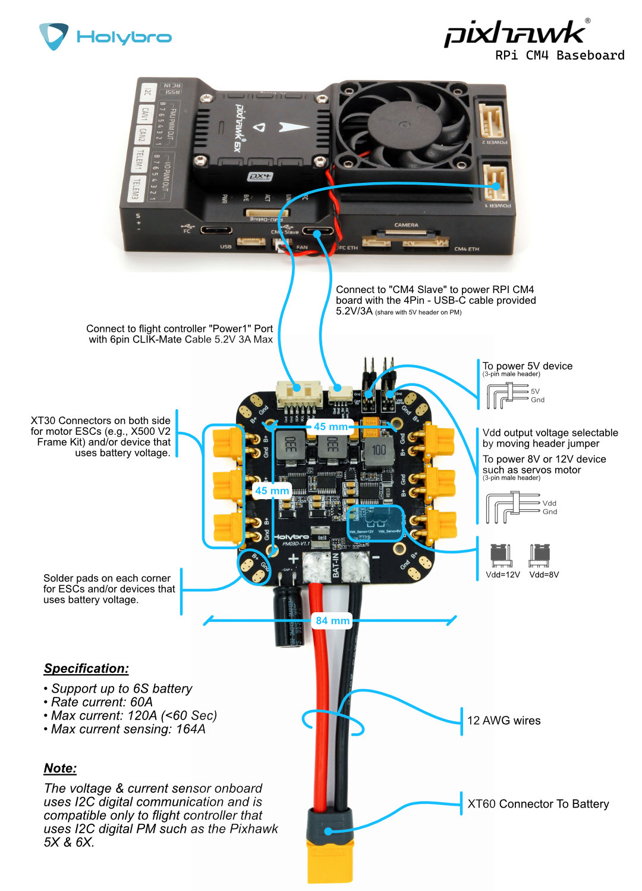
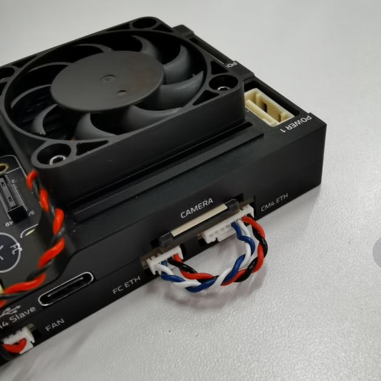

# Holybro Pixhawk RPi CM4 Baseboard

# Overview


The Holybro Pixhawk RPi CM4 Baseboard combine the Pixhawk FC module with the Raspberry Pi CM4 companion computer in on compact form factor with all the connections you need for development. \
\
It follows the Pixhawk Connector and Autopilot Bus Standard, allow easy swap of FC Module with any FC that follows the Pixhawk Bus Standard. The FC Module is internally connected to RPi CM4 through TELEM2, and can also be connected via ethernet with a external cable provided.  This baseboard is compatible with both Pixhawk 5X & 6X, and most other flight controller that follow the Pixhawk Autopilot Bus Standard.\
\
Recommend minimum specification for RPi CM4:

* Wireless: Yes
* RAM: 4GB (or 8GB)
* eMMC: 16GB

# Connections & Ports



Please refer to the [Holybro Documentation page](https://docs.holybro.com/autopilot/pixhawk-baseboards/pixhawk-rpi-cm4-baseboard/connections-and-ports) for the latest info on the Connections & Ports

# Installation of RPi CM4



To install Raspberry Pi CM4 companion compute onto this baseboard.

* Disconnect the FAN connector.



* Remove these 4 screws on the back side of the baseboard.



* Remove the case of the baseboard, install the CM4 and screw on the 4 screws.




# PM03D - RPi CM4 Base Wiring Guide

To ensure stable power supply, the RPi CM4 & Flight controller must be powered separately.&#x20;

Flight controller is powered via the CLIK-Mate cable to POWER1 or POWER2 port, and RPi CM4 is powered by the USB C (CM4 Slave) connection.



# Ethernet Connection

### Link-local networking setup between CM4 and FC

#### Local cable

To set up a local ethernet connection between CM4 and the flight computer, the two ethernet ports need to be connected using a 8 pin to 4 pin connector.

The pinout of the cable is:

| CM4 Eth 8 Pin              | FC ETH 4 Pin                              | 
| ---------------- | ------------------------------------- | 
| A | B |
| B | A |
| C | D |
| D | C |
| - | N/A |
| - | N/A |
| - | N/A |
| - | N/A |



#### IP setup on CM4 <a href="#ip-setup-on-cm4-3" id="ip-setup-on-cm4-3"></a>

Since there is no DHCP server active in this configuration, the IPs have to be set manually:\
First, connect to the CM4 via ssh by connecting to the CM4’s wifi (or use a Wifi dongle).\
Once the ethernet cables are plugged in, the `eth0` network interface seems to switch from DOWN to UP.

You can check the status using:

```
ip address show eth0
```

You can also try to enable it manually:

```
sudo ip link set dev eth0 up
```

It then seems to automatically set a link-local address, for this example it looks like this:

```
ip address show eth0

2: eth0: <BROADCAST,MULTICAST,UP,LOWER_UP> mtu 1500 qdisc mq state UP group default qlen 1000
    link/ether xx:xx:xx:xx:xx:xx brd ff:ff:ff:ff:ff:ff
    inet 169.254.21.183/16 brd 169.254.255.255 scope global noprefixroute eth0
       valid_lft forever preferred_lft forever
    inet6 fe80::yyyy:yyyy:yyyy:yyyy/64 scope link 
       valid_lft forever preferred_lft forever
```

This means the CM4’s ethernet IP is 169.254.21.183.

#### IP setup on FC <a href="#ip-setup-on-fc-4" id="ip-setup-on-fc-4"></a>

Now connect to the NuttX shell (using a console, or the MAVLink shell), and check the status of the link:

```
ifconfig

eth0    Link encap:Ethernet HWaddr xx:xx:xx:xx:xx:xx at DOWN
        inet addr:0.0.0.0 DRaddr:192.168.0.254 Mask:255.255.255.0
```

For this example, it is DOWN at first.

To set it to UP:

```
ifup eth0

ifup eth0...OK
```

Now check the config again:

```
ifconfig

eth0    Link encap:Ethernet HWaddr xx:xx:xx:xx:xx:xx at UP
        inet addr:0.0.0.0 DRaddr:192.168.0.254 Mask:255.255.255.0
```

However, it doesn’t have an IP yet. I’m going to set one similar to the one of CM4:

```
ifconfig eth0 169.254.21.184
```

And check it:

```
ifconfig

eth0    Link encap:Ethernet HWaddr xx:xx:xx:xx:xx:xx at UP
        inet addr:169.254.21.184 DRaddr:169.254.21.1 Mask:255.255.255.0
```

Now the devices should be able to ping each other.

Note that this configuration is ephemeral and will be lost after a reboot, so we’ll need to find a way to configure it statically.

#### Ping test <a href="#ping-test-5" id="ping-test-5"></a>

First from the CM4:

```
ping 169.254.21.184

PING 169.254.21.184 (169.254.21.184) 56(84) bytes of data.
64 bytes from 169.254.21.184: icmp_seq=1 ttl=64 time=0.188 ms
64 bytes from 169.254.21.184: icmp_seq=2 ttl=64 time=0.131 ms
64 bytes from 169.254.21.184: icmp_seq=3 ttl=64 time=0.190 ms
64 bytes from 169.254.21.184: icmp_seq=4 ttl=64 time=0.112 ms
^C
--- 169.254.21.184 ping statistics ---
4 packets transmitted, 4 received, 0% packet loss, time 3077ms
rtt min/avg/max/mdev = 0.112/0.155/0.190/0.034 ms
```

And from the FC in NuttShell:

```
ping 169.254.21.183

PING 169.254.21.183 56 bytes of data
56 bytes from 169.254.21.183: icmp_seq=0 time=0 ms
56 bytes from 169.254.21.183: icmp_seq=1 time=0 ms
56 bytes from 169.254.21.183: icmp_seq=2 time=0 ms
56 bytes from 169.254.21.183: icmp_seq=3 time=0 ms
56 bytes from 169.254.21.183: icmp_seq=4 time=0 ms
56 bytes from 169.254.21.183: icmp_seq=5 time=0 ms
56 bytes from 169.254.21.183: icmp_seq=6 time=0 ms
56 bytes from 169.254.21.183: icmp_seq=7 time=0 ms
56 bytes from 169.254.21.183: icmp_seq=8 time=0 ms
56 bytes from 169.254.21.183: icmp_seq=9 time=0 ms
10 packets transmitted, 10 received, 0% packet loss, time 10010 ms
```

#### MAVLink/MAVSDK test 

For this, we need to set the mavlink instance to send traffic to the CM4’s IP:

For an initial test we can do:

```
mavlink start -o 14540 -t 169.254.21.183
```

This will send MAVLink traffic on UDP to port 14540 (the MAVSDK/MAVROS port) to that IP which means MAVSDK can just listen to any UDP arriving at that default port.

To run a MAVSDK example, install mavsdk via pip, and try out an example from [MAVSDK-Python/examples](https://github.com/mavlink/MAVSDK-Python/tree/main/examples).

For instance:

```
python3 -m pip install mavsdk

wget https://raw.githubusercontent.com/mavlink/MAVSDK-Python/main/examples/tune.py
chmod +x tune.py
./tune.py
```

