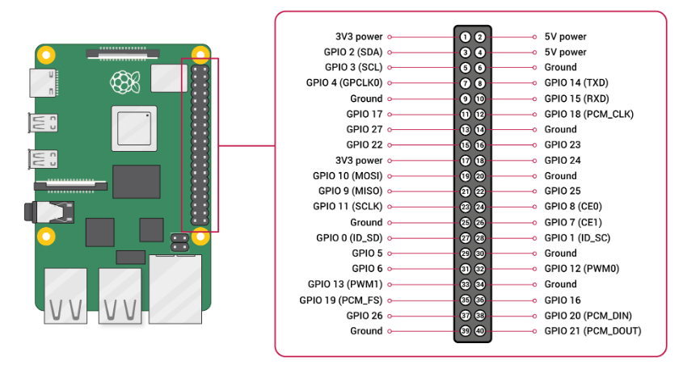

# Using the Raspberry Pi with the Pixhawk Controllers

This section describes how to connect the Pixhawk to the Raspberry Pi ("RPi"). Both the software setup and the wire connections between the hardware are presented. 

There are different ways to connect the RPi with the Pixhawk:

1. Via Ethernet port.

2. Serial connection: via `TELEM` port or via `USB` port.

The connection via `TELEM` port can be done with a FTDI Chip USB-to-serial adapter board or directly at the RPi's TX/RX pins. The following steps describes the connections using the TX/RX pins, since no additional board is required.

There are different models of Pixhawk and RPi, therefore, the main concepts are covered and illustrated in order to give the user the necessary knowledge for any other configuration. The first step is the identification of the `TELEM 2` and the `USB` ports in the Pixhawk. The image illustrates the ports in the Pixhawk-6C Model.


## PX4 setup on Pixhawk

Connect the Pixhawk with the laptop/desktop via `USB` port and check, at the QGroundControl, if the firmware (PX4) is updated. 
The firmware update can be done in the QGroundControl or following the next steps:

Run in the terminal:

```
sudo apt -y install gcc-arm-none-eabi make stlink-tools
```

Clone the last PX4 version and run the script setup:

```
git clone https://github.com/PX4/PX4-Autopilot.git --recursive 
PX4-Autopilot/Tools/setup/ubuntu.sh
```

Build it on the Pixhawk. On Linux, the default name of a USB connection is `/dev/ttyACM0`:

```
sudo chmod a+rw /dev/ttyACM0
cd /PX4-Autopilot
make px4_fmu-v6c_default upload
```

## Ubuntu setup on RPi

The following steps are required to have the Ubuntu 22.04 installed on the RPi. In the next section, the ROS 2 is going to be installed, so it is important the choice for the correct version of Ubuntu.

Prepare the Ubuntu 22.04's boot SD card following the official tutorial available in the Ubuntu website:

https://ubuntu.com/tutorials/how-to-install-ubuntu-desktop-on-raspberry-pi-4#1-overview

Next, connect the SD card in the RPi. Connect the mouse, keyboard, monitor and connect the RPi on 5v Power Supply (external source/charger).

Turn on the RPi to boot on SD card and install Ubuntu. In the sequence, install raspi-config in the RPi's terminal:

```
sudo apt update
sudo apt upgrade
sudo apt-get install raspi-config 
```

Open the raspi-config:

```
sudo raspi-config
```

Go to the **Interface Option** and then click at **Serial Port**. Select **No** to disable serial login shell and select **Yes** to enable serial interface. Click **finish** and restart the RPi.

In the sequence, in the RPi's terminal:

```
sudo nano /boot/firmware/config.txt
```

Include the following, after the last line:

```
enable_uart=1
dtoverlay=disable-bt
```

Then, **ctrl+x**, **ctrl+y**, **Enter** and restart the RPi.

To check if the serial port is available, in the RPi's terminal, confirm the list of serial devices by typing:

```
cd /
ls /dev/ttyAMA0
```

On RPi, the default name of a RX/TX connection is `/dev/ttyAMA0`. The same serial port is also available as `/dev/serial0`.

Next, install the mavproxy in the RPi's terminal:

```
sudo apt install python3-pip
sudo pip3 install mavproxy
sudo apt remove modemmanager
```

## MAVlink communication

Connect the Pixhawk with the laptop via `USB` cable and change the following parameters in QGroundControl:

```
MAV_0_CONFIG = TELEM2
XRCE_DDS_0_CFG = Disabled
SER_TEL1_BAUD = 57600
```

Next, connect the Pixhawk `TELEM2` pins TX/RX/Ground on RPi correspondent pins. We are going to leave the `TELEM1` port for a setup with a Radio Controller.

The connections listed below must be done:

1. `TELEM2` TX -> RPi RXD (GPIO 15 - pin 10)
2. `TELEM2` RX -> RPi TXD (GPIO 14 - pin 8)
3. `TELEM2` GND -> RPi Ground (pin 6)

It is important to identify the correct pins in the hardware. The image illustrates the `TELEM2` pins in the Pixhawk-6C Model.

 

Ps.: The pins are numbered according to the following:

 

The following image illustrates the correspondent pins at the RPi GPIO.

 

To supply the Pixhawk with 5 Volts is possible to follow with the connection of `POWER1` port with a LiPO battery, via Power Module (PM02, for example). Another option, for this setup moment, is to supply the 5 Volts via the connection of the Pixhawk's `USB` with a smartphone charger, for example, or by keeping it in the laptop `USB`. 

Also, for this setup moment, the RPi is charged with 5 Volts via Power Supply (external source/charger). 

Ps.: For an onboard setup, in the drone, it is not recommended to connect the `TELEM2` VCC to supply the RPi in the 5V power (pin 4). You can use your own power supply board to power the RPi baseboard. 

Next, run the mavproxy connection at `/dev/ttyAMA0`. In the RPi's terminal:

```
sudo mavproxy.py --master=/dev/serial0 --baudrate 57600
```

At this moment, you are going to see in the RPi's terminal the MAVlink communication established with the Pixhawk, via RX/TX pins. 
The MAVlink communication is also possible via USB connection, by changing the command to:

```
sudo chmod a+rw /dev/ttyACM0
sudo mavproxy.py --master=/dev/ttyACM0 --baudrate 57600
```

The steps above are important to double check that the hardware communication is done. In the sequence, we are going to move to the XRCE_DDS communication.

## ROS setup on RPi

To install ROS 2 Humble you can follow the official tutorial, available in the website:

https://docs.ros.org/en/humble/Installation/Ubuntu-Install-Debians.html

Next, install the git in the RPi's terminal:

```
sudo apt install git
```

Next, install the XRCE_DDS standalone:

```
git clone https://github.com/eProsima/Micro-XRCE-DDS-Agent.git
cd Micro-XRCE-DDS-Agent
mkdir build
cd build
cmake ..
make
sudo make install
sudo ldconfig /usr/local/lib/
```

## XRCE_DDS communication

If you want to use `TELEM1`, you have to stop mavlink and then activate the microdds_client. You can do that changing the parameters:

1. To disable mavlink on `TELEM1`,

```
MAV_0_CONFIG = 0
```
2. To start microdds_client on `TELEM1`,

```
XRCE_DDS_0_CFG = TELEM1
```

3. Use SER_TEL1_BAUD to set the baudrate.

If you want to use `TELEM2` (ttyS3 of Pixhawk):

```
XRCE_DDS_0_CFG = TELEM2
SER_TEL2_BAUD = 921600
```

Ps.: At this moment, the Pixhawk must be connected with the laptop, via `USB`, so the QGroundControl can be used to change the parameters described above.

To check the status of the microdds_client, run in the QGroundControl's MavlinkConsole: 

```
microdds_client status
```

If it is not running yet, start the client in the MavlinkConsole: 

```
microdds_client start -t serial -d /dev/ttyS3 -b 921600
```

In the command above we have used the `/dev/ttyS3` to establish the XRCE_DDS communication, since it is related to `TELEM2`, according to the table:

 

To start the agent, run the following command in the RPi's terminal:

```
sudo MicroXRCEAgent serial --dev /dev/serial0 -b 921600
```

To see the ROS 2 topics available, run in a new RPi's terminal:

```
source /opt/ros/humble/setup.bash
ros2 topic list
```

To communicate simultaneously via both XRCE_DDS and MAVlink, we can keep the `TELEM2` connected via RX/TX and also connect Pixhawk `USB` at the RPi. 

Before disconnect the `USB` from laptop, remember to set the parameters:

```
MAV_0_CONFIG = TELEM1
SER_TEL1_BAUD = 57600
XRCE_DDS_0_CFG = TELEM2
SER_TEL2_BAUD = 921600
```

The `TELEM2` is going to keep the XRCE_DDS communication with the microdds_client, as above, and the `USB` is going to keep the MAVlink communication. Remember to open a new RPi's terminal and run:

```
sudo chmod a+rw /dev/ttyACM0
sudo mavproxy.py --master=/dev/ttyACM0 --baudrate 57600
```
This is a particular setup when we are looking for both offboard control, via XRCE_DDS with the RPi, and simultaneously to keep monitoring the drone via MAVlink with QGroundControl.
Since the Pixhawk is connected with the RPi, a remote control via QGroundControl (in a ground station laptop) can be done using SSH and the mavros package, running in a new terminal:

```
ssh -C -Y user@raspberrypi_IP
sudo chmod a+rw /dev/ttyACM0 
roslaunch mavros px4.launch fcu_url:=/dev/ttyACM0 gcs_url:=udp://@laptop_IP
```

Ps.: It is not possible to configure XRCE_DDS_0_CFG = USB (/dev/ttyACM0 port). So, the Pixhawk XRCE_DDS communication would not work on laptop via USB.
