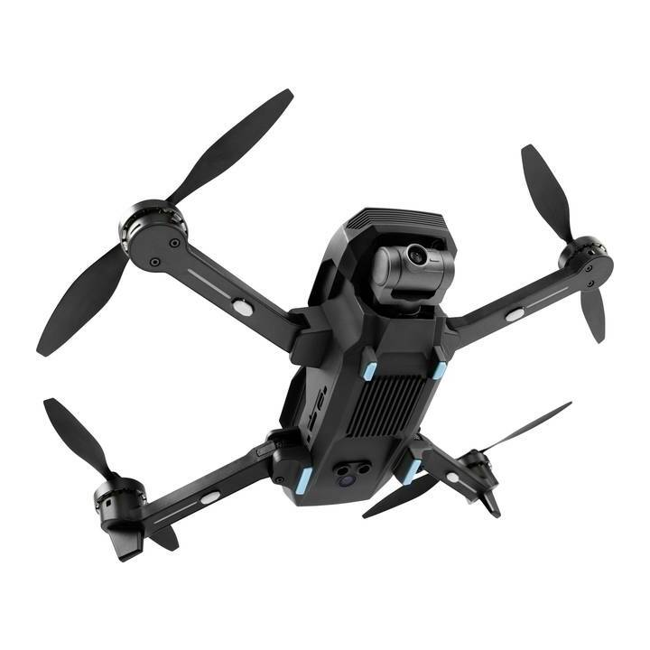

# ATL Mantis EDU



:::warning
The ATL Mantis EDU is currently work in progress. Use with caution.
:::

*ATL Mantis EDU* is the ready-to-fly [Yuneec Mantis G](https://shop.yuneec.com/eu/camera-drones/mantis-g/mantis-g/) vehicle that has been firmware-updated to run "vanilla" PX4 and MAVLink-compatible [camera](https://mavlink.io/en/services/camera.html)/[gimbal](https://mavlink.io/en/services/gimbal_v2.html) firmware.

The updated vehicle is an ideal education platform for developing and testing [MAVSDK](https://mavsdk.mavlink.io/) applications that can run effectively on a ground station (_Mantis-G_ does not have an onboard companion computer).
It can also be used for developing and testing PX4 autopilot software, including optical flow.

:::note
If you have any problems, please first check [Troubleshooting/FAQ](#troubleshooting-fqa). And if the problem persists, ask on the [Support channels](../contribute/support.md) of PX4!
:::

## Purchase

The ATL Mantis EDU version will be released soon.
TODO: add purchase link

## Hardware Overview

The Mantis broadly features the following hardware components:
- Autopilot/FMU based on STM32F7.
- Gimbal controller.
- Camera system on a chip with WiFi (forwards MAVLink messages from autopilot and gimbal via Wifi)
- Downward-facing flow module with laser range sensor.

## Connection

You can either connect to the drone using WiFi, or using a USB cable connected to the remote control. The latter part is work in progress.

You can also access the SD card and the internal storage by connecting to the drone using a USB-C cable.

:::note
When **USB cable** is connected to the laptop, **WiFi will be disabled**!!
:::

## Developing PX4 Firmware

### Build the PX4 Firmware

To build PX4 for the Mantis, use the make command:
```
make atl_mantis-edu
```

:::note
If you don't have the PX4 Development Environment, check out [this page](../dev_setup/building_px4.md).
:::

### Upload/flash the PX4 Firmware

There are two ways to update the firmware:

#### Upload while connected to the Mantis' WiFi:

The firmware will be uploaded to the SD-card over http using curl:
```
make atl_mantis-edu upload_wifi
```

:::note
Make sure to have an SD card inserted for this.
:::

:::note
You can't upgrade the Firmware via QGC neither! TODO : reason.
:::

#### Upload using the SD card

The built firmware can be found in `build/atl_mantis-edu_default/atl_mantis-edu_default.px4`.

To update the vehicle with this firmware: rename the file to **autopilot.px4**, copy it to root of the SD card, and restart the vehicle (as described above).

:::note
When USB cable is connected to the laptop, the firmware flashing won't work. Remove the cable before the update!!
:::


## Using MAVSDK with the Mantis

By default MAVSDK connects via MAVLink on UDP port 14540.
This port is configured for the Mantis, so MAVSDK examples and tests should mostly work out of the box.

TODO: Add more detailed tutorial how to use MAVSDK with the Mantis.

### MAVLink Connection

MAVLink traffic is sent via Wifi on 3 different ports:

1. UDP port 14550: to QGC default auto-connect.
2. UDP port 14540: to SDK (MAVSDK, MAVROS) default connection.
3. UDP port 14530: to RC controller.

### HTTP connection

#### Download Photos/Videos from Internal Storage or SD Card

There is an HTTP server running on 192.168.42.1 that you can use to view or download the media files.

#### Upload Files to SD Card

You can upload files to the SD card when connected to the WiFi of the drone.

The command to upload a file is:
```sh
curl -F "image=@$HOME/path/to/file.ext" -H "Expect:" http://192.168.42.1/cgi-bin/upload
```

For bigger (multi-part) upload, use:
```sh
curl -F "image=@$HOME/path/to/big-file.ext" -H "Expect:" -H "File-Size: $(stat -c%s $HOME/path/to/big-file.ext)" http://192.168.42.1/cgi-bin/upload
```

### RTSP Connection

Video is streamed at 1280x720 at 30 Hz over RTSP.
QGC should connect automatically, as Mantis broadcasts the stream parameters using the [VIDEO_STREAM_INFORMATION](https://mavlink.io/en/messages/common.html#VIDEO_STREAM_INFORMATION) MAVLink message.

If you want to connect manually, you can do so on `rtsp://192.168.42.1:554/live`.

## Photo and Video Recording

There are 3 main control interfaces on the remote for controlling the camera :
- Slider on the left hand side for gimbal pitch control (points camera up and down)
- Video recording button on the left hand side : Starts & Stops video recording
- Photo button on the right hand side : Takes a photo

### Footage retrieval

Turn on the Mantis, then connect the USB-C cable to the computer, and then it will be recognised as a 'storage device' (7.6 GB Volume). Inside that, check the `DCIM` Folder for the footages.


## Troubleshooting/FAQ

### MAVLink and the camera don't connect even though WiFi is connected

Try resetting the camera by pressing a paperclip into the small hole above the SD card slot for 5 seconds.
The camera should reboot and reset some of its internal settings.

### Why does it take over a minute for the WiFi / connection to appear?

The Mantis uses DFS channels on 5 GHz.
In order to be allowed to use these channels, the wifi module needs to listen on these frequency bands for some time to make sure they are not occupied by radars, and other official users.
Once it is verified that the bands are unoccopied, the WiFi will start.

TODO: check if this is required in the US

### The WiFi does not come up

If the WiFi does not come up after a minute or so, the most common cause is that USB is connected (you can either connect WiFi or USB, but not both at the same time).

### The beeps/sound are not working during flight

The beeps are generated by the motors.
Therefore, if the motors are spinning, it's not possible to generate beeps.

### How can I switch between the internal storage and the SD card?

The primary storage can be selected in QGC.
Connect to drone via WiFi, start QGC, and go to the camera settings (gear icon next to camera buttons on the right of the screen).
There, you should find the option to select the storage.

### Can I upload the PX4 firmware by connecting over USB?

No, this is not possible, unless you have a special cable.

You can however, copy the `build/atl_mantis-edu_default/atl_mantis-edu_default.px4` file on SD card and rename it to `autopilot.px4`.
If you then power up the Mantis, it will flash the file automatically.

## What is open-source?

- The PX4 firmware is open-source.
- The camera is proprietary but implementing the [MAVLink camera protocol](https://mavlink.io/en/services/camera.html) and [MAVLink camera definition](https://mavlink.io/en/services/camera_def.html).
- The gimbal is proprietary but implementing the [MAVLink gimbal v2 protocol](https://mavlink.io/en/services/gimbal_v2.html).
- The flow module is proprietary communicating via MAVLink.

## How to get help/technical support?

For hardware issues, please contact TODO: add vendor.

Please get in contact with [Alessandro](https://px4.slack.com/team/UA8EJMGA3) on [PX4 slack](https://slack.px4.io/).