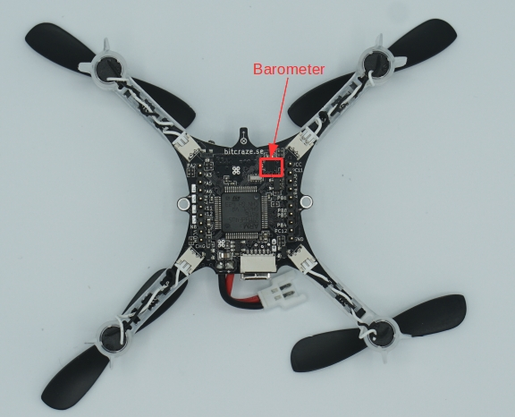
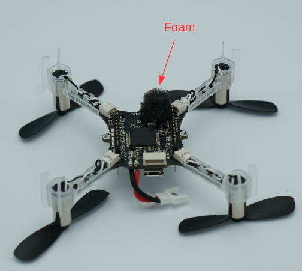

# Crazyflie 2.0 (Discontinued)

:::warning
*Crazyflie 2.0* has been [discontinued/superseded](../flight_controller/autopilot_experimental.md).
Try [Bitcraze Crazyflie 2.1](../complete_vehicles/crazyflie21.md) instead!
:::

:::warning
- PX4 does not manufacture this (or any) autopilot.
  Contact the [manufacturer](https://www.bitcraze.io/) for hardware support or compliance issues.
- PX4 support for this flight controller is [experimental](../flight_controller/autopilot_experimental.md).
:::


The Crazyflie line of micro quads was created by Bitcraze AB.
An overview of the Crazyflie 2.0 can be [found here](https://www.bitcraze.io/crazyflie-2/).


## Quick Summary

:::note
The main hardware documentation is here: https://wiki.bitcraze.io/projects:crazyflie2:index
:::

* Main System-on-Chip: STM32F405RG
  * CPU: 168 MHz ARM Cortex M4 with single-precision FPU
  * RAM: 192 KB SRAM
* nRF51822 radio and power management MCU
* MPU9250 Accel / Gyro / Mag
* LPS25H barometer

## Where to Buy

* [Crazyflie 2.0](https://store.bitcraze.io/collections/kits/products/crazyflie-2-0).
* [Crazyradio PA 2.4 GHz USB dongle](https://store.bitcraze.io/collections/kits/products/crazyradio-pa): used for wireless communication between *QGroundControl* and Crazyflie 2.0.
* [Breakout deck](https://store.bitcraze.io/collections/decks/products/breakout-deck): breakout expansion board for connecting new peripherals.
* [Flow deck](https://store.bitcraze.io/collections/decks/products/flow-deck): contains an optical flow sensor to measure movements of the ground and a distance sensor to measure the distance to the ground.
  This will be useful for precise altitude and position control.
* [Z-ranger deck](https://store.bitcraze.io/collections/decks/products/z-ranger-deck) has the same distance sensor as the Flow deck to measure the distance to the ground.
  This will be useful for precise altitude control.
* [SD-card deck](https://store.bitcraze.io/collections/decks/products/sd-card-deck): used for high speed onboard logging to a micro SD card.
* [Logitech Joystick](https://support.logi.com/hc/en-us/articles/360024326793--Getting-Started-Gamepad-F310).

## Flashing PX4

After setting up the PX4 development environment, follow these steps to install the PX4 Autopilot on the Crazyflie 2.0:

1. Download the source code of the PX4 Bootloader:
   ```
   git clone https://github.com/PX4/Bootloader.git
   ```
1. Navigate into the top directory of the source code and compile it using:
   ```
   make crazyflie_bl
   ```
1. Put the Crazyflie 2.0 into DFU mode by following these steps:
   - Ensure it is initially unpowered.
   - Hold down the reset button (see figure below...).
     
   - Plug into computer's USB port.
   - After a second, the blue LED should start blinking and after 5 seconds should start blinking faster.
   - Release button.
   
1. Install *dfu-util*:
   ```
   sudo apt-get update
   sudo apt-get install dfu-util
   ```

1. Flash bootloader using *dfu-util* and unplug Crazyflie 2.0 when done: 
   ```
   sudo dfu-util -d 0483:df11 -a 0 -s 0x08000000 -D ./build/crazyflie_bl/crazyflie_bl.bin
   ``` 
   When powering on the Crazyflie 2.0 the yellow LED should blink.
   
1. Download the source code of the PX4 autopilot:
   ```
   git clone https://github.com/PX4/PX4-Autopilot.git
   ```
1. Navigate into the top directory of the source code and compile it using:
   ```
   make bitcraze_crazyflie_default upload
   ```
1. When prompted to plug in device, plug in Crazyflie 2.0. 
   The yellow LED should start blinking indicating bootloader mode. 
   Then the red LED should turn on indicating that the flashing process has started.
1. Wait for completion.
1. Done! Calibrate the sensors using [QGroundControl](https://docs.qgroundcontrol.com/master/en/SetupView/Sensors.html).

:::note
If QGroundControl does not connect with the vehicle, ensure that in [nuttx-config](https://github.com/PX4/PX4-Autopilot/blob/main/boards/bitcraze/crazyflie/nuttx-config/nsh/defconfig) for crazyflie `# CONFIG_DEV_LOWCONSOLE is not set` is replaced by `CONFIG_DEV_LOWCONSOLE=y`.
This should be done using *menuconfig*:
```
make bitcraze_crazyflie_default menuconfig
```
or *qconfig* (Check *Low-level console support* under *Serial Driver Support* in GUI):
```
make bitcraze_crazyflie_default qconfig
```
:::

## Wireless Setup Instructions

The onboard nRF module allows connecting to the board via Bluetooth or through the proprietary 2.4GHz Nordic ESB protocol.

- A [Crazyradio PA](https://www.bitcraze.io/crazyradio-pa/) is recommended.
- To fly the Crazyflie 2.0 right away, the Crazyflie phone app is supported via Bluetooth.

Using the official Bitcraze **Crazyflie phone app**:

- Connect via Bluetooth.
- Change mode in settings to 1 or 2.
- Calibrate via QGroundControl.

Connecting via **MAVLink**:

- Use a Crazyradio PA alongside a compatible GCS.
- Download the *crazyflie-lib-python* source code:
   ```
   git clone https://github.com/bitcraze/crazyflie-lib-python.git
   ```

:::note
We will use [cfbridge.py](https://github.com/bitcraze/crazyflie-lib-python/blob/master/examples/cfbridge.py) to setup a wireless MAVlink communication link between Crazyflie 2.0 (flashed with PX4) and QGroundControl. *Cfbridge* enables QGroundControl to communicate with the crazyradio PA. 
The [C based cfbridge](https://github.com/dennisss/cfbridge) is currently experiencing data loss issues, which is why we have chosen to use **cfbridge.py**.
:::

- Make sure you have set the udev permissions to use the USB Radio. To do this, follow the steps listed [here](https://www.bitcraze.io/documentation/repository/crazyflie-lib-python/master/installation/usb_permissions/) and **restart** your computer.
- Connect a Crazyradio PA via USB.
- Build a [virtual environment (local python environment)](https://virtualenv.pypa.io/en/latest/) with package dependencies using the following method:
    ```
    pip install tox --user
    ```
- Navigate to the crazyflie-lib-python folder and type: 
    ```
    make venv
    ```
- Activate the virtual environment: 
    ```
    source venv-cflib/bin/activate
    ```
- Install required dependencies:
    ```
    pip install -r requirements.txt --user
    ```

To connect Crazyflie 2.0 with crazyradio, **launch cfbridge** by following these steps:
- Power off and power on Crazyflie 2.0 and wait for it to boot up.
- Connect a Crazyflie radio device via USB.
- Navigate to the crazyflie-lib-python folder.
- Activate the environment: 
    ```
    source venv-cflib/bin/activate
    ```
- Navigate to the examples folder:
    ```
    cd examples
    ```
- Launch cfbridge: 
    ```
    python cfbridge.py
    ```

  :::note
  *Cfbridge* by default tries to initiate the radio link communication on channel 80 and with crazyflie address 0xE7E7E7E7E7. 
  If you are using [multiple crazyflies and/or crazyradios](https://github.com/dennisss/cfbridge/blob/master/README.md#advanced-swarming) in the same room and want to use a different channel and/or address for each, first connect the crazyflie with QGroundControl via a USB cable and change the syslink parameters (channel, address) in QGroundControl.
  Next, launch the cfbridge by giving the same channel and address as   the first and second arguments respectively, e.g: `python cfbridge.py 90 0x0202020202`
  :::
- Open QGroundControl.
- After using *cfbridge*, you can deactivate the virtualenv if you activated it by pressing `CTRL+z`.
  Most of the time, launching *cfbridge* again from the same terminal doesn't connect to crazyflie, this can be solved by closing the terminal and relaunching *cfbridge* in a new terminal. 

:::tip
If you change any driver in [crazyflie-lib-python](https://github.com/bitcraze/crazyflie-lib-python) or if launching *cfbridge* in a new terminal does not find crazyflie, you can try navigating to the crazyflie-lib-python folder and run the script below to rebuild cflib.

```
make venv
```
:::

:::note
To use Joystick, set `COM_RC_IN_MODE` in QGroundControl to "Joystick/No RC Checks".
Calibrate the Joystick and set the Joystick message frequency in QGroundControl to any value between 5 to 14 Hz (10 Hz is recommended).
To be able to set the frequency, the advanced option should be enabled.
This is the rate at which Joystick commands are sent from QGroundControl to Crazyflie 2.0 (to do this, you will need to follow the instructions [here](https://github.com/mavlink/qgroundcontrol) to obtain the latest QGroundControl source code (master) and build it).
:::


## Hardware Setup

Crazyflie 2.0 is able to fly with precise control in [Stabilized mode](../flight_modes/manual_stabilized_mc.md), [Altitude mode](../flight_modes/altitude_mc.md) and [Position mode](../flight_modes/position_mc.md). 

* You will need the [Z-ranger deck](https://store.bitcraze.io/collections/decks/products/z-ranger-deck) to fly in *Altitude* mode. 
  If you also want to fly in the *Position* mode, it is recommended you buy the [Flow deck](https://store.bitcraze.io/collections/decks/products/flow-deck) which also has the integrated Z-ranger sensor.
* The onboard barometer is highly susceptible to any external wind disturbances including those created by Crazyflie's own propellers. Hence, we isolated the barometer with a piece of foam, and then mounted the distance sensor on top of it as shown below:






In order to log flight details, you can mount SD card deck on top of crazyflie as shown below:


Then, you need to stick the battery on top of the SD card deck using a double sided tape:


## Altitude Control 

Crazyflie is able to fly in *Altitude* mode if you use a [Z-ranger deck](https://store.bitcraze.io/collections/decks/products/z-ranger-deck). 
According to the datasheet, the maximum height (above ground) the range finder can sense is 2 m. However, when tested on dark surfaces this value decreases to 0.5 m. On a light floor, it goes up to max 1.3 m. This means you cannot hold altitudes above this value in *Altitude* or *Position* flight modes.

:::tip
If the Crazyflie 2.0 height drifts at mid-throttle command in *Altitude mode* or *Position mode*, first try rebooting the vehicle. If this does not fix the problem, recalibrate the accel and mag (compass).  
:::

:::note
Since the onboard barometer is highly susceptible to wind disturbances created by the Crazyflie's own propellers, you cannot rely on it to hold altitude.
:::

## Position Control 

With [Flow deck](https://store.bitcraze.io/collections/decks/products/flow-deck), you can fly Crazyflie 2.0 in *Position mode*. 
Unlike [PX4FLOW](../sensor/px4flow.md), the flow deck does not house a gyro, hence the onboard gyro is used for flow fusion to find the local position estimates. 
Moreover, the flow deck shares the same SPI bus as the SD card deck, therefore logging at high rate on SD card is not recommended when flying in *Position mode*. 

:::note
A ulog for flight in *Position* mode is available [here](https://logs.px4.io/plot_app?log=a0e68bf1-e905-410f-b828-f6146dba9d45).
This can be used as a reference to compare your flight performance.
:::

## Using FrSky Taranis RC Transmitter as Joystick

If you already own a Taranis RC transmitter and want to use it as a controller, it can be configured as a USB Joystick:

- Create a new model in Taranis.

  

- In *MODEL SETUP* menu page, turn off both internal and external TX modules.

  

- In *OUTPUTS* menu page (also called “SERVOS” page in some Taranis transmitters), invert Throttle (CH1) and Aileron (CH3).

  
  

To use Taranis switches to arm/disarm and switch to different flight modes:

- In Taranis UI *MIXER* menu page, you can assign the switches to any channel in the range channel 9-16 which map to the buttons 0-7 in the QGroundControl Joystick setup. For example, Taranis “SD” switch can be set to channel 9 in Taranis UI:

  

- Connect Taranis to PC with a USB cable and Open QGroundControl. 
- In QGroundControl Joystick Setup, you can see the buttons turning yellow when you switch them on. For example, channel 9 in Taranis maps to button 0 in QGroundControl Joystick setup. You can assign any mode to this button e.g. *Altitude* mode. Now when you lower the switch "SD", flight mode will change to *Altitude*.

  

### ROS

To connect to Crazyflie 2.0 via MAVROS:

- Start up *cfbridge* using the above instructions.
- Change the UDP port QGroundControl listens to:
  - In QGroundControl, navigate to **Application Settings > General** and uncheck all the boxes under *Autoconnect to the following devices*.
  - Add in **Comm Links** a link of type *UDP*, check the *Automatically Connect on Start* option, change the *Listening Port* to 14557, add Target Hosts: 127.0.0.1 and then press **OK**.
- Make sure you have [MAVROS](https://github.com/mavlink/mavros/tree/master/mavros#installation) installed.
- Start MAVROS with command:

  ```
  roslaunch mavros px4.launch fcu_url:="udp://:14550@127.0.0.1:14551" gcs_url:="udp://@127.0.0.1:14557"
  ```
- Restart QGroundControl if it doesn't connect.

## Flying

@[youtube](https://youtu.be/2Bcy3k1h5uc)
