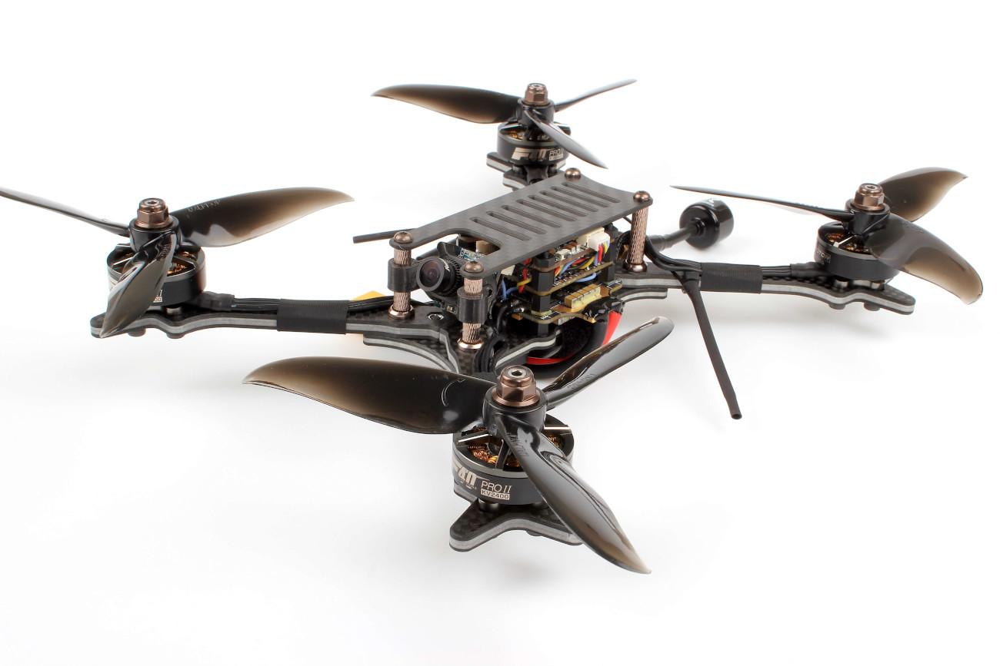

# Holybro Kopis 2

The [Holybro Kopis 2](https://holybro.com/products/kopis2-hdv-free-shipping) is a ready-to-fly race quad for flying FPV or line-of-sight.

## Where to Buy

The *Kopis 2* can be bought from a number of vendors, including:
- [Holybro](https://holybro.com/products/kopis2-hdv-free-shipping)  <!-- item code 30069, 30070 -->
- [GetFPV](https://www.getfpv.com/holybro-kopis-2-fpv-racing-drone-pnp.html)

In addition you will need:

- An RC transmitter. The *Kopis 2* can ship with an FrSky receiver or no receiver at all.
- LiPo battery and charger.
- FPV goggles if you want to fly FPV.
  There are many compatible options, including these ones from [Fatshark](https://www.fatshark.com/product-page/dominator-v3).
  You can also use DJI FPV goggles if you have the HDV version of the Kopis 2.

  :::note
  FPV support is completely independent of PX4/flight controller.
  :::

## Flashing PX4 Bootloader

The *Kopis 2* comes preinstalled with Betaflight.

Before loading PX4 firmware you must first install the PX4 bootloader.
Instructions for installing the bootloader can be found in the [Kakute F7](../flight_controller/kakutef7.md#bootloader) topic (this is the flight controller board on the *Kopis 2*).

:::tip
You can always [reinstall Betaflight](../advanced_config/bootloader_update_from_betaflight.md#reinstall-betaflight) later if you want!
:::

## Installation/Configuration

Once the bootloader is installed, you should be able to connect the vehicle to *QGroundControl* via a USB cable.

:::note
At time of writing *Kopis 2* is supported on the QGroundControl *Daily Build*, and prebuilt firmware is provided for the master branch only (stable releases are not yet available).
:::

To install and configure PX4:
- [Load PX4 Firmware](../config/firmware.md).
- [Set the Airframe](../config/airframe.md) to *Holybro Kopis 2*.
- Continue with [basic configuration](../config/README.md), including sensor calibration and radio setup.

