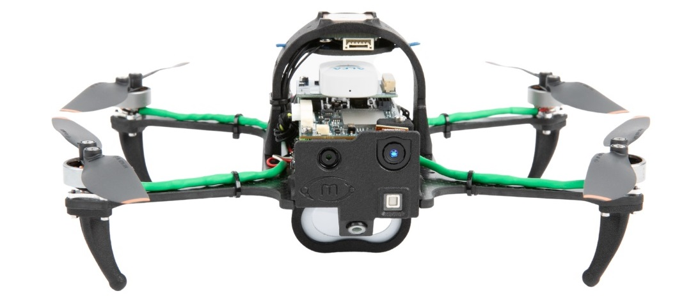
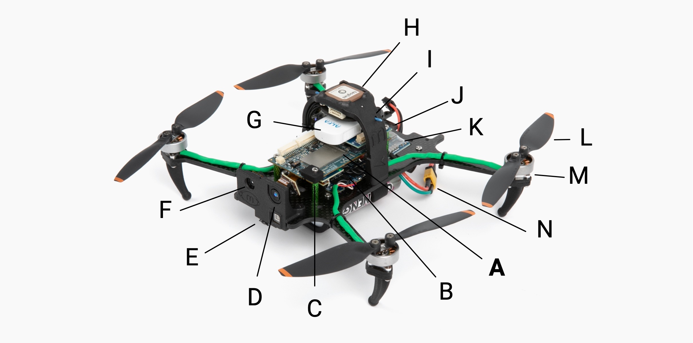

# VOXL 2 Starling PX4 Development Drone

The [Starling](https://modalai.com/starling) is a SLAM development drone supercharged by [VOXL 2](https://modalai.com/voxl-2) and PX4 with SWAP-optimized sensors and payloads optimized for indoor and outdoor autonomous navigation. Powered by Blue UAS Framework autopilot, VOXL 2, the Starling weighs only 275g and boasts an impressive 30 minutes of autonomous indoor flight time.

The VOXL 2 Starling is a PX4 development drone that houses a [VOXL 2](https://modalai.com/voxl-2) companion computer and PX4 flight controller, image sensors, GPS, and connectivity modem and is ready-to-fly out-of-the-box. The Starling features ModalAI’s [open SDK](https://docs.modalai.com/voxl-developer-bootcamp/) that has pre-configured autonomy models for computer vision assisted flight. This development drone is meant to help you get to market faster and accelerate your application development and prototyping. 

This guide explains the minimal additional setup required to get the UAV ready to fly. It also covers a hardware overview, first flight, setting up WiFi, and more. 

**Note:** For complete and regularly updated documentation, please visit https://docs.modalai.com/starling-v2.  

**Note:** If you are new to VOXL, be sure to familiarize yourself with the core features of VOXL hardware and software by reviewing the [VOXL Bootcamp](https://docs.modalai.com/voxl-developer-bootcamp/)

## Where to Buy

[modalai.com/starling](https://modalai.com/starling)

# Starling Developer’s Guide

1. Hardware Overview
1. Datasheet
1. Tutorial Videos

## Hardware Overview

| Callout | Description                           | MPN              |
|---------|---------------------------------------|------------------|
| A       | VOXL 2                                | MDK-M0054-1      |
| B       | VOXL 4-in-1 ESC                       | MDK-M0117-1      |
| C       | Barometer Shield Cap                  | M10000533        |
| D       | ToF Image Sensor (PMD)                | MDK-M0040        |
| E       | Tracking Image Sensor (OV7251)        | M0014            |
| F       | Hires Image Sensor (IMX214)           | M0025-2          |
| G       | AC600 WiFi Dongle                     | AWUS036EACS      |
| H       | GNSS GPS Module & Compass             | M10-5883         |
| I       | 915MHz ELRS Receiver                  | BetaFPV Nano RX  |
| J       | USB C Connector on VOXL 2 (not shown) |                  |
| K       | VOXL Power Module                     | MCCA-M0041-5-B-T |
| L       | 4726FM Propellor                      | M10000302        |
| M       | Motor 1504                            |                  |
| N       | XT30 Power Connector                  |                  |

 

