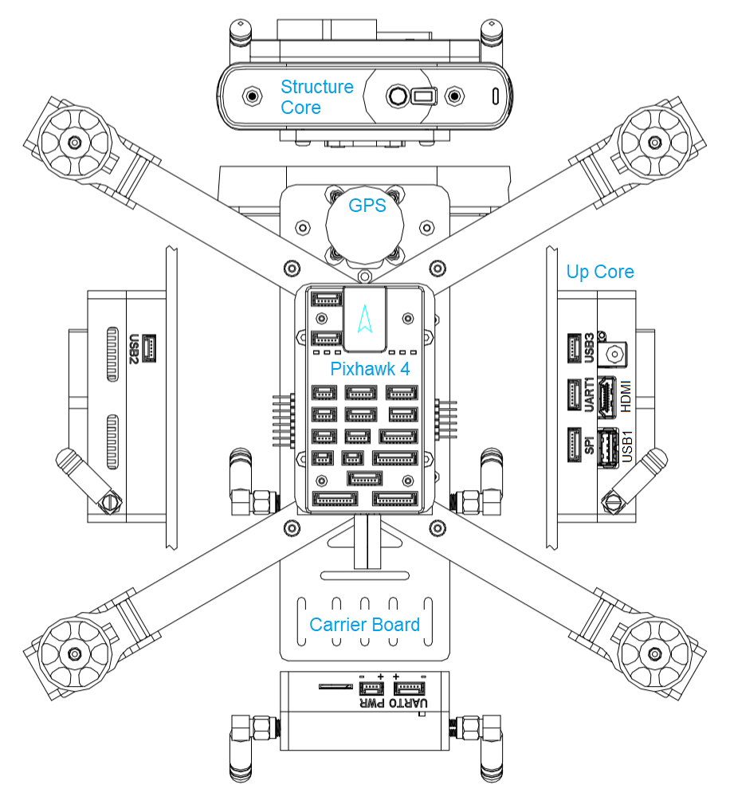
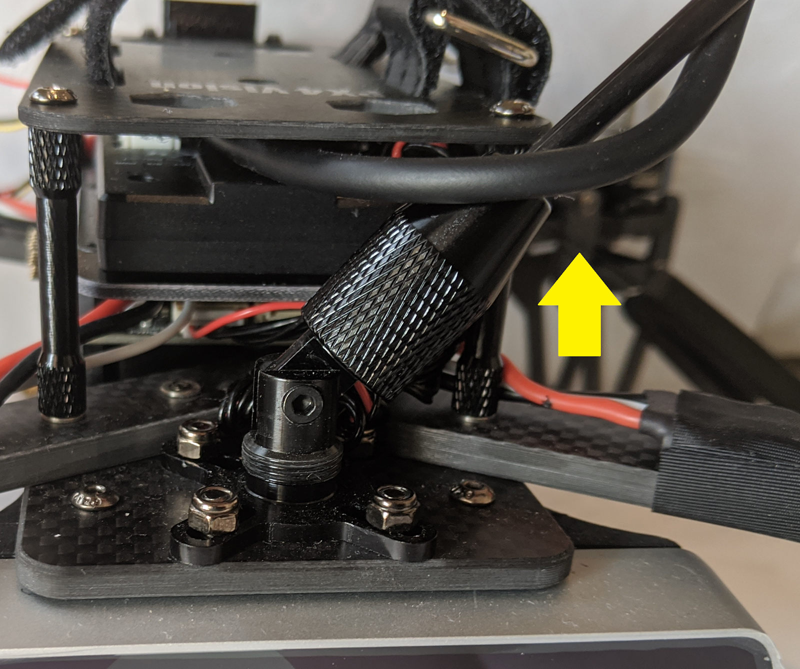
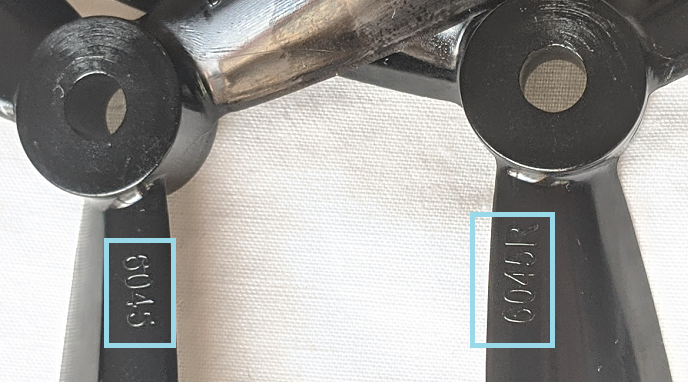
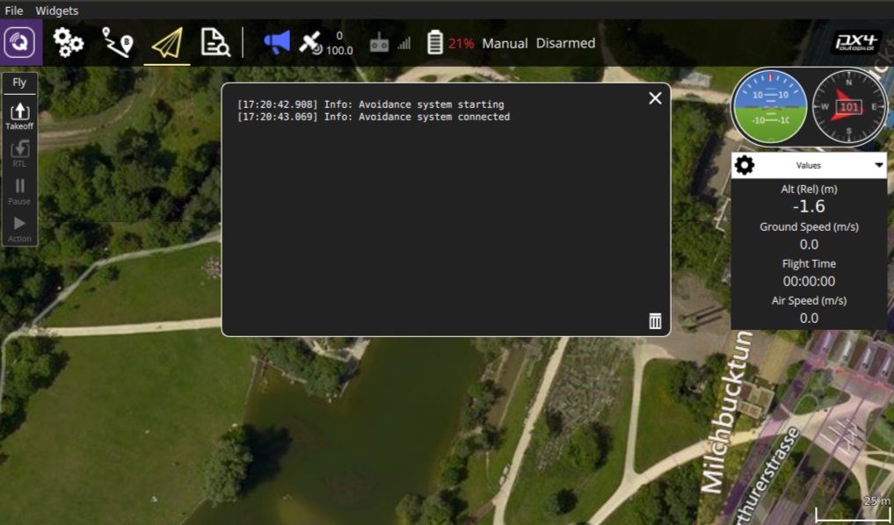
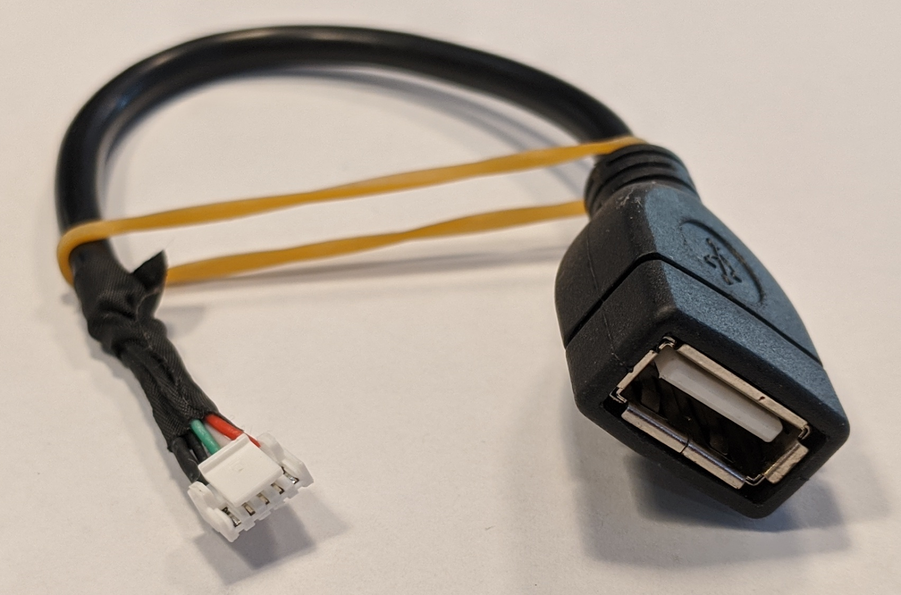

## PX4 Vision Autonomy Development Kit (Early Adopter Edition)


<!-- Getting Started Guide -->


## Introduction

The *PX4 Vision Autonomy DevKit* is a robust and inexpensive kit for enabling computer vision development on autonomous vehicles.

The kit contains a near-ready-to-fly carbon-fiber quadcopter equipped with a Pixhawk 4 flight controller, Upcore companion computer, and Occipital Structure Core depth camera sensor.
The vehicle comes with software for PX4 [Obstacle Avoidance](http://docs.px4.io/master/en/computer_vision/obstacle_avoidance.html) and [Collision Prevention](http://docs.px4.io/master/en/computer_vision/collision_prevention.html) enabled “out of the box”.
Developers can use the kit to try out other features provided by the PX4 Avoidance project, modify the existing code, or experiment with completely new computer vision-based functionality.

The guide explains the minimal additional setup required to get the vehicle ready to fly (installing an RC system and battery).
It also covers the first flight, and how to get started with modifying the computer vision code.

## Schematic Overview





## Getting to know your DevKit


The DevKit contains following components:
- PX4 Vision drone kit with these internal parts:
  - 1x Pixhawk 4 flight controller (with custom PX4 firmware)
  - 1x pmw3901 optical flow sensor
  - 1x distance sensor
  - 1x Structure Core depth camera
  - 1x Up Core companion computer
    - Atom CPU
    - FTDI UART connected to flight controller
    - USB2 port connected to depth camera
    - Unused USB3 A port
    - SD card slot
    - HDMI out
    - Wifi attached to external antenna #1
  - ESP8266 connected to flight controller, attached to external wifi antenna #2
- A USB2.0 stick with pre-flashed software that bundles:
  - Ubuntu 18.04 LTS
  - ROS Melodic
  - Occipital Structure Core ROS driver 
  - MAVROS
  - PX4 Avoidance
- Assorted cables, propellers, and other accessories (from Pixhawk 4, Structure Core and other components).
  To be used to attach additional peripherals.


## What else do you need?

The kit contains all the essential drone hardware except a battery and an RC control system, which must be purchased separately:
- Battery
  - 4S LiPo with XT60 female connector
  - Less than 115mm long (to fit between power connector and GPS mast)
- Remote control receiver/transmitter system
  - Any [PX4-compatible RC System](../getting_started/rc_transmitter_receiver.md) can be used.
  - An FrSky Taranis transmitter with R-XSR receiver is one of the more popular setups.
- A H2.0 Hex Key (to undo the screws from top plate to connect your receiver to flight controller)

In addition, users will need ground station hardware/software:
- Laptop or tablet running [QGroundControl](https://docs.qgroundcontrol.com/en/getting_started/download_and_install.html) (“QGC”).


## First-time setup

1. Attach an RC Receiver to the vehicle (not supplied with kit):
   - Remove the top plate using an H2.0 hex key tool.
   - Connect the receiver to the flight controller:
     - [Pixhawk 4 Wiring Diagrams](../assembly/quick_start_pixhawk4.md)
     - [Radio Systems](../getting_started/rc_transmitter_receiver.md#connecting-receivers)
   - Re-attach the top plate.
   - Mount the RC receiver on the carrier plate at the back of the vehicle (using zipties or double-sided tape). 
   - Ensure the antennas are clear of any obstructions and electrically isolated from the frame (e.g. secure them under the carrier board or to the vehicle arms or legs).


1. Bind the RC transmitter/receiver units if this has not already been done. The binding procedure depends on the specific air and ground RC modules used (read the receiver manual).
1. Raise the GPS mast and screw the cover onto the holder on the base plate.

   

1. Power the vehicle with a fully charged battery.
   Make sure all the props are removed in this step
1. Connect the Pixhawk 4 to the ground station using a USB cable.
1. Start QGroundControl on the ground station
1. Make sure the airframe is set to **PX4 Vision Devkit Platform **.
1. [Calibrate RC](../config/radio.md)
1. [Calibrate the compass](../config/compass.md), if needed.
1. [Calibrate any other sensors](../config/README.md), if needed.
Generally sensors should be pre-calibrated in the factory and this will not be necessary.
1. (Optional) Configure a [Flight Mode selector switch](../config/flight_mode.md).
   We recommend that you minimally configure RC switches for:
   - [Position Mode](../flight_modes/position_mc.md) (for testing collision prevention, and a safe mode for manual flight)
   - [Mission Mode](../flight_modes/mission.md) (“Auto” - for testing obstacle avoidance), 
   - [Return Mode](../flight_modes/return.md) (for easy return and land).
1. Attach the propellers with the rotations as shown:
   

   - The propellers directions can be determined from the labels: *6045* (clockwise) and _6045_**R** (reversed).
     

   - Screw down firmly using the provided propellor nuts:
     

## Fly the drone (with avoidance running) {#fly_drone}

When the vehicle setup is complete:

1. Plug in the pre-imaged USB from the kit into the Up Core companion computer USB1 port (highlighted below).

   
1. Connect the battery to start the vehicle
   > **Note** The companion computer will take about 2.5 minutes to boot Ubuntu from the USB stick and start the “local planner” avoidance system.

1. Check that the local planner has started properly:
   > **Note** The vehicle will reject arming commands if the avoidance system is not running.

   - The QGC log displays the message: **Avoidance system connected** when the avoidance system running on the companion computer successfully boots.
     
   - A red laser is visible from the front of the Structure Core camera when the avoidance system is running
1. Wait for the GPS to turn green. This means that the vehicle has a GPS fix and is ready to fly!
1. To monitor the vehicle when flying, connect the ground station to the vehicle WiFi network using the following default credentials:
   - **SSID:** pixhawk4
   - **Password:** pixhawk4

   > **Note** WiFi network SSID, password, and other credentials may be changed after connecting (if desired), by using a web browser to open the URL: `http://192.168.4.1`. The baud rate must not be changed from 921600.

1. Find a safe outdoor location for flying, ideally with a tree or other convenient obstacle for testing PX4 Vision.
   > **Note** PX4 obstacle avoidance and collision prevention can only be used when GPS is available (not indoors).
1. To test [collision prevention](../computer_vision/collision_prevention.md), enable Position mode and fly manually towards an obstacle. The vehicle should slow down and then stop within 6m of the obstacle (the distance can be [changed](../advanced_config/parameters.md) using the [CP_DIST](../advanced_config/parameter_reference.md#CP_DIST) parameter).
   > **Tip** While collision prevention is active you will be unable to manually pitch, roll, or yaw.

1. To test [obstacle avoidance](../computer_vision/obstacle_avoidance.md), create a mission where the path is blocked by an obstacle.
  Then switch to auto mode to run the mission, and observe the vehicle moving around the obstacle and then returning to the planned course.


## Development using the kit

The PX4 Avoidance system consists of computer vision software running on a mission computer (with attached depth camera) that provides obstacle and/or path information to the PX4 flight stack running on a *flight controller*.

This kit is primarily intended for developers that want to target the software running on the *mission computer*.

The following sections explain how to boot and log into the PX4 Vision Kit *mission computer*, and use it as an environment for developing computer vision software.

### PX4 avoidance overview

The PX4 Avoidance system consists of computer vision software running on a mission computer (with attached depth camera) that provides obstacle and/or route information to the PX4 flight stack running on a *flight controller*.

Documentation about the mission computer vision/planning software can be found on github here: [PX4/avoidance](https://github.com/PX4/avoidance#obstacle-detection-and-avoidance).
The project provides a number of different planner implementations (packaged as ROS nodes):
- The PX4 Vision Kit runs the *localplanner* by default and this is the recommended starting point for your own software.
- The *globalplanner* may well work but has not been tested. 
- The *landing planner* requires a downward facing camera, and cannot be tested using this kit.

PX4 and the mission computer exchange data over [MAVLink](https://mavlink.io/en/) using these interfaces:
- [Path Planning Interface](../computer_vision/path_planning_interface.md) - API for implementing avoidance features in automatic modes.
- [Collision Prevention Interface](../computer_vision/collision_prevention.md) - API for vehicle based avoidance in manual position mode based on an obstacle map (currently used for collision prevention).

### Boot the mission vomputer {#boot_mission_computer}

The USB stick provided with the kit contains a bootable Ubuntu Linux 18.04 image with PX4 Avoidance software included, and which automatically runs the local planner for object avoidance and collision prevention on startup.

The first three steps of [Fly the drone (with avoidance running)](#fly_drone) explain how to connect the drone and test when the avoidance software has started.

Once started the mission computer can be used both as a computer vision development environment and for running the software.


### Login to the mission computer {#login_mission_computer}

To login to the Ubuntu companion computer:
1. Connect a keyboard and mouse to the companion computer via its USB2 port:
   - Connect using the USB-JST cable provided in the kit
     
   - If you have separate connectors for the keyboard and mouse, you will need a USB-hub. 
1. Connect a monitor to the mission computer via its HDMI port.

   

   The Ubuntu login screen should then appear on the monitor. 
1. Login to the companion using the credentials:
   - **Username:** px4vision
   - **Password:** px4vision

### Installing the image on the mission computer  {#install_image_mission_computer}

You can alternatively install the image and boot from mission computer memory (instead of the USB).

To flash the USB image on to the eMMC of the companion computer:

1. Plug in the pre-flashed USB drive on the companion computer (same port?)
1. [Login to the mission computer](#login_mission_computer) (as described above).
1. Open a terminal and run the following command to flash the pre-flashed image onto the eMMC.
   The terminal will prompt for a number of responses as you reflash the companion computer.
   ```sh
   cd ~/catkin_ws/src/px4vision_ros
   sudo ./flash_emmc.sh
   ```
	
   > **Note** All information saved in the companion computer will get removed when executing this script

1. Pull out the USB stick
1. Restart the vehicle, the companion computer will now boot from the eMMC.
1. The catkin workspace will be in `~/catkin_ws` already configured for Avoidance. The launch file `avoidance.launch` file from boot is in the `px4vision_ros` package

### Start developing on PX4 Avoidance

The PX4 Vision’s UpCore companion computer provides a complete and fully configured environment for extending PX4 Avoidance software (and more generally, for developing new computer vision algorithms using ROS2). You should develop and test your software on the vehicle, sync it to your own git repository, and share any fixes and improvements with the wider PX4 community on the github [PX4/Avoidance](https://github.com/PX4/avoidance) repo.

The avoidance package is initiated from boot.
To integrate a different planner, this needs to be disabled.

1. Disable the avoidance process using the following command:
   ```sh
   systemctl stop avoidance.service
   ```
   To make this change permanent even after a reboot, the process needs to be disabled:
   ```sh
   systemctl disable avoidance.service
   ```

1. The source code of the obstacle avoidance package can be found in https://github.com/PX4/avoidance which is located in `~/catkin_ws/src/avoidance`.

1. Make changes to the code! To get the latest code of avoidance pull the code from the avoidance repo:
   ```sh
   git pull origin
   git checkout origin/master
   ```
1. Build the package
   ```
   catkin build local_planner
   ```

The ROS workspace is placed in `~/catkin_ws`. 
or reference on developing in ROS and using the catkin workspace, see the [ROS catkin tutorials](http://wiki.ros.org/catkin/Tutorials).


### Developing PX4 firmware

The kit is designed for creating computer vision software that runs on the mission computer, and which integrates with PX4’s flexible path planning and collision prevention interfaces.

Modification of PX4 code is not needed to meet most computer vision use cases.
To discuss the interfaces or how to integrate other features join the PX4 slack channel: #computer-vision.

> **Note** Modification of the firmware is not currently even possible (at time of writing).
  The PX Vision Devkit Early Adopter Edition currently relies on specially configured custom firmware, and should not be used with any other firmware.

## Other development resources

- UpCore companion computer technical information: UpWiki
- Structure Core camera information: occipital developer forum 
- [Pixhawk 4 Overview](../flight_controller/pixhawk4.md)
- [PX4 Avoidance software/documentation](https://github.com/PX4/avoidance)
- [Path Planning Interface](../computer_vision/path_planning_interface.md) 

## Warnings & Notifications

There is a label for Do not power the Up Core companion computer using the power socket (this may destroy the computer). The companion should only be powered using the battery.
PX4 Vision can only be used for forward-facing computer vision projects (it does not have downward or rear-facing depth cameras). Consequently it can’t be used for projects like PX4 Avoidance Safe Landing planner that require a downward facing camera.

## How to get technical support?

For hardware issues, please contact Holybro at: [support@holybro.com](mailto:support@holybro.com).

For software issues, use the following [community support channels](README.md#support):
- PX4 discuss: [Computer Vision](https://discuss.px4.io/c/Vision-based-navigation-and-obstacle-avoidance) category.
- PX4 slack channel: #avoidance

