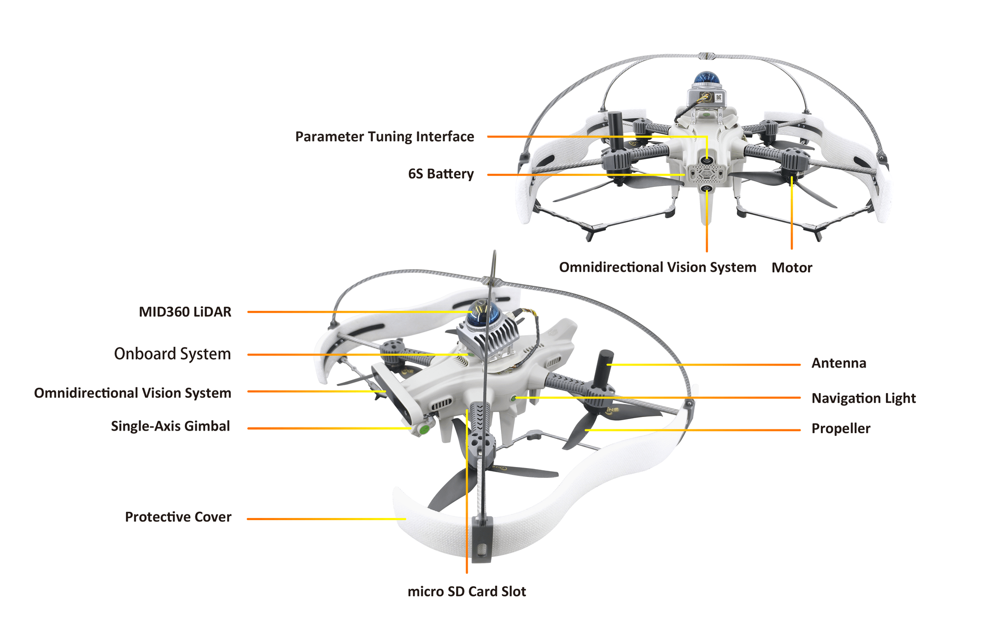

# Amovlab SU17 Drone

The [Amov SU17](https://docs.amovlab.com/su17u-v2-wiki/#/en-src/) is a brand-new quadrotor drone development platform based on PX4 developed by Amovlab integrating the latest hardware devices.

It supports four-camera SLAM, RTK, 3D LiDAR, optical flow altitude sensors, gimbal pods, and other sensor equipment, specifically providing a drone development platform for drone developers and industry users.
This drone has a high level of integration, incorporating our self-developed flight control, image telemetry, high-performance onboard computer, four MIPI time-synchronized cameras, and one 2-megapixel primary camera.
The main PCB board is a 10-layer board, and the main components are all electromagnetic shielded.

## Where to Buy

Please send email to service@amovauto.com

## Hardware Overview

| Callout | Description                    |
| ------- | ------------------------------ |
| 1       | MID360 LiDAR                   |
| 2       | Onboard System                 |
| 3       | Omnidirectional Vision System  |
| 4       | Single Axis Gimbal             |
| 5       | Protective Cover               |
| 6       | Micro SD Card Slot             |
| 7       | Propeller                      |
| 8       | Navigation Light               |
| 9       | GPS Antenna                    |
| 10      | Motor                          |
| 11      | Omnidirectional Vision System  |
| 12      | Battery                        |
| 13      | Parameter Adjustment Interface |

### Software structure

### Hardware structure

## Datasheet

### Specifications

| Parameter                                | Value                                                                                                                  |
| ---------------------------------------- | ---------------------------------------------------------------------------------------------------------------------- |
| **Weight (approx.)**                     | 2339.7g (including protective cover/battery)                                                                           |
| **Diagonal Wheelbase**                   | 320 mm (diagonal)                                                                                                      |
| **Dimensions**                           | - 442mm x 388mm x 174 mm (without protective cover + no radar)                                                         |
|                                          | - 442mm x 388mm x 235mm (without protective cover + radar)                                                             |
|                                          | - 485mm x433mm x 263mm (with protective cover + radar)                                                                 |
| **Maximum Payload**                      | 200g                                                                                                                   |
| **Maximum Flight Time**                  | Tested with: takeoff weight: 2339.7g, average endurance around 12.30 minutes, start voltage 26.39V, end voltage 22.40V |
|                                          | - Takeoff preparation: 1 min                                                                                           |
|                                          | - Test duration: 12.22 min                                                                                             |
| **Hover Precision (Radar)**              | Vertical ±0.08m, Horizontal ±0.08m (radar)                                                                             |
| **Hover Precision (Visual)**             | Vertical ±0.05m, Horizontal ±0.05m (visual)                                                                            |
| **Hover Precision (GPS)**                | Vertical ±1.5m, Horizontal ±2.0m (GPS)                                                                                 |
| **Hover Precision Records (10 minutes)** | Description                                                                                                            |
| **Wind Resistance Level**                | Level 4                                                                                                                |
| **Operating Temperature**                | -10℃~40℃ (ambient temperature)                                                                                         |

### Overview Hardware Parameters

| Parameter                     | Value                                                                            |
| ----------------------------- | -------------------------------------------------------------------------------- |
| **Onboard Computer**          |                                                                                  |
| Processor                     | Intel® Core™ i5-8365U                                                            |
| Memory Capacity               | 8GB                                                                              |
| Memory Frequency              | LPDDR3@2133MHz                                                                   |
| Storage                       | 256GB NVMe SSD                                                                   |
| Ethernet                      | Fast Ethernet x2                                                                 |
| Power Supply                  | 12V@3A                                                                           |
| Supports                      | IEEE 1588-2008 (PTP v2)                                                          |
| Serial Ports                  | TTL Serial x2                                                                    |
| Power Supply                  | 5V/3.3V@500mA                                                                    |
| USB                           | TYPE-C x2 (one USB2.0, one USB3.0)                                               |
| HDMI                          | HDMI 1.4                                                                         |
| **Four-Camera Depth Camera**  |                                                                                  |
| Vision Accelerator            | Intel® Movidius™ Myriad™ X VPU                                                   |
| Maximum Resolution            | 1296X816                                                                         |
| Maximum Frame Rate            | 1280X800@120fps                                                                  |
| Shutter Type                  | Global Shutter                                                                   |
| Encoding Format               | 8/10-bit single channel                                                          |
| Pixel Size                    | 3X3 um                                                                           |
| FOV                           | 150.5°DFOV, 127.4°HFOV, 79.7°VFOV                                                |
| Number of Sensors             | 4 (Forward X2 + Rearward X2)                                                     |
| **IMU**                       | BMI270                                                                           |
| **Flight Controller**         |                                                                                  |
| Model                         | ICF6                                                                             |
| Main Controller               | STM32H743                                                                        |
| IMU                           | ICM42688/BMI088                                                                  |
| Compass                       | QMC5883L                                                                         |
| Barometer                     | MS5611                                                                           |
| **Gimbal Camera**             |                                                                                  |
| Maximum Resolution            | 1920X1080                                                                        |
| Maximum Frame Rate            | 1280X720@60fps                                                                   |
| Shutter Type                  | Rolling Shutter                                                                  |
| Pixel Size                    | 3X3 um                                                                           |
| FOV                           | 120°DFOV, 95°HFOV, 54°VFOV                                                       |
| Single-Axis Gimbal            | Controllable Angle: -90°~30° (Pitch Axis)                                        |
| Resolution                    | 1920X1080                                                                        |
| Frame Rate                    | 25FPS                                                                            |
| Media Type                    | RTSP H.264                                                                       |
| Typical Latency               | (Wired)                                                                          |
| Control Precision             | 0.05°                                                                            |
| **GNSS**                      |                                                                                  |
| Horizontal Accuracy           | 1.5 m CEP (with SBAS)                                                            |
| Speed Accuracy                | 0.05m/s                                                                          |
| Operating Mode                | GPS+GLONASS+BDS+GALILEO+SBAS+QZSS                                                |
| **Image Telemetry**           |                                                                                  |
| Operating Frequency Band      | 2.4GHz                                                                           |
| Transmission Power            | 18dBm                                                                            |
| - Maximum Bandwidth           | 40Mbps                                                                           |
| - Maximum Effective Distance  | 3Km (no interference, no obstruction), 1Km (slight interference, no obstruction) |
| - Typical Latency             | 110~150ms (greatly affected by the environment)                                  |
| **Battery**                   |                                                                                  |
| - Model                       | SU17-L                                                                           |
| - Battery Type                | High-voltage lithium-ion polymer battery                                         |
| - Rated Voltage               | 26.4V (max), 21V (min)                                                           |
| - Storage Voltage             | 22.8V (typical)                                                                  |
| - Rated Capacity              | 6000mAh                                                                          |
| - Weight                      | 680g                                                                             |
| **MID360 3D LiDAR**           |                                                                                  |
| - Laser Wavelength            | 905nm                                                                            |
| - Eye Safety Level            | Class 1 (IEC60825-1:2014) Eye Safe                                               |
| - Range (@100 klx)            | 40 m @ 10% reflectivity / 70 m @ 80% reflectivity                                |
| - FOV                         | Horizontal 360°, Vertical -7°~52°                                                |
| - Near Blind Zone             | 0.1m                                                                             |
| - Distance Random Error (1σ)  | ≤2 cm (@10 m) / ≤3 cm (@0.2 m)                                                   |
| - Angular Random Error (1σ)   | ≤0.15°                                                                           |
| - Point Cloud Output          | 200,000 points/sec                                                               |
| - Point Cloud Frame Rate      | 10 Hz (typical)                                                                  |
| - Data Ethernet Port          | 100 BASE-TX Ethernet                                                             |
| - Data Synchronization Method | IEEE 1588-2008 (PTP v2), GPS                                                     |
| - Anti-Interference Function  | Yes                                                                              |
| - False Alarm Rate (@100 klx) | <0.01%                                                                           |
| - IMU                         | Built-in IMU model: ICM40609                                                     |
| - Operating Temperature       | -20℃ to 55℃                                                                      |
| - Power                       | 6.5 W (ambient temperature 25℃)                                                  |
| - Input Voltage Range         | 9~27 V DC                                                                        |
| - Dimensions                  | 65 (W) x 65 (D) x 60 (H) mm                                                      |
| - Weight                      | Approx. 265 g                                                                    |

## Tutorials

[Tutorials](https://docs.amovlab.com/su17u-v2-wiki/#/en-src/%E4%BA%A7%E5%93%81%E7%AE%80%E4%BB%8B/%E4%BA%A7%E5%93%81%E7%AE%80%E4%BB%8B)

### Videos

- [SU17 test flight in multiple scenario](https://www.youtube.com/watch?v=qZDCgk9vr7Y)
- [SU17 indoor inspection](https://www.youtube.com/watch?v=_tiUkOGx5kY)
- [SU17 utilizes 3D LiDAR-based positioning for obstacle avoidance and guided flight](https://www.youtube.com/watch?v=0Kz26P4mn9E)
- [SU17 unbox](https://studio.youtube.com/video/j7gA4E7KNAg/edit)
- [SU17 test flight in multiple scenario](https://www.youtube.com/watch?v=qZDCgk9vr7Y)
- [SU17 inspection test in multiple scenario](https://www.youtube.com/watch?v=rNLOXzG3reM)
- [SU17 demo demonstration](https://www.youtube.com/watch?v=yz7Bn1m12JE)
