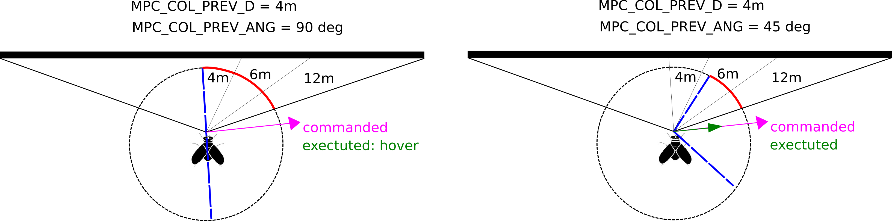

# Collision Prevention

*Collision Prevention* may be used to automatically slow and stop a vehicle before it can crash into an obstacle.

It can be enabled for multicopter vehicles in [Position mode](../flight_modes/position_mc.md), and can use sensor data from an offboard companion computer, a rangefinder attached to the flight controller, or both (fused).

> **Warning** Collision prevention may not prevent a crash if your vehicle is moving too fast!
  This feature has only been tested (at time of writing) for a vehicle moving at 4 m/s.

## Overview

*Collision Prevention* is enabled on PX4 by setting the parameter for minimum allowed approach distance ([MPC_COL_PREV_D](../advanced_config/parameter_reference.md#MPC_COL_PREV_D)).

The feature requires obstacle information from an external system (sent using the MAVLink [OBSTACLE_DISTANCE](https://mavlink.io/en/messages/common.html#OBSTACLE_DISTANCE) message) and/or a [distance sensor](../sensor/rangefinders.md) connected to the flight controller.

> **Note** Multiple sensors can be used to get information about, and prevent collisions with, objects *around* the vehicle. 
  If multiple sources supply data for the *same* orientation, the system uses the data that reports the smallest distance to an object.

The data from all sensors is fused into a range scan (a 360 degree map of the sensor data/state from around the vehicle), which is then input to the collision prevention algorithm.
The collision prevention algorithm only uses/considers part of the range scan data in the calculation of the velocity limit (see [MPC_COL_PREV_ANG Angle Tuning](#angle_tuning)).

The vehicle starts braking as soon as it detects an obstacle, and will stop movement when it reaches the minimum allowed separation (the velocity depends on the geometry, measured distances, and range of sensor data being considered).
If the vehicle approaches any closer (i.e. it overshoots or is pushed) negative thrust is applied to repel it from the obstacle.

In order to move away from an obstacle the user must command the vehicle to move toward a setpoint that is an "acceptable" angle away from the obstacle.
The angle that must be used depends on [MPC_COL_PREV_ANG Angle Tuning](#angle_tuning).

The user is notified through *QGroundControl* while *Collision Prevention* is actively controlling velocity setpoints.

## PX4 (Software) Setup

Configure collision prevention by [setting the following parameters](../advanced_config/parameters.md) in *QGroundControl*:

* [MPC_COL_PREV_D](../advanced_config/parameter_reference.md#MPC_COL_PREV_D) - Set the minimum allowed distance (the closest distance that the vehicle can approach the obstacle).
  Set negative to disable *collision prevention*.

  This should be tuned for both the *desired* minimal distance and likely speed of the vehicle.
* [MPC_COL_PREV_ANG](#angle_tuning) - Set the angle (to both sides of the commanded direction) within which collected sensor data is used.

If you are using a distance sensor attached to your flight controller for collision prevention, it will need to be [attached and configured](#rangefinder) as described in the next section.
If you are using a companion computer to provide obstacle information see [companion setup](#companion).

### MPC_COL_PREV_ANG Angle Tuning {#angle_tuning}

The data from all sensors is fused into a range scan (a 360 degree map of the sensor data/state from around the vehicle), which is then input to the collision prevention algorithm.

The collision prevention algorithm only uses part of the range scan data in the calculation of the velocity limit (which we refer to as the *considered sensor data*). 
This comprises the sensor data from the range scan that is within two [MPC_COL_PREV_ANG](../advanced_config/parameter_reference.md#MPC_COL_PREV_ANG) degree arcs centered around the commanded direction.

Provided none of the *considered sensor data* includes data below the minimum allowed distance, the executed speed depends on the geometry, considered data, and actual sensor values.
The vehicle will not move if **any** *considered sensor data* is below the minimum allowed separation.

> **Tip** Generally 45 degrees is a good compromise value. 
  Using a larger angle reduces the chance of clipping obstacles, but can make it feel like the vehicle is "always getting "stuck" (as you're more likely to detect an obstacle within the minimum distance).

The diagrams below are used to illustrate how the setting works, where:
- The minimum distance (separation) `MPC_COL_PREV_D = 4m`, and the sensor range is 12m.
- The pink line shows where the user is trying to move the vehicle (this is the same for both diagrams).
- The blue line shows the angle where received sensor data *can be used* (and what will be discarded).
  - This is equal to double `MPC_COL_PREV_ANG` degrees centred on the commanded setpoint.
  - On the left diagram the `MPC_COL_PREV_D` angle is 90 degrees, so all sensor data from the right hand side of the blue line is included.
  - On the right the angle is 45 degrees, resulting in a smaller set of sensor data being used (note the sensor data close to the obstacle is excluded!)
- The red arc shows the angle where sensor data *will be used*.
  This is the subset of sensors that are both in range of an obstacle, and within the angle defined by the blue line.

The vehicle on the left specifies a large angle, causing the collision prevention algorithm to consider sensor data that is within the 4m minimum separation.
As a result the commanded setpoint is ignored (vehicle doesn't move).

The vehicle on the right uses an angle that causes the collision prevention algorithm to discard the sensor data that is closest to the obstacle.
The vehicle is can move in the commanded direction, albeit perhaps at a reduced velocity.

## PX4 Distance Sensor {#rangefinder}

At time of writing PX4 allows you to use the [Lanbao PSK-CM8JL65-CC5](../sensor/cm8jl65_ir_distance_sensor.md) IR distance sensor for collision prevention "out of the box", with minimal additional configuration:
- First [attach and configure the sensor](../sensor/cm8jl65_ir_distance_sensor.md), and enable collision prevention (as described above, using `MPC_COL_PREV_D`).
- Set the sensor orientation using [SENS_CM8JL65_R_0](../advanced_config/parameter_reference.md#SENS_CM8JL65_R_0).

<!-- ROTATION_FORWARD_FACING - Does it matter what angles? - ie is collision prevention active in 3 D? -->

Other sensors may be enabled, but this requires modification of driver code to set the sensor orientation and field of view.
- Attach and configure the distance sensor on a particular port (see [sensor-specific docs](../sensor/rangefinders.md)) and enable collision prevention using `MPC_COL_PREV_D`.
- Modify the driver to set the orientation. 
  This should be done by mimicking the `SENS_CM8JL65_R_0` parameter (though you might also hard-code the orientation in the sensor *module.yaml* file to something like `sf0x start -d ${SERIAL_DEV} -R 25` - where 25 is equivalent to `ROTATION_DOWNWARD_FACING`).
- Modify the driver to set the *field of view* in the distance sensor UORB topic (`distance_sensor_s.h_fov`).

> **Tip** You can see the required modifications from the [feature PR](https://github.com/PX4/Firmware/pull/12179). 
  Please contribute back your changes!
  

## Companion Setup {#companion}

If using a companion computer, it needs to supply a stream of [OBSTACLE_DISTANCE](https://mavlink.io/en/messages/common.html#OBSTACLE_DISTANCE) messages when an obstacle is detected.

The minimum rate at which messages *must* be sent depends on vehicle speed - at higher rates the vehicle will have a longer time to respond to detected obstacles.

> **Info** Initial testing of the system used a vehicle moving at 4 m/s with `OBSTACLE_DISTANCE` messages being emitted at 30Hz (the maximum rate supported by the vision system).
  The system may work well at significantly higher speeds and lower frequency distance updates. 

The tested hardware/software platform is [Auterion IF750A](https://auterion.com/if750a/) reference multicopter running the *local_planner* avoidance software from the [PX4/avoidance](https://github.com/PX4/avoidance#obstacle-detection-and-avoidance) repo.

The hardware and software should be set up as described in the [PX4/avoidance](https://github.com/PX4/avoidance#obstacle-detection-and-avoidance) repo.
In order to emit `OBSTACLE_DISTANCE` messages you must use the *rqt_reconfigure* tool and set the parameter `send_obstacles_fcu` to true. 

## Gazebo Setup

*Collision Prevention* can also be tested using Gazebo.
See [PX4/avoidance](https://github.com/PX4/avoidance#obstacle-detection-and-avoidance) for setup instructions.

<!-- PR companion collision prevention (initial): https://github.com/PX4/Firmware/pull/10785 -->
<!-- PR for FC sensor collision prevention: https://github.com/PX4/Firmware/pull/12179 -->

