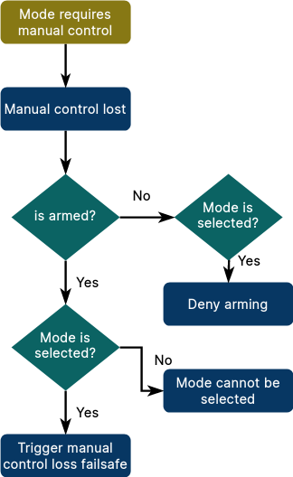

# Flight Modes (Developers)

Modes ("flight modes", "drive modes", and so on) are special operational states that control how the autopilot responds to user input and controls vehicle movement.
They are loosely grouped into _manual_, _assisted_ and _auto_ modes, based on the level/type of control provided by the autopilot.
The pilot transitions between flight modes using switches on the remote control or with a ground control station.

Modes can be implemented as [PX4 internal modes](#px4-internal-modes) running on the flight controller, or as [PX4 external (ROS2) modes](#px4-external-modes) running on a companion computer.
From the perspective of a ground station (MAVLink), the origin of a mode is indistinguishable.

This topic links to documentation for the supported modes, compares PX4 internal and external modes, provides implementation hints, and provides an overview of how PX4 modes can be used with MAVLink.

## Supported Modes

Not all modes are available (or makes sense), on all vehicle types, and some modes behave differently on different vehicle types.

Mode documentation for the PX4 internal modes are listed below:

- [Flight Modes (Multicopter)](../flight_modes_mc/index.md)
- [Flight Modes (Fixed-Wing)](../flight_modes_fw/index.md)
- [Flight Modes (VTOL)](../flight_modes_vtol/index.md)
- [Drive Modes (Differential Rover)](../flight_modes_rover/differential.md)
- [Drive Modes (Ackermann Rover)](../flight_modes_rover/ackermann.md)
- [Basic Configuration > Flight Modes](../config/flight_mode.md)

## Internal vs External Modes

With some exceptions a mode can be implemented in either the FC or companion computer.
The main considerations are listed below.

PX4 external modes cannot be used in the following cases:

- Modes that need to run on vehicles that don't have a companion computer.
- Modes that require low-level access, strict timing, and/or high update rate requirements.
  For example, a multicopter mode that implements direct motor control.
- Safety critical modes, such as [Return mode](../flight_modes_mc/return.md).
- When you can't use ROS (for any reason).

External modes should be considered for all other cases.
They have the following benefits:

- Easier to implement as there is no need to deal with low-level embedded constraints and requirements (such as restricted stack sizes).
- Easier to maintain as the integration API is small, well defined, and stable.
- Porting custom PX4 modes on the flight controller between PX4 versions can be much harder, as often flight modes use interfaces that are considered internal, and allowed to change.
- Process termination of a ROS 2 mode results in a fallback to an internal flight mode (while termination of an internal mode may well crash the vehicle).
- They can override existing modes to provide more advanced features.
  You can even override a safety-critical mode with a better versions: if the ROS 2 mode crashes the original mode will be engaged.
- High-level functionality is available, including a better-feature programming environment, and many useful Linux and ROS libraries.
- More available compute to do more advanced processing (e.g. computer vision).

Note that the [PX4 ROS 2 Control Interface](../ros2/px4_ros2_control_interface.md) used to create external modes first appeared in PX4 v1.15 and is still considered experimental.
There are still some limitations, but expect changes and ongoing enhancement.

## PX4 External Modes

PX4 external modes, are written in ROS 2 using the [PX4 ROS 2 Control Interface](../ros2/px4_ros2_control_interface.md) (see link for instructions).

## PX4 Internal Modes

The specific control behaviour of a mode at any time is determined by a [Flight Task](../concept/flight_tasks.md).
A mode might define one or more tasks that define variations of the mode behavior, for example whether inputs are treated as acceleration or velocity setpoints.

The task that is used is normally defined in a parameter, and selected in [src/modules/flight_mode_manager/FlightModeManager.cpp](https://github.com/PX4/PX4-Autopilot/blob/main/src/modules/flight_mode_manager/FlightModeManager.cpp#L266-L285)

### Mode Restrictions

Some modes only make sense only under specific pre-flight and in-flight conditions.
For example, a manual control mode should not be used unless the system has a manual controller.

PX4 modes can specify these conditions as _restrictions_.
For internal modes the types of restrictions are listed in the [FailsafeFlags](../msg_docs/FailsafeFlags.md) uORB topic under "Per mode requirements" (duplicated below)

```text
# Per-mode requirements
mode_req_angular_velocity
mode_req_attitude
mode_req_local_alt
mode_req_local_position
mode_req_local_position_relaxed
mode_req_global_position
mode_req_mission
mode_req_offboard_signal
mode_req_home_position
mode_req_wind_and_flight_time_compliance # if set, mode cannot be entered if wind or flight time limit exceeded
mode_req_prevent_arming    # if set, cannot arm while in this mode
mode_req_manual_control
mode_req_other             # other requirements, not covered above (for external modes)
```

If the condition of restriction is not met:

- arming is not allowed, while the mode is selected
- when already armed, the mode cannot be selected
- when armed and the mode is selected, the relevant failsafe is triggered (e.g. RC loss for the manual control requirement).
  Check [Safety (Failsafe) Configuration](../config/safety.md) for how to configure failsafe behaviour.

This is the corresponding flow diagram for the manual control flag (`mode_req_manual_control`):



The requirements for all modes are set in `getModeRequirements()` in [src/modules/commander/ModeUtil/mode_requirements.cpp](https://github.com/PX4/PX4-Autopilot/blob/main/src/modules/commander/ModeUtil/mode_requirements.cpp#L46).
When adding a new mode you will need to add appropriate requirements in that method.

::: tip
Readers may note that this image is from [PX4 ROS2 Control Interface > Failsafes and mode requirements](../ros2/px4_ros2_control_interface.md#failsafes-and-mode-requirements).
The requirements and concepts are essentially the same (though defined in different places).
The main difference is that ROS 2 modes _infer_ the correct requirements to use, while modes in PX4 source code must explicitly specify them.
:::

## MAVLink Integration

### Standard Modes Protocol

PX4 implements the MAVLink [Standard Modes Protocol](https://mavlink.io/en/services/standard_modes.md) from PX4 v1.15, with a corresponding implementation in QGroundControl Daily builds (and future release builds).

Modes can be "standard" or "custom".
The standard modes ([MAV_STANDARD_MODE](https://mavlink.io/en/messages/common.html#MAV_STANDARD_MODE)) are those that are common to most flight stacks with broadly the same behaviour, whereas custom modes are flight-stack specific.

This protocol allows:

- Discovery of all modes supported by a system from both PX4 and ROS 2 ([MAV_CMD_REQUEST_MESSAGE](https://mavlink.io/en/messages/common.html#MAV_CMD_REQUEST_MESSAGE) and [AVAILABLE_MODES](https://mavlink.io/en/messages/common.html#AVAILABLE_MODES)).
- Discovery of the current mode ([CURRENT_MODE](https://mavlink.io/en/messages/common.html#CURRENT_MODE)).
- Setting of standard modes using [MAV_CMD_DO_SET_STANDARD_MODE](https://mavlink.io/en/messages/common.html#MAV_CMD_DO_SET_STANDARD_MODE) (recommended)
- Setting of custom modes using [SET_MODE](https://mavlink.io/en/messages/common.html#SET_MODE) (using information from `AVAILABLE_MODES`). At time of writing [MAV_CMD_DO_SET_MODE](https://mavlink.io/en/messages/common.html#MAV_CMD_DO_SET_MODE) is not supported.
- Notification when the set of modes changes ([AVAILABLE_MODES_MONITOR](https://mavlink.io/en/messages/common.html#AVAILABLE_MODES_MONITOR))

PX4 advertises support for the following standard flight modes, which means that you can start them by calling [MAV_CMD_DO_SET_STANDARD_MODE](https://mavlink.io/en/messages/common.html#MAV_CMD_DO_SET_STANDARD_MODE) and the appropriate enum values:

All vehicle types:

| Standard Mode                                                      | PX4 Mode                                      | Internal Mode |
| ------------------------------------------------------------------ | --------------------------------------------- | ------------- |
| [MAV_STANDARD_MODE_SAFE_RECOVERY][MAV_STANDARD_MODE_SAFE_RECOVERY] | [Return mode](../flight_modes/return.md)      | AUTO_RTL      |
| [MAV_STANDARD_MODE_MISSION][MAV_STANDARD_MODE_MISSION]             | [Mission mode](../flight_modes_mc/mission.md) | AUTO_MISSION  |
| [MAV_STANDARD_MODE_LAND][MAV_STANDARD_MODE_LAND]                   | [Land mode](../flight_modes_mc/land.md)       | AUTO_LAND     |
| [MAV_STANDARD_MODE_TAKEOFF][MAV_STANDARD_MODE_TAKEOFF]             | [Takeoff mode](../flight_modes_mc/takeoff.md) | AUTO_TAKEOFF  |

[MAV_STANDARD_MODE_SAFE_RECOVERY]: https://mavlink.io/en/messages/common.html#MAV_STANDARD_MODE_SAFE_RECOVERY
[MAV_STANDARD_MODE_MISSION]: https://mavlink.io/en/messages/common.html#MAV_STANDARD_MODE_MISSION
[MAV_STANDARD_MODE_LAND]: https://mavlink.io/en/messages/common.html#MAV_STANDARD_MODE_LAND
[MAV_STANDARD_MODE_TAKEOFF]: https://mavlink.io/en/messages/common.html#MAV_STANDARD_MODE_TAKEOFF

MC vehicles support the following standard modes (in addition to the ones that are supported by all vehicles):

| Standard Mode                                                      | PX4 Mode                                           | Internal Mode |
| ------------------------------------------------------------------ | -------------------------------------------------- | ------------- |
| [MAV_STANDARD_MODE_POSITION_HOLD][MAV_STANDARD_MODE_POSITION_HOLD] | [MC Position mode](../flight_modes_mc/position.md) | POSCTL        |
| [MAV_STANDARD_MODE_ALTITUDE_HOLD][MAV_STANDARD_MODE_ALTITUDE_HOLD] | [MC Altitude mode](../flight_modes_mc/altitude.md) | ALTCTL        |
| [MAV_STANDARD_MODE_ORBIT][MAV_STANDARD_MODE_ORBIT]                 | [FW Orbit mode](../flight_modes_mc/orbit.md)       | POSCTL        |

[MAV_STANDARD_MODE_POSITION_HOLD]: https://mavlink.io/en/messages/common.html#MAV_STANDARD_MODE_POSITION_HOLD
[MAV_STANDARD_MODE_ORBIT]: https://mavlink.io/en/messages/common.html#MAV_STANDARD_MODE_ORBIT
[MAV_STANDARD_MODE_ALTITUDE_HOLD]: https://mavlink.io/en/messages/common.html#MAV_STANDARD_MODE_ALTITUDE_HOLD

FW vehicles support the following standard modes (in addition to the ones that are supported by all vehicles):

| Standard Mode                                                      | PX4 Mode                                           | Internal Mode |
| ------------------------------------------------------------------ | -------------------------------------------------- | ------------- |
| [MAV_STANDARD_MODE_CRUISE][MAV_STANDARD_MODE_CRUISE]               | [FW Position mode](../flight_modes_fw/position.md) | POSCTL        |
| [MAV_STANDARD_MODE_ALTITUDE_HOLD][MAV_STANDARD_MODE_ALTITUDE_HOLD] | [FW Altitude mode](../flight_modes_fw/altitude.md) | ALTCTL        |
| [MAV_STANDARD_MODE_ORBIT][MAV_STANDARD_MODE_ORBIT]                 | [FW Hold mode](../flight_modes_fw/hold.md)         | AUTO_LOITER   |

[MAV_STANDARD_MODE_CRUISE]: https://mavlink.io/en/messages/common.html#MAV_STANDARD_MODE_CRUISE
[MAV_STANDARD_MODE_ALTITUDE_HOLD]: https://mavlink.io/en/messages/common.html#MAV_STANDARD_MODE_ALTITUDE_HOLD
[MAV_STANDARD_MODE_ORBIT]: https://mavlink.io/en/messages/common.html#MAV_STANDARD_MODE_ORBIT

VTOL vehicles also support the following standard modes (in addition to the ones that are supported by all vehicles):

| Standard Mode                                                      | PX4 Mode                                           | Internal Mode |
| ------------------------------------------------------------------ | -------------------------------------------------- | ------------- |
| [MAV_STANDARD_MODE_ALTITUDE_HOLD][MAV_STANDARD_MODE_ALTITUDE_HOLD] | [FW Altitude mode](../flight_modes_fw/altitude.md) | ALTCTL        |

::: info
Note that VTOL vehicles could also support `MAV_STANDARD_MODE_CRUISE` (FW) or `MAV_STANDARD_MODE_POSITION_HOLD` (MC) and `MAV_STANDARD_MODE_ORBIT` in respective modes, but this has not been implemented.
:::

When implementing a mapping to a standard mode, see [src/lib/modes/standard_modes.hpp](https://github.com/PX4/PX4-Autopilot/blob/main/src/lib/modes/standard_modes.hpp), and in particular the implementation of `getNavStateFromStandardMode()`.

<!--
- How are modes added to available modes - does a developer need to do anything particular when defining a new mode?
- How are their characteristics set?
- How do I notify when the set of modes changes? Do I need to do anything when I create a new mode?

- [PX4-Autopilot#24011: standard_modes: add vehicle-type specific standard modes](https://github.com/PX4/PX4-Autopilot/pull/24011)

-->

### Other MAVLink Mode-changing Commands

Some modes, both standard and custom, can also be set using specific commands and messages.
This can be more convenient that just starting the mode, in particular when the message allows additional settings to be configured.

PX4 supports these commands for changing modes on some vehicle types:

- [MAV_CMD_NAV_TAKEOFF](https://mavlink.io/en/messages/common.html#MAV_CMD_NAV_TAKEOFF) — Takeoff mode
- [MAV_CMD_NAV_RETURN_TO_LAUNCH](https://mavlink.io/en/messages/common.html#MAV_CMD_NAV_RETURN_TO_LAUNCH) — Return mode
- [MAV_CMD_NAV_LAND](https://mavlink.io/en/messages/common.html#MAV_CMD_NAV_LAND) — Land mode
- [MAV_CMD_DO_FOLLOW](https://mavlink.io/en/messages/common.html#MAV_CMD_DO_FOLLOW) — MC Follow mode
- [MAV_CMD_DO_FOLLOW_REPOSITION](https://mavlink.io/en/messages/common.html#MAV_CMD_DO_FOLLOW_REPOSITION) — Follow mode (from new position)
- [MAV_CMD_DO_ORBIT](https://mavlink.io/en/messages/common.html#MAV_CMD_DO_ORBIT) — MC Orbit mode
- [MAV_CMD_NAV_VTOL_TAKEOFF](https://mavlink.io/en/messages/common.html#MAV_CMD_NAV_VTOL_TAKEOFF) — VTOL specific takeoff mode
- [MAV_CMD_DO_REPOSITION](https://mavlink.io/en/messages/common.html#MAV_CMD_DO_REPOSITION)
- [MAV_CMD_DO_PAUSE_CONTINUE](https://mavlink.io/en/messages/common.html#MAV_CMD_DO_PAUSE_CONTINUE) — Pauses a mission by putting the vehicle into Hold/Loiter
- [MAV_CMD_MISSION_START](https://mavlink.io/en/messages/common.html#MAV_CMD_MISSION_START) — Starts a mission.

Note that these commands predate "standard modes" and are mapped to vehicle-specific custom modes.
What that means is that even though the standard mode may be applicable to multiple vehicle types, the mode may only work for particular vehicles.
For example, the Orbit standard mode maps to Orbit mode on MC and Hold/Loiter on FW: but at time of writing the `MAV_CMD_DO_ORBIT` would start orbit mode in MC and be ignored on FW.
