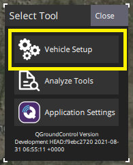

# Standard Configuration

This section describes the standard software configuration and calibration that is required for all PX4 vehicles.

:::note
Before starting this section you should [Download QGroundControl](http://qgroundcontrol.com/downloads/) and install it on your **desktop** computer (*QGroundControl* does not support vehicle configuration on mobile platforms).

To access **Vehicle Setup** screens, open the QGC application menu ("Q" icon in the top-left corner) and then choose **Vehicle Setup** in the *Select Tool* popup:

  
:::

The sub topics cover each of the steps in detail (first install the PX4 firmware and set your vehicle airframe):
* [Firmware](../config/firmware.md)
* [Airframe](../config/airframe.md)
* [Sensor Orientation](../config/flight_controller_orientation.md)
* [Compass](../config/compass.md)
* [Gyroscope](../config/gyroscope.md)
* [Accelerometer](../config/accelerometer.md)
* [Airspeed](../config/airspeed.md) (primarily for fixed-wing/VTOL)
* [Level Horizon Calibration](../config/level_horizon_calibration.md)
* [Radio Setup](../config/radio.md)
* [Joystick Setup](../config/joystick.md)
* [Flight Modes](../config/flight_mode.md) (Optional)
* [Battery](../config/battery.md) (optional)
* [Safety](../config/safety.md) (optional)
* [Motors/Servos](../config/motors.md)
* [Actuators](../config/actuators.md)
* [Autotune](../config/autotune.md)

## Video Guide

The video below shows the calibration process in detail (this uses an older version of *QGroundControl*, but most of the process is unchanged).

@[youtube](https://youtu.be/91VGmdSlbo4)

## Advanced Configuration

If your [selected airframe configuration](../config/airframe.md) is a _specific vehicle model_ (e.g. [Holybro s500](../frames_multicopter/holybro_s500_v2_pixhawk4.md#install-configure-px4)) then it may benefit from fine tuning, but this is not generally required.

If you're using a new airframe, a "generic" airframe, significantly modifying an airframe, or using less common sensors then see:
* [Advanced Configuration](../advanced_config/README.md): Vehicle-specific tuning, fine tuning, factory-level configuration.
* [Flight Controller Peripherals](../peripherals/README.md) - Hardware and software setup related to specific hardware (in particular lesser-used sensors).

## Support

If you need help with the configuration you can ask for help on the [QGroundControl Support forum](https://discuss.px4.io//c/qgroundcontrol/qgroundcontrol-usage).

## Further Information

* [QGroundControl > Setup](https://docs.qgroundcontrol.com/en/SetupView/SetupView.html)

